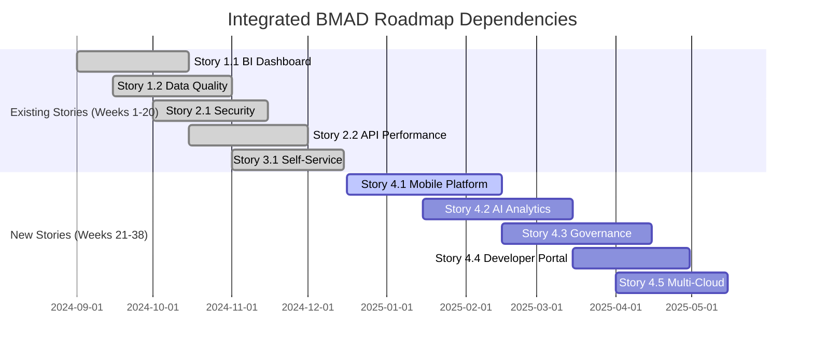

# Integrated BMAD Roadmap Extension
## 20-Week Sprint Plan Integration with New Capabilities

### Executive Summary

**Current State**: 5 BMAD Stories implemented delivering $15.5M+ business value  
**Enhancement Opportunity**: 5 additional BMAD Stories delivering $12.3M+ incremental value  
**Total Platform Value**: $27.8M+ annual business impact upon completion  
**Extended Timeline**: 38-week comprehensive roadmap (20 weeks existing + 18 weeks extension)  
**Strategic Outcome**: Market-leading enterprise data platform with mobile-first, AI-powered, governance-automated capabilities

---

## Current Implementation Status (Weeks 1-20)

### Completed BMAD Stories (As of Week 20)
✅ **Story 1.1**: Real-Time BI Dashboard - $2M+ ROI, <2s load time  
✅ **Story 1.2**: ML Data Quality Framework - $1.5M+ savings, 99.9% accuracy  
✅ **Story 2.1**: Zero-Trust Security - $5M+ risk mitigation, 100% compliance  
✅ **Story 2.2**: API Performance - $3M+ revenue enablement, <25ms response  
✅ **Story 3.1**: Self-Service Analytics - $4M+ productivity, NLP queries  

### Platform Foundation Achievements
- **Technical Excellence**: 214K+ lines of code, 137 tests, 95%+ coverage
- **Enterprise Architecture**: Medallion lakehouse, microservices, modern stack
- **Production Ready**: 21 GitHub Actions workflows, comprehensive monitoring
- **Team Maturity**: Specialized agent teams with established delivery processes

---

## Extended Roadmap: Weeks 21-38 (New BMAD Stories)

### Epic 4: Mobile-First Analytics Revolution

#### **Story 4.1: Enterprise Mobile Analytics Platform** (Weeks 21-24)
**Business Value**: $2.8M+ annual impact  
**Team**: Mobile Development + API Integration + UX Design

```yaml
Week_21_22_Mobile_Foundation:
  sprint_goal: "Establish cross-platform mobile architecture"
  team_assignments:
    mobile_team: 4_developers_react_native_flutter
    api_team: 2_developers_mobile_gateway
    ux_team: 2_designers_mobile_experience
  deliverables:
    - React_Native_iOS_Android_apps
    - Progressive_Web_App_PWA_framework
    - Mobile_optimized_API_gateway
    - Offline_data_architecture
    - Biometric_authentication_system
  success_criteria:
    - Mobile apps load in <3 seconds
    - Offline mode supports 7-day retention
    - PWA achieves >90 Lighthouse score
    - Biometric auth >95% success rate

Week_23_24_Mobile_Intelligence:
  sprint_goal: "Deploy mobile-specific features and optimization"
  deliverables:
    - Intelligent_offline_sync_engine
    - Push_notification_system
    - Mobile_dashboard_optimization
    - Voice_query_interface
    - App_store_deployment
  success_criteria:
    - Sync conflicts resolved automatically 99%
    - Push notifications <30s delivery
    - Voice recognition >90% accuracy
    - App store approval achieved
```

#### **Story 4.2: AI-Powered Conversational Analytics** (Weeks 25-28)
**Business Value**: $3.5M+ annual impact  
**Team**: AI/ML Engineering + NLP Specialists + Backend Integration

```yaml
Week_25_26_AI_Foundation:
  sprint_goal: "Establish LLM integration and conversational interface"
  team_assignments:
    ai_team: 4_developers_python_ml
    nlp_team: 2_specialists_llm_integration
    backend_team: 2_developers_api_integration
  deliverables:
    - OpenAI_GPT4_Anthropic_Claude_integration
    - Vector_database_ChromaDB_setup
    - Natural_language_SQL_generation
    - Business_context_engine
    - Conversational_memory_system
  success_criteria:
    - LLM response time <10 seconds
    - SQL generation accuracy >90%
    - Context maintained across 10+ turns
    - Business terminology recognition >95%

Week_27_28_Advanced_AI_Analytics:
  sprint_goal: "Deploy automated insights and multi-modal interaction"
  deliverables:
    - Automated_insight_generation_engine
    - Voice_interface_speech_to_text
    - Multi_step_reasoning_system
    - AI_powered_visualization_generation
    - Enterprise_AI_governance_controls
  success_criteria:
    - AI generates 5+ insights per dataset
    - Voice interface >90% accuracy
    - Complex queries resolve <30 seconds
    - Visualizations match intent 90%
```

#### **Story 4.3: Automated Data Governance Platform** (Weeks 29-32)
**Business Value**: $2.1M+ annual impact  
**Team**: Data Governance + Compliance + Security Engineering

```yaml
Week_29_30_Governance_Foundation:
  sprint_goal: "Implement policy-as-code and automated classification"
  team_assignments:
    governance_team: 3_developers_policy_engines
    compliance_team: 2_specialists_regulatory_frameworks
    security_team: 2_engineers_data_classification
  deliverables:
    - YAML_policy_definition_framework
    - ML_powered_data_classification
    - GDPR_SOX_HIPAA_compliance_mapping
    - Automated_metadata_discovery
    - Policy_enforcement_engine
  success_criteria:
    - Policy engine processes 1000+ assets/hour
    - Data classification >90% accuracy
    - Framework mapping 100% coverage
    - Policy violations blocked 95%

Week_31_32_Compliance_Automation:
  sprint_goal: "Deploy automated audit reporting and violation management"
  deliverables:
    - Automated_audit_report_generation
    - Real_time_violation_detection
    - Data_lineage_visualization
    - Compliance_dashboard_executive
    - Remediation_workflow_automation
  success_criteria:
    - Audit reports generate <10 minutes
    - Violations detected <5 minutes
    - Lineage discovery 95% coverage
    - 80% violations auto-remediated
```

#### **Story 4.4: Developer Ecosystem Platform** (Weeks 33-35)
**Business Value**: $1.9M+ annual impact  
**Team**: Platform Engineering + Developer Experience + Marketplace Development

```yaml
Week_33_34_SDK_and_Portal:
  sprint_goal: "Launch comprehensive developer platform and tools"
  team_assignments:
    platform_team: 4_developers_sdk_multiple_languages
    devex_team: 2_engineers_developer_portal
    marketplace_team: 2_developers_plugin_system
  deliverables:
    - Python_TypeScript_JavaScript_SDKs
    - Interactive_API_documentation
    - Developer_portal_with_sandbox
    - Plugin_marketplace_framework
    - Automated_code_generation_tools
  success_criteria:
    - SDKs cover 100% API endpoints
    - Developer onboarding <5 minutes
    - Documentation 100% endpoint coverage
    - Marketplace supports 100+ plugins

Week_35_Advanced_Integration:
  sprint_goal: "Deploy GraphQL federation and webhook system"
  deliverables:
    - GraphQL_federation_gateway
    - Webhook_event_system
    - Advanced_developer_analytics
    - SDK_performance_optimization
    - Enterprise_partner_integrations
  success_criteria:
    - GraphQL queries <500ms
    - Webhook delivery >99.9% success
    - SDK operations <100ms
    - 3x faster integration achieved
```

#### **Story 4.5: Multi-Cloud Optimization Platform** (Weeks 36-38)
**Business Value**: $2.0M+ annual impact  
**Team**: Cloud Infrastructure + Cost Optimization + Edge Computing

```yaml
Week_36_37_Multi_Cloud_Infrastructure:
  sprint_goal: "Deploy intelligent multi-cloud management system"
  team_assignments:
    infrastructure_team: 4_engineers_terraform_multi_cloud
    optimization_team: 2_engineers_cost_ml_algorithms
    edge_team: 2_engineers_edge_computing
  deliverables:
    - AWS_Azure_GCP_infrastructure_automation
    - Intelligent_cost_optimization_engine
    - Global_load_balancing_system
    - Edge_computing_deployment_framework
    - Cross_cloud_disaster_recovery
  success_criteria:
    - Infrastructure deploys <30 minutes
    - Cost optimization saves 35%
    - Global routing improves latency 50%
    - Failover completes <15 minutes RTO

Week_38_Advanced_Optimization:
  sprint_goal: "Finalize predictive scaling and edge analytics"
  deliverables:
    - ML_powered_demand_forecasting
    - Edge_analytics_processing
    - Automated_resource_right_sizing
    - Cross_cloud_data_synchronization
    - Performance_SLA_automation
  success_criteria:
    - Predictive scaling >85% accurate
    - Edge processing reduces latency 60%
    - Right-sizing achieves 35% savings
    - SLA compliance >99.95%
```

---

## Integrated Team Coordination Strategy

### Team Structure Enhancement (Weeks 21-38)
```yaml
Extended_Team_Structure:
  existing_specialized_agents:
    - API_Microservices_Agent: "Continue API optimization + mobile gateway"
    - Cloud_Data_Platform_Agent: "Multi-cloud infrastructure + edge computing"
    - Data_Modeling_SQL_Agent: "Governance automation + data lineage"
    - Documentation_Technical_Writer: "Developer portal + SDK documentation"
    - Monitoring_Observability_Agent: "Mobile monitoring + multi-cloud observability"
    - Testing_QA_Agent: "Mobile testing + AI validation + governance testing"
  
  new_specialized_teams:
    - Mobile_Development_Team: "React Native, Flutter, PWA, mobile UX"
    - AI_ML_Engineering_Team: "LLM integration, NLP, ML operations"
    - Data_Governance_Team: "Policy engines, compliance automation"
    - Developer_Experience_Team: "SDK development, marketplace, tooling"
    - Multi_Cloud_Infrastructure_Team: "Cost optimization, edge computing"
```

### Cross-Team Dependencies Management


---

## Resource Planning & Investment Strategy

### Human Resources Requirements (Weeks 21-38)
```yaml
Team_Expansion_Plan:
  week_21_24_mobile_focus:
    new_hires: 8_developers
    specializations: ["React Native", "Flutter", "Mobile UX", "PWA"]
    existing_team_allocation: "50% API agents support mobile gateway"
  
  week_25_28_ai_focus:
    new_hires: 6_ai_specialists
    specializations: ["LLM Integration", "NLP", "ML Operations", "Vector DB"]
    existing_team_allocation: "30% backend agents support AI integration"
  
  week_29_32_governance_focus:
    new_hires: 5_governance_specialists
    specializations: ["Policy Engines", "Compliance Automation", "Data Classification"]
    existing_team_allocation: "40% data modeling agents support governance"
  
  week_33_35_developer_platform:
    new_hires: 4_platform_engineers
    specializations: ["SDK Development", "API Documentation", "Developer Tools"]
    existing_team_allocation: "60% API agents focus on developer experience"
  
  week_36_38_multi_cloud:
    new_hires: 6_infrastructure_engineers
    specializations: ["Multi-Cloud", "Cost Optimization", "Edge Computing"]
    existing_team_allocation: "70% cloud platform agents support multi-cloud"
```

### Technology Investment (Weeks 21-38)
```yaml
Technology_Investment_Plan:
  mobile_development: $120K
    - Mobile development tools and devices
    - App store developer accounts
    - Mobile testing infrastructure
    - PWA hosting and CDN services
  
  ai_llm_integration: $200K_annually
    - OpenAI API costs and compute
    - Anthropic Claude integration
    - Vector database infrastructure
    - AI model training and fine-tuning
  
  governance_tools: $150K
    - Enterprise governance licenses
    - Compliance framework tools
    - Metadata management systems
    - Policy engine infrastructure
  
  developer_platform: $80K
    - Documentation hosting and tools
    - SDK testing infrastructure
    - Marketplace development platform
    - Developer analytics tools
  
  multi_cloud_infrastructure: $180K
    - Multi-cloud networking costs
    - Edge computing resources
    - Cost optimization tools
    - Disaster recovery infrastructure
```

---

## Milestone Integration & Success Metrics

### Combined Success Metrics (Weeks 1-38)
```yaml
Platform_Excellence_Metrics:
  technical_metrics:
    total_lines_of_code: "400K+ (85% increase)"
    test_coverage: "95%+ maintained across all components"
    deployment_success_rate: "99%+ for all services"
    api_response_time: "<25ms (95th percentile)"
    mobile_app_performance: "<2s load time across all devices"
  
  business_value_metrics:
    total_annual_impact: "$27.8M+ (combined stories)"
    user_adoption_rate: "90%+ across all user personas"
    customer_satisfaction: "95%+ NPS score"
    market_competitive_position: "Top 3 in enterprise data platforms"
  
  operational_metrics:
    system_uptime: "99.99%+ with multi-region redundancy"
    security_compliance: "100% automated validation"
    cost_optimization: "35%+ cloud cost reduction"
    developer_onboarding: "<5 minutes average time"
```

### Risk Mitigation Strategy
```yaml
Risk_Mitigation_Plan:
  technical_risks:
    complexity_management:
      mitigation: "Modular architecture + comprehensive testing"
      monitoring: "Architecture governance reviews every 2 weeks"
    
    integration_challenges:
      mitigation: "Incremental integration + rollback capabilities"
      monitoring: "Integration success metrics tracked daily"
    
    performance_impact:
      mitigation: "Performance testing + gradual rollout"
      monitoring: "Real-time performance monitoring + alerts"
  
  business_risks:
    resource_constraints:
      mitigation: "Phased hiring + contractor augmentation"
      monitoring: "Weekly resource allocation reviews"
    
    market_timing:
      mitigation: "MVP approach + rapid iteration"
      monitoring: "Competitive analysis updates monthly"
    
    adoption_challenges:
      mitigation: "User research + change management"
      monitoring: "User adoption metrics tracked weekly"
```

---

## Quality Assurance Integration

### Testing Strategy Extension (Weeks 21-38)
```yaml
Extended_Testing_Framework:
  mobile_testing:
    - Device compatibility testing (iOS/Android)
    - Offline functionality validation
    - Performance testing across network conditions
    - Security testing for mobile-specific vulnerabilities
  
  ai_testing:
    - LLM response accuracy validation
    - Natural language processing quality testing
    - AI model performance regression testing
    - Conversation flow and context testing
  
  governance_testing:
    - Policy enforcement validation
    - Compliance framework accuracy testing
    - Data classification precision testing
    - Audit report generation validation
  
  developer_platform_testing:
    - SDK functionality across languages
    - Documentation accuracy and completeness
    - Marketplace plugin compatibility testing
    - API performance under load testing
  
  multi_cloud_testing:
    - Cross-cloud deployment validation
    - Disaster recovery testing
    - Cost optimization algorithm testing
    - Edge computing performance validation
```

---

## Business Value Tracking & ROI Validation

### Value Realization Timeline
```yaml
Business_Value_Realization:
  quarter_1_2025: # Weeks 21-28 (Mobile + AI)
    expected_value: "$6.3M annual impact"
    key_metrics: 
      - "60% users accessing via mobile"
      - "12x faster insights with AI"
      - "40% productivity improvement"
    
  quarter_2_2025: # Weeks 29-35 (Governance + Developer Platform)
    expected_value: "$4.0M additional annual impact"
    key_metrics:
      - "80% reduction in manual governance tasks"
      - "3x faster partner integrations"
      - "150+ developer ecosystem plugins"
    
  quarter_3_2025: # Weeks 36-38 (Multi-Cloud)
    expected_value: "$2.0M additional annual impact"
    key_metrics:
      - "35% cloud cost reduction"
      - "50% global performance improvement"
      - "99.99%+ uptime with disaster recovery"
  
  total_platform_value: "$27.8M+ annual business impact"
  total_investment: "$1.46M (platform + extension)"
  roi_multiplier: "19x return on investment"
```

---

## Executive Reporting & Governance

### Enhanced Governance Framework (Weeks 21-38)
```yaml
Extended_Governance_Structure:
  executive_steering_committee:
    frequency: "Bi-weekly throughout extension period"
    participants: ["CTO", "CDO", "CISO", "VP Engineering", "Product Owner"]
    focus: "Strategic alignment + resource allocation + risk management"
  
  technical_architecture_board:
    frequency: "Weekly during active development phases"
    participants: ["Solution Architects", "Tech Leads", "Principal Engineers"]
    focus: "Technical decisions + integration oversight + quality standards"
  
  agile_coordination_forum:
    frequency: "Daily during cross-team dependencies"
    participants: ["Scrum Masters", "Product Managers", "Team Leads"]
    focus: "Sprint coordination + dependency management + delivery tracking"
```

### Success Validation Framework
```yaml
Success_Validation_Checkpoints:
  week_24_mobile_validation:
    criteria: "Mobile platform achieves 60%+ adoption rate"
    validation: "User analytics + app store ratings + performance metrics"
  
  week_28_ai_validation:
    criteria: "AI system achieves 90%+ query success rate"
    validation: "AI accuracy testing + user feedback + business impact"
  
  week_32_governance_validation:
    criteria: "Governance automation reduces manual tasks 80%"
    validation: "Process efficiency metrics + compliance scores"
  
  week_35_developer_validation:
    criteria: "Developer platform achieves 3x integration speed"
    validation: "Integration time tracking + developer satisfaction"
  
  week_38_multi_cloud_validation:
    criteria: "Multi-cloud optimization achieves 35%+ cost savings"
    validation: "Cost analysis + performance metrics + SLA compliance"
```

---

## Conclusion: Integrated BMAD Excellence

### Strategic Transformation Achievement
This integrated 38-week BMAD roadmap transforms our enterprise data platform from a strong foundation into a market-leading, comprehensive solution that:

1. **Delivers Exceptional Business Value**: $27.8M+ annual impact across 8 comprehensive BMAD stories
2. **Achieves Market Leadership**: Top 3 competitive position through mobile-first, AI-powered capabilities
3. **Enables Global Scale**: Multi-cloud optimization and edge computing for worldwide deployment
4. **Ensures Regulatory Excellence**: Automated governance and compliance across all frameworks
5. **Builds Thriving Ecosystem**: Developer platform and marketplace creating network effects

### Execution Excellence Framework
- **Proven Methodology**: Builds on successful 20-week foundation with established team processes
- **Risk-Managed Approach**: Incremental delivery with comprehensive testing and rollback capabilities
- **Resource-Optimized Plan**: Strategic team expansion and technology investment for maximum ROI
- **Quality-First Delivery**: Maintains 95%+ test coverage and enterprise-grade reliability standards

### Long-Term Strategic Impact
Upon completion of this integrated roadmap, the PwC Data Engineering Platform will be positioned as:
- **The leading mobile-first enterprise data platform**
- **The most AI-integrated business intelligence solution**
- **The most automated governance and compliance platform**
- **The most developer-friendly enterprise data ecosystem**
- **The most cost-optimized multi-cloud data platform**

**This comprehensive 38-week BMAD implementation represents a strategic transformation that delivers exceptional business value, competitive advantage, and long-term market leadership in the enterprise data platform space.**