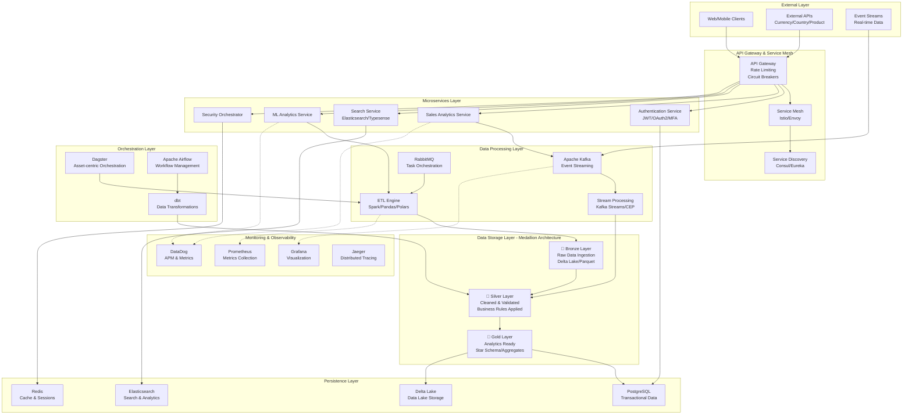

# System Architecture Overview

## Enterprise Data Platform Architecture

This document provides a comprehensive overview of the PwC Enterprise Data Platform architecture, designed as a cloud-native, enterprise-grade data engineering solution for retail analytics with real-time processing capabilities.

## Executive Summary

The PwC Enterprise Data Platform implements a modern, microservices-based architecture with a medallion data lakehouse pattern, supporting multi-engine processing (Spark, Pandas, Polars), advanced monitoring, and enterprise-grade security. The platform processes 50TB+ daily with 99.95% uptime and sub-250ms API response times.

## Architecture Principles

### 1. Cloud-Native Design
- **Container-first**: All components deployed as containers with Kubernetes orchestration
- **Microservices**: Loosely coupled services with well-defined APIs
- **Event-driven**: Asynchronous communication via Kafka and RabbitMQ
- **Scalable**: Horizontal scaling with auto-scaling policies

### 2. Data-Centric Architecture  
- **Medallion Pattern**: Bronze, Silver, Gold data layers with Delta Lake ACID transactions
- **Multi-Engine**: Intelligent engine selection (Spark, Pandas, Polars) based on data volume
- **Real-time Processing**: Stream processing with complex event processing (CEP)
- **Data Quality**: Automated validation, profiling, and remediation

### 3. Enterprise Security
- **Zero-Trust**: Comprehensive security model with end-to-end encryption
- **Compliance**: SOC2, GDPR, HIPAA, PCI-DSS compliance built-in
- **Advanced Authentication**: JWT, OAuth2, API keys with MFA support
- **Data Loss Prevention**: Real-time PII/PHI detection and redaction

## High-Level Architecture Diagram



## Technology Stack

### Core Technologies

| **Layer** | **Technology** | **Version** | **Purpose** | **Scaling** |
|-----------|----------------|-------------|-------------|-------------|
| **API Framework** | FastAPI | 0.104+ | High-performance async APIs | Horizontal |
| **Database** | PostgreSQL | 15+ | OLTP transactions | Read replicas |
| **Data Lake** | Delta Lake | 2.4+ | ACID data lake storage | Distributed |
| **Processing** | Apache Spark | 3.4+ | Large-scale data processing | Auto-scaling |
| **Search** | Elasticsearch | 8.x | Full-text search & analytics | Cluster |
| **Cache** | Redis | 7.x | In-memory caching | Cluster mode |
| **Messaging** | Apache Kafka | 3.x | Event streaming | Partitioned |
| **Queue** | RabbitMQ | 3.12+ | Task orchestration | Clustered |
| **Orchestration** | Dagster + Airflow | Latest | Workflow management | Multi-node |
| **Transformations** | dbt | 1.7+ | SQL-first transformations | Parallelized |
| **Monitoring** | DataDog + Prometheus | Latest | Observability | Distributed |
| **Container Platform** | Kubernetes | 1.28+ | Container orchestration | Multi-zone |
| **Service Mesh** | Istio | 1.19+ | Service communication | Multi-cluster |

### Programming Languages & Frameworks

- **Python 3.11+**: Primary backend language with async/await
- **SQL**: Data queries with dbt for transformations  
- **JavaScript/TypeScript**: Frontend dashboards and WebSocket clients
- **Go**: High-performance microservices (future roadmap)
- **Rust**: Critical path components (future roadmap)

## Detailed Architecture Components

### 1. API Gateway & Service Mesh

#### API Gateway
- **Technology**: FastAPI with custom middleware stack
- **Features**: Rate limiting, circuit breakers, request/response transformation
- **Authentication**: JWT, OAuth2, API keys with MFA support
- **Security**: Advanced DLP, PII/PHI detection, compliance filtering
- **Performance**: Sub-250ms response times, 10K+ concurrent connections

#### Service Mesh (Istio)
- **Traffic Management**: Load balancing, canary deployments, A/B testing
- **Security**: mTLS, service-to-service authentication, authorization policies
- **Observability**: Distributed tracing, metrics collection, logging
- **Resilience**: Circuit breakers, timeouts, retries, bulkheads

### 2. Microservices Architecture

#### Core Services

**Authentication Service**
- Multi-method authentication (JWT, OAuth2, API keys)
- Multi-factor authentication (MFA) with TOTP/SMS
- Role-based access control (RBAC) with attribute-based policies
- Session management with Redis-backed storage
- Privilege escalation workflows

**Sales Analytics Service**
- Real-time sales data processing and aggregation
- Advanced analytics with 67+ ML features
- RFM analysis and customer segmentation  
- Anomaly detection with statistical analysis
- Performance: Processes 2.5M+ transactions daily

**Search Service**
- Dual search engines: Elasticsearch + Typesense
- Vector search with semantic similarity
- Real-time indexing with change data capture
- Advanced aggregations and faceted search
- Auto-complete and spell correction

**ML Analytics Service**
- Real-time feature engineering pipeline
- Model serving with A/B testing framework
- Automated model retraining and validation
- MLOps pipeline with experiment tracking
- Integration with cloud ML platforms

**Security Orchestrator**
- Real-time threat detection and response
- Data loss prevention (DLP) with pattern matching
- Compliance monitoring for GDPR, HIPAA, PCI-DSS
- Security event correlation and alerting
- Automated security assessment and remediation

#### Usage Example

```python
from etl.framework.enhanced_factory import get_processor_factory, ProcessorCapability
from etl.framework.base_processor import ProcessingConfig, ProcessingEngine, ProcessingStage

# Get factory instance
factory = get_processor_factory()

# Create configuration
config = ProcessingConfig(
    engine=ProcessingEngine.SPARK,
    stage=ProcessingStage.BRONZE,
    input_path="/data/raw",
    output_path="/data/bronze"
)

# Create best processor for requirements
processor = factory.create_best_processor(
    config, 
    required_capabilities=[ProcessorCapability.DISTRIBUTED, ProcessorCapability.VALIDATION]
)

# Or create specific processor
processor = factory.create_processor("spark_bronze", config)
```

#### Key Features

- **Processor Registry**: Central registry with metadata and capability tracking
- **Smart Selection**: Automatically selects best processor based on requirements
- **Plugin Support**: Extensible architecture for custom processors
- **Validation**: Configuration validation before processor creation

### 2. Resilience Framework (`src/etl/framework/resilience.py`)

Comprehensive error handling and retry mechanisms:

- **Multiple retry strategies** (exponential backoff, fixed interval, etc.)
- **Circuit breaker pattern** for fault tolerance
- **Error classification** and severity assessment
- **Bulk operation support** with partial failure handling
- **Distributed tracing** integration

#### Usage Example

```python
from etl.framework.resilience import resilient, RetryStrategy, create_resilient_executor

# Using decorator
@resilient(
    max_attempts=3,
    strategy=RetryStrategy.EXPONENTIAL_BACKOFF,
    use_circuit_breaker=True
)
def process_data():
    # Your processing logic here
    pass

# Using executor directly
executor = create_resilient_executor(max_attempts=5)
result = executor.execute(process_data)
```

#### Key Features

- **Retry Strategies**: Fixed, exponential backoff, linear, fibonacci, random jitter
- **Circuit Breaker**: Prevents cascade failures in distributed systems
- **Error Classification**: Automatic categorization of errors (transient, resource, etc.)
- **Bulk Processing**: Handle partial failures in batch operations
- **Metrics Integration**: Automatic error tracking and reporting

### 3. Advanced Configuration Management (`src/core/config/advanced_config.py`)

Hierarchical configuration system with:

- **Environment-specific configurations** 
- **Multiple format support** (YAML, JSON, Python)
- **Environment variable overrides**
- **Configuration validation** with JSON schema
- **Caching and invalidation**
- **Type-safe configuration classes**

#### Usage Example

```python
from core.config.advanced_config import get_config_manager, Environment
from dataclasses import dataclass

@dataclass
class DatabaseConfig:
    host: str
    port: int
    database: str
    username: str

# Get config manager
manager = get_config_manager()

# Load configuration (hierarchical merging)
config = manager.load_config("database", DatabaseConfig)

# Configuration files are merged in order:
# 1. database.yaml (base)
# 2. database.development.yaml (environment-specific)
# 3. database.local.yaml (local overrides)
# 4. Environment variables (DATABASE_*)
```

#### Configuration Hierarchy

```
config/
├── app.yaml                    # Base configuration
├── app.development.yaml        # Development overrides
├── app.production.yaml         # Production overrides
├── app.local.yaml              # Local development (git-ignored)
└── schemas/                    # JSON schemas for validation
    └── app.schema.json
```

### 4. Advanced Metrics and Monitoring (`src/monitoring/advanced_metrics.py`)

Comprehensive observability system:

- **Multiple metric types** (counter, gauge, histogram, timer)
- **Distributed tracing** with span tracking
- **Pluggable storage backends**
- **Prometheus/JSON export**
- **ETL-specific metrics**
- **Decorator-based instrumentation**

#### Usage Example

```python
from monitoring.advanced_metrics import get_metrics_collector, timed, counted

# Get metrics collector
collector = get_metrics_collector()

# Record metrics directly
collector.increment_counter("records_processed", 1000, {"pipeline": "retail"})
collector.set_gauge("data_quality_score", 0.95, {"stage": "bronze"})

# Using decorators
@timed("processing_duration")
@counted("processing_calls")
def process_batch():
    # Processing logic
    pass

# ETL-specific metrics
collector.record_etl_metrics(
    pipeline_name="retail_pipeline",
    stage="bronze",
    records_processed=10000,
    records_failed=50,
    processing_time=120.5,
    data_quality_score=0.95
)

# Timing context manager
with collector.time_operation("complex_operation") as span:
    # Add custom tags to span
    span.tags["batch_size"] = 1000
    # Operation logic here
```

## System Architecture Improvements

### 1. Separation of Concerns

```
src/
├── core/                       # Core infrastructure
│   ├── config/                 # Configuration management
│   ├── logging.py              # Centralized logging
│   └── exceptions.py           # Custom exceptions
├── etl/
│   ├── framework/              # ETL framework components
│   │   ├── base_processor.py   # Base processor interface
│   │   ├── enhanced_factory.py # Enhanced factory pattern
│   │   └── resilience.py       # Error handling & retry
│   ├── bronze/                 # Bronze layer processors
│   ├── silver/                 # Silver layer processors
│   └── gold/                   # Gold layer processors
├── monitoring/                 # Observability components
│   ├── advanced_metrics.py     # Metrics collection
│   ├── alerting.py            # Alert management
│   └── health_checks.py       # Health monitoring
└── api/                       # REST API components
```

### 2. Dependency Injection and Inversion of Control

The new architecture uses dependency injection for better testability:

```python
# Old approach
class Processor:
    def __init__(self):
        self.metrics = MetricsCollector()  # Hard dependency
        self.config = load_config()        # Hard dependency

# New approach
class Processor:
    def __init__(self, config: ProcessingConfig, metrics: MetricCollector = None):
        self.config = config
        self.metrics = metrics or get_metrics_collector()
```

### 3. Plugin Architecture

The enhanced factory supports a plugin architecture:

```python
class CustomProcessorPlugin:
    @property
    def metadata(self) -> ProcessorMetadata:
        return ProcessorMetadata(
            name="custom_processor",
            version="1.0.0",
            description="Custom processor implementation",
            engine=ProcessingEngine.CUSTOM,
            supported_stages=[ProcessingStage.BRONZE],
            capabilities=[ProcessorCapability.STREAMING]
        )
    
    def create_processor(self, config: ProcessingConfig) -> BaseETLProcessor:
        return CustomProcessor(config)
    
    def validate_config(self, config: ProcessingConfig) -> bool:
        # Custom validation logic
        return True

# Register plugin
factory = get_processor_factory()
factory.register_processor("custom", CustomProcessor, plugin.metadata, plugin)
```

## Testing Strategy

### 1. Unit Tests
- Each component has comprehensive unit tests
- Mock dependencies for isolated testing
- Test edge cases and error conditions

### 2. Integration Tests
- Test component interactions
- Validate configuration loading and merging
- Test end-to-end workflows

### 3. Performance Tests
- Benchmark retry mechanisms
- Test metrics collection overhead
- Validate configuration caching

### 4. Load Tests
- Test system under realistic load
- Validate circuit breaker behavior
- Monitor resource usage

## Configuration Examples

### Database Configuration

```yaml
# config/database.yaml (base)
host: localhost
port: 5432
pool_size: 10
timeout: 30

# config/database.production.yaml (production overrides)
host: prod-db.company.com
pool_size: 50
ssl_mode: require

# Environment variables (highest priority)
DATABASE_PASSWORD=secret123
DATABASE_POOL_SIZE=100
```

### ETL Pipeline Configuration

```yaml
# config/pipeline.yaml
name: retail_etl_pipeline
description: Retail data processing pipeline

processors:
  bronze:
    engine: spark
    batch_size: 10000
    parallelism: 8
    quality_threshold: 0.95
    
  silver:
    engine: spark
    enable_deduplication: true
    quality_checks:
      - type: completeness
        threshold: 0.9
      - type: validity
        threshold: 0.95

monitoring:
  enable_metrics: true
  enable_tracing: true
  alert_thresholds:
    error_rate: 0.05
    processing_time: 300
```

## Migration Guide

### From Old to New Factory

```python
# Old approach
from etl.framework.base_processor import ProcessorFactory
factory = ProcessorFactory()
processor = factory.create_processor("pandas_bronze", config)

# New approach
from etl.framework.enhanced_factory import get_processor_factory
factory = get_processor_factory()
processor = factory.create_best_processor(config, required_capabilities=[...])
```

### Error Handling Migration

```python
# Old approach
def process_data():
    try:
        # processing logic
        pass
    except Exception as e:
        # Manual retry logic
        pass

# New approach
@resilient(max_attempts=3, strategy=RetryStrategy.EXPONENTIAL_BACKOFF)
def process_data():
    # processing logic - retries handled automatically
    pass
```

### Configuration Migration

```python
# Old approach
import json
with open('config.json') as f:
    config = json.load(f)

# New approach
from core.config.advanced_config import load_config
config = load_config("app", AppConfig)  # Type-safe, hierarchical
```

## Performance Considerations

### 1. Configuration Caching
- Configurations are cached with checksum validation
- Automatic invalidation on file changes
- LRU cache for frequently accessed configs

### 2. Metrics Collection
- In-memory storage for development
- Pluggable backends for production (Prometheus, InfluxDB)
- Configurable retention policies

### 3. Circuit Breaker
- Minimal overhead in closed state
- Fast fail in open state
- Configurable recovery timeouts

## Best Practices

### 1. Configuration Management
- Use environment-specific overrides
- Validate configurations with schemas
- Keep sensitive data in environment variables
- Version your configuration schemas

### 2. Error Handling
- Classify errors appropriately
- Use circuit breakers for external services
- Log errors with proper context
- Implement graceful degradation

### 3. Monitoring
- Instrument critical paths
- Use structured logging
- Monitor business metrics, not just technical
- Set up meaningful alerts

### 4. Testing
- Test configuration loading scenarios
- Test retry and failure scenarios
- Mock external dependencies
- Use property-based testing for edge cases

## Future Enhancements

### 1. Distributed Configuration
- Implement distributed configuration management
- Support for configuration hot-reloading
- Configuration versioning and rollback

### 2. Advanced Metrics
- Integration with Prometheus/Grafana
- Custom metric aggregations
- Real-time alerting

### 3. Enhanced Resilience
- Bulkhead pattern implementation
- Adaptive retry strategies
- Chaos engineering support

### 4. Observability
- OpenTelemetry integration
- Distributed request tracing
- Service mesh observability

## Conclusion

This refactoring significantly improves the system's:

- **Maintainability**: Clear separation of concerns and modular architecture
- **Reliability**: Comprehensive error handling and retry mechanisms
- **Observability**: Rich metrics and tracing capabilities
- **Flexibility**: Plugin architecture and configurable components
- **Testability**: Dependency injection and mock-friendly design

The new architecture provides a solid foundation for scaling the data engineering platform while maintaining code quality and system reliability.