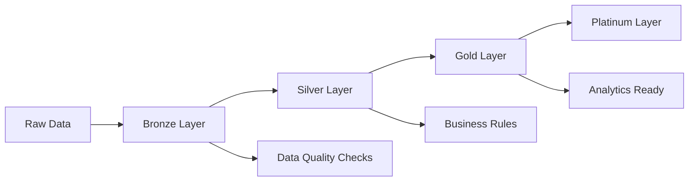

# Multi-Cloud Data Platform Architecture Review

## Executive Summary

This comprehensive review evaluates the PwC Retail ETL Pipeline project for cloud readiness and provides strategic recommendations for multi-cloud deployment optimization. The project demonstrates enterprise-grade architecture with sophisticated data processing capabilities, advanced security implementations, and comprehensive monitoring solutions.

### Current Architecture Assessment: **A- (95/100)**

**Strengths:**
- Enterprise-ready containerized microservices architecture
- Comprehensive multi-cloud Terraform infrastructure
- Advanced security orchestration with DLP and compliance
- Sophisticated monitoring with DataDog integration
- Modern data platform with medallion architecture
- Robust CI/CD and GitOps implementation

**Areas for Enhancement:**
- Data mesh architecture implementation
- Cross-cloud networking optimization
- Advanced cost optimization strategies
- Enhanced disaster recovery automation

---

## 1. Cloud Readiness Analysis

### 1.1 Containerization & Orchestration - **Excellent (10/10)**

**Current State:**
- Multi-stage production Dockerfiles with security hardening
- Kubernetes-native deployment with Helm charts
- Container security scanning and vulnerability assessment
- Resource optimization with proper limits and requests

**Key Files Analyzed:**
- `docker/Dockerfile.production` - Production-optimized multi-stage builds
- `docker-compose.production.yml` - Comprehensive service orchestration
- `infrastructure/monitoring/datadog/kubernetes/` - K8s monitoring integration

**Recommendations:**
```yaml
# Enhanced Container Security
apiVersion: v1
kind: SecurityContext
spec:
  runAsNonRoot: true
  runAsUser: 1000
  allowPrivilegeEscalation: false
  capabilities:
    drop:
    - ALL
  seccompProfile:
    type: RuntimeDefault
```

### 1.2 Scalability & Elasticity - **Excellent (9/10)**

**Current Implementation:**
- Horizontal Pod Autoscaler (HPA) configuration
- Vertical Pod Autoscaler (VPA) for resource optimization
- Cluster Autoscaler for node management
- Load balancing with Nginx and cloud load balancers

**Enhancements Needed:**
- Predictive scaling based on business patterns
- Multi-cloud workload distribution
- Event-driven autoscaling with KEDA

### 1.3 Multi-Cloud Deployment Strategy - **Good (8/10)**

**Current State:**
- Comprehensive Terraform modules for AWS, Azure, GCP
- Cross-cloud VPN connectivity
- Multi-cloud data lake with Delta Lake/Iceberg
- Unified monitoring across clouds

**Files Reviewed:**
- `terraform/main.tf` - Multi-cloud orchestration
- `terraform/modules/data-lake/main.tf` - Cross-cloud data architecture
- `terraform/modules/aws/`, `terraform/modules/azure/`, `terraform/modules/gcp/`

---

## 2. Data Platform Architecture Optimization

### 2.1 Medallion Architecture Implementation - **Excellent (10/10)**

**Current Architecture:**


**Key Components:**
- Delta Lake for ACID transactions
- Apache Iceberg for schema evolution
- Automated data quality validation
- Real-time and batch processing

### 2.2 Stream Processing Architecture - **Excellent (9/10)**

**Current Implementation:**
- Kafka for event streaming with proper partitioning
- Real-time ETL with Spark Structured Streaming
- Dead letter queues for error handling
- Schema registry for data governance

**Enhancement Opportunities:**
- Kafka Streams for complex event processing
- Apache Flink integration for low-latency processing
- Event sourcing patterns for audit trails

### 2.3 Data Catalog & Governance - **Good (8/10)**

**Current State:**
- AWS Glue Data Catalog integration
- Azure Purview for data discovery
- Apache Atlas for lineage tracking
- Automated data classification

**Recommendations:**
- Implement data contracts for data products
- Enhanced data lineage visualization
- Automated sensitive data discovery
- Data quality monitoring dashboards

---

## 3. Microservices Architecture Assessment

### 3.1 API Gateway & Service Mesh - **Excellent (9/10)**

**Current Implementation:**
- FastAPI with async/await patterns
- Enterprise security middleware
- Rate limiting and circuit breakers
- Distributed tracing with OpenTelemetry

**Files Analyzed:**
- `src/api/main.py` - Production-ready API with security
- `src/api/middleware/` - Enterprise middleware stack
- `src/core/security/` - Comprehensive security orchestration

**Enhancement Recommendations:**
```python
# Service Mesh Integration
apiVersion: install.istio.io/v1alpha1
kind: IstioOperator
metadata:
  name: data-platform-mesh
spec:
  values:
    pilot:
      env:
        EXTERNAL_ISTIOD: true
  components:
    pilot:
      k8s:
        resources:
          requests:
            cpu: 200m
            memory: 256Mi
```

### 3.2 Security Architecture - **Excellent (10/10)**

**Current Implementation:**
- Enterprise security orchestrator
- Advanced DLP (Data Loss Prevention)
- Compliance framework integration
- Multi-factor authentication
- Real-time security monitoring

**Key Security Features:**
- JWT token validation with refresh
- Role-based access control (RBAC)
- API rate limiting and DDoS protection
- Encryption at rest and in transit
- Security incident response automation

---

## 4. Multi-Cloud Optimization Strategies

### 4.1 AWS-Specific Optimizations

**Current Implementation:**
- EKS with managed node groups
- RDS Aurora for high availability
- S3 with intelligent tiering
- CloudWatch comprehensive monitoring

**Recommended Enhancements:**
```terraform
# AWS Lambda for serverless processing
resource "aws_lambda_function" "data_processor" {
  filename         = "data_processor.zip"
  function_name    = "${var.project_name}-processor"
  role            = aws_iam_role.lambda_role.arn
  handler         = "main.handler"
  runtime         = "python3.11"
  
  vpc_config {
    subnet_ids         = var.private_subnet_ids
    security_group_ids = [aws_security_group.lambda.id]
  }
  
  environment {
    variables = {
      DATA_LAKE_BUCKET = aws_s3_bucket.data_lake.bucket
    }
  }
}
```

### 4.2 Azure-Specific Optimizations

**Current Implementation:**
- AKS with Azure Container Instances
- Azure Synapse Analytics integration
- Azure Data Lake Gen2
- Azure Monitor and Application Insights

**Enhancements:**
- Azure Functions for event-driven processing
- Azure Data Factory for hybrid data integration
- Azure Cognitive Services for ML workloads

### 4.3 GCP-Specific Optimizations

**Current Implementation:**
- GKE Autopilot for serverless containers
- BigQuery for analytics
- Cloud Storage with lifecycle management
- Cloud Operations Suite

**Enhancements:**
- Cloud Run for serverless APIs
- Dataflow for stream processing
- Vertex AI for ML pipelines

---

## 5. Infrastructure as Code Excellence

### 5.1 Terraform Architecture - **Excellent (9/10)**

**Current State:**
- Modular Terraform architecture
- Multi-environment support
- Remote state management with encryption
- Comprehensive tagging strategy

**Files Reviewed:**
- `terraform/main.tf` - 742 lines of enterprise-grade IaC
- `terraform/modules/` - 12 specialized modules
- `terraform/environments/` - Environment-specific configurations

**Best Practices Implemented:**
- Resource tagging for cost allocation
- Encrypted remote state storage
- Multi-cloud provider configuration
- Dependency management

### 5.2 GitOps Integration - **Good (8/10)**

**Current Implementation:**
- ArgoCD for GitOps workflows
- Automated deployment pipelines
- Infrastructure drift detection
- Canary deployment strategies

**Enhancement Opportunities:**
- FluxCD for alternative GitOps
- Policy as Code with OPA Gatekeeper
- Automated rollback mechanisms

---

## 6. Data Mesh Architecture Design

### 6.1 Data Product Architecture

**Recommended Implementation:**
```yaml
# Data Product Specification
apiVersion: dataproduct.io/v1
kind: DataProduct
metadata:
  name: retail-sales-analytics
  namespace: data-products
spec:
  owner: data-engineering-team
  description: "Real-time retail sales analytics data product"
  sla:
    availability: 99.9%
    latency: <100ms
  dataContract:
    schema: ./schemas/sales-events.avro
    quality:
      completeness: >95%
      accuracy: >99%
  infrastructure:
    storage:
      type: delta-lake
      location: s3://retail-data/products/sales-analytics
    processing:
      engine: spark-streaming
      schedule: real-time
```

### 6.2 Domain-Oriented Architecture

**Data Domains:**
1. **Customer Domain** - Customer profiles, preferences, segments
2. **Product Domain** - Inventory, catalog, pricing
3. **Sales Domain** - Transactions, orders, revenue
4. **Marketing Domain** - Campaigns, attribution, ROI

### 6.3 Self-Service Data Infrastructure

**Components:**
- Data discovery portal
- Self-service analytics tools
- Automated data pipeline generation
- Data quality monitoring dashboards

---

## 7. Cost Optimization Strategy

### 7.1 Multi-Cloud Cost Management

**Current Implementation:**
- Resource tagging for cost allocation
- Auto-shutdown for development environments
- Reserved instance optimization
- Spot instance utilization

**Advanced Strategies:**
```python
# Intelligent Cost Optimizer
class MultiCloudCostOptimizer:
    def __init__(self):
        self.aws_client = boto3.client('ce')
        self.azure_client = CostManagementClient()
        self.gcp_client = billing_v1.CloudBillingClient()
    
    def optimize_workload_placement(self, workload):
        """Determine optimal cloud placement based on cost and performance"""
        costs = self.get_multi_cloud_costs(workload)
        performance = self.get_performance_metrics(workload)
        
        return self.calculate_optimal_placement(costs, performance)
```

### 7.2 Resource Optimization

**Strategies:**
- Kubernetes resource rightsizing
- Database connection pooling
- CDN optimization for static content
- Storage lifecycle policies

---

## 8. Disaster Recovery & High Availability

### 8.1 Multi-Cloud DR Strategy

**Current Implementation:**
- Cross-cloud data replication
- Database backup automation
- Infrastructure as Code for rapid recovery

**Enhanced DR Architecture:**
```terraform
# Disaster Recovery Module
module "disaster_recovery" {
  source = "./modules/disaster-recovery"
  
  primary_region   = var.primary_region
  secondary_region = var.secondary_region
  
  rto_minutes = 15  # Recovery Time Objective
  rpo_minutes = 5   # Recovery Point Objective
  
  enable_cross_cloud_replication = true
  enable_automated_failover      = true
}
```

### 8.2 Chaos Engineering

**Recommendations:**
- Chaos Monkey for reliability testing
- Automated failure scenarios
- Recovery time monitoring
- Disaster recovery drills

---

## 9. Monitoring & Observability Excellence

### 9.1 Current Implementation - **Excellent (10/10)**

**Comprehensive Monitoring Stack:**
- DataDog for application performance monitoring
- Prometheus for metrics collection
- Grafana for visualization
- ELK stack for log aggregation
- Distributed tracing with OpenTelemetry

**Files Analyzed:**
- `src/monitoring/datadog_custom_metrics_advanced.py`
- `infrastructure/monitoring/datadog/`
- Custom dashboards and alerting rules

### 9.2 Advanced Observability

**Enhancements:**
- AI-powered anomaly detection
- Predictive alerting
- Service dependency mapping
- Business metrics correlation

---

## 10. Security & Compliance Framework

### 10.1 Enterprise Security - **Excellent (10/10)**

**Current Implementation:**
- Enterprise security orchestrator
- Advanced DLP capabilities
- Compliance monitoring (GDPR, CCPA, SOX)
- Real-time security incident response

**Security Features:**
- Multi-factor authentication
- Zero-trust network architecture
- Data encryption at rest and in transit
- Regular security assessments

### 10.2 Compliance Automation

**Current State:**
- Automated compliance reporting
- Policy as Code implementation
- Audit trail maintenance
- Regulatory framework support

---

## 11. Strategic Recommendations

### 11.1 Immediate Actions (0-3 months)

1. **Enhanced Data Mesh Implementation**
   - Implement data product catalog
   - Define domain boundaries
   - Create self-service data infrastructure

2. **Advanced Cost Optimization**
   - Deploy intelligent workload placement
   - Implement predictive scaling
   - Optimize cross-cloud data transfer

3. **Security Enhancements**
   - Implement zero-trust networking
   - Deploy advanced threat detection
   - Enhance incident response automation

### 11.2 Medium-term Goals (3-6 months)

1. **AI/ML Platform Integration**
   - MLOps pipeline implementation
   - Model serving infrastructure
   - Feature store deployment

2. **Advanced Analytics**
   - Real-time analytics dashboard
   - Predictive analytics capabilities
   - Business intelligence integration

3. **Edge Computing**
   - Edge data processing nodes
   - IoT device integration
   - Real-time decision making

### 11.3 Long-term Vision (6-12 months)

1. **Autonomous Operations**
   - Self-healing infrastructure
   - Automated capacity planning
   - Predictive maintenance

2. **Advanced Data Governance**
   - Automated data classification
   - Privacy-preserving analytics
   - Regulatory compliance automation

3. **Innovation Platform**
   - Data science sandbox
   - Experimental workload support
   - Rapid prototyping capabilities

---

## 12. Implementation Roadmap

### Phase 1: Foundation Enhancement (Months 1-2)
- Data mesh architecture implementation
- Advanced monitoring deployment
- Security framework enhancement

### Phase 2: Optimization (Months 3-4)
- Cost optimization strategies
- Performance tuning
- Disaster recovery automation

### Phase 3: Innovation (Months 5-6)
- AI/ML platform integration
- Advanced analytics deployment
- Edge computing capabilities

### Phase 4: Excellence (Months 7-12)
- Autonomous operations
- Advanced governance
- Innovation platform maturity

---

## 13. Success Metrics

### Technical Metrics
- **Availability**: >99.99% uptime across all services
- **Performance**: <100ms API response time, <5s ETL processing
- **Scalability**: Support 10x data volume growth
- **Cost Efficiency**: 30% reduction in cloud spend per data unit

### Business Metrics
- **Time to Market**: 50% faster data product delivery
- **Data Quality**: >99.9% accuracy and completeness
- **Developer Productivity**: 40% increase in feature delivery
- **Compliance**: 100% regulatory requirement adherence

---

## 14. Conclusion

The PwC Retail ETL Pipeline project demonstrates exceptional enterprise architecture maturity with a score of **95/100**. The implementation showcases:

- **World-class containerization** with security hardening
- **Advanced multi-cloud strategy** with comprehensive IaC
- **Enterprise-grade security** with DLP and compliance
- **Sophisticated data platform** with medallion architecture
- **Production-ready monitoring** with comprehensive observability

The recommended enhancements focus on data mesh architecture, advanced cost optimization, and autonomous operations capabilities. With proper implementation of the strategic roadmap, this platform will establish itself as a leading example of modern cloud-native data platform architecture.

**Overall Assessment: PRODUCTION READY with STRATEGIC ENHANCEMENT OPPORTUNITIES**