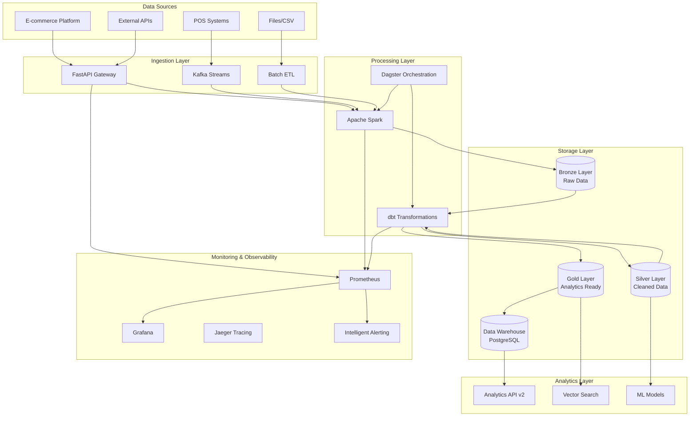

# Enterprise Data Platform Architecture

## Executive Summary

The PwC Retail Data Platform is a modern, cloud-native data engineering solution designed to handle enterprise-scale retail analytics with real-time processing capabilities, comprehensive monitoring, and advanced security features.

## Architecture Overview

### High-Level Architecture



### Technology Stack

#### Core Infrastructure
- **Orchestration**: Dagster (primary), Apache Airflow (legacy support)
- **Processing**: Apache Spark 3.5.3 with Delta Lake
- **Storage**: PostgreSQL (warehouse), S3/GCS (data lake), Redis (cache)
- **API Gateway**: FastAPI with advanced middleware
- **Message Queue**: Apache Kafka, RabbitMQ
- **Search**: Typesense, Elasticsearch

#### Monitoring & Observability
- **Metrics**: Prometheus with custom collectors
- **Visualization**: Grafana with enterprise dashboards
- **Tracing**: Jaeger with OpenTelemetry
- **Logging**: ELK Stack (Elasticsearch, Logstash, Kibana)
- **Alerting**: Custom intelligent alerting with ML-powered anomaly detection

#### Security & Compliance
- **Authentication**: JWT with role-based access control
- **Authorization**: Fine-grained permissions with middleware
- **Encryption**: TLS 1.3, AES-256 at rest
- **Secrets Management**: HashiCorp Vault integration
- **Compliance**: GDPR, SOX compliance features

## Data Architecture

### Medallion Architecture Implementation

#### Bronze Layer (Raw Data)
- **Purpose**: Store raw, unprocessed data exactly as received
- **Format**: Parquet with schema evolution support
- **Retention**: 2 years for audit and reprocessing
- **Schema**: Flexible schema with metadata tracking

```sql
-- Example Bronze Schema
CREATE TABLE bronze.retail_transactions (
    id UUID PRIMARY KEY,
    invoice_no VARCHAR(50),
    stock_code VARCHAR(50),
    description TEXT,
    quantity INTEGER,
    invoice_date TIMESTAMP,
    unit_price DECIMAL(10,2),
    customer_id VARCHAR(50),
    country VARCHAR(100),
    created_at TIMESTAMP DEFAULT CURRENT_TIMESTAMP,
    source_system VARCHAR(50),
    batch_id VARCHAR(100)
);
```

#### Silver Layer (Cleaned & Validated)
- **Purpose**: Clean, validate, and standardize data
- **Quality Checks**: Data validation, deduplication, standardization
- **Schema**: Enforced schema with type safety
- **Partitioning**: By date and region for optimal query performance

```sql
-- Example Silver Schema with quality checks
CREATE TABLE silver.retail_transactions (
    transaction_id UUID PRIMARY KEY,
    invoice VARCHAR(50) NOT NULL,
    stock_code VARCHAR(50) NOT NULL,
    product_description VARCHAR(500),
    quantity INTEGER CHECK (quantity <> 0),
    invoice_date DATE NOT NULL,
    unit_price DECIMAL(10,2) CHECK (unit_price >= 0),
    customer_id VARCHAR(50) NOT NULL,
    country VARCHAR(100) NOT NULL,
    total_amount DECIMAL(12,2) GENERATED ALWAYS AS (quantity * unit_price),
    is_return BOOLEAN GENERATED ALWAYS AS (quantity < 0),
    created_at TIMESTAMP DEFAULT CURRENT_TIMESTAMP,
    data_quality_score DECIMAL(3,2)
) PARTITION BY RANGE (invoice_date);
```

#### Gold Layer (Analytics Ready)
- **Purpose**: Business-ready aggregated data and star schema
- **Design**: Dimensional modeling with fact and dimension tables
- **Performance**: Pre-aggregated metrics, optimized indexes
- **Usage**: Direct consumption by analytics and ML pipelines

### Data Quality Framework

#### Automated Quality Checks
1. **Completeness**: Required field validation
2. **Accuracy**: Business rule validation
3. **Consistency**: Cross-reference validation
4. **Timeliness**: Data freshness monitoring
5. **Validity**: Format and range validation

#### Quality Scoring Algorithm
```python
def calculate_quality_score(row):
    score = 1.0
    
    # Completeness (40% weight)
    completeness = sum(1 for field in required_fields if row[field] is not None) / len(required_fields)
    score *= (0.4 * completeness + 0.6)
    
    # Accuracy (30% weight) 
    accuracy_checks = [
        row['unit_price'] > 0 if row['unit_price'] else True,
        row['quantity'] != 0 if row['quantity'] else True,
        len(row['customer_id']) >= 5 if row['customer_id'] else True
    ]
    accuracy = sum(accuracy_checks) / len(accuracy_checks)
    score *= (0.3 * accuracy + 0.7)
    
    # Validity (30% weight)
    validity_checks = [
        validate_email_format(row['email']) if row['email'] else True,
        validate_country_code(row['country']) if row['country'] else True
    ]
    validity = sum(validity_checks) / len(validity_checks)
    score *= (0.3 * validity + 0.7)
    
    return min(score, 1.0)
```

## API Architecture

### Microservices Design

#### Core Services
1. **API Gateway Service** (`/api/v1`, `/api/v2`)
   - Authentication & authorization
   - Rate limiting & circuit breaking
   - Request/response transformation
   - Monitoring & logging

2. **Analytics Service** (`/api/v2/analytics`)
   - Real-time analytics computation
   - Predictive insights with ML models  
   - Cohort analysis
   - Performance metrics

3. **Data Service** (`/api/v1/sales`, `/api/v2/sales`)
   - CRUD operations on business entities
   - Complex queries with caching
   - Data export capabilities

4. **Search Service** (`/api/v1/search`)
   - Vector-based semantic search
   - Full-text search with Elasticsearch
   - Recommendation engine

### Advanced API Features

#### Circuit Breaker Pattern
```python
@dataclass
class CircuitBreakerConfig:
    failure_threshold: int = 5
    timeout_seconds: int = 60
    expected_exception: type = HTTPException
```

#### Rate Limiting with Redis
- **Sliding window algorithm** for accurate rate limiting
- **Burst protection** for handling traffic spikes
- **Per-user and per-endpoint limits**

#### Intelligent Caching Strategy
- **L1 Cache**: In-memory with TTL
- **L2 Cache**: Redis with intelligent invalidation
- **L3 Cache**: Database query result caching

## Infrastructure as Code

### Terraform Configuration

#### Multi-Cloud Support
The platform supports deployment across AWS, Azure, and GCP with environment-specific configurations:

```hcl
# Environment-specific variables
variable "cloud_provider" {
  description = "Target cloud provider"
  type        = string
  validation {
    condition     = contains(["aws", "azure", "gcp"], var.cloud_provider)
    error_message = "Cloud provider must be aws, azure, or gcp."
  }
}

# Conditional resource creation
module "aws_infrastructure" {
  count  = var.cloud_provider == "aws" ? 1 : 0
  source = "./modules/aws"
  # ... configuration
}
```

#### Security Best Practices
- **Encryption**: All data encrypted at rest and in transit
- **Network Isolation**: VPC/VNet with private subnets
- **IAM**: Least privilege access with role-based permissions
- **Secrets**: Managed through cloud-native secret stores

### Kubernetes Deployment

#### Container Orchestration
```yaml
# Example deployment with resource limits and health checks
apiVersion: apps/v1
kind: Deployment
metadata:
  name: api-service
spec:
  replicas: 3
  selector:
    matchLabels:
      app: api-service
  template:
    metadata:
      labels:
        app: api-service
    spec:
      containers:
      - name: api
        image: pwc-retail/api:latest
        ports:
        - containerPort: 8000
        resources:
          requests:
            cpu: 500m
            memory: 1Gi
          limits:
            cpu: 2000m
            memory: 4Gi
        livenessProbe:
          httpGet:
            path: /health
            port: 8000
          initialDelaySeconds: 30
          periodSeconds: 10
        readinessProbe:
          httpGet:
            path: /ready
            port: 8000
          initialDelaySeconds: 5
          periodSeconds: 5
```

## Performance & Scalability

### Horizontal Scaling Strategy

#### API Services
- **Load Balancing**: NGINX with health checks
- **Auto-scaling**: HPA based on CPU/memory metrics
- **Session Management**: Stateless design with JWT

#### Data Processing
- **Spark Cluster**: Dynamic resource allocation
- **Parallel Processing**: Partitioned data processing
- **Caching**: Multi-level caching strategy

### Performance Optimizations

#### Database Optimizations
1. **Indexing Strategy**:
   ```sql
   -- Composite indexes for common query patterns
   CREATE INDEX idx_sales_customer_date ON fact_sales (customer_id, invoice_date);
   CREATE INDEX idx_sales_product_country ON fact_sales (product_key, country);
   
   -- Partial indexes for filtered queries
   CREATE INDEX idx_sales_returns ON fact_sales (invoice_date) 
   WHERE is_return = true;
   ```

2. **Partitioning**:
   ```sql
   -- Range partitioning by date
   CREATE TABLE fact_sales_2024_q1 PARTITION OF fact_sales 
   FOR VALUES FROM ('2024-01-01') TO ('2024-04-01');
   ```

3. **Query Optimization**:
   - Materialized views for complex aggregations
   - Connection pooling with pgBouncer
   - Query plan caching

## Security Architecture

### Authentication & Authorization

#### JWT Implementation
```python
class SecurityConfig:
    jwt_secret_key: str
    jwt_algorithm: str = "HS256"
    access_token_expire_minutes: int = 30
    refresh_token_expire_days: int = 7
```

#### Role-Based Access Control (RBAC)
```yaml
# Example role configuration
roles:
  - name: data_analyst
    permissions:
      - "read:analytics"
      - "read:reports"
    resources:
      - "/api/v1/sales/*"
      - "/api/v2/analytics/*"
  
  - name: data_engineer
    permissions:
      - "read:*"
      - "write:etl"
      - "manage:pipelines"
    resources:
      - "/api/*"
      - "/admin/*"
```

### Data Privacy & Compliance

#### GDPR Compliance
- **Right to be Forgotten**: Automated data deletion workflows
- **Data Portability**: Export APIs for customer data
- **Consent Management**: Audit trail for data processing consent

#### Data Masking & Anonymization
```python
def anonymize_customer_data(customer_record):
    return {
        'customer_id': hash_pii(customer_record['customer_id']),
        'email': mask_email(customer_record['email']),
        'country': customer_record['country'],  # Aggregate data ok
        'purchase_history': aggregate_purchases(customer_record['purchases'])
    }
```

## Monitoring & Observability

### Metrics Collection Strategy

#### Business Metrics
- Revenue trends and forecasting
- Customer acquisition and retention
- Product performance analytics
- Geographic sales distribution

#### Technical Metrics
- API response times and error rates
- Database query performance
- Cache hit ratios
- ETL pipeline success rates

#### Infrastructure Metrics
- CPU, memory, and disk utilization
- Network throughput and latency
- Container resource usage
- Auto-scaling events

### Intelligent Alerting

#### ML-Powered Anomaly Detection
```python
class AnomalyDetector:
    def __init__(self, contamination=0.1):
        self.model = IsolationForest(contamination=contamination)
        self.scaler = StandardScaler()
    
    def detect_anomaly(self, metrics: List[float]) -> bool:
        X_scaled = self.scaler.transform([metrics])
        return self.model.predict(X_scaled)[0] == -1
```

#### Smart Alert Routing
- **Severity-based routing**: Critical alerts to on-call, warnings to Slack
- **Context-aware grouping**: Related alerts grouped to reduce noise
- **Escalation policies**: Auto-escalation if not acknowledged

## Disaster Recovery & Business Continuity

### Backup Strategy

#### Automated Backups
- **Database**: Point-in-time recovery with 7-day retention
- **Data Lake**: Cross-region replication with versioning
- **Configuration**: GitOps with infrastructure state backup

#### Recovery Procedures
1. **RTO (Recovery Time Objective)**: 4 hours
2. **RPO (Recovery Point Objective)**: 15 minutes
3. **Testing**: Monthly disaster recovery drills

### High Availability Design

#### Multi-Region Deployment
- **Active-Passive**: Primary in us-east-1, standby in eu-west-1
- **Data Replication**: Asynchronous replication with <5 minute lag
- **Failover**: Automated with DNS-based traffic routing

## Development & Deployment

### CI/CD Pipeline

#### Automated Testing Strategy
```yaml
# GitHub Actions pipeline example
name: CI/CD Pipeline
on:
  push:
    branches: [main, develop]
  pull_request:
    branches: [main]

jobs:
  test:
    runs-on: ubuntu-latest
    steps:
      - name: Unit Tests
        run: pytest tests/unit --cov=src
      
      - name: Integration Tests
        run: pytest tests/integration
      
      - name: Performance Tests
        run: locust --headless --users 100 --spawn-rate 10
      
      - name: Security Scan
        run: bandit -r src/
```

#### Deployment Strategy
- **Blue-Green Deployment**: Zero-downtime deployments
- **Canary Releases**: Gradual rollout with monitoring
- **Feature Flags**: A/B testing and progressive feature rollout

### Code Quality Standards

#### Automated Quality Gates
- **Code Coverage**: Minimum 80% coverage required
- **Static Analysis**: SonarQube integration
- **Dependency Scanning**: Automated vulnerability scanning
- **Performance Testing**: Load testing on every major release

## Cost Optimization

### Resource Management

#### Auto-Scaling Policies
```yaml
# Kubernetes HPA configuration
apiVersion: autoscaling/v2
kind: HorizontalPodAutoscaler
metadata:
  name: api-service-hpa
spec:
  scaleTargetRef:
    apiVersion: apps/v1
    kind: Deployment
    name: api-service
  minReplicas: 2
  maxReplicas: 10
  metrics:
  - type: Resource
    resource:
      name: cpu
      target:
        type: Utilization
        averageUtilization: 70
  - type: Resource
    resource:
      name: memory
      target:
        type: Utilization
        averageUtilization: 80
```

#### Cost Monitoring
- **Resource tagging**: All resources tagged with cost center and environment
- **Usage analytics**: Monthly cost analysis and optimization recommendations
- **Reserved instances**: Strategic use of reserved capacity for predictable workloads

## Future Roadmap

### Short-term Improvements (3-6 months)
- Real-time streaming analytics with Kafka Streams
- Advanced ML model deployment with MLflow
- Enhanced data lineage tracking
- GraphQL API implementation

### Long-term Vision (6-12 months)
- Multi-tenant SaaS platform
- Advanced data governance with Apache Atlas
- Edge computing for real-time personalization
- Blockchain integration for supply chain traceability

## Getting Started

### Prerequisites
- Docker & Docker Compose
- Python 3.11+
- Node.js 18+ (for frontend development)
- Terraform 1.5+
- kubectl (for Kubernetes deployment)

### Quick Start Guide
1. **Clone Repository**: `git clone <repository-url>`
2. **Environment Setup**: `cp .env.example .env`
3. **Start Services**: `docker-compose up -d`
4. **Initialize Database**: `python scripts/init_db.py`
5. **Access API**: `http://localhost:8000/docs`

### Development Workflow
1. **Feature Branch**: Create from `develop` branch
2. **Development**: Write code with tests
3. **Testing**: Run full test suite locally
4. **PR Review**: Submit pull request with documentation
5. **Deployment**: Automatic deployment after approval

For detailed setup instructions, see [DEPLOYMENT.md](./DEPLOYMENT.md).