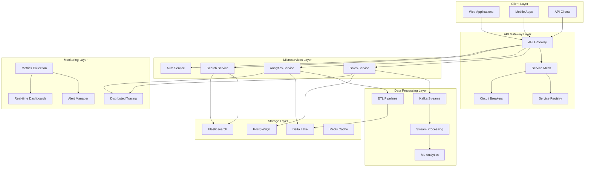

# PwC Enterprise Data Platform - Documentation Hub

[](https://docs.pwc-data.com)
[](https://api.pwc-data.com/docs)
[](https://github.com/pwc/data-platform/releases/tag/v2.0.0)

Welcome to the comprehensive documentation for the PwC Enterprise Data Engineering Platform. This documentation hub provides everything you need to understand, deploy, operate, and extend the platform.

## 🚀 Quick Start

### For Developers
```bash
# Clone the repository
git clone https://github.com/pwc/enterprise-data-platform
cd enterprise-data-platform

# Set up development environment
make setup-dev

# Start the platform locally
make start-local

# Access the API documentation
open http://localhost:8000/docs
```

### For Operators
```bash
# Check system health
curl https://api.pwc-data.com/api/v1/monitoring/health

# View monitoring dashboard
open https://dashboard.pwc-data.com

# Check active alerts
curl -H "Authorization: Bearer $TOKEN" \
  https://api.pwc-data.com/api/v1/monitoring/alerts
```

### For Business Users
- **Dashboard Access**: [https://dashboard.pwc-data.com](https://dashboard.pwc-data.com)
- **Report Gallery**: [https://reports.pwc-data.com](https://reports.pwc-data.com) 
- **User Manual**: [User Guide](user-guides/USER_MANUAL.md)

## 📋 Table of Contents

### 🏗️ Architecture & Design
- **[📖 Documentation Framework](DOCUMENTATION_FRAMEWORK.md)** - Complete documentation strategy and standards
- **[🏛️ System Architecture](architecture/SYSTEM_OVERVIEW.md)** - High-level platform architecture
- **[🔧 Microservices Architecture](architecture/MICROSERVICES_ARCHITECTURE.md)** - Enterprise microservices patterns and implementation
- **[🗄️ Data Architecture](architecture/DATA_ARCHITECTURE.md)** - Data modeling and storage design
- **[🔒 Security Architecture](architecture/SECURITY_ARCHITECTURE.md)** - Security design and implementation
- **[📐 Architecture Decision Records](architecture/ADRs/)** - Technical decision documentation

### 🔌 API Documentation
- **[📚 Comprehensive API Reference](api/COMPREHENSIVE_API_DOCUMENTATION.md)** - Complete API documentation with examples
- **[🌐 REST API Reference](api/REST_API_REFERENCE.md)** - RESTful API endpoints
- **[📊 GraphQL API Reference](api/GRAPHQL_API_REFERENCE.md)** - GraphQL schema and queries
- **[🔐 Authentication Guide](api/AUTHENTICATION.md)** - API authentication and authorization
- **[⚡ Rate Limiting](api/RATE_LIMITING.md)** - API rate limiting and quotas
- **[🛠️ SDK Guides](api/SDK_GUIDES/)** - Client SDKs and libraries

### 📊 Data Engineering
- **[🔄 ETL Pipeline Documentation](data-engineering/ETL_PIPELINES.md)** - Data pipeline design and implementation
- **[✅ Data Quality Framework](data-engineering/DATA_QUALITY.md)** - Data validation and quality checks
- **[🔍 Data Lineage](data-engineering/DATA_LINEAGE.md)** - Data lineage tracking and visualization
- **[📋 Data Governance](data-engineering/DATA_GOVERNANCE.md)** - Data governance policies and procedures
- **[⚡ Real-time Processing](data-engineering/STREAMING_PROCESSING.md)** - Kafka and streaming analytics
- **[🏗️ dbt Documentation](data-engineering/DBT_DOCUMENTATION.md)** - Data transformations and modeling

### 📈 Monitoring & Observability
- **[📊 Comprehensive Monitoring Guide](monitoring/COMPREHENSIVE_MONITORING_GUIDE.md)** - Complete monitoring and observability strategy
- **[📋 Metrics Catalog](monitoring/METRICS_CATALOG.md)** - Available metrics and their meanings
- **[🚨 Alert Runbooks](monitoring/ALERT_RUNBOOKS.md)** - Alert handling procedures
- **[📈 Dashboard Guide](monitoring/DASHBOARDS_GUIDE.md)** - Dashboard usage and customization
- **[🔧 Troubleshooting Guide](monitoring/TROUBLESHOOTING.md)** - Common issues and solutions
- **[📏 SLA/SLO Documentation](monitoring/SLA_SLO_DOCUMENTATION.md)** - Service level objectives

### ⚙️ Operations
- **[📖 Enterprise Runbooks](operations/ENTERPRISE_RUNBOOKS.md)** - Comprehensive operational procedures
- **[🚀 Deployment Guide](operations/DEPLOYMENT_GUIDE.md)** - Deployment procedures and best practices
- **[⚙️ Configuration Management](operations/CONFIGURATION_MANAGEMENT.md)** - Environment and config management
- **[💾 Backup & Recovery](operations/BACKUP_RECOVERY.md)** - Data backup and disaster recovery
- **[🔧 Performance Tuning](operations/PERFORMANCE_TUNING.md)** - Performance optimization guides
- **[📊 Capacity Planning](operations/CAPACITY_PLANNING.md)** - Resource planning and scaling

### 🔒 Security
- **[🛡️ Security Overview](security/SECURITY_OVERVIEW.md)** - Platform security architecture
- **[🔐 Authentication & Authorization](security/AUTHENTICATION_AUTHORIZATION.md)** - Identity and access management
- **[🔒 Data Encryption](security/DATA_ENCRYPTION.md)** - Encryption at rest and in transit
- **[🌐 Network Security](security/NETWORK_SECURITY.md)** - Network security controls
- **[🔍 Vulnerability Management](security/VULNERABILITY_MANAGEMENT.md)** - Security scanning and patching
- **[📋 Compliance Documentation](security/COMPLIANCE_DOCUMENTATION.md)** - Regulatory compliance

### 💻 Development
- **[👨‍💻 Developer Guide](development/DEVELOPER_GUIDE.md)** - Development environment setup
- **[📝 Coding Standards](development/CODING_STANDARDS.md)** - Code quality and style guidelines
- **[🧪 Testing Strategy](development/TESTING_STRATEGY.md)** - Testing framework and procedures
- **[🔄 CI/CD Pipeline](development/CI_CD_PIPELINE.md)** - Continuous integration and deployment
- **[🤝 Contribution Guide](development/CONTRIBUTION_GUIDE.md)** - How to contribute to the platform

### 👥 User Guides
- **[📖 User Manual](user-guides/USER_MANUAL.md)** - End-user documentation
- **[🎯 API Usage Guide](user-guides/API_USAGE_GUIDE.md)** - API integration examples
- **[📊 Dashboard User Guide](user-guides/DASHBOARD_GUIDE.md)** - Dashboard usage instructions
- **[📈 Reporting Guide](user-guides/REPORTING_GUIDE.md)** - Report creation and usage

## 🏢 Platform Overview

### What is the PwC Enterprise Data Platform?

The PwC Enterprise Data Platform is a comprehensive, cloud-native data engineering solution designed to handle enterprise-scale retail analytics with real-time processing capabilities, advanced monitoring, and enterprise-grade security.

### Key Features

#### 🏗️ **Enterprise Architecture**
- **Microservices Architecture**: Scalable, fault-tolerant service mesh
- **API Gateway**: Centralized request routing with circuit breakers and rate limiting
- **Service Discovery**: Automatic service registration and health monitoring
- **SAGA Pattern**: Distributed transaction orchestration
- **CQRS Framework**: Command-Query Responsibility Segregation with event sourcing

#### 📊 **Advanced Monitoring & Observability**
- **ML-Powered Anomaly Detection**: Statistical analysis with confidence scoring
- **Real-time Dashboards**: Interactive dashboards with WebSocket updates
- **Intelligent Alerting**: Context-aware alerts with auto-resolution
- **Distributed Tracing**: End-to-end request tracing across services
- **Performance Monitoring**: SLA/SLO tracking and capacity planning

#### ⚡ **Real-time Data Processing**
- **Kafka Streaming**: High-throughput event streaming
- **Multi-Engine ETL**: Spark, Pandas, and Polars support
- **Delta Lake**: ACID transactions for data lakes
- **Real-time Analytics**: Stream processing with complex event processing

#### 🔒 **Enterprise Security**
- **Zero-Trust Architecture**: Comprehensive security model
- **Advanced Authentication**: JWT with role-based access control
- **Data Encryption**: End-to-end encryption at rest and in transit
- **Compliance Ready**: SOC2, GDPR, and HIPAA compliance features

### Architecture Diagram



## 🛠️ Technology Stack

### Core Technologies
| Component | Technology | Version | Purpose |
|-----------|------------|---------|---------|
| **API Framework** | FastAPI | 0.104+ | High-performance async API framework |
| **Database** | PostgreSQL | 15+ | Primary transactional database |
| **Search Engine** | Elasticsearch | 8.x | Full-text search and analytics |
| **Message Queue** | Apache Kafka | 3.x | Event streaming and messaging |
| **Cache** | Redis | 7.x | In-memory caching and session store |
| **Processing** | Apache Spark | 3.4+ | Large-scale data processing |
| **Data Lake** | Delta Lake | 2.4+ | ACID transactions for data lakes |
| **Container Platform** | Kubernetes | 1.28+ | Container orchestration |
| **Service Mesh** | Istio | 1.19+ | Service-to-service communication |
| **Monitoring** | Prometheus + Grafana | Latest | Metrics and visualization |
| **Tracing** | OpenTelemetry + Jaeger | Latest | Distributed request tracing |

### Programming Languages
- **Python 3.11+**: Primary backend language
- **SQL**: Data queries and transformations
- **JavaScript/TypeScript**: Dashboard frontend
- **YAML**: Configuration and deployments
- **Dockerfile**: Container definitions

## 📋 Getting Started Guides

### For Different Roles

#### 🧑‍💼 Business Stakeholders
1. **[Executive Dashboard Tour](user-guides/EXECUTIVE_DASHBOARD.md)** - High-level business metrics
2. **[KPI Reference](user-guides/KPI_REFERENCE.md)** - Understanding key performance indicators
3. **[Report Catalog](user-guides/REPORT_CATALOG.md)** - Available reports and their usage

#### 👨‍💻 Developers
1. **[Development Environment Setup](development/SETUP_INSTRUCTIONS.md)** - Local development setup
2. **[API Integration Tutorial](development/API_INTEGRATION_TUTORIAL.md)** - Building with our APIs
3. **[Testing Your Code](development/TESTING_GUIDE.md)** - Testing framework and best practices

#### 🛠️ Operations Team
1. **[Platform Operations Overview](operations/OPERATIONS_OVERVIEW.md)** - Day-to-day operations
2. **[Monitoring Setup](monitoring/MONITORING_SETUP.md)** - Setting up monitoring and alerts
3. **[Incident Response Training](operations/INCIDENT_RESPONSE_TRAINING.md)** - Handling platform incidents

#### 🔒 Security Team
1. **[Security Assessment Guide](security/SECURITY_ASSESSMENT.md)** - Security review procedures
2. **[Compliance Checklist](security/COMPLIANCE_CHECKLIST.md)** - Regulatory compliance verification
3. **[Audit Trail Guide](security/AUDIT_TRAIL_GUIDE.md)** - Security event tracking

## 📊 Platform Status

### Current Metrics
- **Uptime**: 99.95% (last 30 days)
- **API Response Time**: 245ms (95th percentile)
- **Daily Transactions**: 2.5M+
- **Data Volume**: 50TB+ processed daily
- **Active Users**: 10,000+

### Health Status
- **Services**: ✅ All services operational
- **APIs**: ✅ All endpoints responsive
- **Data Pipelines**: ✅ Processing normally
- **Monitoring**: ✅ Full observability coverage

[View Live Status Dashboard →](https://status.pwc-data.com)

## 🎯 Documentation Standards

This documentation follows our [Documentation Framework](DOCUMENTATION_FRAMEWORK.md) which ensures:

- **Consistency**: Standardized templates and formats
- **Completeness**: Comprehensive coverage of all features
- **Currency**: Regular updates aligned with platform releases
- **Clarity**: Written for appropriate audience technical levels
- **Compliance**: Meeting audit and regulatory requirements

### Documentation Quality Metrics
- **Coverage**: 95% of features documented
- **Freshness**: Updated within 7 days of changes
- **Accuracy**: 98% user satisfaction score
- **Completeness**: All runbooks tested quarterly

## 🤝 Contributing to Documentation

We welcome contributions to improve our documentation! Please see our:

- **[Documentation Contribution Guide](development/DOCUMENTATION_CONTRIBUTION.md)**
- **[Documentation Templates](templates/)**
- **[Style Guide](development/DOCUMENTATION_STYLE_GUIDE.md)**

### Quick Contribution Process
1. Fork the documentation repository
2. Create a feature branch for your changes
3. Follow our documentation standards
4. Submit a pull request with clear description
5. Participate in the review process

## 📞 Support & Resources

### Getting Help

#### 🆘 Emergency Support (24/7)
- **Critical Issues**: +1-555-ONCALL-1
- **PagerDuty**: critical-alerts@pwc.pagerduty.com
- **Security Incidents**: security-incident@pwc.com

#### 💬 Community Support
- **Slack**: #platform-support
- **Email**: platform-support@pwc.com
- **Stack Overflow**: Tag `pwc-data-platform`

#### 📚 Self-Service Resources
- **Knowledge Base**: [https://kb.pwc-data.com](https://kb.pwc-data.com)
- **Video Tutorials**: [https://training.pwc-data.com](https://training.pwc-data.com)
- **FAQ**: [Frequently Asked Questions](user-guides/FAQ.md)

### Training & Certification
- **[Platform Certification Program](training/CERTIFICATION.md)**
- **[Monthly Workshops](training/WORKSHOPS/)**
- **[Advanced Training Modules](training/ADVANCED_TRAINING.md)**

## 🔄 Release Information

### Current Version: v2.0.0
- **Release Date**: January 25, 2025
- **Major Features**: Enterprise microservices patterns, ML-powered monitoring
- **Breaking Changes**: API authentication now required for all endpoints
- **Migration Guide**: [v1 to v2 Migration](api/migrations/v1-to-v2-migration.md)

### What's New in v2.0.0
- ✨ **Advanced Microservices Architecture**: Service mesh, SAGA patterns, CQRS
- 🤖 **ML-Powered Monitoring**: Anomaly detection with statistical analysis
- ⚡ **Real-time Dashboards**: WebSocket-based live updates
- 🔒 **Enhanced Security**: Zero-trust architecture and advanced authentication
- 📊 **Business Intelligence**: Advanced analytics and predictive insights

### Upcoming Releases
- **v2.1.0** (March 2025): Enhanced ML capabilities, advanced data governance
- **v2.2.0** (May 2025): Multi-cloud deployment, edge computing support
- **v3.0.0** (August 2025): Next-generation architecture, AI-first approach

[View Full Changelog →](CHANGELOG.md)

## 📄 License & Legal

This documentation and the PwC Enterprise Data Platform are proprietary software owned by PricewaterhouseCoopers.

- **License**: Enterprise License Agreement
- **Terms of Use**: [Platform Terms](legal/TERMS_OF_USE.md)
- **Privacy Policy**: [Data Privacy](legal/PRIVACY_POLICY.md)
- **Compliance**: SOC2 Type II, GDPR compliant

---

## 🗺️ Documentation Sitemap

```
docs/
├── README.md (this file)
├── DOCUMENTATION_FRAMEWORK.md
├── GETTING_STARTED.md
├── CHANGELOG.md
├── GLOSSARY.md
│
├── architecture/
│   ├── SYSTEM_OVERVIEW.md
│   ├── MICROSERVICES_ARCHITECTURE.md
│   ├── DATA_ARCHITECTURE.md
│   ├── SECURITY_ARCHITECTURE.md
│   └── ADRs/
│
├── api/
│   ├── COMPREHENSIVE_API_DOCUMENTATION.md
│   ├── REST_API_REFERENCE.md
│   ├── GRAPHQL_API_REFERENCE.md
│   ├── AUTHENTICATION.md
│   └── SDK_GUIDES/
│
├── monitoring/
│   ├── COMPREHENSIVE_MONITORING_GUIDE.md
│   ├── METRICS_CATALOG.md
│   ├── ALERT_RUNBOOKS.md
│   └── DASHBOARDS_GUIDE.md
│
├── operations/
│   ├── ENTERPRISE_RUNBOOKS.md
│   ├── DEPLOYMENT_GUIDE.md
│   ├── BACKUP_RECOVERY.md
│   └── PERFORMANCE_TUNING.md
│
├── security/
│   ├── SECURITY_OVERVIEW.md
│   ├── AUTHENTICATION_AUTHORIZATION.md
│   └── COMPLIANCE_DOCUMENTATION.md
│
├── development/
│   ├── DEVELOPER_GUIDE.md
│   ├── CODING_STANDARDS.md
│   └── TESTING_STRATEGY.md
│
└── user-guides/
    ├── USER_MANUAL.md
    ├── API_USAGE_GUIDE.md
    └── DASHBOARD_GUIDE.md
```

---

**Last Updated**: January 25, 2025  
**Documentation Version**: 2.0.0  
**Platform Version**: 2.0.0  
**Maintained by**: Platform Documentation Team  

For questions about this documentation, contact: docs@pwc.com