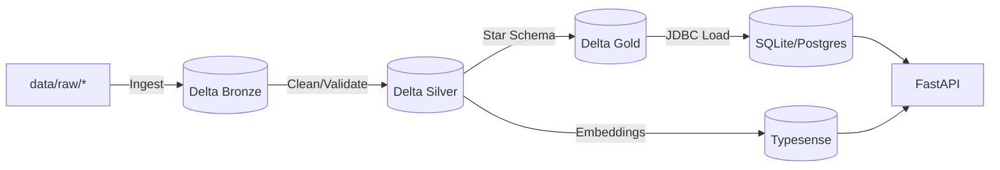

# PwC Data Engineering Challenge — Technical README

This document provides a precise, implementation-focused guide for running, extending, and validating the project. It aligns with the JSON prompt in `/.vscode/jsonprompt.json` and clarifies how the API consumes curated data from the ETL Gold layer (star schema warehouse).

- Code root: `src/de_challenge/`
- Config: `src/de_challenge/core/config.py`
- API root: `src/de_challenge/api/`
- ETL layers: `src/de_challenge/etl/{bronze,silver,gold}/`
- Domain validation: `src/de_challenge/domain/`
- Vector search: `src/de_challenge/vector_search/`
- Warehouse (SQLite dev): `data/warehouse/retail.db`

---

## 1. Architecture Overview

- Bronze: Raw ingestion from `data/raw/` to Delta tables in `data/bronze/`.
- Silver: Cleaned/standardized data in Delta at `data/silver/`, validated by Pydantic domain models.
- Gold: Star schema (Dimensions + FactSale) in Delta at `data/gold/` and loaded to warehouse (SQLite for dev; PostgreSQL for staging/prod).
- API: FastAPI serving health, sales querying, and (future) ETL triggers & search endpoints.
- Vector search: Typesense using product description embeddings (future).

Mermaid (high-level):


---

## 2. Environments & Configuration

Environment variables are managed by `pydantic-settings` in `src/de_challenge/core/config.py`. A sample is provided in `.env.example`.

Key variables:
- `ENVIRONMENT` = development|staging|production
- `DATABASE_TYPE` = sqlite|postgresql
- `DATABASE_URL` = `sqlite:///./data/warehouse/retail.db` (dev default)
- `SPARK_MASTER` = `local[*]` (dev)
- `TYPESENSE_API_KEY`, `TYPESENSE_HOST`, `TYPESENSE_PORT`
- `BASIC_AUTH_USERNAME`, `BASIC_AUTH_PASSWORD`

On import, `settings.validate_paths()` creates the required directories.

---

## 3. Data Contracts by Layer

### 3.1 Bronze (Raw -> Delta)
- Inputs: `data/raw/transactions/*.csv` (or XLSX per Online Retail II)
- Outputs: Delta at `data/bronze/transactions`
- Partitions: `ingestion_date`
- Metadata columns: `ingestion_timestamp`, `source_file_path`, `source_file_size`, `source_file_type`, `ingestion_job_id`, `schema_version`
- Quarantine for corrupt rows: `data/bronze/quarantine`

### 3.2 Silver (Cleaned -> Delta)
- Input: `data/bronze/transactions`
- Output: `data/silver/transactions`
- Validations: Pydantic models in `src/de_challenge/domain/validators/`
- Dedup strategy: row_number over (`invoice_no`, `stock_code`, `customer_id`) ordered by `ingestion_timestamp` desc
- Metrics: processed/validated/rejected counts and error distribution

### 3.3 Gold (Star Schema -> Delta + Warehouse)
- Input: `data/silver/transactions`
- Dimensions: `DimDate`, `DimProduct`, `DimCustomer`, `DimCountry`, `DimInvoice`
- Facts: `FactSale`
- Surrogate keys: `sha256(natural_key)` with `-1` unknown members
- Warehouse load (dev): SQLite from Delta Gold using JDBC
  - Dimensions: overwrite
  - Facts: append

Warehouse target (dev default): `data/warehouse/retail.db`

---

## 4. Warehouse Schema (API Source of Truth)

The API reads from the Gold warehouse. Expected SQLModel entities (to be implemented in `src/de_challenge/data_access/models/`) include:

- Dim tables (example fields):
  - `DimDate(date_key PK, date, year, quarter, month, day)`
  - `DimProduct(product_key PK, stock_code, description, category)`
  - `DimCustomer(customer_key PK, customer_id, segment)`
  - `DimCountry(country_key PK, name)`
  - `DimInvoice(invoice_key PK, invoice_no, invoice_status, invoice_type)`
- Fact table:
  - `FactSale(sale_key PK, date_key FK, product_key FK, customer_key FK, country_key FK, invoice_key FK, quantity, unit_price, total, invoice_timestamp)`

These tables will be created/migrated with SQLModel + Alembic and queried by the API services.

---

## 5. API Contracts (v1)

Root app: `src/de_challenge/api/main.py`.

- Auth: HTTP Basic. Configure via `.env`: `BASIC_AUTH_USERNAME`, `BASIC_AUTH_PASSWORD`.

Routes:
- `GET /health`
  - Response: `{ status: "ok", environment: string, version: "v1" }`
  - Purpose: Healthcheck (used by Docker healthcheck)
- `GET /api/v1/health`
  - Response: same as `/health`
- `GET /api/v1/sales`
  - Auth: Basic required
  - Query params: `date_from?`, `date_to?`, `product?`, `country?`, `page=1`, `size=20`, `sort="invoice_date:desc"`
  - Response model:
    ```json
    {
      "items": [
        {
          "invoice_no": "string",
          "stock_code": "string",
          "description": "string|null",
          "quantity": 0,
          "invoice_date": "YYYY-MM-DDTHH:MM:SS",
          "unit_price": 0.0,
          "customer_id": "string|null",
          "country": "string|null",
          "total": 0.0,
          "total_str": "0.00"
        }
      ],
      "total": 0,
      "page": 1,
      "size": 20
    }
    ```
  - Data source: Gold warehouse (SQLite/Postgres) joining `FactSale` with dimensions to hydrate fields.
  - Notes:
    - `total` is a rounded float value.
    - `total_str` is the same value formatted with exactly 2 decimals for display.

Planned (per JSON prompt):
- `POST /api/v1/etl/trigger` — trigger Bronze/Silver/Gold jobs with job status response
- `GET /api/v1/search` — Typesense-backed product search with filters and pagination

Examples:
```bash
# Health
curl http://127.0.0.1:8000/health

# Sales (Basic Auth)
curl -u admin:changeme123 "http://127.0.0.1:8000/api/v1/sales?page=1&size=10"
```

---

## 6. ETL Execution

Spark config derived in `settings.spark_config`. Defaults for dev:
- `spark.master = local[*]`
- Delta Lake enabled via extensions & catalog
- `spark.sql.adaptive.enabled = true`

Entry points (to be implemented):
- Bronze: `python -m de_challenge.etl.bronze.ingest_structured --input data/raw/ --output data/bronze/`
- Silver: `python -m de_challenge.etl.silver.clean_transactions --input data/bronze/ --output data/silver/`
- Gold: `python -m de_challenge.etl.gold.load_warehouse --input data/silver/ --db data/warehouse/retail.db`

---

## 7. Vector Search (Planned)

- Typesense collection `products` with fields:
  - `id (string)`, `stock_code (string, facet)`, `description (string)`, `description_embedding (float[384])`, `category (string, facet)`, `price (float, facet)`, `country (string[], facet)`
- Embeddings model: `sentence-transformers` (e.g., all-MiniLM-L6-v2)
- Indexer in `src/de_challenge/vector_search/{embeddings}/`
- API `GET /api/v1/search` to query Typesense with filters/pagination

---

## 8. Local Development

Prereqs:
- Python 3.10.x, Poetry 1.8+

Commands:
```bash
# Install (all deps)
poetry install

# Run API (dev)
poetry run uvicorn de_challenge.api.main:app --host 0.0.0.0 --port 8000 --reload

# Or via Makefile
make dev-install
make run-api

# Pre-commit hooks
poetry run pre-commit install
```

Docker:
```bash
docker compose up --build -d
curl http://localhost:8000/health
```

Split images (faster API builds):

- API image (no Java): `docker/Dockerfile.api`
- ETL image (with Java for PySpark): `docker/Dockerfile.etl`

Compose services (see `docker-compose.yml`):

- `api` uses `docker/Dockerfile.api`
- `etl-gold` uses `docker/Dockerfile.etl` with profile `etl`

Common commands:

```bash
# Rebuild API only (after code changes in src/ or API deps)
docker compose build api && docker compose up -d api

# Tail API logs
docker compose logs -f api

# Run Gold ETL on-demand (reads Silver CSV/Parquet, loads warehouse; idempotent)
docker compose run --rm --profile etl etl-gold
```

Idempotency:

- Gold load skips inserting `FactSale` rows that already exist for the same `(invoice_key, product_key, invoice_timestamp)`.
- This allows safely re-running the job without creating duplicates. The job reports inserted and skipped counts.

---

## 9. Testing & Quality

- Unit, integration tests under `tests/`
- Pytest config: `pyproject.toml` (`[tool.pytest.ini_options]`)
- Lint/format/typecheck:
  - `ruff`, `black`, `mypy` configured in `pyproject.toml`
  - `make check` or run individually

Coverage target: 80%+ for core modules.

---

## 10. Roadmap to Completion

1) Implement SQLModel entities and Alembic migrations for star schema in `src/de_challenge/data_access/models/`.
2) Implement SalesService queries against warehouse.
3) Implement Bronze/Silver/Gold Spark jobs (Delta I/O + validations).
4) Add ETL trigger endpoint and background job orchestration.
5) Implement Typesense embeddings, indexing, and search endpoint.
6) Expand tests, add fixtures, CI checks.

---

## 11. Security Notes

- Basic Auth only in this version; keep credentials in `.env`.
- Validate all inputs (Pydantic + query param bounds).
- Prefer environment-specific DB credentials for staging/prod.

---

## 12. Troubleshooting

- 401 on `/api/v1/sales`: supply Basic Auth; verify `.env` values.
- Import errors: ensure running inside Poetry environment.
- Docker healthcheck failing: confirm `/health` returns status ok; check logs.
- SQLite locked: close other connections; avoid concurrent writers on dev.
