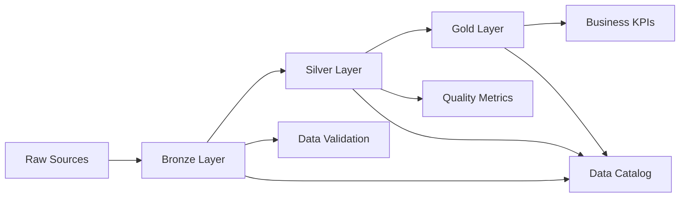

# ADR-003: Medallion Architecture for Data Layers

**Status:** Accepted  
**Date:** 2024-01-22  
**Decision Makers:** Data Engineering Team, Data Architecture Committee  
**Technical Story:** [Data Lake Organization with Bronze-Silver-Gold Layers]

## Context and Problem Statement

Our data engineering platform needs to organize and process data in a way that:
- Provides clear data quality progression from raw to analytics-ready
- Enables incremental processing and data lineage tracking
- Supports both batch and streaming data processing
- Allows different consumers to access data at appropriate quality levels
- Maintains data governance and compliance requirements
- Enables efficient storage and query performance

We need an architecture that can handle diverse data sources (CSV, JSON, API feeds) and transform them into high-quality, business-ready datasets for analytics and reporting.

## Decision Drivers

* **Data Quality**: Clear progression from raw to refined data
* **Performance**: Optimized storage and query performance at each layer
* **Governance**: Data lineage, quality metrics, and compliance tracking
* **Scalability**: Handle increasing data volumes and variety
* **Flexibility**: Support different data formats and processing patterns
* **Cost Efficiency**: Optimize storage costs through appropriate data formats
* **Developer Experience**: Clear data organization and access patterns

## Considered Options

### Option A: Single Data Lake with Folders
**Pros:**
- Simple folder structure
- Direct access to all data
- Minimal data duplication

**Cons:**
- No clear data quality boundaries
- Mixed raw and processed data
- Difficult to enforce data quality standards
- Performance issues with mixed formats

### Option B: Traditional Data Warehouse Approach
**Pros:**
- Well-established patterns
- Strong schema enforcement
- Optimized for analytical queries

**Cons:**
- Rigid structure limits flexibility
- Expensive transformation processes
- Difficult to handle semi-structured data
- Long time-to-insights

### Option C: Medallion Architecture (Bronze-Silver-Gold)
**Pros:**
- Clear data quality progression
- Flexible raw data storage
- Optimized analytical data
- Incremental processing capabilities
- Good balance of flexibility and structure

**Cons:**
- Data duplication across layers
- More complex data pipeline management
- Requires careful layer governance

## Decision Outcome

**Chosen option: "Medallion Architecture (Bronze-Silver-Gold)"**

We implement a three-layer medallion architecture that provides clear data quality progression while maintaining flexibility for diverse data sources and use cases.

### Layer Definitions

#### Bronze Layer (Raw Data)
```
Purpose: Raw data ingestion with minimal processing
Format: Parquet with schema evolution support
Partitioning: By ingestion date and source system
Retention: 2+ years for compliance and reprocessing
Schema: Flexible, preserves original structure + metadata
```

#### Silver Layer (Cleaned Data)
```
Purpose: Cleaned, validated, and deduplicated data
Format: Delta Lake for ACID transactions
Partitioning: By business date and logical groupings
Retention: 5+ years for historical analysis
Schema: Standardized with data quality metrics
```

#### Gold Layer (Business-Ready Data)
```
Purpose: Aggregated, business-ready datasets
Format: Delta Lake with optimized layouts
Partitioning: By business dimensions (time, geography, product)
Retention: 10+ years for long-term analytics
Schema: Star/snowflake schemas optimized for queries
```

### Data Flow Architecture



### Positive Consequences

* **Clear Data Quality Progression**: Each layer has well-defined quality expectations
* **Flexible Raw Storage**: Bronze layer accommodates any data format
* **Optimized Analytics**: Gold layer provides fast query performance
* **Incremental Processing**: Each layer can be processed independently
* **Data Lineage**: Clear tracking from source to consumption
* **Quality Monitoring**: Built-in data quality metrics at each layer
* **Cost Optimization**: Appropriate storage formats for each use case

### Negative Consequences

* **Storage Overhead**: Data duplicated across layers (2-3x storage cost)
* **Pipeline Complexity**: More stages to monitor and maintain
* **Consistency Challenges**: Ensuring consistency across layers
* **Processing Latency**: Multiple stages increase end-to-end latency

## Implementation Details

### Bronze Layer Implementation

```python
class BronzeIngester:
    def ingest_data(self, source_data: Any, metadata: Dict[str, Any]) -> bool:
        enriched_data = self._add_ingestion_metadata(source_data, metadata)
        
        # Store in partitioned Parquet format
        partition_path = self._get_partition_path(
            ingestion_date=datetime.now().date(),
            source_system=metadata['source_system']
        )
        
        return self._write_parquet(enriched_data, partition_path)
    
    def _add_ingestion_metadata(self, data: Any, metadata: Dict[str, Any]) -> Dict[str, Any]:
        return {
            **data,
            'ingestion_timestamp': datetime.now(),
            'source_file_path': metadata.get('file_path'),
            'source_system': metadata.get('source_system'),
            'ingestion_job_id': metadata.get('job_id'),
            'schema_version': '1.0'
        }
```

### Silver Layer Implementation

```python
class SilverProcessor:
    def process_bronze_to_silver(self, bronze_data: DataFrame) -> DataFrame:
        # Data cleaning and standardization
        silver_data = self._clean_data(bronze_data)
        silver_data = self._standardize_formats(silver_data)
        silver_data = self._deduplicate_records(silver_data)
        silver_data = self._validate_business_rules(silver_data)
        
        # Add data quality metrics
        silver_data = self._calculate_quality_score(silver_data)
        silver_data = self._add_processing_metadata(silver_data)
        
        return silver_data
    
    def _calculate_quality_score(self, data: DataFrame) -> DataFrame:
        # Completeness, accuracy, consistency checks
        quality_scores = []
        for _, row in data.iterrows():
            score = self._assess_data_quality(row)
            quality_scores.append(score)
        
        data['data_quality_score'] = quality_scores
        return data
```

### Gold Layer Implementation

```python
class GoldAggregator:
    def create_business_aggregations(self, silver_data: DataFrame) -> Dict[str, DataFrame]:
        aggregations = {}
        
        # Sales summary by time periods
        aggregations['daily_sales'] = self._create_daily_sales_summary(silver_data)
        aggregations['monthly_sales'] = self._create_monthly_sales_summary(silver_data)
        
        # Customer analytics
        aggregations['customer_segments'] = self._create_customer_segments(silver_data)
        aggregations['customer_lifetime_value'] = self._calculate_clv(silver_data)
        
        # Product analytics
        aggregations['product_performance'] = self._analyze_product_performance(silver_data)
        
        return aggregations
    
    def _create_daily_sales_summary(self, data: DataFrame) -> DataFrame:
        return data.groupby('business_date').agg({
            'total_amount': ['sum', 'mean', 'count'],
            'customer_id': 'nunique',
            'product_id': 'nunique'
        }).round(2)
```

## Data Quality Framework

### Quality Dimensions by Layer

| Layer | Completeness | Accuracy | Consistency | Timeliness | Validity |
|-------|--------------|----------|-------------|------------|----------|
| Bronze | Preserve original | Raw data | Variable | Real-time | Format checks |
| Silver | Gap identification | Validation rules | Standardization | SLA-based | Business rules |
| Gold | 100% for aggregations | Verified | Fully consistent | Business schedule | Domain validated |

### Quality Monitoring

```python
class DataQualityMonitor:
    def assess_layer_quality(self, layer_name: str, data: DataFrame) -> Dict[str, float]:
        if layer_name == 'bronze':
            return self._assess_bronze_quality(data)
        elif layer_name == 'silver':
            return self._assess_silver_quality(data)
        elif layer_name == 'gold':
            return self._assess_gold_quality(data)
    
    def _assess_silver_quality(self, data: DataFrame) -> Dict[str, float]:
        return {
            'completeness_score': self._calculate_completeness(data),
            'accuracy_score': self._validate_business_rules(data),
            'consistency_score': self._check_referential_integrity(data),
            'timeliness_score': self._check_data_freshness(data),
            'overall_quality_score': self._calculate_weighted_score(data)
        }
```

## Storage and Partitioning Strategy

### Bronze Layer Partitioning
```
/bronze/
├── source_system=sales_api/
│   ├── ingestion_date=2024-01-22/
│   │   ├── hour=09/
│   │   └── hour=10/
│   └── ingestion_date=2024-01-23/
└── source_system=customer_db/
    └── ingestion_date=2024-01-22/
```

### Silver Layer Partitioning
```
/silver/
├── table=transactions/
│   ├── business_date=2024-01-22/
│   │   ├── country=UK/
│   │   └── country=DE/
│   └── business_date=2024-01-23/
└── table=customers/
    └── last_updated_date=2024-01-22/
```

### Gold Layer Partitioning
```
/gold/
├── mart=sales_analytics/
│   ├── year=2024/
│   │   ├── month=01/
│   │   │   ├── day=22/
│   │   │   └── day=23/
│   │   └── month=02/
│   └── year=2023/
└── mart=customer_analytics/
    ├── segment=enterprise/
    └── segment=retail/
```

## Performance Optimization

### Layer-Specific Optimizations

#### Bronze Layer
- **File Format**: Parquet for compression and column pruning
- **Partitioning**: By ingestion time to enable efficient cleanup
- **Schema Evolution**: Support for adding new fields without breaking existing data
- **Compaction**: Regular small file cleanup to prevent performance degradation

#### Silver Layer
- **File Format**: Delta Lake for ACID transactions and time travel
- **Z-Ordering**: Optimize for common query patterns
- **Bloom Filters**: Enable efficient point lookups
- **Liquid Clustering**: Automatic data layout optimization

#### Gold Layer
- **File Format**: Delta Lake with aggressive optimization
- **Materialized Views**: Pre-computed aggregations for common queries
- **Columnstore Indexes**: Optimize for analytical workloads
- **Caching**: Intelligent caching of frequently accessed datasets

## Monitoring and Alerting

### Key Performance Indicators

```python
@dataclass
class LayerMetrics:
    layer_name: str
    data_volume_gb: float
    processing_time_minutes: float
    quality_score: float
    freshness_hours: float
    query_performance_ms: float
    error_rate: float
    
    def is_healthy(self) -> bool:
        return (
            self.quality_score >= 0.95 and
            self.error_rate <= 0.01 and
            self.freshness_hours <= 24
        )
```

### Alerting Rules
```yaml
alerts:
  bronze_layer:
    - metric: ingestion_lag_hours
      threshold: 4
      severity: warning
    - metric: file_size_variance
      threshold: 200%
      severity: error
      
  silver_layer:
    - metric: data_quality_score
      threshold: 0.90
      severity: warning
    - metric: processing_failure_rate
      threshold: 0.05
      severity: error
      
  gold_layer:
    - metric: aggregation_completeness
      threshold: 0.99
      severity: error
    - metric: query_performance_p95
      threshold: 30000ms
      severity: warning
```

## Migration and Rollout Strategy

### Phase 1: Bronze Layer (Weeks 1-2)
- Set up raw data ingestion pipelines
- Implement partitioning and metadata enrichment
- Basic monitoring and alerting

### Phase 2: Silver Layer (Weeks 3-4)
- Data cleaning and validation pipelines
- Quality scoring and monitoring
- Delta Lake implementation

### Phase 3: Gold Layer (Weeks 5-6)
- Business aggregation pipelines
- Star schema implementation
- Performance optimization

### Phase 4: Advanced Features (Weeks 7-8)
- Cross-layer lineage tracking
- Advanced quality monitoring
- Automated data discovery

## Future Enhancements

### Platinum Layer
For ML-ready datasets with feature engineering and model-specific transformations.

### Real-time Streaming
Extend architecture to support streaming data through all layers using Delta Live Tables or similar technologies.

### Data Mesh Integration
Enable domain-oriented data ownership while maintaining centralized governance.

## References

* [Medallion Architecture - Databricks](https://docs.databricks.com/lakehouse/medallion.html)
* [Delta Lake Architecture](https://delta.io/)
* [Data Quality Dimensions](https://www.talend.com/resources/what-is-data-quality/)
* [Modern Data Stack Architecture](https://www.getdbt.com/analytics-engineering/)