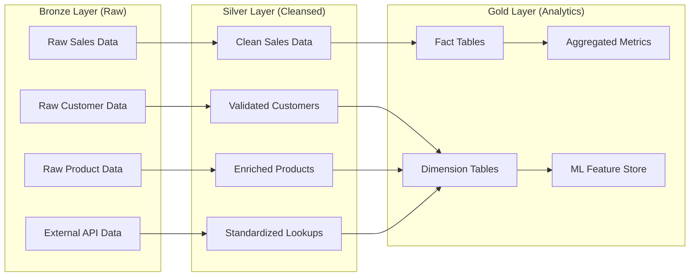
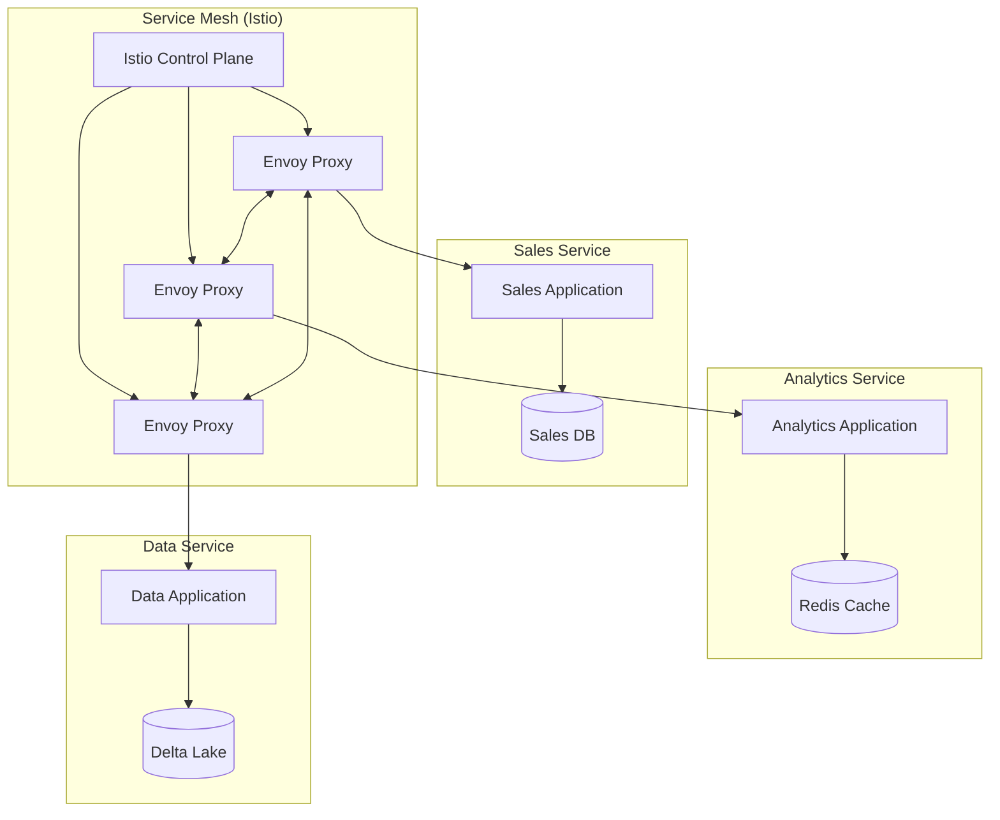
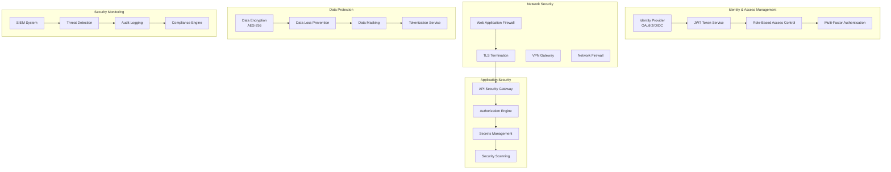
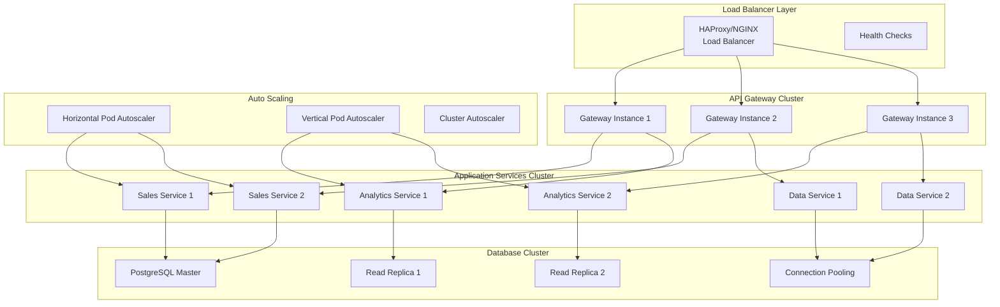

# Comprehensive System Architecture - PwC Data Engineering Platform

## 📋 Table of Contents

1. [Architecture Overview](#architecture-overview)
2. [System Components](#system-components)
3. [Microservices Architecture](#microservices-architecture)
4. [Data Architecture](#data-architecture)
5. [Security Architecture](#security-architecture)
6. [Infrastructure Architecture](#infrastructure-architecture)
7. [Integration Patterns](#integration-patterns)
8. [Scalability & Performance](#scalability--performance)
9. [Deployment Architecture](#deployment-architecture)
10. [Monitoring & Observability](#monitoring--observability)

## 🏗️ Architecture Overview

The PwC Data Engineering Platform implements a modern, cloud-native architecture using microservices patterns, event-driven design, and enterprise-grade security.

### High-Level System Architecture

```mermaid
graph TB
    subgraph "Client Layer"
        WEB[Web Applications]
        MOBILE[Mobile Apps]
        API_CLIENTS[API Clients]
        DASHBOARDS[Business Dashboards]
    end
    
    subgraph "API Gateway & Load Balancing"
        LB[Load Balancer<br/>HAProxy/NGINX]
        GATEWAY[API Gateway<br/>FastAPI]
        RATE_LIMIT[Rate Limiter]
        CIRCUIT[Circuit Breaker]
    end
    
    subgraph "Authentication & Authorization"
        AUTH[Auth Service<br/>JWT/OAuth2]
        RBAC[RBAC Engine]
        MFA[MFA Service]
        API_KEYS[API Key Manager]
    end
    
    subgraph "Microservices Layer"
        SALES_SVC[Sales Service]
        ANALYTICS_SVC[Analytics Service]
        DATA_SVC[Data Service]
        SEARCH_SVC[Search Service]
        ML_SVC[ML Service]
        NOTIFICATION_SVC[Notification Service]
    end
    
    subgraph "Event-Driven Architecture"
        KAFKA[Apache Kafka<br/>Event Streaming]
        RABBITMQ[RabbitMQ<br/>Message Queue]
        REDIS_QUEUE[Redis<br/>Task Queue]
        SAGA[SAGA Orchestrator]
        CQRS[CQRS Framework]
    end
    
    subgraph "Data Processing Layer"
        ETL[ETL Framework<br/>Multi-Engine]
        STREAMING[Stream Processing<br/>Kafka Streams]
        BATCH[Batch Processing<br/>Airflow]
        ML_PIPELINE[ML Pipelines<br/>MLflow]
    end
    
    subgraph "Data Storage Layer"
        POSTGRES[PostgreSQL<br/>Transactional Data]
        DELTA[Delta Lake<br/>Data Lake]
        REDIS[Redis<br/>Caching]
        ELASTIC[Elasticsearch<br/>Search & Analytics]
        TYPESENSE[Typesense<br/>Vector Search]
    end
    
    subgraph "Security & Compliance"
        DLP[Data Loss Prevention]
        ENCRYPTION[Encryption Service]
        AUDIT[Audit Logging]
        COMPLIANCE[Compliance Engine]
        VAULT[Secrets Manager]
    end
    
    subgraph "Monitoring & Observability"
        DATADOG[DataDog<br/>Metrics & APM]
        PROMETHEUS[Prometheus<br/>Metrics]
        GRAFANA[Grafana<br/>Dashboards]
        JAEGER[Jaeger<br/>Distributed Tracing]
        LOGS[Centralized Logging]
    end
    
    subgraph "Infrastructure Layer"
        K8S[Kubernetes<br/>Container Orchestration]
        DOCKER[Docker<br/>Containerization]
        TERRAFORM[Terraform<br/>Infrastructure as Code]
        HELM[Helm<br/>Package Management]
    end
    
    %% Client connections
    WEB --> LB
    MOBILE --> LB
    API_CLIENTS --> LB
    DASHBOARDS --> LB
    
    %% Gateway layer
    LB --> GATEWAY
    GATEWAY --> RATE_LIMIT
    RATE_LIMIT --> CIRCUIT
    CIRCUIT --> AUTH
    
    %% Authentication flow
    AUTH --> RBAC
    AUTH --> MFA
    AUTH --> API_KEYS
    
    %% Service routing
    GATEWAY --> SALES_SVC
    GATEWAY --> ANALYTICS_SVC
    GATEWAY --> DATA_SVC
    GATEWAY --> SEARCH_SVC
    GATEWAY --> ML_SVC
    
    %% Event-driven connections
    SALES_SVC --> KAFKA
    ANALYTICS_SVC --> KAFKA
    DATA_SVC --> RABBITMQ
    ML_SVC --> REDIS_QUEUE
    
    KAFKA --> SAGA
    RABBITMQ --> CQRS
    
    %% Data processing
    KAFKA --> STREAMING
    DATA_SVC --> ETL
    ML_SVC --> ML_PIPELINE
    STREAMING --> BATCH
    
    %% Data storage
    SALES_SVC --> POSTGRES
    DATA_SVC --> DELTA
    SEARCH_SVC --> ELASTIC
    SEARCH_SVC --> TYPESENSE
    ANALYTICS_SVC --> REDIS
    
    %% Security integration
    GATEWAY --> DLP
    AUTH --> ENCRYPTION
    POSTGRES --> AUDIT
    DELTA --> COMPLIANCE
    
    %% Monitoring integration
    SALES_SVC --> DATADOG
    ANALYTICS_SVC --> PROMETHEUS
    ETL --> GRAFANA
    GATEWAY --> JAEGER
    K8S --> LOGS
    
    %% Infrastructure
    SALES_SVC -.-> K8S
    ANALYTICS_SVC -.-> K8S
    POSTGRES -.-> DOCKER
    KAFKA -.-> K8S
```


### Architecture Principles

#### 1. **Microservices First**
- Domain-driven design with bounded contexts
- Independent deployment and scaling
- Technology diversity where appropriate
- Resilience through isolation

#### 2. **Event-Driven Architecture**
- Asynchronous communication
- Loose coupling between services
- Event sourcing for audit trails
- CQRS for read/write optimization

#### 3. **Cloud-Native Design**
- Container-first deployment
- Kubernetes orchestration
- Infrastructure as Code
- Auto-scaling capabilities

#### 4. **Security by Design**
- Zero-trust architecture
- Defense in depth
- Data encryption everywhere
- Comprehensive audit trails

## 🔧 System Components

### Core Application Services

#### 1. API Gateway Service
```yaml
Component: API Gateway
Technology: FastAPI + NGINX
Purpose: Single entry point for all client requests
Capabilities:
  - Request routing and load balancing
  - Authentication and authorization
  - Rate limiting and throttling
  - Request/response transformation
  - Circuit breaker pattern
  - API versioning
```

#### 2. Sales Service
```yaml
Component: Sales Service  
Technology: FastAPI + PostgreSQL
Purpose: Manage sales data and transactions
Capabilities:
  - Transaction CRUD operations
  - Sales analytics aggregation
  - Customer data management
  - Revenue reporting
  - Real-time sales metrics
```

#### 3. Analytics Service
```yaml
Component: Analytics Service
Technology: FastAPI + Spark + Delta Lake
Purpose: Advanced analytics and business intelligence
Capabilities:
  - Complex analytical queries
  - Predictive analytics
  - Customer segmentation
  - Trend analysis
  - KPI calculation
  - Report generation
```

#### 4. Data Service
```yaml
Component: Data Service
Technology: FastAPI + Multi-Engine ETL
Purpose: Data processing and transformation
Capabilities:
  - ETL pipeline orchestration
  - Data quality validation
  - Schema management
  - Data lineage tracking
  - Metadata management
```

### Data Processing Components

#### 1. ETL Framework
```python
# Multi-engine ETL framework architecture
from abc import ABC, abstractmethod

class BaseProcessor(ABC):
    """Base class for all ETL processors"""
    
    @abstractmethod
    def extract(self, source):
        pass
    
    @abstractmethod
    def transform(self, data):
        pass
    
    @abstractmethod  
    def load(self, data, target):
        pass

class PandasProcessor(BaseProcessor):
    """Pandas-based processor for small to medium datasets"""
    def __init__(self, config):
        self.config = config
        self.chunk_size = config.get('chunk_size', 10000)

class SparkProcessor(BaseProcessor):
    """Spark-based processor for large datasets"""
    def __init__(self, config):
        self.config = config
        self.spark_session = self._create_spark_session()

class PolarsProcessor(BaseProcessor):
    """Polars-based processor for high-performance processing"""
    def __init__(self, config):
        self.config = config
        self.lazy_execution = config.get('lazy_execution', True)
```

#### 2. Stream Processing Architecture
```python
# Kafka Streams processing topology
from kafka import KafkaProducer, KafkaConsumer
import json

class SalesStreamProcessor:
    def __init__(self):
        self.producer = KafkaProducer(
            bootstrap_servers=['kafka:9092'],
            value_serializer=lambda v: json.dumps(v).encode()
        )
        self.consumer = KafkaConsumer(
            'sales-events',
            bootstrap_servers=['kafka:9092'],
            value_deserializer=lambda m: json.loads(m.decode())
        )
    
    def process_sales_events(self):
        for message in self.consumer:
            event = message.value
            
            # Real-time aggregation
            self.update_metrics(event)
            
            # Trigger downstream processing
            self.trigger_analytics(event)
            
            # Send to notification service
            if self.is_high_value_sale(event):
                self.send_notification(event)
```

### Storage Architecture

#### 1. Data Lake Architecture (Delta Lake)


#### 2. Transactional Database Design
```sql
-- PostgreSQL schema for transactional data
CREATE SCHEMA IF NOT EXISTS retail_dwh;

-- Fact table for sales transactions
CREATE TABLE retail_dwh.fact_sales (
    sales_key SERIAL PRIMARY KEY,
    customer_key INTEGER NOT NULL,
    product_key INTEGER NOT NULL,
    time_key INTEGER NOT NULL,
    invoice_no VARCHAR(20) NOT NULL,
    quantity INTEGER NOT NULL,
    unit_price DECIMAL(10,2) NOT NULL,
    total_amount DECIMAL(10,2) NOT NULL,
    created_at TIMESTAMP DEFAULT CURRENT_TIMESTAMP,
    updated_at TIMESTAMP DEFAULT CURRENT_TIMESTAMP
);

-- Customer dimension
CREATE TABLE retail_dwh.dim_customer (
    customer_key SERIAL PRIMARY KEY,
    customer_id VARCHAR(20) UNIQUE NOT NULL,
    customer_segment VARCHAR(50),
    country VARCHAR(100),
    lifetime_value DECIMAL(15,2),
    first_purchase_date DATE,
    last_purchase_date DATE,
    is_active BOOLEAN DEFAULT TRUE,
    created_at TIMESTAMP DEFAULT CURRENT_TIMESTAMP,
    updated_at TIMESTAMP DEFAULT CURRENT_TIMESTAMP
);

-- Indexes for performance
CREATE INDEX idx_fact_sales_customer ON retail_dwh.fact_sales(customer_key);
CREATE INDEX idx_fact_sales_time ON retail_dwh.fact_sales(time_key);
CREATE INDEX idx_customer_segment ON retail_dwh.dim_customer(customer_segment);
```

## 🏢 Microservices Architecture

### Service Mesh Architecture


### Service Communication Patterns

#### 1. Synchronous Communication (REST)
```python
# Inter-service communication via REST
import httpx
from typing import Dict, Any

class ServiceClient:
    def __init__(self, base_url: str, service_name: str):
        self.base_url = base_url
        self.service_name = service_name
        self.client = httpx.AsyncClient(
            timeout=30.0,
            headers={"User-Agent": f"ServiceClient/{service_name}"}
        )
    
    async def call_service(self, endpoint: str, data: Dict[Any, Any] = None):
        url = f"{self.base_url}/{endpoint}"
        try:
            if data:
                response = await self.client.post(url, json=data)
            else:
                response = await self.client.get(url)
            response.raise_for_status()
            return response.json()
        except httpx.RequestError as e:
            raise ServiceCommunicationError(f"Failed to call {url}: {e}")

# Usage example
analytics_client = ServiceClient("http://analytics-service:8080", "sales-service")
customer_insights = await analytics_client.call_service(
    "customer-insights", 
    {"customer_id": "12345", "period": "30d"}
)
```

#### 2. Asynchronous Communication (Events)
```python
# Event-driven communication via Kafka
from kafka import KafkaProducer, KafkaConsumer
import json
from dataclasses import dataclass, asdict
from datetime import datetime

@dataclass
class SalesEvent:
    event_id: str
    event_type: str
    customer_id: str
    transaction_id: str
    amount: float
    timestamp: datetime
    metadata: dict

class EventPublisher:
    def __init__(self):
        self.producer = KafkaProducer(
            bootstrap_servers=['kafka:9092'],
            value_serializer=lambda v: json.dumps(v).encode(),
            key_serializer=lambda k: k.encode() if k else None
        )
    
    async def publish_event(self, event: SalesEvent):
        await self.producer.send(
            'sales-events',
            key=event.customer_id,
            value=asdict(event)
        )

class EventSubscriber:
    def __init__(self, service_name: str):
        self.service_name = service_name
        self.consumer = KafkaConsumer(
            'sales-events',
            bootstrap_servers=['kafka:9092'],
            group_id=f'{service_name}-group',
            value_deserializer=lambda m: json.loads(m.decode())
        )
    
    def handle_events(self):
        for message in self.consumer:
            event_data = message.value
            event = SalesEvent(**event_data)
            self.process_event(event)
    
    def process_event(self, event: SalesEvent):
        # Service-specific event processing
        pass
```

### SAGA Pattern Implementation
```python
# Distributed transaction management using SAGA pattern
from enum import Enum
from typing import List, Callable
import asyncio

class SagaStatus(Enum):
    PENDING = "pending"
    COMPLETED = "completed"
    COMPENSATING = "compensating"
    FAILED = "failed"

class SagaStep:
    def __init__(self, action: Callable, compensation: Callable):
        self.action = action
        self.compensation = compensation

class SagaOrchestrator:
    def __init__(self, saga_id: str):
        self.saga_id = saga_id
        self.steps: List[SagaStep] = []
        self.completed_steps: List[int] = []
        self.status = SagaStatus.PENDING
    
    def add_step(self, action: Callable, compensation: Callable):
        self.steps.append(SagaStep(action, compensation))
    
    async def execute(self):
        try:
            for i, step in enumerate(self.steps):
                await step.action()
                self.completed_steps.append(i)
            
            self.status = SagaStatus.COMPLETED
            return {"status": "success", "saga_id": self.saga_id}
            
        except Exception as e:
            self.status = SagaStatus.COMPENSATING
            await self.compensate()
            self.status = SagaStatus.FAILED
            raise SagaExecutionError(f"Saga {self.saga_id} failed: {e}")
    
    async def compensate(self):
        for step_index in reversed(self.completed_steps):
            try:
                await self.steps[step_index].compensation()
            except Exception as e:
                # Log compensation failure but continue
                print(f"Compensation failed for step {step_index}: {e}")

# Example: Order processing saga
async def process_order_saga(order_data):
    saga = SagaOrchestrator(f"order-{order_data['order_id']}")
    
    # Step 1: Reserve inventory
    saga.add_step(
        action=lambda: reserve_inventory(order_data['items']),
        compensation=lambda: release_inventory(order_data['items'])
    )
    
    # Step 2: Process payment
    saga.add_step(
        action=lambda: process_payment(order_data['payment']),
        compensation=lambda: refund_payment(order_data['payment'])
    )
    
    # Step 3: Create shipment
    saga.add_step(
        action=lambda: create_shipment(order_data),
        compensation=lambda: cancel_shipment(order_data['order_id'])
    )
    
    return await saga.execute()
```

## 🛡️ Security Architecture

### Zero-Trust Security Model


### Security Implementation Details

#### 1. Authentication & Authorization
```python
# Advanced JWT authentication with claims
from jose import JWTError, jwt
from datetime import datetime, timedelta
from typing import Dict, List, Optional

class EnhancedJWTManager:
    def __init__(self, secret_key: str, algorithm: str = "HS256"):
        self.secret_key = secret_key
        self.algorithm = algorithm
        self.issuer = "pwc-data-platform"
    
    def create_access_token(self, user_data: Dict, expires_delta: Optional[timedelta] = None):
        to_encode = user_data.copy()
        
        # Add standard claims
        now = datetime.utcnow()
        expire = now + (expires_delta or timedelta(hours=1))
        
        to_encode.update({
            "iat": now,
            "exp": expire,
            "iss": self.issuer,
            "aud": "pwc-api",
            "sub": user_data["user_id"],
            "roles": user_data.get("roles", []),
            "permissions": user_data.get("permissions", []),
            "clearance_level": user_data.get("clearance_level", "standard"),
            "mfa_verified": user_data.get("mfa_verified", False),
            "session_id": user_data.get("session_id"),
            "risk_score": user_data.get("risk_score", 0.0)
        })
        
        encoded_jwt = jwt.encode(to_encode, self.secret_key, algorithm=self.algorithm)
        return encoded_jwt
    
    def verify_token(self, token: str) -> Dict:
        try:
            payload = jwt.decode(
                token, 
                self.secret_key, 
                algorithms=[self.algorithm],
                audience="pwc-api",
                issuer=self.issuer
            )
            return payload
        except JWTError as e:
            raise AuthenticationError(f"Token verification failed: {e}")

# Role-based access control
class RBACEngine:
    def __init__(self):
        self.role_permissions = {
            "data_analyst": [
                "data:read", 
                "analytics:access", 
                "reports:create"
            ],
            "data_engineer": [
                "data:read", 
                "data:write", 
                "etl:execute", 
                "quality:check"
            ],
            "admin": [
                "admin:system", 
                "admin:users", 
                "admin:security"
            ]
        }
    
    def check_permission(self, user_roles: List[str], required_permission: str) -> bool:
        user_permissions = set()
        for role in user_roles:
            user_permissions.update(self.role_permissions.get(role, []))
        return required_permission in user_permissions
```

#### 2. Data Encryption
```python
# Comprehensive data encryption service
from cryptography.fernet import Fernet
from cryptography.hazmat.primitives import hashes
from cryptography.hazmat.primitives.kdf.pbkdf2 import PBKDF2HMAC
import base64
import os

class DataEncryptionService:
    def __init__(self, master_key: bytes):
        self.fernet = Fernet(master_key)
    
    def encrypt_field(self, data: str) -> str:
        """Encrypt individual field data"""
        encrypted_data = self.fernet.encrypt(data.encode())
        return base64.urlsafe_b64encode(encrypted_data).decode()
    
    def decrypt_field(self, encrypted_data: str) -> str:
        """Decrypt individual field data"""
        decoded_data = base64.urlsafe_b64decode(encrypted_data.encode())
        decrypted_data = self.fernet.decrypt(decoded_data)
        return decrypted_data.decode()
    
    def encrypt_pii_data(self, customer_data: Dict) -> Dict:
        """Encrypt PII fields in customer data"""
        sensitive_fields = ['email', 'phone', 'address', 'ssn']
        encrypted_data = customer_data.copy()
        
        for field in sensitive_fields:
            if field in encrypted_data:
                encrypted_data[field] = self.encrypt_field(encrypted_data[field])
                
        return encrypted_data

# Database-level encryption
class DatabaseEncryption:
    @staticmethod
    def enable_transparent_encryption(connection_string: str) -> str:
        """Enable TDE (Transparent Data Encryption) for PostgreSQL"""
        return f"{connection_string}?sslmode=require&application_name=pwc-secure"
    
    @staticmethod  
    def create_encrypted_column(table_name: str, column_name: str) -> str:
        """Generate SQL for encrypted column creation"""
        return f"""
        ALTER TABLE {table_name} 
        ADD COLUMN {column_name}_encrypted BYTEA;
        
        -- Create trigger for automatic encryption/decryption
        CREATE OR REPLACE FUNCTION encrypt_{column_name}()
        RETURNS TRIGGER AS $$
        BEGIN
            NEW.{column_name}_encrypted = pgp_sym_encrypt(NEW.{column_name}, current_setting('app.encryption_key'));
            RETURN NEW;
        END;
        $$ LANGUAGE plpgsql;
        """
```

## 🚀 Scalability & Performance

### Horizontal Scaling Architecture


### Performance Optimization Strategies

#### 1. Caching Architecture
```python
# Multi-level caching strategy
import redis
import pickle
from typing import Any, Optional
import asyncio

class CacheManager:
    def __init__(self):
        self.redis_client = redis.Redis(
            host='redis-cluster',
            port=6379,
            decode_responses=True,
            max_connections=20
        )
        self.local_cache = {}  # In-memory cache
        self.cache_ttl = 3600  # 1 hour default TTL
    
    async def get(self, key: str, fetch_function: callable = None) -> Any:
        # Level 1: Check local cache
        if key in self.local_cache:
            return self.local_cache[key]
        
        # Level 2: Check Redis cache
        cached_value = self.redis_client.get(key)
        if cached_value:
            value = pickle.loads(cached_value)
            self.local_cache[key] = value  # Update local cache
            return value
        
        # Level 3: Fetch from source if function provided
        if fetch_function:
            value = await fetch_function()
            await self.set(key, value)
            return value
        
        return None
    
    async def set(self, key: str, value: Any, ttl: Optional[int] = None):
        ttl = ttl or self.cache_ttl
        
        # Update Redis cache
        pickled_value = pickle.dumps(value)
        self.redis_client.setex(key, ttl, pickled_value)
        
        # Update local cache
        self.local_cache[key] = value
    
    async def invalidate(self, pattern: str):
        # Invalidate Redis cache
        keys = self.redis_client.keys(pattern)
        if keys:
            self.redis_client.delete(*keys)
        
        # Invalidate local cache
        to_remove = [k for k in self.local_cache.keys() if pattern in k]
        for key in to_remove:
            del self.local_cache[key]

# Usage in service layer
class SalesService:
    def __init__(self):
        self.cache = CacheManager()
    
    async def get_sales_summary(self, date_range: str, filters: dict):
        cache_key = f"sales_summary:{date_range}:{hash(str(filters))}"
        
        async def fetch_from_db():
            return await self._calculate_sales_summary(date_range, filters)
        
        return await self.cache.get(cache_key, fetch_from_db)
```

#### 2. Database Performance Optimization
```sql
-- PostgreSQL performance optimizations

-- 1. Partitioning for large tables
CREATE TABLE retail_dwh.fact_sales_partitioned (
    LIKE retail_dwh.fact_sales INCLUDING ALL
) PARTITION BY RANGE (created_at);

-- Create monthly partitions
CREATE TABLE retail_dwh.fact_sales_2025_08 
    PARTITION OF retail_dwh.fact_sales_partitioned
    FOR VALUES FROM ('2025-08-01') TO ('2025-09-01');

-- 2. Materialized views for common aggregations
CREATE MATERIALIZED VIEW retail_dwh.mv_daily_sales AS
SELECT 
    DATE(created_at) as sale_date,
    COUNT(*) as transaction_count,
    SUM(total_amount) as total_revenue,
    AVG(total_amount) as avg_transaction_value
FROM retail_dwh.fact_sales
GROUP BY DATE(created_at)
ORDER BY sale_date;

-- Refresh materialized view automatically
CREATE OR REPLACE FUNCTION refresh_daily_sales_mv()
RETURNS TRIGGER AS $$
BEGIN
    REFRESH MATERIALIZED VIEW CONCURRENTLY retail_dwh.mv_daily_sales;
    RETURN NULL;
END;
$$ LANGUAGE plpgsql;

-- 3. Connection pooling configuration
-- PgBouncer configuration for connection management
-- max_client_conn = 1000
-- default_pool_size = 50
-- max_db_connections = 200
-- pool_mode = transaction
```

## 📊 Monitoring & Observability

### Comprehensive Monitoring Stack
```python
# OpenTelemetry distributed tracing setup
from opentelemetry import trace, metrics
from opentelemetry.exporter.jaeger.thrift import JaegerExporter
from opentelemetry.sdk.trace import TracerProvider
from opentelemetry.sdk.trace.export import BatchSpanProcessor
from opentelemetry.instrumentation.fastapi import FastAPIInstrumentor
from opentelemetry.instrumentation.sqlalchemy import SQLAlchemyInstrumentor

class ObservabilityManager:
    def __init__(self):
        self.setup_tracing()
        self.setup_metrics()
    
    def setup_tracing(self):
        # Configure tracing
        trace.set_tracer_provider(TracerProvider())
        tracer = trace.get_tracer(__name__)
        
        # Jaeger exporter
        jaeger_exporter = JaegerExporter(
            agent_host_name="jaeger-agent",
            agent_port=6831,
        )
        
        # Batch span processor
        span_processor = BatchSpanProcessor(jaeger_exporter)
        trace.get_tracer_provider().add_span_processor(span_processor)
        
        # Auto-instrument FastAPI and SQLAlchemy
        FastAPIInstrumentor.instrument()
        SQLAlchemyInstrumentor.instrument()
    
    def setup_metrics(self):
        # Configure custom metrics
        meter = metrics.get_meter(__name__)
        
        # Business metrics
        self.sales_counter = meter.create_counter(
            "sales_transactions_total",
            description="Total number of sales transactions"
        )
        
        self.revenue_histogram = meter.create_histogram(
            "sales_revenue_amount",
            description="Sales revenue amounts distribution"
        )
        
        # System metrics
        self.request_duration = meter.create_histogram(
            "http_request_duration_seconds",
            description="HTTP request duration in seconds"
        )

# Usage in application code
observability = ObservabilityManager()

@app.middleware("http")
async def add_observability(request: Request, call_next):
    tracer = trace.get_tracer(__name__)
    
    with tracer.start_as_current_span(f"{request.method} {request.url.path}") as span:
        # Add span attributes
        span.set_attribute("http.method", request.method)
        span.set_attribute("http.url", str(request.url))
        
        start_time = time.time()
        response = await call_next(request)
        duration = time.time() - start_time
        
        # Record metrics
        observability.request_duration.record(duration, {"endpoint": request.url.path})
        
        # Add response attributes
        span.set_attribute("http.status_code", response.status_code)
        
        return response
```

---

**Last Updated**: August 31, 2025  
**Architecture Version**: 2.0.0  
**Documentation Version**: 1.0.0