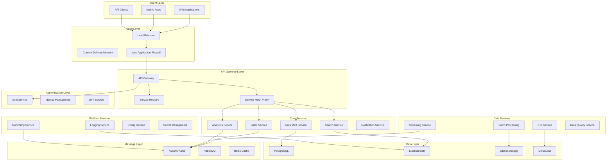
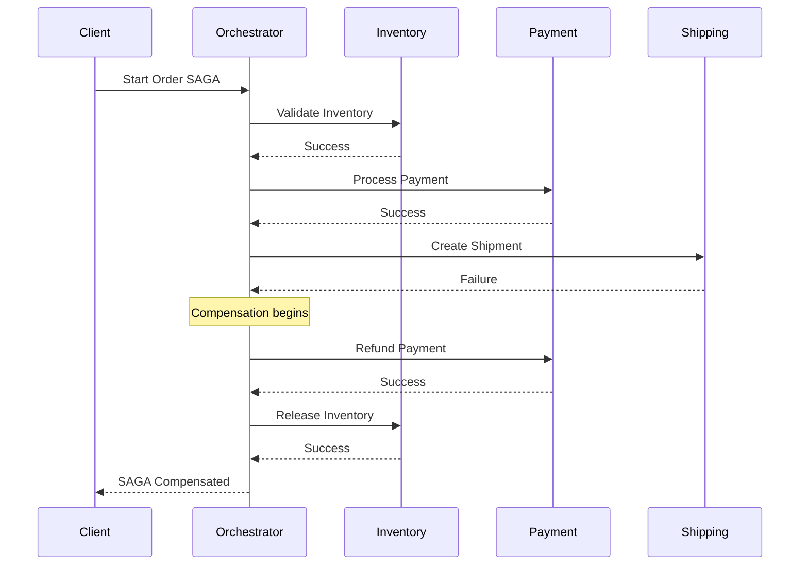

# Microservices Architecture

---
title: Microservices Architecture Documentation
description: Comprehensive guide to the enterprise microservices architecture implementation
audience: [architects, developers, operators]
last_updated: 2025-01-25
version: 2.0.0
owner: Architecture Team
reviewers: [Platform Team, Security Team]
tags: [microservices, architecture, service-mesh, api-gateway, patterns]
---

## Table of Contents

1. [Overview](#overview)
2. [Architecture Principles](#architecture-principles)
3. [Service Architecture](#service-architecture)
4. [Advanced Patterns](#advanced-patterns)
5. [Service Registry & Discovery](#service-registry--discovery)
6. [API Gateway & Service Mesh](#api-gateway--service-mesh)
7. [Distributed Transactions](#distributed-transactions)
8. [Command Query Responsibility Segregation](#command-query-responsibility-segregation)
9. [Communication Patterns](#communication-patterns)
10. [Resilience Patterns](#resilience-patterns)
11. [Monitoring & Observability](#monitoring--observability)
12. [Security Architecture](#security-architecture)
13. [Deployment & Operations](#deployment--operations)

## Overview

The PwC Enterprise Data Engineering Platform implements a comprehensive microservices architecture designed for high availability, scalability, and maintainability. The architecture follows modern enterprise patterns including service mesh, API gateway, distributed transactions, and advanced observability.

### Architecture Diagram



## Architecture Principles

### 1. Domain-Driven Design (DDD)
- **Bounded Contexts**: Each microservice owns a specific business domain
- **Ubiquitous Language**: Consistent terminology across services
- **Event-Driven Communication**: Domain events for cross-service communication

### 2. Single Responsibility
- Each service has a single, well-defined responsibility
- Clear service boundaries and interfaces
- Minimal service coupling

### 3. Autonomy
- Services can be developed, deployed, and scaled independently
- Technology diversity where appropriate
- Independent data stores per service

### 4. Fault Tolerance
- Circuit breakers for service protection
- Graceful degradation under failure
- Bulkhead pattern for resource isolation

### 5. Observability First
- Comprehensive logging, metrics, and tracing
- Service health monitoring
- Business metrics tracking

## Service Architecture

### Service Categories

#### 1. Core Business Services
- **Sales Service** (`/api/v1/sales/*`)
  - Sales transaction processing
  - Customer management
  - Product catalog management
  - Business rule enforcement

- **Analytics Service** (`/api/v2/analytics/*`)
  - Real-time analytics processing
  - Data aggregation and computation
  - Report generation
  - KPI calculation

- **Data Mart Service** (`/api/v1/datamart/*`)
  - Data warehouse access
  - Dimensional modeling
  - OLAP operations
  - Historical data queries

#### 2. Platform Services
- **Authentication Service** (`/api/v1/auth/*`)
  - User authentication
  - JWT token management
  - Session management
  - Role-based access control

- **Search Service** (`/api/v1/search/*`)
  - Full-text search
  - Faceted search
  - Search analytics
  - Index management

- **Notification Service**
  - Email notifications
  - Push notifications
  - SMS messaging
  - Notification templates

#### 3. Data Services
- **ETL Service**
  - Data extraction and transformation
  - Pipeline orchestration
  - Data validation
  - Error handling

- **Streaming Service**
  - Real-time data processing
  - Event stream processing
  - Complex event processing
  - Stream analytics

#### 4. Infrastructure Services
- **Monitoring Service**
  - Metrics collection
  - Health monitoring
  - Alert management
  - Performance tracking

- **Configuration Service**
  - Centralized configuration
  - Feature flags
  - Environment management
  - Configuration validation

### Service Design Patterns

#### 1. Database Per Service
Each service maintains its own database to ensure loose coupling:

```python
# Sales Service - PostgreSQL
class SalesRepository:
    def __init__(self):
        self.db = PostgreSQLConnection("sales_db")
    
    async def create_sale(self, sale_data: SaleData) -> Sale:
        # Sales-specific data operations
        pass

# Search Service - Elasticsearch
class SearchRepository:
    def __init__(self):
        self.es = ElasticsearchClient("search_index")
    
    async def index_document(self, document: Document) -> str:
        # Search-specific operations
        pass
```

#### 2. API Versioning
Services support multiple API versions for backward compatibility:

```python
# Version-specific routers
app.include_router(v1_sales_router, prefix="/api/v1/sales")
app.include_router(v2_sales_router, prefix="/api/v2/sales")

# Version negotiation
@app.middleware("http")
async def version_negotiation(request: Request, call_next):
    version = request.headers.get("API-Version", "v1")
    request.state.api_version = version
    return await call_next(request)
```

## Advanced Patterns

### 1. Service Registry & Discovery

The service registry provides automatic service discovery and health monitoring:

```python
# Service Registration
service_registry = get_service_registry()

# Register service instance
service_instance = ServiceInstance(
    service_name="sales-service",
    host="sales-api-1.internal",
    port=8000,
    health_check_url="/health",
    metadata={"version": "2.1.0", "datacenter": "us-east-1"}
)

await service_registry.register_service(service_instance)
```

**Features:**
- Automatic health checking every 30 seconds
- Multiple load balancing strategies
- Service metadata management
- Real-time service discovery
- Graceful service deregistration

**Load Balancing Strategies:**
- **Round Robin**: Equal distribution across instances
- **Weighted Round Robin**: Based on service capacity
- **Least Connections**: Route to least busy instance  
- **Consistent Hash**: Session-based routing
- **Random**: Random distribution

### 2. API Gateway Implementation

The API Gateway provides centralized request routing and cross-cutting concerns:

```python
# Route Configuration
routes = [
    RouteConfig(
        path_pattern="/api/v1/sales/*",
        service_name="sales-service",
        timeout_seconds=30,
        retry_attempts=3,
        circuit_breaker=True,
        load_balancing=LoadBalancingStrategy.LEAST_CONNECTIONS
    ),
    RouteConfig(
        path_pattern="/api/v2/analytics/*",
        service_name="analytics-service",
        timeout_seconds=60,
        retry_attempts=1,
        headers_to_add={"X-Analytics-Version": "2.0"}
    )
]

# Gateway initialization
gateway = APIGateway(app, routes, enable_service_mesh=True)
app.add_middleware(gateway)
```

**Gateway Features:**
- Request routing and load balancing
- Circuit breaker pattern implementation
- Request/response transformation
- Rate limiting and throttling
- Authentication and authorization
- Request tracing and metrics

### 3. Circuit Breaker Pattern

Circuit breakers prevent cascade failures and provide graceful degradation:

```python
circuit_breakers = {
    "GET:/api/v1/sales/analytics": CircuitBreaker(
        failure_threshold=5,
        timeout=60,
        expected_exception=HTTPException
    ),
    "POST:/api/v2/analytics/complex": CircuitBreaker(
        failure_threshold=3,
        timeout=30
    )
}

@circuit_breaker("sales_analytics")
async def get_sales_analytics():
    # Protected service call
    return await external_service_call()
```

**Circuit Breaker States:**
- **CLOSED**: Normal operation, requests pass through
- **OPEN**: Failures exceeded, requests fail fast
- **HALF_OPEN**: Testing if service recovered

## Distributed Transactions (SAGA Pattern)

For complex business transactions spanning multiple services, we implement the SAGA pattern:

### SAGA Orchestrator

```python
# Order Processing SAGA
class OrderProcessingSaga:
    def create_order_saga(order_data: Dict) -> SagaTransaction:
        steps = [
            SagaStep(
                service_name="inventory-service",
                action="validate_inventory",
                compensation_action="release_inventory",
                payload={"order_id": order_data["order_id"]}
            ),
            SagaStep(
                service_name="payment-service", 
                action="process_payment",
                compensation_action="refund_payment",
                payload={"amount": order_data["total"]}
            ),
            SagaStep(
                service_name="shipping-service",
                action="create_shipment",
                compensation_action="cancel_shipment",
                payload={"address": order_data["shipping_address"]}
            )
        ]
        
        return SagaTransaction(
            saga_id=str(uuid.uuid4()),
            transaction_type="order_processing",
            steps=steps,
            timeout_seconds=600
        )
```

### SAGA Execution Flow



## Command Query Responsibility Segregation (CQRS)

CQRS separates read and write operations for better performance and scalability:

### Command Side (Write Operations)

```python
# Command Handler
class CreateSaleCommand(Command):
    def __init__(self, sale_data: Dict):
        super().__init__()
        self.sale_data = sale_data
    
    def validate(self) -> bool:
        required_fields = ['customer_id', 'product_id', 'quantity']
        return all(field in self.sale_data for field in required_fields)

class CreateSaleCommandHandler(CommandHandler):
    async def handle(self, command: CreateSaleCommand) -> CommandResult:
        # Validate and create sale
        sale = await self.sales_service.create_sale(command.sale_data)
        
        # Generate domain events
        events = [
            SaleCreatedEvent(sale_id=sale.id, customer_id=sale.customer_id),
            InventoryUpdatedEvent(product_id=sale.product_id, quantity=-sale.quantity)
        ]
        
        # Store events
        await self.event_store.save_events(sale.id, events)
        
        return CommandResult(
            command_id=command.command_id,
            success=True,
            result={"sale_id": sale.id}
        )
```

### Query Side (Read Operations)

```python
# Query Handler
class GetSalesReportQuery(Query):
    def __init__(self, date_range: Dict, filters: Dict):
        super().__init__()
        self.date_range = date_range
        self.filters = filters
    
    def get_cache_key(self) -> str:
        return f"sales_report:{hash(json.dumps(self.filters, sort_keys=True))}"

class GetSalesReportQueryHandler(QueryHandler):
    async def handle(self, query: GetSalesReportQuery) -> QueryResult:
        # Query optimized read model
        data = await self.read_model_repository.get_sales_report(
            query.date_range, 
            query.filters
        )
        
        return QueryResult(
            query_id=query.query_id,
            data=data,
            execution_time_ms=processing_time
        )
```

### Event Sourcing

```python
# Domain Event
@dataclass
class SaleCreatedEvent(DomainEvent):
    sale_id: str
    customer_id: str
    product_id: str
    quantity: int
    total_amount: float
    
    def __post_init__(self):
        self.event_type = "sale_created"
        self.aggregate_type = "sale"

# Event Store
class EventStore:
    async def save_events(self, aggregate_id: str, events: List[DomainEvent]):
        # Store events in order
        for event in events:
            await self.kafka_producer.produce_event(event)
            await self.database.insert_event(event)
    
    async def get_events(self, aggregate_id: str) -> List[DomainEvent]:
        return await self.database.get_events_by_aggregate(aggregate_id)
```

## Communication Patterns

### 1. Synchronous Communication

**REST API Calls**
```python
# Service-to-service HTTP calls
async def call_inventory_service(product_id: str) -> Dict:
    async with httpx.AsyncClient() as client:
        response = await client.get(
            f"http://inventory-service/api/v1/products/{product_id}",
            headers={"Authorization": f"Bearer {service_token}"},
            timeout=30.0
        )
        return response.json()
```

**GraphQL Federation**
```python
# Federated GraphQL schema
@strawberry.federation.type(keys=["id"])
class Sale:
    id: strawberry.ID
    customer_id: str
    product_id: str
    
    @strawberry.federation.field
    async def customer(self) -> Customer:
        # Resolved by customer service
        return await customer_service.get_customer(self.customer_id)
```

### 2. Asynchronous Communication

**Event-Driven Messaging**
```python
# Kafka Event Publishing
async def publish_sale_created_event(sale: Sale):
    event = {
        "event_type": "sale_created",
        "sale_id": sale.id,
        "customer_id": sale.customer_id,
        "timestamp": datetime.utcnow().isoformat()
    }
    
    await kafka_producer.send("sales-events", value=event)
```

**Message Queue Processing**
```python
# RabbitMQ Task Processing
async def process_payment_task(message: TaskMessage):
    try:
        result = await payment_processor.process_payment(message.payload)
        
        # Publish result
        await rabbitmq.publish_result(
            task_id=message.task_id,
            success=True,
            result=result
        )
    except Exception as e:
        await rabbitmq.publish_result(
            task_id=message.task_id,
            success=False,
            error=str(e)
        )
```

## Resilience Patterns

### 1. Retry with Exponential Backoff

```python
@retry(
    stop=stop_after_attempt(3),
    wait=wait_exponential(multiplier=1, min=4, max=10)
)
async def resilient_service_call():
    async with httpx.AsyncClient() as client:
        response = await client.get("http://external-service/api/data")
        response.raise_for_status()
        return response.json()
```

### 2. Bulkhead Pattern

```python
# Resource isolation
class ServiceResources:
    def __init__(self):
        # Separate thread pools for different operations
        self.critical_operations_pool = ThreadPoolExecutor(max_workers=10)
        self.batch_operations_pool = ThreadPoolExecutor(max_workers=5)
        self.reporting_pool = ThreadPoolExecutor(max_workers=2)
    
    async def execute_critical(self, operation):
        return await asyncio.get_event_loop().run_in_executor(
            self.critical_operations_pool, 
            operation
        )
```

### 3. Timeout and Deadline Patterns

```python
# Request timeout management
@timeout(30.0)  # 30-second timeout
async def process_complex_request(request_data):
    # Long-running operation with timeout
    result = await heavy_computation(request_data)
    return result

# Deadline propagation
async def service_call_with_deadline(deadline: datetime):
    remaining_time = (deadline - datetime.utcnow()).total_seconds()
    
    if remaining_time <= 0:
        raise TimeoutError("Deadline exceeded")
    
    async with httpx.AsyncClient(timeout=remaining_time) as client:
        return await client.get("http://downstream-service/api/data")
```

## Security Architecture

### 1. Service-to-Service Authentication

```python
# JWT Service Tokens
class ServiceTokenManager:
    async def get_service_token(self, service_name: str) -> str:
        token = jwt.encode(
            payload={
                "service": service_name,
                "exp": datetime.utcnow() + timedelta(hours=1),
                "iss": "api-gateway",
                "aud": "internal-services"
            },
            key=service_secret,
            algorithm="HS256"
        )
        return token

# Token validation middleware
async def validate_service_token(request: Request):
    token = request.headers.get("Authorization", "").replace("Bearer ", "")
    
    try:
        payload = jwt.decode(token, service_secret, algorithms=["HS256"])
        request.state.service_name = payload["service"]
    except JWTError:
        raise HTTPException(status_code=401, detail="Invalid service token")
```

### 2. Network Security

```python
# Service mesh security configuration
service_mesh_config = {
    "mtls_enabled": True,
    "allowed_services": {
        "sales-service": ["inventory-service", "payment-service"],
        "analytics-service": ["sales-service", "datamart-service"]
    },
    "rate_limits": {
        "default": {"requests": 1000, "window": 60},
        "critical": {"requests": 100, "window": 60}
    }
}
```

## Deployment & Operations

### 1. Containerization

```dockerfile
# Service Dockerfile
FROM python:3.11-slim

WORKDIR /app

# Install dependencies
COPY requirements.txt .
RUN pip install --no-cache-dir -r requirements.txt

# Copy application code
COPY src/ ./src/
COPY config/ ./config/

# Health check
HEALTHCHECK --interval=30s --timeout=10s --retries=3 \
    CMD curl -f http://localhost:8000/health || exit 1

# Start application
CMD ["uvicorn", "src.main:app", "--host", "0.0.0.0", "--port", "8000"]
```

### 2. Kubernetes Deployment

```yaml
# Service deployment
apiVersion: apps/v1
kind: Deployment
metadata:
  name: sales-service
  labels:
    app: sales-service
    version: v2.1.0
spec:
  replicas: 3
  selector:
    matchLabels:
      app: sales-service
  template:
    metadata:
      labels:
        app: sales-service
        version: v2.1.0
    spec:
      containers:
      - name: sales-service
        image: pwc/sales-service:2.1.0
        ports:
        - containerPort: 8000
        env:
        - name: DATABASE_URL
          valueFrom:
            secretKeyRef:
              name: sales-db-secret
              key: connection-string
        resources:
          requests:
            memory: "512Mi"
            cpu: "250m"
          limits:
            memory: "1Gi"
            cpu: "500m"
        livenessProbe:
          httpGet:
            path: /health
            port: 8000
          initialDelaySeconds: 30
          periodSeconds: 30
        readinessProbe:
          httpGet:
            path: /ready
            port: 8000
          initialDelaySeconds: 5
          periodSeconds: 10
```

### 3. Service Monitoring

```python
# Service health endpoint
@router.get("/health")
async def health_check():
    health_status = {
        "status": "healthy",
        "timestamp": datetime.utcnow().isoformat(),
        "service": "sales-service",
        "version": "2.1.0",
        "checks": {
            "database": await check_database_connection(),
            "redis": await check_redis_connection(),
            "kafka": await check_kafka_connection()
        }
    }
    
    # Overall health based on dependencies
    if not all(health_status["checks"].values()):
        health_status["status"] = "unhealthy"
        raise HTTPException(status_code=503, detail=health_status)
    
    return health_status

# Readiness endpoint
@router.get("/ready")
async def readiness_check():
    # Check if service is ready to accept traffic
    checks = {
        "database_migrations": await check_migrations_applied(),
        "configuration_loaded": check_configuration(),
        "cache_warmed": await check_cache_status()
    }
    
    if not all(checks.values()):
        raise HTTPException(status_code=503, detail="Service not ready")
    
    return {"status": "ready", "checks": checks}
```

## Best Practices

### 1. Service Design
- Keep services small and focused (< 1000 lines of code)
- Design for failure and implement graceful degradation
- Use domain-driven design for service boundaries
- Implement comprehensive health checks
- Version APIs from the beginning

### 2. Data Management
- Each service owns its data
- Use event sourcing for audit trails
- Implement data consistency patterns (eventual consistency)
- Consider read replicas for query optimization
- Plan for data migration strategies

### 3. Communication
- Prefer asynchronous communication for non-critical operations
- Use circuit breakers for external dependencies
- Implement proper timeout and retry policies
- Design idempotent operations
- Use correlation IDs for request tracing

### 4. Security
- Implement zero-trust security model
- Use service-to-service authentication
- Encrypt all inter-service communication
- Implement proper authorization boundaries
- Regular security scanning and updates

### 5. Operations
- Implement comprehensive observability
- Use infrastructure as code
- Automate deployment pipelines
- Plan for disaster recovery
- Implement proper backup strategies

## Troubleshooting Guide

### Common Issues

#### 1. Service Discovery Failures
```bash
# Check service registry
curl http://service-registry:8761/api/services

# Check service health
curl http://service-name:8000/health

# Check network connectivity
kubectl exec -it service-pod -- nc -zv target-service 8000
```

#### 2. Circuit Breaker Tripping
```bash
# Check circuit breaker status
curl http://api-gateway:8000/admin/circuit-breakers

# Reset circuit breaker
curl -X POST http://api-gateway:8000/admin/circuit-breakers/reset/service-name
```

#### 3. Performance Issues
```bash
# Check service metrics
curl http://service-name:8000/metrics

# Check resource usage
kubectl top pods -l app=service-name

# Check database connections
kubectl exec -it service-pod -- ps aux | grep postgres
```

---

## Related Documentation

- [API Gateway Configuration](./API_GATEWAY.md)
- [Service Registry Documentation](./SERVICE_REGISTRY.md)
- [SAGA Pattern Implementation](./SAGA_PATTERNS.md)
- [CQRS Framework Guide](./CQRS_FRAMEWORK.md)
- [Monitoring and Observability](../monitoring/MONITORING_STRATEGY.md)
- [Security Architecture](../security/SECURITY_OVERVIEW.md)
- [Deployment Guide](../operations/DEPLOYMENT_GUIDE.md)

*This document is maintained by the Architecture Team and is updated with each major platform release.*