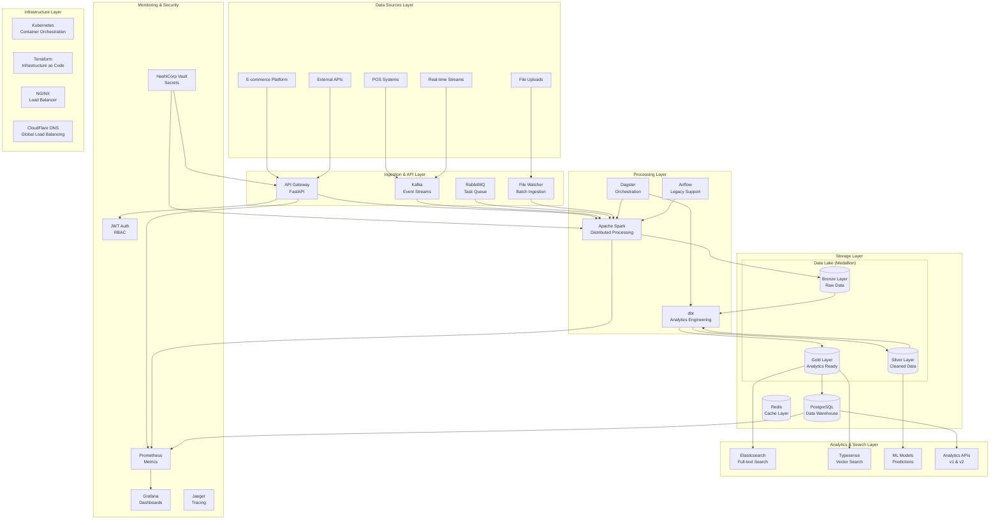
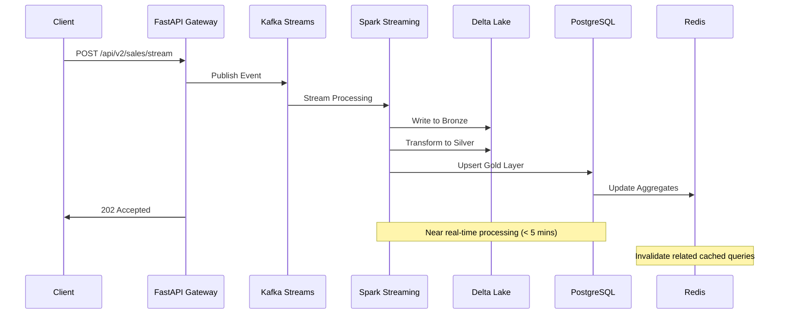
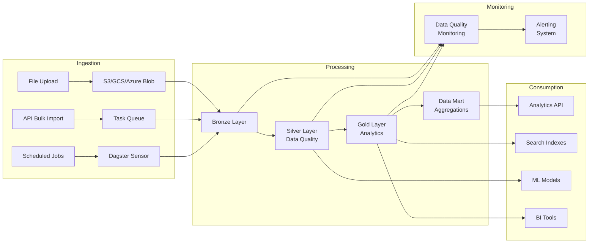

# PwC Retail Data Platform - System Architecture Documentation

## Table of Contents

1. [Executive Summary](#executive-summary)
2. [Architecture Overview](#architecture-overview)
3. [System Components](#system-components)
4. [Data Flow Architecture](#data-flow-architecture)
5. [Service Architecture](#service-architecture)
6. [Security Architecture](#security-architecture)
7. [Scalability & Performance](#scalability--performance)
8. [Monitoring & Observability](#monitoring--observability)
9. [Disaster Recovery](#disaster-recovery)
10. [Integration Patterns](#integration-patterns)

## Executive Summary

The PwC Retail Data Platform is an enterprise-grade, cloud-native data engineering solution built using modern architectural patterns including:

- **Clean Architecture** with domain-driven design
- **Medallion Architecture** for data lake organization
- **Microservices Architecture** with API-first design
- **Event-Driven Architecture** with real-time processing
- **Multi-Cloud Strategy** with vendor flexibility

### Key Architectural Decisions

| Decision | Rationale | Trade-offs |
|----------|-----------|------------|
| Clean Architecture | Maintainability, testability, separation of concerns | Initial complexity |
| Medallion (Bronze-Silver-Gold) | Data quality progression, clear data lineage | Storage overhead |
| Multi-Engine ETL | Performance optimization per use case | Operational complexity |
| FastAPI + SQLModel | Type safety, auto-documentation, performance | Learning curve |
| Dagster Orchestration | Modern data orchestration, asset-centric | Airflow migration complexity |

## Architecture Overview

### High-Level System Architecture



### Technology Stack Overview

#### Core Processing Stack
- **Languages**: Python 3.10+, SQL, YAML, HCL (Terraform)
- **Frameworks**: FastAPI, Pydantic, SQLModel, Strawberry GraphQL
- **Processing**: Apache Spark 3.5.6, Delta Lake, Polars, Pandas
- **Orchestration**: Dagster 1.8+, Apache Airflow 2.10+

#### Data Stack
- **Storage**: PostgreSQL, Delta Lake, S3/GCS/Azure Blob
- **Analytics**: dbt, Apache Spark, Custom ML Models
- **Search**: Elasticsearch 8.11+, Typesense
- **Cache**: Redis, In-Memory Caching

#### Infrastructure Stack
- **Container**: Docker, Kubernetes
- **Cloud**: Multi-cloud (AWS, Azure, GCP)
- **IaC**: Terraform, Helm Charts
- **Networking**: NGINX, CloudFlare

#### Monitoring Stack
- **Metrics**: Prometheus, Grafana
- **Tracing**: Jaeger, OpenTelemetry
- **Logging**: ELK Stack (Elasticsearch, Logstash, Kibana)
- **Alerting**: Custom ML-powered alerting system

## System Components

### 1. API Gateway Layer

#### FastAPI Application (`src/api/main.py`)
```python
# Enterprise FastAPI configuration with security and middleware
app = FastAPI(
    title="PwC Data Engineering Challenge - Enterprise API",
    version="2.0.0",
    description="Enterprise-grade REST API for retail data analytics"
)

# Security middleware stack
- JWT Authentication with role-based access control
- Rate limiting with Redis backend
- Circuit breaker pattern for resilience
- CORS configuration for cross-origin requests
- Request/response logging and monitoring
```

#### Key Features
- **Dual Authentication**: JWT (primary) + Basic Auth (fallback)
- **Advanced Middleware**: Circuit breakers, rate limiting, correlation tracking
- **API Versioning**: v1 (stable) and v2 (enhanced) endpoints
- **Auto-Documentation**: OpenAPI/Swagger integration
- **Health Checks**: Comprehensive health monitoring endpoints

#### Endpoint Architecture
```
/api/v1/
├── auth/           # Authentication endpoints
├── sales/          # Sales data CRUD operations
├── search/         # Vector and full-text search
├── datamart/       # Data warehouse queries
├── async-tasks/    # Background task management
└── features/       # Feature toggles and configurations

/api/v2/
├── sales/          # Enhanced sales operations
├── analytics/      # Advanced analytics and ML
└── cohorts/        # Customer cohort analysis

/api/graphql        # GraphQL unified interface
```

### 2. Data Processing Layer

#### ETL Framework Architecture

```python
# Multi-engine ETL framework with strategy pattern
class ETLEngineStrategy(Enum):
    PANDAS = "pandas"      # Small to medium datasets
    POLARS = "polars"      # High-performance single-machine processing
    SPARK = "spark"        # Distributed big data processing
    DBT = "dbt"           # SQL-first analytics engineering
```

#### Processing Patterns

##### Bronze Layer (Raw Data Ingestion)
```python
# Flexible ingestion supporting multiple formats and sources
class BronzeProcessor:
    def process(self, source_data, config):
        # Preserve raw data exactly as received
        # Add metadata: source, timestamp, batch_id
        # Support schema evolution
        # Handle errors gracefully with dead letter queues
```

##### Silver Layer (Data Cleaning & Validation)
```python
# Data quality and standardization layer
class SilverProcessor:
    def process(self, bronze_data, rules):
        # Data quality checks and scoring
        # Standardization and normalization
        # Deduplication and validation
        # Business rule enforcement
```

##### Gold Layer (Analytics Ready)
```python
# Business-ready dimensional modeling
class GoldProcessor:
    def process(self, silver_data, schema):
        # Star schema dimensional modeling
        # Pre-computed aggregations
        # Performance optimizations
        # Business metric calculations
```

### 3. Orchestration Layer

#### Dagster Asset-Centric Architecture

```python
# Asset definitions for data lineage and dependencies
@asset(
    deps=["bronze_retail_data"],
    io_manager_key="warehouse_io_manager",
    compute_kind="dbt"
)
def silver_cleaned_transactions(context):
    """Clean and validate raw transaction data with quality scoring."""
    # Automated data quality checks
    # Schema validation and type enforcement
    # Business rule validation
    # Quality score calculation
```

#### Key Orchestration Features
- **Asset-centric development**: Focus on data products, not tasks
- **Automatic lineage tracking**: Visual data flow dependencies
- **Quality monitoring**: Built-in data quality checks
- **Backfill capabilities**: Historical data reprocessing
- **Multi-environment support**: Dev, staging, production isolation

### 4. Storage Architecture

#### Medallion Architecture Implementation

```sql
-- Bronze Layer: Raw data preservation
CREATE TABLE bronze.retail_transactions (
    id UUID PRIMARY KEY DEFAULT gen_random_uuid(),
    invoice_no VARCHAR(50),
    stock_code VARCHAR(50),
    description TEXT,
    quantity INTEGER,
    invoice_date TIMESTAMP,
    unit_price DECIMAL(10,2),
    customer_id VARCHAR(50),
    country VARCHAR(100),
    -- Metadata
    created_at TIMESTAMP DEFAULT CURRENT_TIMESTAMP,
    source_system VARCHAR(50),
    batch_id VARCHAR(100),
    file_name VARCHAR(255),
    row_number INTEGER
);

-- Silver Layer: Cleaned and validated data
CREATE TABLE silver.retail_transactions (
    transaction_id UUID PRIMARY KEY DEFAULT gen_random_uuid(),
    invoice VARCHAR(50) NOT NULL,
    stock_code VARCHAR(50) NOT NULL,
    product_description VARCHAR(500),
    quantity INTEGER CHECK (quantity <> 0),
    invoice_date DATE NOT NULL,
    unit_price DECIMAL(10,2) CHECK (unit_price >= 0),
    customer_id VARCHAR(50) NOT NULL,
    country VARCHAR(100) NOT NULL,
    -- Computed columns
    total_amount DECIMAL(12,2) GENERATED ALWAYS AS (quantity * unit_price) STORED,
    is_return BOOLEAN GENERATED ALWAYS AS (quantity < 0) STORED,
    -- Quality metrics
    data_quality_score DECIMAL(3,2) NOT NULL DEFAULT 1.0,
    validation_errors JSONB,
    -- Metadata
    created_at TIMESTAMP DEFAULT CURRENT_TIMESTAMP,
    updated_at TIMESTAMP DEFAULT CURRENT_TIMESTAMP,
    processed_at TIMESTAMP DEFAULT CURRENT_TIMESTAMP
) PARTITION BY RANGE (invoice_date);

-- Gold Layer: Dimensional model for analytics
CREATE TABLE gold.fact_sales (
    sale_key SERIAL PRIMARY KEY,
    customer_key INTEGER REFERENCES gold.dim_customers(customer_key),
    product_key INTEGER REFERENCES gold.dim_products(product_key),
    date_key INTEGER REFERENCES gold.dim_date(date_key),
    invoice_no VARCHAR(50),
    quantity INTEGER,
    unit_price DECIMAL(10,2),
    total_amount DECIMAL(12,2),
    discount_amount DECIMAL(10,2) DEFAULT 0,
    is_return BOOLEAN DEFAULT FALSE,
    created_at TIMESTAMP DEFAULT CURRENT_TIMESTAMP
);
```

#### Storage Performance Optimizations

##### Partitioning Strategy
```sql
-- Time-based partitioning for performance
CREATE TABLE fact_sales_2024_q1 PARTITION OF gold.fact_sales 
FOR VALUES FROM ('2024-01-01') TO ('2024-04-01');

-- Geographic partitioning for global data
CREATE TABLE fact_sales_americas PARTITION OF gold.fact_sales_regional
FOR VALUES IN ('US', 'CA', 'MX', 'BR', 'AR');
```

##### Indexing Strategy
```sql
-- Composite indexes for common query patterns
CREATE INDEX idx_sales_customer_date ON gold.fact_sales (customer_key, date_key);
CREATE INDEX idx_sales_product_country ON gold.fact_sales (product_key, country);

-- Partial indexes for filtered queries  
CREATE INDEX idx_sales_returns ON gold.fact_sales (date_key) 
WHERE is_return = true;

-- Expression indexes for computed queries
CREATE INDEX idx_sales_month_year ON gold.fact_sales 
USING btree (EXTRACT(YEAR FROM invoice_date), EXTRACT(MONTH FROM invoice_date));
```

### 5. Analytics & Search Layer

#### Search Architecture

##### Elasticsearch Configuration
```yaml
# Full-text search with advanced analytics
elasticsearch:
  indices:
    products:
      settings:
        number_of_shards: 3
        number_of_replicas: 1
        analysis:
          analyzer:
            product_analyzer:
              type: custom
              tokenizer: standard
              filters: [lowercase, stop, stemmer]
      mappings:
        properties:
          description:
            type: text
            analyzer: product_analyzer
          stock_code:
            type: keyword
          category:
            type: keyword
          price_range:
            type: keyword
```

##### Typesense Vector Search
```python
# Semantic search with vector embeddings
class TypesenseVectorSearch:
    def __init__(self):
        self.collection_schema = {
            "name": "retail_products",
            "fields": [
                {"name": "description", "type": "string"},
                {"name": "embedding", "type": "float[]", "num_dim": 384},
                {"name": "category", "type": "string", "facet": True},
                {"name": "price", "type": "float", "facet": True}
            ]
        }
```

### 6. Security Architecture

#### Multi-Layer Security Model

##### Authentication & Authorization
```python
# JWT-based authentication with role-based access control
class SecurityConfig:
    JWT_ALGORITHM: str = "HS256"
    ACCESS_TOKEN_EXPIRE_MINUTES: int = 30
    REFRESH_TOKEN_EXPIRE_DAYS: int = 7
    
    # Role-based permissions
    ROLE_PERMISSIONS = {
        "data_analyst": ["read:analytics", "read:reports"],
        "data_engineer": ["read:*", "write:etl", "manage:pipelines"],
        "admin": ["*:*"]
    }
```

##### Data Protection
```python
# GDPR compliance and data masking
class DataProtection:
    def anonymize_pii(self, data):
        """Anonymize personally identifiable information"""
        return {
            'customer_id': self.hash_pii(data['customer_id']),
            'email': self.mask_email(data['email']),
            'purchase_history': self.aggregate_data(data['purchases'])
        }
        
    def implement_right_to_be_forgotten(self, customer_id):
        """GDPR Article 17 implementation"""
        # Remove from all data layers
        # Maintain audit trail
        # Update downstream systems
```

## Data Flow Architecture

### Real-Time Data Pipeline



### Batch Processing Pipeline



## Service Architecture

### Microservices Design Patterns

#### Service Decomposition
```python
# Domain-driven service boundaries
services = {
    "authentication_service": {
        "responsibility": "User authentication and authorization",
        "endpoints": ["/auth/login", "/auth/refresh", "/auth/logout"],
        "dependencies": ["vault", "redis"]
    },
    "sales_service": {
        "responsibility": "Sales data operations and analytics",
        "endpoints": ["/sales/*", "/analytics/*"],
        "dependencies": ["postgresql", "elasticsearch", "redis"]
    },
    "search_service": {
        "responsibility": "Full-text and vector search",
        "endpoints": ["/search/*"],
        "dependencies": ["elasticsearch", "typesense", "ml_service"]
    }
}
```

#### Inter-Service Communication
```python
# Async messaging with RabbitMQ and Kafka
class ServiceCommunication:
    # Synchronous communication for real-time queries
    async def sync_request(self, service, endpoint, data):
        # Circuit breaker pattern
        # Request/response with timeout
        # Load balancing across instances
        
    # Asynchronous communication for background processing  
    async def async_message(self, queue, message):
        # Event-driven architecture
        # Message durability and delivery guarantees
        # Dead letter queue handling
```

### API Gateway Pattern

#### Rate Limiting Strategy
```python
# Sliding window rate limiting with Redis
class RateLimitConfig:
    ENDPOINTS = {
        "/api/v1/auth/*": {"limit": 5, "window": 60},
        "/api/v2/analytics/*": {"limit": 20, "window": 60, "burst": 30},
        "/api/*/search": {"limit": 50, "window": 60},
        "default": {"limit": 100, "window": 60}
    }
```

#### Circuit Breaker Implementation
```python
# Fail-fast pattern for external dependencies
@dataclass
class CircuitBreakerConfig:
    failure_threshold: int = 5
    timeout_seconds: int = 60
    recovery_timeout: int = 30
    expected_exceptions: tuple = (HTTPException, ConnectionError)
```

## Scalability & Performance

### Horizontal Scaling Strategy

#### API Layer Scaling
```yaml
# Kubernetes Horizontal Pod Autoscaler
apiVersion: autoscaling/v2
kind: HorizontalPodAutoscaler
metadata:
  name: api-service-hpa
spec:
  scaleTargetRef:
    apiVersion: apps/v1
    kind: Deployment
    name: api-service
  minReplicas: 2
  maxReplicas: 20
  metrics:
  - type: Resource
    resource:
      name: cpu
      target:
        type: Utilization
        averageUtilization: 70
  - type: Resource
    resource:
      name: memory
      target:
        type: Utilization
        averageUtilization: 80
  behavior:
    scaleUp:
      stabilizationWindowSeconds: 60
      policies:
      - type: Percent
        value: 100
        periodSeconds: 15
    scaleDown:
      stabilizationWindowSeconds: 300
      policies:
      - type: Percent
        value: 50
        periodSeconds: 60
```

#### Data Processing Scaling
```python
# Spark dynamic resource allocation
spark_config = {
    "spark.dynamicAllocation.enabled": "true",
    "spark.dynamicAllocation.minExecutors": "2",
    "spark.dynamicAllocation.maxExecutors": "20",
    "spark.dynamicAllocation.initialExecutors": "4",
    "spark.sql.adaptive.enabled": "true",
    "spark.sql.adaptive.coalescePartitions.enabled": "true"
}
```

### Performance Optimizations

#### Database Performance
```sql
-- Connection pooling configuration
-- pgBouncer settings for connection management
pool_mode = transaction
max_client_conn = 200
default_pool_size = 25
reserve_pool_size = 5
reserve_pool_timeout = 3

-- Query optimization techniques
-- Materialized views for complex aggregations
CREATE MATERIALIZED VIEW mv_daily_sales_summary AS
SELECT 
    date_trunc('day', invoice_date) as sales_date,
    country,
    COUNT(*) as transaction_count,
    SUM(total_amount) as daily_revenue,
    AVG(total_amount) as avg_transaction_value
FROM gold.fact_sales
GROUP BY 1, 2;

-- Refresh strategy
CREATE INDEX CONCURRENTLY ON mv_daily_sales_summary (sales_date, country);
REFRESH MATERIALIZED VIEW CONCURRENTLY mv_daily_sales_summary;
```

#### Caching Strategy
```python
# Multi-level caching architecture
class CacheStrategy:
    L1_CACHE = "in_memory"    # FastAPI local cache, 1-5 seconds TTL
    L2_CACHE = "redis"        # Distributed cache, 5-300 seconds TTL  
    L3_CACHE = "database"     # Query result cache, 300+ seconds TTL
    
    # Cache invalidation patterns
    def invalidate_related_caches(self, entity_type, entity_id):
        # Dependency-based cache invalidation
        # Tag-based cache clearing
        # Probabilistic cache warming
```

## Monitoring & Observability

### Metrics Collection Architecture

#### Application Metrics
```python
# Custom Prometheus metrics
from prometheus_client import Counter, Histogram, Gauge

api_requests_total = Counter(
    'api_requests_total',
    'Total API requests',
    ['method', 'endpoint', 'status']
)

request_duration_seconds = Histogram(
    'request_duration_seconds',
    'Request duration in seconds',
    ['method', 'endpoint']
)

etl_pipeline_status = Gauge(
    'etl_pipeline_status',
    'ETL pipeline status',
    ['pipeline', 'stage', 'environment']
)
```

#### Business Metrics Dashboard
```python
# Business intelligence metrics
business_metrics = {
    "revenue_metrics": {
        "daily_revenue": "SUM(total_amount) FROM fact_sales WHERE date = CURRENT_DATE",
        "monthly_growth": "Revenue growth rate month-over-month",
        "customer_lifetime_value": "Average CLV by customer segment"
    },
    "operational_metrics": {
        "data_quality_score": "Average quality score across all data",
        "pipeline_success_rate": "Percentage of successful ETL runs",
        "api_availability": "API uptime percentage"
    }
}
```

### Intelligent Alerting System

#### ML-Powered Anomaly Detection
```python
# Anomaly detection for automated alerting
class IntelligentAlerting:
    def __init__(self):
        self.anomaly_detector = IsolationForest(contamination=0.1)
        self.metric_models = {}
        
    def detect_anomaly(self, metric_name, value, context):
        # Time series anomaly detection
        # Seasonal pattern recognition  
        # Contextual anomaly scoring
        # Automated root cause analysis
        
    def smart_alert_routing(self, alert):
        # Severity-based routing
        # On-call schedule integration
        # Alert correlation and grouping
        # Escalation policies
```

## Disaster Recovery

### Backup & Recovery Strategy

#### Automated Backup System
```python
# Comprehensive backup orchestration
class BackupOrchestrator:
    def create_backup_plan(self, environment):
        return {
            "database_backup": {
                "frequency": "every_6_hours",
                "retention": "7_days_full, 30_days_incremental",
                "encryption": "AES-256",
                "compression": True
            },
            "data_lake_backup": {
                "frequency": "daily",
                "retention": "90_days",
                "cross_region_replication": True,
                "versioning_enabled": True
            },
            "configuration_backup": {
                "frequency": "on_change",
                "retention": "indefinite",
                "git_backup": True
            }
        }
```

#### Recovery Procedures
```python
# Disaster recovery automation
class DisasterRecovery:
    def __init__(self):
        self.rto = 4 * 3600  # 4 hours Recovery Time Objective
        self.rpo = 15 * 60   # 15 minutes Recovery Point Objective
        
    def automated_failover(self, incident_type):
        # Multi-region failover orchestration
        # DNS-based traffic routing
        # Database promotion procedures
        # Application health verification
        
    def recovery_validation(self):
        # Data consistency verification
        # Application functionality testing
        # Performance baseline validation
        # Business continuity confirmation
```

## Integration Patterns

### External System Integration

#### API Integration Patterns
```python
# Robust external API client with resilience patterns
class ExternalAPIClient:
    def __init__(self):
        self.circuit_breaker = CircuitBreaker()
        self.retry_policy = ExponentialBackoff(max_retries=3)
        self.rate_limiter = TokenBucketRateLimiter()
        
    async def make_request(self, endpoint, data):
        # Circuit breaker protection
        # Automatic retry with backoff
        # Request/response logging
        # Error handling and recovery
```

#### Event-Driven Integration
```python
# Kafka-based event streaming
class EventProcessor:
    def __init__(self):
        self.kafka_config = {
            "bootstrap_servers": ["kafka-1:9092", "kafka-2:9092"],
            "auto_offset_reset": "latest",
            "enable_auto_commit": False,
            "group_id": "retail-analytics-processor"
        }
    
    async def process_events(self):
        # Event sourcing patterns
        # Saga pattern for distributed transactions
        # Event store for audit and replay
        # Stream processing with exactly-once semantics
```

---

## Architecture Evolution Roadmap

### Phase 1: Foundation (Completed)
- ✅ Clean architecture implementation
- ✅ Medallion data lake architecture
- ✅ Multi-engine ETL framework
- ✅ Basic API and authentication
- ✅ Monitoring and observability

### Phase 2: Enhancement (Current)
- 🔄 Advanced analytics and ML integration
- 🔄 Real-time streaming capabilities
- 🔄 Enhanced security and compliance
- 🔄 Performance optimization
- 🔄 Multi-cloud deployment

### Phase 3: Scale (Next 6 months)
- 📋 Multi-tenant SaaS platform
- 📋 Advanced data governance
- 📋 Edge computing integration
- 📋 Blockchain for supply chain
- 📋 Advanced ML/AI capabilities

### Phase 4: Innovation (12+ months)
- 📋 Quantum computing integration
- 📋 Advanced AI/LLM integration
- 📋 Autonomous data operations
- 📋 Global edge deployment
- 📋 Industry-specific extensions

---

## Conclusion

The PwC Retail Data Platform represents a modern, scalable, and maintainable approach to enterprise data engineering. The architecture supports:

- **Scalability**: Horizontal scaling across all layers
- **Reliability**: Multiple redundancy and failover mechanisms
- **Security**: Enterprise-grade security throughout the stack
- **Maintainability**: Clean architecture with clear separation of concerns
- **Performance**: Optimized for high-throughput and low-latency operations
- **Extensibility**: Plugin architecture for future enhancements

This architectural foundation provides a solid base for evolving business requirements while maintaining operational excellence and technical debt minimization.