# Comprehensive System Architecture Documentation

---
title: Enterprise System Architecture
description: Complete system architecture documentation with detailed component diagrams and implementation patterns
audience: [architects, developers, infrastructure-engineers, stakeholders]
last_updated: 2025-01-25
version: 3.0.0
owner: Architecture Team
reviewers: [CTO, Platform Team, Security Team]
tags: [architecture, microservices, data-engineering, enterprise, scalability]
---

## Table of Contents

1. [Architecture Overview](#architecture-overview)
2. [System Components](#system-components)
3. [Data Architecture](#data-architecture)
4. [API & Service Architecture](#api--service-architecture)
5. [Security Architecture](#security-architecture)
6. [Infrastructure Architecture](#infrastructure-architecture)
7. [Deployment Architecture](#deployment-architecture)
8. [Monitoring & Observability](#monitoring--observability)
9. [Performance & Scalability](#performance--scalability)
10. [Integration Patterns](#integration-patterns)

## Architecture Overview

The PwC Enterprise Data Engineering Platform implements a **modern, cloud-native architecture** based on **microservices**, **event-driven patterns**, and **medallion data lakehouse** principles, designed for **enterprise-scale operations** with **99.9% availability**.

### 🎯 Architectural Principles

- **Domain-Driven Design**: Clear bounded contexts and service ownership
- **Clean Architecture**: Dependency inversion and separation of concerns
- **Event-Driven Architecture**: Asynchronous communication with eventual consistency
- **Microservices**: Independent, deployable, and scalable services
- **Infrastructure as Code**: Fully automated provisioning and deployment
- **Security by Design**: Zero-trust security model with defense in depth

### 🏗️ High-Level System Architecture


### 🔧 Technology Stack

| Layer | Technologies | Purpose |
|-------|--------------|---------|
| **Frontend** | React, TypeScript, Apollo Client | Interactive dashboards and user interfaces |
| **API Gateway** | FastAPI, NGINX, Cloudflare | Request routing, rate limiting, SSL termination |
| **Backend APIs** | FastAPI, SQLModel, Pydantic | RESTful and GraphQL APIs with type safety |
| **Data Processing** | Apache Spark, dbt, Dagster, Airflow | Batch and streaming data processing |
| **Databases** | PostgreSQL, Delta Lake, Redis | Transactional, analytical, and caching storage |
| **Search** | Elasticsearch, Typesense | Full-text and vector search capabilities |
| **Message Queues** | Apache Kafka, RabbitMQ, Redis Streams | Event streaming and task queuing |
| **Monitoring** | DataDog, OpenTelemetry, Prometheus | APM, metrics, logging, and distributed tracing |
| **Infrastructure** | Docker, Kubernetes, Terraform, AWS/GCP | Containerization and cloud infrastructure |

## System Components

### 🔌 API Gateway Architecture

The API Gateway serves as the single entry point for all client requests, providing:


**Key Features**:
- **Request Routing**: Intelligent routing based on path, headers, and query parameters
- **Authentication**: JWT token validation with role-based access control
- **Rate Limiting**: Per-user, per-endpoint rate limiting with Redis backend
- **Circuit Breaker**: Automatic failover and service protection
- **Load Balancing**: Weighted round-robin with health checks
- **SSL Termination**: TLS 1.3 with automatic certificate management

### 🔐 Authentication & Authorization


**Security Features**:
- **JWT Tokens**: Stateless authentication with configurable expiration
- **Role-Based Access Control**: Fine-grained permissions per endpoint
- **Multi-Factor Authentication**: TOTP support for enhanced security
- **Session Management**: Redis-based session storage with automatic cleanup
- **Audit Logging**: Comprehensive security event logging

### 📊 Data Services Architecture


## Data Architecture

### 🏛️ Medallion Lakehouse Architecture

The platform implements a **medallion architecture** with **Bronze**, **Silver**, and **Gold** layers for progressive data refinement:

```mermaid
graph LR
    subgraph "Data Sources"
        RAW[Raw Sales Data<br/>CSV/JSON/Parquet]
        EXTERNAL[External APIs<br/>Enrichment Data]
        STREAMING[Streaming Data<br/>Kafka Topics]
        FILES[File Uploads<br/>Batch Imports]
    end
    
    subgraph "Bronze Layer (Raw)"
        BRONZE_STORAGE[(Delta Lake Bronze<br/>Raw Data Ingestion)]
        BRONZE_CATALOG[Unity Catalog<br/>Schema Registry]
        BRONZE_GOVERNANCE[Data Governance<br/>Lineage Tracking]
    end
    
    subgraph "Silver Layer (Cleansed)"
        SILVER_STORAGE[(Delta Lake Silver<br/>Cleaned & Validated)]
        SILVER_TRANSFORMS[Data Transformations<br/>Spark + dbt]
        SILVER_QUALITY[Data Quality<br/>Validation Rules]
    end
    
    subgraph "Gold Layer (Business)"
        GOLD_STORAGE[(Delta Lake Gold<br/>Business Ready)]
        STAR_SCHEMA[Star Schema<br/>Dimensional Modeling]
        AGGREGATIONS[Pre-computed<br/>Aggregations]
        MART_VIEWS[Data Mart Views<br/>Business Layer]
    end
    
    subgraph "Serving Layer"
        POSTGRES[(PostgreSQL<br/>Transactional Queries)]
        ELASTICSEARCH[(Elasticsearch<br/>Search & Analytics)]
        REDIS[(Redis<br/>High-Speed Cache)]
        API_LAYER[API Services<br/>Data Access]
    end
    
    RAW --> BRONZE_STORAGE
    EXTERNAL --> BRONZE_STORAGE
    STREAMING --> BRONZE_STORAGE
    FILES --> BRONZE_STORAGE
    
    BRONZE_STORAGE --> SILVER_TRANSFORMS
    SILVER_TRANSFORMS --> SILVER_STORAGE
    SILVER_STORAGE --> SILVER_QUALITY
    
    SILVER_STORAGE --> STAR_SCHEMA
    STAR_SCHEMA --> GOLD_STORAGE
    GOLD_STORAGE --> AGGREGATIONS
    AGGREGATIONS --> MART_VIEWS
    
    MART_VIEWS --> POSTGRES
    MART_VIEWS --> ELASTICSEARCH
    GOLD_STORAGE --> REDIS
    
    POSTGRES --> API_LAYER
    ELASTICSEARCH --> API_LAYER
    REDIS --> API_LAYER
```



### 📋 Star Schema Design


### 🔄 Data Pipeline Architecture


## API & Service Architecture

### 🔄 CQRS and Event Sourcing


### 🔍 Service Discovery & Communication


## Security Architecture

### 🛡️ Zero Trust Security Model


### 🔒 API Security Layers


## Infrastructure Architecture

### ☁️ Cloud-Native Architecture


### 🐳 Container Orchestration


## Deployment Architecture

### 🚀 CI/CD Pipeline


### 🌍 Multi-Environment Strategy


## Monitoring & Observability

### 📊 Three Pillars of Observability


### 🎯 Performance Monitoring


## Performance & Scalability

### ⚡ Scalability Patterns


### 🔄 Async Processing Architecture


## Integration Patterns

### 🔗 External System Integration


### 🎛️ Event-Driven Architecture

```mermaid
graph LR
    subgraph "Event Producers"
        API_SERVICE[API Services<br/>Business Events]
        DATA_PIPELINE[Data Pipeline<br/>Processing Events]
        USER_ACTIONS[User Actions<br/>UI Events]
        SYSTEM_EVENTS[System Events<br/>Infrastructure Events]
    end
    
    subgraph "Event Infrastructure"
        EVENT_BUS[Event Bus<br/>Kafka/RabbitMQ]
        EVENT_STORE[Event Store<br/>Event History]
        SCHEMA_REGISTRY[Schema Registry<br/>Event Contracts]
        DEAD_LETTER[Dead Letter Queue<br/>Failed Events]
    end
    
    subgraph "Event Consumers"
        ANALYTICS_SERVICE[Analytics Service<br/>Metrics Processing]
        NOTIFICATION_SERVICE[Notification Service<br/>User Alerts]
        AUDIT_SERVICE[Audit Service<br/>Compliance Logging]
        INTEGRATION_SERVICE[Integration Service<br/>External Updates]
    end
    
    API_SERVICE --> EVENT_BUS
    DATA_PIPELINE --> EVENT_BUS
    USER_ACTIONS --> EVENT_BUS
    SYSTEM_EVENTS --> EVENT_BUS
    
    EVENT_BUS --> EVENT_STORE
    EVENT_BUS --> SCHEMA_REGISTRY
    EVENT_BUS --> DEAD_LETTER
    
    EVENT_BUS --> ANALYTICS_SERVICE
    EVENT_BUS --> NOTIFICATION_SERVICE
    EVENT_BUS --> AUDIT_SERVICE
    EVENT_BUS --> INTEGRATION_SERVICE
```

---

## Conclusion

This comprehensive system architecture provides a **robust**, **scalable**, and **maintainable** foundation for the PwC Enterprise Data Engineering Platform. The architecture emphasizes:

- **Modularity**: Clean separation of concerns with well-defined boundaries
- **Scalability**: Horizontal and vertical scaling capabilities
- **Reliability**: Fault tolerance and disaster recovery mechanisms
- **Security**: Defense-in-depth security model with zero trust principles
- **Observability**: Comprehensive monitoring and alerting systems
- **Performance**: Optimized data flow and caching strategies

The architecture supports **enterprise-grade requirements** while maintaining **developer productivity** and **operational excellence**.

---

**For detailed implementation guides and specific component documentation, refer to our [Developer Portal](https://docs.pwc-data.com) and [Architecture Decision Records](./ADRs/).**