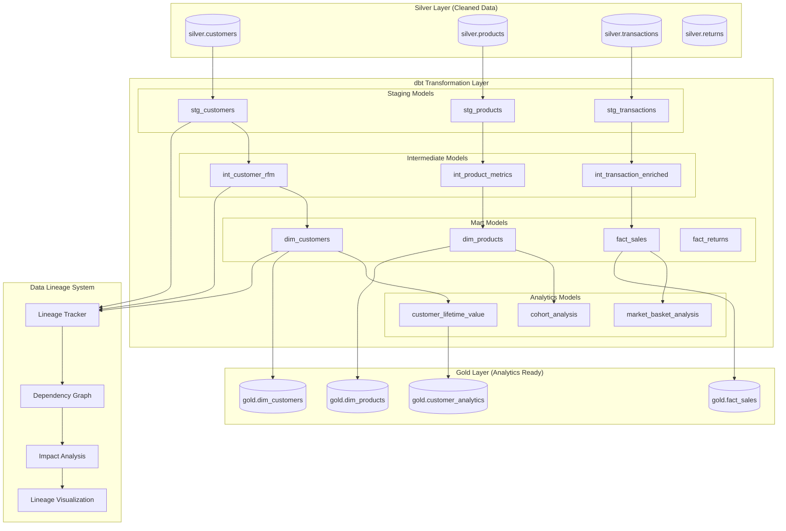

# PwC Retail Data Platform - Data Lineage & dbt Documentation

## Table of Contents

1. [Overview](#overview)
2. [Data Lineage Architecture](#data-lineage-architecture)
3. [dbt Project Structure](#dbt-project-structure)
4. [Data Models Documentation](#data-models-documentation)
5. [Incremental Models & Performance](#incremental-models--performance)
6. [Data Quality Testing](#data-quality-testing)
7. [Macros & Advanced Features](#macros--advanced-features)
8. [Lineage Visualization](#lineage-visualization)
9. [Version Control & CI/CD](#version-control--cicd)
10. [Best Practices](#best-practices)

## Overview

The PwC Retail Data Platform implements comprehensive data lineage tracking and uses dbt (data build tool) as the primary transformation layer for the Gold layer. This ensures transparency, maintainability, and reliability in our data transformations.

### Key Components
- **dbt Core**: SQL-first transformation framework
- **Data Lineage Tracking**: Automated dependency mapping
- **Version Control**: Git-based change management
- **Testing Framework**: Comprehensive data quality tests
- **Documentation**: Auto-generated model documentation
- **CI/CD Integration**: Automated testing and deployment

### Architecture Overview



## Data Lineage Architecture

### Automated Lineage Collection

The platform automatically tracks data lineage at multiple levels:

```python
class DataLineageCollector:
    """Comprehensive data lineage collection across all processing layers"""
    
    def __init__(self):
        self.lineage_store = LineageStore()
        self.metadata_extractor = MetadataExtractor()
        
    def collect_dbt_lineage(self, manifest_path: str) -> LineageGraph:
        """Extract lineage from dbt manifest.json"""
        
        with open(manifest_path, 'r') as f:
            manifest = json.load(f)
        
        lineage_graph = LineageGraph()
        
        # Process dbt models
        for model_name, model_info in manifest['nodes'].items():
            if model_info['resource_type'] == 'model':
                # Extract dependencies
                dependencies = model_info.get('depends_on', {}).get('nodes', [])
                
                # Create lineage node
                node = LineageNode(
                    id=model_name,
                    name=model_info['name'],
                    type='dbt_model',
                    schema=model_info['schema'],
                    database=model_info['database'],
                    materialization=model_info.get('config', {}).get('materialized', 'view'),
                    description=model_info.get('description', ''),
                    columns=self._extract_column_lineage(model_info),
                    tags=model_info.get('tags', []),
                    meta=model_info.get('meta', {})
                )
                
                lineage_graph.add_node(node)
                
                # Add dependencies
                for dep in dependencies:
                    lineage_graph.add_edge(dep, model_name)
        
        return lineage_graph
    
    def collect_spark_lineage(self, spark_plan: SparkExecutionPlan) -> LineageGraph:
        """Extract lineage from Spark execution plans"""
        
        lineage_graph = LineageGraph()
        
        # Parse Spark logical plan
        for operation in spark_plan.operations:
            if operation.type == 'DataSource':
                source_node = LineageNode(
                    id=operation.source_id,
                    name=operation.table_name,
                    type='data_source',
                    schema=operation.schema,
                    format=operation.format
                )
                lineage_graph.add_node(source_node)
            
            elif operation.type == 'Transform':
                transform_node = LineageNode(
                    id=operation.transform_id,
                    name=operation.name,
                    type='transformation',
                    transformation_type=operation.transform_type,
                    code=operation.code
                )
                lineage_graph.add_node(transform_node)
                
                # Add dependencies
                for input_id in operation.inputs:
                    lineage_graph.add_edge(input_id, operation.transform_id)
        
        return lineage_graph
    
    def _extract_column_lineage(self, model_info: Dict) -> List[ColumnLineage]:
        """Extract column-level lineage from dbt model"""
        
        column_lineage = []
        
        for column_name, column_info in model_info.get('columns', {}).items():
            lineage_info = ColumnLineage(
                column_name=column_name,
                data_type=column_info.get('data_type'),
                description=column_info.get('description', ''),
                source_columns=self._parse_column_dependencies(column_info),
                transformations=column_info.get('meta', {}).get('transformations', [])
            )
            column_lineage.append(lineage_info)
        
        return column_lineage
```

### Lineage Storage and Querying

```python
class LineageStore:
    """Persistent storage for data lineage information"""
    
    def __init__(self, connection_string: str):
        self.db = create_engine(connection_string)
        self.session = sessionmaker(bind=self.db)()
    
    def store_lineage_graph(self, graph: LineageGraph, run_id: str):
        """Store complete lineage graph"""
        
        # Store nodes
        for node in graph.nodes:
            lineage_node = LineageNodeModel(
                node_id=node.id,
                name=node.name,
                type=node.type,
                schema=node.schema,
                database=node.database,
                metadata=json.dumps(node.metadata),
                created_at=datetime.now(),
                run_id=run_id
            )
            self.session.merge(lineage_node)
        
        # Store edges (dependencies)
        for edge in graph.edges:
            lineage_edge = LineageEdgeModel(
                source_node_id=edge.source,
                target_node_id=edge.target,
                relationship_type=edge.type,
                created_at=datetime.now(),
                run_id=run_id
            )
            self.session.merge(lineage_edge)
        
        self.session.commit()
    
    def get_upstream_lineage(self, node_id: str, depth: int = 3) -> LineageGraph:
        """Get upstream dependencies for a node"""
        
        query = """
        WITH RECURSIVE upstream_lineage AS (
            -- Base case: start with the target node
            SELECT source_node_id, target_node_id, 1 as level
            FROM lineage_edges 
            WHERE target_node_id = :node_id
            
            UNION ALL
            
            -- Recursive case: find upstream dependencies
            SELECT le.source_node_id, le.target_node_id, ul.level + 1
            FROM lineage_edges le
            INNER JOIN upstream_lineage ul ON le.target_node_id = ul.source_node_id
            WHERE ul.level < :depth
        )
        SELECT DISTINCT source_node_id, target_node_id, level
        FROM upstream_lineage
        ORDER BY level;
        """
        
        result = self.session.execute(text(query), {"node_id": node_id, "depth": depth})
        
        # Build lineage graph from results
        graph = LineageGraph()
        for row in result:
            graph.add_edge(row.source_node_id, row.target_node_id)
        
        return graph
    
    def analyze_impact(self, changed_node_id: str) -> ImpactAnalysis:
        """Analyze downstream impact of changes to a node"""
        
        downstream_graph = self.get_downstream_lineage(changed_node_id)
        
        affected_models = []
        affected_dashboards = []
        affected_reports = []
        
        for node_id in downstream_graph.get_node_ids():
            node = self.get_node(node_id)
            
            if node.type == 'dbt_model':
                affected_models.append(node)
            elif node.type == 'dashboard':
                affected_dashboards.append(node)
            elif node.type == 'report':
                affected_reports.append(node)
        
        return ImpactAnalysis(
            changed_node=changed_node_id,
            affected_models=affected_models,
            affected_dashboards=affected_dashboards,
            affected_reports=affected_reports,
            estimated_impact_score=self._calculate_impact_score(downstream_graph)
        )
```

## dbt Project Structure

### Project Organization

```
dbt/
├── README.md
├── dbt_project.yml
├── profiles.yml
├── packages.yml
│
├── analysis/                  # Analytical queries for exploration
│   ├── customer_analysis.sql
│   └── product_performance.sql
│
├── macros/                    # Reusable SQL snippets
│   ├── generate_alias_name.sql
│   ├── data_quality_checks.sql
│   ├── dimensional_modeling.sql
│   ├── advanced_analytics.sql
│   └── performance_optimization.sql
│
├── models/
│   ├── staging/              # Raw data cleaning and standardization
│   │   ├── schema.yml
│   │   ├── stg_customers.sql
│   │   ├── stg_products.sql
│   │   └── stg_retail_data.sql
│   │
│   ├── intermediate/         # Business logic transformations
│   │   ├── int_customer_rfm.sql
│   │   ├── int_product_metrics.sql
│   │   └── int_transaction_enriched.sql
│   │
│   └── marts/               # Final business-ready models
│       ├── core/            # Core dimensional models
│       │   ├── schema.yml
│       │   ├── dim_customers.sql
│       │   ├── dim_products.sql
│       │   └── fact_sales.sql
│       │
│       ├── analytics/       # Advanced analytics models
│       │   ├── schema.yml
│       │   ├── customer_lifetime_value.sql
│       │   ├── cohort_analysis.sql
│       │   └── market_basket_analysis.sql
│       │
│       ├── performance/     # Performance-optimized models
│       │   ├── schema.yml
│       │   ├── fact_sales_incremental.sql
│       │   └── agg_sales_daily_optimized.sql
│       │
│       ├── finance/         # Finance-specific models
│       │   └── finance_summary_daily.sql
│       │
│       └── marketing/       # Marketing-specific models
│           └── customer_segments_summary.sql
│
├── seeds/                   # Static reference data
│   ├── country_codes.csv
│   ├── product_categories.csv
│   └── exchange_rates.csv
│
├── snapshots/              # SCD Type 2 snapshots
│   ├── snap_customers.sql
│   └── snap_products.sql
│
└── tests/                  # Custom data tests
    ├── assert_customer_uniqueness.sql
    ├── assert_positive_revenue.sql
    └── assert_valid_dates.sql
```

### dbt_project.yml Configuration

```yaml
name: 'pwc_retail_platform'
version: '1.0.0'
config-version: 2

# Project profile
profile: 'pwc_retail'

# Model paths
model-paths: ["models"]
analysis-paths: ["analysis"]
test-paths: ["tests"]
seed-paths: ["seeds"]
macro-paths: ["macros"]
snapshot-paths: ["snapshots"]

target-path: "target"
clean-targets:
  - "target"
  - "dbt_packages"

# Model configurations
models:
  pwc_retail_platform:
    # Staging models - materialized as views for development agility
    staging:
      +materialized: view
      +schema: staging
      +docs:
        node_color: "#87CEEB"
    
    # Intermediate models - materialized as ephemeral for performance
    intermediate:
      +materialized: ephemeral
      +docs:
        node_color: "#FFA500"
    
    # Mart models - materialized as tables for query performance
    marts:
      +materialized: table
      +schema: gold
      
      # Core dimensional models
      core:
        +tags: ["core", "dimensional"]
        +docs:
          node_color: "#228B22"
        
        # Fact tables with incremental loading
        fact_sales:
          +materialized: incremental
          +unique_key: sale_key
          +on_schema_change: "fail"
          +partition_by: {
            "field": "date_key",
            "data_type": "int64"
          }
          +cluster_by: ["customer_key", "product_key"]
        
        # Dimension tables with SCD Type 2
        dim_customers:
          +materialized: table
          +post-hook: "{{ create_scd2_indexes('dim_customers') }}"
      
      # Analytics models
      analytics:
        +tags: ["analytics", "ml"]
        +materialized: table
        +schema: analytics
        +docs:
          node_color: "#9932CC"
      
      # Performance-optimized models
      performance:
        +tags: ["performance", "aggregates"]
        +materialized: incremental
        +schema: performance

# Seeds configuration
seeds:
  pwc_retail_platform:
    +schema: reference_data
    +docs:
      node_color: "#DAA520"
    
    # Country reference data
    country_codes:
      +column_types:
        country_code: varchar(3)
        country_name: varchar(100)
        region: varchar(50)
    
    # Product categories
    product_categories:
      +column_types:
        category_id: integer
        category_name: varchar(100)
        parent_category: varchar(100)

# Snapshot configurations
snapshots:
  pwc_retail_platform:
    +target_schema: snapshots
    +strategy: timestamp
    +updated_at: updated_at

# Variables
vars:
  # Date variables for incremental processing
  start_date: '2020-01-01'
  end_date: '2024-12-31'
  
  # Data quality thresholds
  min_quality_score: 0.8
  max_null_percentage: 0.05
  
  # Performance tuning
  incremental_lookback_days: 7
  large_table_threshold: 1000000

# Quoting configuration
quoting:
  database: false
  schema: false
  identifier: false

# Documentation
docs:
  include: "**/*.md"
  exclude: "target/**"
```

## Data Models Documentation

### Staging Models

Staging models perform initial cleaning and standardization of raw data.

#### stg_customers.sql

```sql
{{ config(
    materialized='view',
    tags=['staging', 'customers']
) }}

WITH source_data AS (
    SELECT DISTINCT
        customer_id,
        country,
        first_value(invoice_date) OVER (
            PARTITION BY customer_id 
            ORDER BY invoice_date ASC 
            ROWS UNBOUNDED PRECEDING
        ) AS first_purchase_date,
        last_value(invoice_date) OVER (
            PARTITION BY customer_id 
            ORDER BY invoice_date ASC 
            ROWS BETWEEN UNBOUNDED PRECEDING AND UNBOUNDED FOLLOWING
        ) AS last_purchase_date
        
    FROM {{ source('silver', 'retail_transactions') }}
    WHERE customer_id IS NOT NULL
    AND customer_id != ''
    AND length(customer_id) >= 5  -- Data quality filter
),

customer_aggregates AS (
    SELECT 
        customer_id,
        country,
        first_purchase_date,
        last_purchase_date,
        
        -- Calculated fields
        date_diff('day', first_purchase_date, last_purchase_date) AS customer_lifetime_days,
        date_diff('day', last_purchase_date, current_date()) AS days_since_last_purchase,
        
        -- Data quality indicators
        CASE 
            WHEN country IS NOT NULL AND length(trim(country)) > 0 THEN 1
            ELSE 0
        END AS has_valid_country
        
    FROM source_data
)

SELECT 
    customer_id,
    upper(trim(country)) AS country,
    first_purchase_date,
    last_purchase_date,
    customer_lifetime_days,
    days_since_last_purchase,
    has_valid_country,
    
    -- Metadata
    current_timestamp() AS _stg_loaded_at
    
FROM customer_aggregates

-- Data quality tests
{{ test_not_null('customer_id') }}
{{ test_unique('customer_id') }}
{{ test_accepted_values('has_valid_country', [0, 1]) }}
```

#### stg_products.sql

```sql
{{ config(
    materialized='view',
    tags=['staging', 'products'],
    docs={
        'description': 'Staging model for product data with standardization and quality checks'
    }
) }}

WITH source_data AS (
    SELECT DISTINCT
        stock_code,
        description,
        unit_price
        
    FROM {{ source('silver', 'retail_transactions') }}
    WHERE stock_code IS NOT NULL
    AND stock_code != ''
    AND description IS NOT NULL
    AND unit_price > 0
),

product_enrichment AS (
    SELECT 
        s.*,
        pc.category_name,
        pc.parent_category,
        
        -- Data quality scoring
        CASE 
            WHEN length(trim(s.description)) >= 10 THEN 0.4
            WHEN length(trim(s.description)) >= 5 THEN 0.2
            ELSE 0.0
        END +
        CASE 
            WHEN s.unit_price BETWEEN 0.01 AND 10000 THEN 0.3
            ELSE 0.0
        END +
        CASE 
            WHEN pc.category_name IS NOT NULL THEN 0.3
            ELSE 0.0
        END AS product_quality_score
        
    FROM source_data s
    LEFT JOIN {{ ref('product_categories') }} pc
        ON upper(left(s.description, 20)) LIKE '%' || upper(pc.category_name) || '%'
)

SELECT 
    upper(trim(stock_code)) AS stock_code,
    trim(description) AS product_description,
    unit_price,
    coalesce(category_name, 'UNCATEGORIZED') AS category,
    parent_category,
    product_quality_score,
    
    -- Computed attributes
    CASE 
        WHEN description ILIKE '%christmas%' OR description ILIKE '%xmas%' THEN true
        WHEN description ILIKE '%valentine%' OR description ILIKE '%heart%' THEN true
        WHEN description ILIKE '%easter%' THEN true
        ELSE false
    END AS is_seasonal,
    
    -- Price tier classification
    CASE 
        WHEN unit_price < 1.0 THEN 'budget'
        WHEN unit_price < 10.0 THEN 'standard'
        WHEN unit_price < 50.0 THEN 'premium'
        ELSE 'luxury'
    END AS price_tier,
    
    current_timestamp() AS _stg_loaded_at
    
FROM product_enrichment
WHERE product_quality_score >= {{ var('min_quality_score', 0.5) }}
```

### Intermediate Models

Intermediate models contain business logic and prepare data for final mart models.

#### int_customer_rfm.sql

```sql
{{ config(
    materialized='ephemeral',
    tags=['intermediate', 'analytics', 'rfm']
) }}

WITH customer_transactions AS (
    SELECT 
        customer_id,
        invoice_date,
        total_amount,
        is_return
        
    FROM {{ source('silver', 'retail_transactions') }}
    WHERE customer_id IS NOT NULL
    AND invoice_date >= '{{ var('start_date') }}'
    AND data_quality_score >= {{ var('min_quality_score') }}
),

rfm_calculations AS (
    SELECT 
        customer_id,
        
        -- Recency: Days since last purchase
        date_diff('day', max(invoice_date), current_date()) AS recency_days,
        
        -- Frequency: Number of unique purchase days
        count(DISTINCT invoice_date) AS frequency,
        
        -- Monetary: Total spend (excluding returns)
        sum(CASE WHEN NOT is_return THEN total_amount ELSE 0 END) AS monetary_value,
        
        -- Additional metrics
        count(*) AS total_transactions,
        sum(CASE WHEN is_return THEN total_amount ELSE 0 END) AS return_value,
        avg(CASE WHEN NOT is_return THEN total_amount ELSE null END) AS avg_order_value
        
    FROM customer_transactions
    GROUP BY customer_id
),

rfm_scores AS (
    SELECT 
        *,
        
        -- RFM Scoring (1-5 scale, 5 being best)
        {{ rfm_score('recency_days', 'DESC') }} AS recency_score,
        {{ rfm_score('frequency', 'ASC') }} AS frequency_score, 
        {{ rfm_score('monetary_value', 'ASC') }} AS monetary_score
        
    FROM rfm_calculations
),

rfm_segments AS (
    SELECT 
        *,
        
        -- Combined RFM Score
        cast(recency_score AS string) || 
        cast(frequency_score AS string) || 
        cast(monetary_score AS string) AS rfm_combined_score,
        
        -- Customer Segmentation based on RFM
        CASE 
            WHEN recency_score >= 4 AND frequency_score >= 4 AND monetary_score >= 4 THEN 'champions'
            WHEN recency_score >= 3 AND frequency_score >= 3 AND monetary_score >= 3 THEN 'loyal_customers'
            WHEN recency_score >= 4 AND frequency_score <= 2 AND monetary_score <= 2 THEN 'new_customers'
            WHEN recency_score >= 3 AND frequency_score <= 2 AND monetary_score >= 3 THEN 'potential_loyalists'
            WHEN recency_score <= 2 AND frequency_score >= 3 AND monetary_score >= 3 THEN 'at_risk'
            WHEN recency_score <= 2 AND frequency_score >= 4 AND monetary_score <= 2 THEN 'cannot_lose_them'
            WHEN recency_score <= 2 AND frequency_score <= 2 AND monetary_score >= 3 THEN 'hibernating_high_value'
            WHEN recency_score <= 2 AND frequency_score <= 2 AND monetary_score <= 2 THEN 'lost'
            ELSE 'others'
        END AS customer_segment,
        
        -- Value tier based on monetary score
        CASE 
            WHEN monetary_score >= 5 THEN 'high_value'
            WHEN monetary_score >= 3 THEN 'medium_value'
            ELSE 'low_value'
        END AS value_tier
        
    FROM rfm_scores
)

SELECT * FROM rfm_segments
```

### Mart Models - Dimensional Design

#### dim_customers.sql (SCD Type 2)

```sql
{{ config(
    materialized='table',
    unique_key='customer_key',
    tags=['mart', 'dimension', 'scd2'],
    post_hook="{{ create_dimension_indexes('dim_customers') }}"
) }}

WITH customer_current AS (
    SELECT 
        c.customer_id,
        c.country,
        c.first_purchase_date,
        c.last_purchase_date,
        
        -- RFM Analysis
        rfm.recency_days,
        rfm.frequency,
        rfm.monetary_value,
        rfm.recency_score,
        rfm.frequency_score,
        rfm.monetary_score,
        rfm.rfm_combined_score,
        rfm.customer_segment,
        rfm.value_tier,
        
        -- Customer Lifetime Metrics
        rfm.total_transactions,
        rfm.return_value,
        rfm.avg_order_value,
        
        -- Geographic Enrichment
        geo.region,
        geo.country_iso_code,
        geo.timezone,
        
        -- Behavioral Flags
        CASE 
            WHEN rfm.return_value / nullif(rfm.monetary_value + rfm.return_value, 0) > 0.2 THEN true
            ELSE false
        END AS is_high_return_customer,
        
        CASE 
            WHEN date_diff('day', c.last_purchase_date, current_date()) > 365 THEN true
            ELSE false
        END AS is_churned,
        
        current_date() AS effective_date,
        null AS end_date,
        true AS is_current,
        1 AS version
        
    FROM {{ ref('stg_customers') }} c
    LEFT JOIN {{ ref('int_customer_rfm') }} rfm
        ON c.customer_id = rfm.customer_id
    LEFT JOIN {{ ref('country_reference') }} geo
        ON c.country = geo.country_name
),

-- Handle SCD Type 2 logic
existing_customers AS (
    SELECT 
        customer_key,
        customer_id,
        customer_segment,
        value_tier,
        is_churned,
        effective_date,
        end_date,
        is_current,
        version
    FROM {{ this }}
    WHERE is_current = true
),

changed_customers AS (
    SELECT 
        curr.customer_id,
        CASE 
            WHEN existing.customer_segment != curr.customer_segment THEN true
            WHEN existing.value_tier != curr.value_tier THEN true  
            WHEN existing.is_churned != curr.is_churned THEN true
            ELSE false
        END AS has_changes
        
    FROM customer_current curr
    LEFT JOIN existing_customers existing
        ON curr.customer_id = existing.customer_id
    WHERE existing.customer_id IS NOT NULL
),

final_dimension AS (
    SELECT 
        {{ generate_surrogate_key(['customer_id', 'effective_date']) }} AS customer_key,
        customer_id,
        country,
        region,
        country_iso_code,
        timezone,
        
        -- Customer Attributes
        customer_segment,
        value_tier,
        first_purchase_date,
        last_purchase_date,
        
        -- RFM Scores
        recency_days,
        frequency,
        monetary_value,
        recency_score,
        frequency_score, 
        monetary_score,
        rfm_combined_score,
        
        -- Behavioral Metrics
        total_transactions,
        avg_order_value,
        return_value,
        is_high_return_customer,
        is_churned,
        
        -- SCD Type 2 Fields
        effective_date,
        end_date,
        is_current,
        version,
        
        -- Metadata
        current_timestamp() AS created_at,
        current_timestamp() AS updated_at
        
    FROM customer_current
)

SELECT * FROM final_dimension
```

#### fact_sales.sql (Incremental Model)

```sql
{{ config(
    materialized='incremental',
    unique_key=['invoice_no', 'stock_code', 'customer_id'],
    incremental_strategy='merge',
    partition_by={
        "field": "date_key", 
        "data_type": "int64"
    },
    cluster_by=['customer_key', 'product_key'],
    tags=['mart', 'fact', 'incremental']
) }}

WITH silver_transactions AS (
    SELECT 
        transaction_id,
        invoice,
        stock_code,
        quantity,
        unit_price,
        total_amount,
        customer_id,
        invoice_date,
        is_return,
        data_quality_score,
        created_at,
        updated_at
        
    FROM {{ source('silver', 'retail_transactions') }}
    
    
        -- Only process new or updated records
        WHERE updated_at > (SELECT max(updated_at) FROM {{ this }})
        OR created_at > (SELECT max(created_at) FROM {{ this }})
    
    
    -- Data quality filter
    AND data_quality_score >= {{ var('min_quality_score', 0.8) }}
    AND invoice_date >= '{{ var('start_date') }}'
),

dimension_joins AS (
    SELECT 
        st.*,
        
        -- Dimension Keys
        dc.customer_key,
        dp.product_key,
        dd.date_key,
        
        -- Additional Measures from Dimensions
        coalesce(dp.unit_cost, 0) AS unit_cost,
        coalesce(dp.category, 'UNKNOWN') AS product_category,
        dc.customer_segment,
        dc.value_tier
        
    FROM silver_transactions st
    
    -- Join Customer Dimension (SCD Type 2 - point-in-time lookup)
    LEFT JOIN {{ ref('dim_customers') }} dc
        ON st.customer_id = dc.customer_id
        AND st.invoice_date >= dc.effective_date
        AND (st.invoice_date < dc.end_date OR dc.end_date IS NULL)
        AND dc.is_current = true
    
    -- Join Product Dimension
    LEFT JOIN {{ ref('dim_products') }} dp
        ON st.stock_code = dp.stock_code
    
    -- Join Date Dimension  
    LEFT JOIN {{ ref('dim_date') }} dd
        ON st.invoice_date = dd.full_date
),

fact_calculations AS (
    SELECT 
        -- Natural Keys (for deduplication)
        invoice AS invoice_no,
        stock_code,
        customer_id,
        
        -- Dimension Keys
        customer_key,
        product_key,
        date_key,
        
        -- Measures
        quantity,
        unit_price,
        total_amount,
        unit_cost,
        
        -- Calculated Measures
        (quantity * unit_price) AS line_total,
        (quantity * unit_cost) AS cost_of_goods_sold,
        (total_amount - (quantity * unit_cost)) AS gross_profit,
        
        CASE 
            WHEN total_amount > 0 THEN (total_amount - (quantity * unit_cost)) / total_amount
            ELSE 0
        END AS profit_margin_pct,
        
        -- Flags and Attributes
        is_return,
        
        CASE 
            WHEN unit_price < (
                SELECT avg(unit_price) 
                FROM silver_transactions s2 
                WHERE s2.stock_code = dimension_joins.stock_code
            ) THEN true
            ELSE false
        END AS is_discounted,
        
        product_category,
        customer_segment,
        value_tier,
        
        -- Metadata
        transaction_id AS source_transaction_id,
        'silver.retail_transactions' AS source_system,
        current_timestamp() AS created_at,
        updated_at
        
    FROM dimension_joins
    WHERE customer_key IS NOT NULL
    AND product_key IS NOT NULL
    AND date_key IS NOT NULL
)

SELECT 
    {{ generate_surrogate_key(['invoice_no', 'stock_code', 'customer_id']) }} AS sale_key,
    *
FROM fact_calculations

-- Post-hook tests
{{ test_not_null('customer_key') }}
{{ test_not_null('product_key') }}
{{ test_not_null('date_key') }}
{{ test_relationships('customer_key', ref('dim_customers'), 'customer_key') }}
{{ test_relationships('product_key', ref('dim_products'), 'product_key') }}
```

## Incremental Models & Performance

### Incremental Strategy Configuration

```sql
-- Different incremental strategies for different use cases

-- 1. Append-only for immutable event data
{{ config(
    materialized='incremental',
    incremental_strategy='append',
    unique_key='event_id'
) }}

-- 2. Merge strategy for updates and inserts
{{ config(
    materialized='incremental', 
    incremental_strategy='merge',
    unique_key=['customer_id', 'date']
) }}

-- 3. Insert-overwrite for date partitioned data
{{ config(
    materialized='incremental',
    incremental_strategy='insert_overwrite',
    partition_by={'field': 'date', 'data_type': 'date'}
) }}
```

### Incremental Model Best Practices

```sql
-- Advanced incremental pattern with data quality checks
{{ config(
    materialized='incremental',
    unique_key='transaction_id',
    incremental_strategy='merge',
    on_schema_change='fail'
) }}

WITH new_data AS (
    SELECT *
    FROM {{ source('raw', 'transactions') }}
    
    
        -- Incremental filter with lookback window for late-arriving data
        WHERE updated_at > (
            SELECT dateadd('day', -{{ var('incremental_lookback_days', 3) }}, max(updated_at))
            FROM {{ this }}
        )
    
),

quality_filtered AS (
    SELECT *
    FROM new_data
    WHERE {{ data_quality_filter() }}  -- Custom macro for quality rules
    AND _is_deleted = false  -- Soft delete handling
),

-- Handle duplicates within the batch
deduplicated AS (
    SELECT *
    FROM (
        SELECT *,
        row_number() OVER (
            PARTITION BY transaction_id 
            ORDER BY updated_at DESC
        ) AS row_num
        FROM quality_filtered
    )
    WHERE row_num = 1
)

SELECT * FROM deduplicated
```

### Performance Optimization Patterns

```sql
-- Partitioning and Clustering
{{ config(
    materialized='table',
    partition_by={
        'field': 'transaction_date',
        'data_type': 'date',
        'granularity': 'month'
    },
    cluster_by=['customer_id', 'product_category'],
    
    -- BigQuery specific optimizations
    require_partition_filter=true,
    partition_expiration_days=2555  -- 7 years retention
) }}

-- Pre-aggregation for performance
WITH daily_aggregates AS (
    SELECT 
        transaction_date,
        customer_id,
        product_category,
        count(*) AS transaction_count,
        sum(total_amount) AS daily_spend,
        avg(total_amount) AS avg_transaction_value
        
    FROM {{ ref('fact_sales') }}
    GROUP BY 1, 2, 3
)
```

## Data Quality Testing

### Generic Tests Configuration

```yaml
# models/marts/core/schema.yml
version: 2

models:
  - name: fact_sales
    description: "Core sales fact table with comprehensive measures"
    columns:
      - name: sale_key
        description: "Surrogate key for sales fact"
        tests:
          - not_null
          - unique
          
      - name: customer_key
        description: "Foreign key to customer dimension"
        tests:
          - not_null
          - relationships:
              to: ref('dim_customers')
              field: customer_key
              
      - name: total_amount
        description: "Total transaction amount"
        tests:
          - not_null
          - dbt_expectations.expect_column_values_to_be_between:
              min_value: -10000  # Allow for returns
              max_value: 100000
              
      - name: profit_margin_pct
        description: "Profit margin percentage"
        tests:
          - dbt_expectations.expect_column_values_to_be_between:
              min_value: -1.0
              max_value: 1.0
              
  - name: dim_customers
    description: "Customer dimension with SCD Type 2"
    tests:
      - dbt_expectations.expect_table_row_count_to_be_between:
          min_value: 1000
          max_value: 1000000
    columns:
      - name: customer_id
        description: "Natural customer identifier"  
        tests:
          - not_null
          - dbt_expectations.expect_column_values_to_match_regex:
              regex: "^[0-9]{5,10}$"
              
      - name: customer_segment
        description: "RFM-based customer segment"
        tests:
          - accepted_values:
              values: ['champions', 'loyal_customers', 'new_customers', 
                      'potential_loyalists', 'at_risk', 'cannot_lose_them',
                      'hibernating_high_value', 'lost', 'others']
```

### Custom Data Quality Tests

```sql
-- tests/assert_revenue_consistency.sql
-- Custom test to ensure revenue consistency across layers

WITH silver_revenue AS (
    SELECT 
        date(invoice_date) AS transaction_date,
        sum(total_amount) AS silver_revenue
    FROM {{ source('silver', 'retail_transactions') }}
    WHERE invoice_date >= current_date - 30
    GROUP BY 1
),

gold_revenue AS (
    SELECT 
        dd.full_date AS transaction_date,
        sum(fs.total_amount) AS gold_revenue
    FROM {{ ref('fact_sales') }} fs
    JOIN {{ ref('dim_date') }} dd ON fs.date_key = dd.date_key
    WHERE dd.full_date >= current_date - 30
    GROUP BY 1
),

revenue_comparison AS (
    SELECT 
        s.transaction_date,
        s.silver_revenue,
        coalesce(g.gold_revenue, 0) AS gold_revenue,
        abs(s.silver_revenue - coalesce(g.gold_revenue, 0)) AS revenue_diff,
        
        CASE 
            WHEN s.silver_revenue = 0 THEN 0
            ELSE abs(s.silver_revenue - coalesce(g.gold_revenue, 0)) / s.silver_revenue
        END AS revenue_diff_pct
        
    FROM silver_revenue s
    LEFT JOIN gold_revenue g ON s.transaction_date = g.transaction_date
)

SELECT *
FROM revenue_comparison
WHERE revenue_diff_pct > 0.01  -- Allow 1% variance
```

### Great Expectations Integration

```sql
-- macros/great_expectations.sql

    
    WITH validation AS (
        SELECT 
            {{ column_list | join(', ') }},
            count(*) AS combination_count
        FROM {{ this }}
        GROUP BY {{ column_list | join(', ') }}
        HAVING count(*) > 1
    )
    
    SELECT count(*) AS duplicate_combinations
    FROM validation
    


-- Usage in model
SELECT *
FROM my_model
WHERE {{ expect_column_values_to_be_unique_combination_of(['customer_id', 'transaction_date']) }} = 0
```

## Macros & Advanced Features

### Advanced dbt Macros

```sql
-- macros/dimensional_modeling.sql


    {{ dbt_utils.generate_surrogate_key(columns) }}



    
    WITH source_data AS (
        SELECT 
            {{ natural_key }},
            
            {{ col }},
            
            current_timestamp() AS effective_date,
            null AS end_date,
            true AS is_current,
            1 AS version
        FROM {{ ref('stg_' ~ table_name) }}
    ),
    
    existing_records AS (
        SELECT *
        FROM {{ this }}
        WHERE is_current = true
    ),
    
    changed_records AS (
        SELECT 
            s.{{ natural_key }},
            
            CASE WHEN s.{{ col }} != e.{{ col }} THEN true ELSE false END AS {{ col }}_changed,
            
        FROM source_data s
        LEFT JOIN existing_records e
            ON s.{{ natural_key }} = e.{{ natural_key }}
        WHERE 
            s.{{ col }} != e.{{ col }}
             OR 
        
    )
    
    -- Implementation continues...
    


-- Advanced RFM Scoring Macro

    ntile(5) OVER (
        ORDER BY {{ column }} {{ order_direction }}
        ROWS BETWEEN UNBOUNDED PRECEDING AND UNBOUNDED FOLLOWING
    )


-- Data Quality Macro with Configurable Rules

    
    
    
    
    
    
    
    -- Not null conditions
    
        
    
    
    -- Positive value conditions  
    
        
    
    
    -- Date range conditions
    
        
            
        
        
            
        
    
    
    {{ conditions | join(' AND ') }}
    

```

### Performance Optimization Macros

```sql
-- macros/performance_optimization.sql


    
    -- Create indexes for dimension table lookups
    CREATE INDEX IF NOT EXISTS idx_{{ table_name }}_natural_key 
    ON {{ this }} ({{ get_natural_key(table_name) }});
    
    
        CREATE INDEX IF NOT EXISTS idx_{{ table_name }}_scd2 
        ON {{ this }} ({{ get_natural_key(table_name) }}, effective_date, end_date);
    
    
    -- Create indexes for common join patterns
    
    
        CREATE INDEX IF NOT EXISTS idx_{{ table_name }}_{{ join_col }}
        ON {{ this }} ({{ join_col }});
    
    



    
    -- Analyze table statistics after incremental load
    ANALYZE TABLE {{ this }};
    
    -- Optimize file layout (BigQuery/Spark specific)
    
        -- BigQuery automatically optimizes, no action needed
    
        OPTIMIZE {{ this }}
        
        ZORDER BY ({{ get_cluster_columns() | join(', ') }})
        
    
    


-- Dynamic partition management

    
    
    
    -- Drop old partitions beyond retention period
    
        DELETE FROM {{ this }}
        WHERE _PARTITIONDATE < '{{ cutoff_date }}'
    
        ALTER TABLE {{ this }}
        DROP PARTITION (date < '{{ cutoff_date }}')
    
    

```

## Lineage Visualization

### Automated Documentation Generation

```python
class dbtDocumentationGenerator:
    """Generate comprehensive documentation with lineage visualization"""
    
    def __init__(self, project_dir: str):
        self.project_dir = project_dir
        self.manifest_path = os.path.join(project_dir, 'target', 'manifest.json')
        self.catalog_path = os.path.join(project_dir, 'target', 'catalog.json')
    
    def generate_lineage_documentation(self) -> LineageDocumentation:
        """Generate interactive lineage documentation"""
        
        # Load dbt artifacts
        manifest = self._load_manifest()
        catalog = self._load_catalog()
        
        # Create lineage graph
        lineage_graph = self._build_lineage_graph(manifest)
        
        # Generate documentation
        documentation = LineageDocumentation(
            project_name=manifest['metadata']['project_name'],
            generated_at=datetime.now(),
            models=self._document_models(manifest, catalog),
            lineage_graph=lineage_graph,
            test_results=self._load_test_results(),
            performance_metrics=self._load_performance_metrics()
        )
        
        return documentation
    
    def _build_lineage_graph(self, manifest: Dict) -> LineageGraph:
        """Build interactive lineage graph from dbt manifest"""
        
        graph = LineageGraph()
        
        # Add nodes for each model
        for node_id, node_info in manifest['nodes'].items():
            if node_info['resource_type'] == 'model':
                
                # Determine node styling based on model type
                node_style = self._get_node_style(node_info)
                
                graph_node = GraphNode(
                    id=node_id,
                    name=node_info['name'],
                    type='model',
                    layer=self._determine_layer(node_info),
                    description=node_info.get('description', ''),
                    tags=node_info.get('tags', []),
                    materialization=node_info.get('config', {}).get('materialized', 'view'),
                    style=node_style,
                    metadata={
                        'file_path': node_info['original_file_path'],
                        'schema': node_info['schema'],
                        'database': node_info['database']
                    }
                )
                
                graph.add_node(graph_node)
        
        # Add edges for dependencies
        for node_id, node_info in manifest['nodes'].items():
            dependencies = node_info.get('depends_on', {}).get('nodes', [])
            for dep_id in dependencies:
                graph.add_edge(dep_id, node_id)
        
        return graph
    
    def generate_html_documentation(self, output_path: str):
        """Generate interactive HTML documentation"""
        
        documentation = self.generate_lineage_documentation()
        
        html_template = """
        <!DOCTYPE html>
        <html>
        <head>
            <title>{{ project_name }} - Data Lineage</title>
            <script src="https://d3js.org/d3.v7.min.js"></script>
            <style>
                .node { cursor: pointer; }
                .node circle { stroke-width: 2px; }
                .link { stroke: #999; stroke-opacity: 0.6; stroke-width: 2px; }
                .tooltip { position: absolute; background: rgba(0,0,0,0.8); color: white; padding: 10px; border-radius: 5px; }
            </style>
        </head>
        <body>
            <div id="lineage-graph"></div>
            <script>
                // D3.js visualization code
                const data = {{ lineage_data | tojson }};
                // Implementation of interactive lineage visualization
            </script>
        </body>
        </html>
        """
        
        # Render template with documentation data
        rendered_html = self._render_template(html_template, {
            'project_name': documentation.project_name,
            'lineage_data': documentation.lineage_graph.to_dict()
        })
        
        with open(output_path, 'w') as f:
            f.write(rendered_html)
```

### Lineage API Integration

```python
class LineageAPI:
    """REST API for querying data lineage"""
    
    def __init__(self, lineage_store: LineageStore):
        self.lineage_store = lineage_store
    
    def get_model_lineage(self, model_name: str, depth: int = 3) -> Dict:
        """Get upstream and downstream lineage for a model"""
        
        upstream = self.lineage_store.get_upstream_lineage(model_name, depth)
        downstream = self.lineage_store.get_downstream_lineage(model_name, depth)
        
        return {
            'model': model_name,
            'upstream': upstream.to_dict(),
            'downstream': downstream.to_dict(),
            'impact_score': self._calculate_impact_score(downstream),
            'complexity_score': self._calculate_complexity_score(upstream)
        }
    
    def get_column_lineage(self, table: str, column: str) -> Dict:
        """Get column-level lineage tracking"""
        
        column_lineage = self.lineage_store.get_column_lineage(table, column)
        
        return {
            'table': table,
            'column': column,
            'source_columns': column_lineage.source_columns,
            'transformations': column_lineage.transformations,
            'data_type_evolution': column_lineage.type_changes
        }
    
    def analyze_breaking_changes(self, changed_models: List[str]) -> Dict:
        """Analyze potential breaking changes impact"""
        
        impact_analysis = []
        
        for model in changed_models:
            downstream = self.lineage_store.get_downstream_lineage(model)
            
            for downstream_model in downstream.get_models():
                risk_level = self._assess_change_risk(model, downstream_model)
                
                impact_analysis.append({
                    'changed_model': model,
                    'affected_model': downstream_model,
                    'risk_level': risk_level,
                    'recommended_actions': self._get_recommended_actions(risk_level)
                })
        
        return {
            'analysis_timestamp': datetime.now().isoformat(),
            'changed_models': changed_models,
            'impact_analysis': impact_analysis,
            'overall_risk': self._calculate_overall_risk(impact_analysis)
        }
```

## Version Control & CI/CD

### dbt CI/CD Pipeline

```yaml
# .github/workflows/dbt_ci_cd.yml
name: dbt CI/CD Pipeline

on:
  push:
    branches: [main, develop]
    paths: ['dbt/**']
  pull_request:
    branches: [main]
    paths: ['dbt/**']

jobs:
  dbt-test:
    runs-on: ubuntu-latest
    
    steps:
      - uses: actions/checkout@v3
      
      - name: Setup Python
        uses: actions/setup-python@v4
        with:
          python-version: '3.10'
          
      - name: Install dbt
        run: |
          pip install dbt-postgres dbt-bigquery
          
      - name: Setup dbt profiles
        run: |
          mkdir -p ~/.dbt
          echo "${{ secrets.DBT_PROFILES_YML }}" > ~/.dbt/profiles.yml
          
      - name: Install dbt packages
        run: |
          cd dbt
          dbt deps
          
      - name: Run dbt seed
        run: |
          cd dbt
          dbt seed --target ci
          
      - name: Run dbt tests
        run: |
          cd dbt
          dbt test --target ci
          
      - name: Run dbt build (models + tests)
        run: |
          cd dbt  
          dbt build --target ci --select state:modified+
          
      - name: Generate documentation
        run: |
          cd dbt
          dbt docs generate --target ci
          
      - name: Upload documentation artifacts
        uses: actions/upload-artifact@v3
        with:
          name: dbt-docs
          path: dbt/target/
          
  dbt-deploy:
    if: github.ref == 'refs/heads/main'
    needs: dbt-test
    runs-on: ubuntu-latest
    
    steps:
      - uses: actions/checkout@v3
        
      - name: Deploy to production
        run: |
          cd dbt
          dbt deps
          dbt build --target prod
          
      - name: Update data catalog
        run: |
          python scripts/update_data_catalog.py
          
      - name: Notify deployment
        run: |
          curl -X POST ${{ secrets.SLACK_WEBHOOK }} \
            -H 'Content-type: application/json' \
            --data '{"text":"dbt models deployed to production successfully"}'
```

### Advanced dbt Testing Strategy

```yaml
# dbt_project.yml - Test configurations
tests:
  pwc_retail_platform:
    +severity: warn  # Don't fail builds on warnings
    
    # Critical tests that should fail builds
    core:
      +severity: error
      
    # Performance tests with custom thresholds  
    performance:
      +severity: warn
      +where: "created_at >= current_date - 7"  # Test recent data only
```

### Data Quality Monitoring Integration

```python
class dbtDataQualityMonitor:
    """Integrate dbt test results with monitoring system"""
    
    def __init__(self, monitoring_client: MonitoringClient):
        self.monitoring = monitoring_client
        
    def process_test_results(self, results_path: str):
        """Process dbt test results and send to monitoring system"""
        
        with open(results_path, 'r') as f:
            results = json.load(f)
        
        test_metrics = self._aggregate_test_results(results)
        
        # Send metrics to monitoring system
        for metric_name, value in test_metrics.items():
            self.monitoring.send_metric(
                name=f"dbt.tests.{metric_name}",
                value=value,
                tags={'project': 'pwc_retail_platform'}
            )
        
        # Create alerts for failed tests
        failed_tests = [r for r in results['results'] if r['status'] == 'fail']
        
        for failed_test in failed_tests:
            self.monitoring.send_alert(
                severity='high' if failed_test['config']['severity'] == 'error' else 'medium',
                title=f"dbt test failure: {failed_test['unique_id']}",
                message=failed_test['message'],
                tags={
                    'model': failed_test['unique_id'],
                    'test_type': failed_test['test_metadata']['name']
                }
            )
    
    def _aggregate_test_results(self, results: Dict) -> Dict[str, float]:
        """Aggregate test results into monitoring metrics"""
        
        total_tests = len(results['results'])
        passed_tests = len([r for r in results['results'] if r['status'] == 'pass'])
        failed_tests = len([r for r in results['results'] if r['status'] == 'fail'])
        
        return {
            'total_tests': total_tests,
            'passed_tests': passed_tests,
            'failed_tests': failed_tests,
            'success_rate': passed_tests / total_tests if total_tests > 0 else 0,
            'execution_time_seconds': results['elapsed_time']
        }
```

## Best Practices

### Model Organization

1. **Layer Separation**: Clear separation between staging, intermediate, and mart layers
2. **Naming Conventions**: 
   - Staging: `stg_<source_name>`
   - Intermediate: `int_<business_concept>`
   - Marts: `dim_<entity>`, `fact_<process>`
3. **Documentation**: Every model and column documented
4. **Testing**: Comprehensive test coverage at all layers

### Performance Best Practices

1. **Materialization Strategy**:
   - Views for staging (development agility)
   - Ephemeral for intermediate (avoid table proliferation) 
   - Tables/Incremental for marts (query performance)

2. **Incremental Processing**:
   - Use appropriate incremental strategies
   - Include lookback windows for late data
   - Implement proper deduplication logic

3. **Partitioning & Clustering**:
   - Partition large tables by date
   - Cluster by common filter columns
   - Require partition filters where appropriate

### Data Quality Best Practices

1. **Test Coverage**:
   - Every primary key tested for uniqueness and not null
   - Foreign key relationships validated
   - Business rules enforced through tests

2. **Data Quality Scoring**:
   - Implement quality scores for all models
   - Set appropriate quality thresholds
   - Monitor quality trends over time

3. **Error Handling**:
   - Graceful handling of data quality issues
   - Clear error messages and remediation steps
   - Automated alerts for quality degradation

For detailed implementation examples and troubleshooting guides, see our [dbt Development Guide](./development/DBT_DEVELOPMENT_GUIDE.md).