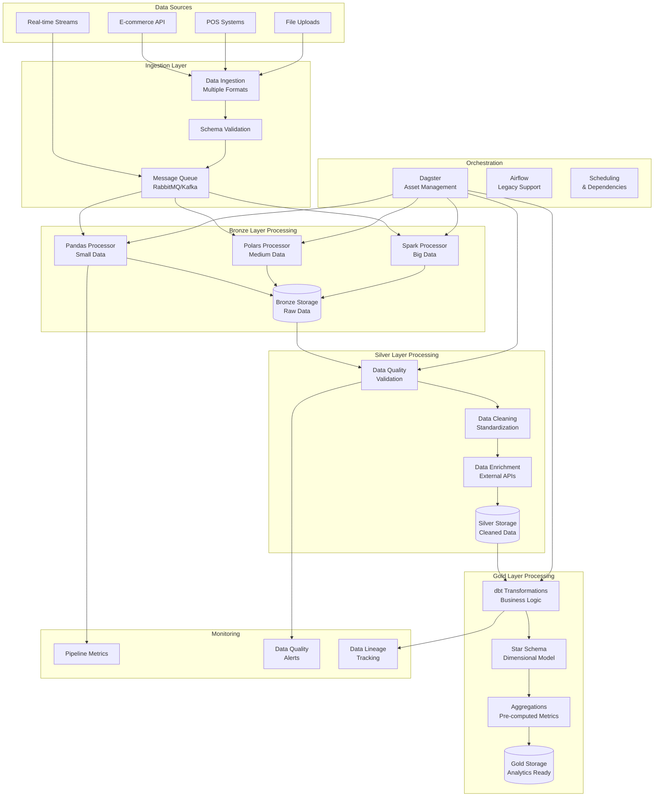

# PwC Retail Data Platform - ETL Pipeline Documentation

## Table of Contents

1. [Overview](#overview)
2. [Architecture & Design Patterns](#architecture--design-patterns)
3. [Medallion Architecture Implementation](#medallion-architecture-implementation)
4. [ETL Processing Engines](#etl-processing-engines)
5. [Data Quality Framework](#data-quality-framework)
6. [Pipeline Orchestration](#pipeline-orchestration)
7. [Data Lineage & Governance](#data-lineage--governance)
8. [Performance Optimization](#performance-optimization)
9. [Monitoring & Alerting](#monitoring--alerting)
10. [Troubleshooting Guide](#troubleshooting-guide)

## Overview

The PwC Retail Data Platform implements a modern, scalable ETL architecture based on the Medallion Architecture pattern, supporting multiple processing engines for optimal performance across different data volumes and use cases.

### Key Principles

- **Medallion Architecture**: Bronze (raw) → Silver (cleaned) → Gold (analytics-ready)
- **Multi-Engine Strategy**: Pandas, Polars, Spark, and dbt for different workloads
- **Data Quality First**: Comprehensive validation and quality scoring
- **Asset-Centric Design**: Focus on data products rather than tasks
- **Incremental Processing**: Efficient processing of only changed data
- **Fault Tolerance**: Robust error handling and recovery mechanisms

### Pipeline Flow Overview



## Architecture & Design Patterns

### Clean Architecture Implementation

The ETL framework follows clean architecture principles with clear separation of concerns:

```python
# Domain Layer - Business Logic
class DataQualityRule:
    def __init__(self, name: str, description: str):
        self.name = name
        self.description = description
    
    def validate(self, data: pd.DataFrame) -> QualityResult:
        """Abstract method for validation logic"""
        raise NotImplementedError

# Application Layer - Use Cases
class ProcessBronzeData:
    def __init__(self, processor: ETLProcessor, storage: DataStorage):
        self.processor = processor
        self.storage = storage
    
    def execute(self, source_config: SourceConfig) -> ProcessingResult:
        """Execute bronze layer processing use case"""
        raw_data = self.processor.extract(source_config)
        validated_data = self.processor.validate_schema(raw_data)
        result = self.storage.save(validated_data, "bronze")
        return result

# Infrastructure Layer - Technical Implementation
class SparkETLProcessor(ETLProcessor):
    def __init__(self, spark_session: SparkSession):
        self.spark = spark_session
    
    def extract(self, source_config: SourceConfig) -> DataFrame:
        """Spark-specific extraction implementation"""
        return self.spark.read.format(source_config.format).load(source_config.path)
```

### Strategy Pattern for Engine Selection

```python
class ETLEngineStrategy(Enum):
    PANDAS = "pandas"    # < 1GB datasets
    POLARS = "polars"    # 1-10GB datasets  
    SPARK = "spark"      # > 10GB datasets
    DBT = "dbt"          # SQL transformations

class ETLProcessorFactory:
    @staticmethod
    def create_processor(
        strategy: ETLEngineStrategy, 
        data_size: int
    ) -> ETLProcessor:
        """Factory method to create appropriate processor"""
        
        if strategy == ETLEngineStrategy.PANDAS:
            return PandasETLProcessor()
        elif strategy == ETLEngineStrategy.POLARS:
            return PolarsETLProcessor()
        elif strategy == ETLEngineStrategy.SPARK:
            return SparkETLProcessor()
        elif strategy == ETLEngineStrategy.DBT:
            return DBTProcessor()
        else:
            # Auto-select based on data size
            if data_size < 1_000_000_000:  # 1GB
                return PandasETLProcessor()
            elif data_size < 10_000_000_000:  # 10GB
                return PolarsETLProcessor()
            else:
                return SparkETLProcessor()
```

### Repository Pattern for Data Access

```python
class DataRepository(ABC):
    @abstractmethod
    def save(self, data: DataFrame, layer: str, table: str) -> bool:
        pass
    
    @abstractmethod
    def load(self, layer: str, table: str, filters: Dict = None) -> DataFrame:
        pass

class DeltaLakeRepository(DataRepository):
    def __init__(self, base_path: str):
        self.base_path = base_path
    
    def save(self, data: DataFrame, layer: str, table: str) -> bool:
        path = f"{self.base_path}/{layer}/{table}"
        data.write.format("delta").mode("append").save(path)
        return True
    
    def load(self, layer: str, table: str, filters: Dict = None) -> DataFrame:
        path = f"{self.base_path}/{layer}/{table}"
        df = spark.read.format("delta").load(path)
        
        if filters:
            for column, value in filters.items():
                df = df.filter(df[column] == value)
        
        return df
```

## Medallion Architecture Implementation

### Bronze Layer - Raw Data Ingestion

The Bronze layer stores raw data exactly as received from source systems, with minimal processing for preservation and auditability.

#### Bronze Schema Design

```sql
-- Bronze layer table structure
CREATE TABLE bronze.retail_transactions (
    -- Original data columns (preserved exactly)
    invoice_no STRING,
    stock_code STRING, 
    description STRING,
    quantity INTEGER,
    invoice_date STRING,  -- Preserved as string to handle format variations
    unit_price STRING,    -- Preserved as string to handle currency symbols
    customer_id STRING,
    country STRING,
    
    -- Metadata columns
    _metadata STRUCT<
        source_system: STRING,
        ingestion_timestamp: TIMESTAMP,
        file_name: STRING,
        row_number: INTEGER,
        batch_id: STRING,
        schema_version: STRING,
        data_hash: STRING
    >,
    
    -- Partitioning
    _partition_date DATE GENERATED ALWAYS AS (CAST(_metadata.ingestion_timestamp AS DATE))
) 
PARTITIONED BY (_partition_date)
TBLPROPERTIES (
    'delta.autoOptimize.optimizeWrite' = 'true',
    'delta.autoOptimize.autoCompact' = 'true'
);
```

#### Bronze Processing Implementation

```python
class BronzeProcessor:
    def __init__(self, engine_strategy: ETLEngineStrategy):
        self.processor = ETLProcessorFactory.create_processor(engine_strategy)
        self.data_quality = DataQualityValidator()
        
    def process_bronze_data(
        self, 
        source_config: SourceConfig,
        batch_id: str
    ) -> ProcessingResult:
        """
        Process raw data into bronze layer with metadata enrichment
        """
        try:
            # Extract raw data
            raw_data = self.processor.extract(source_config)
            
            # Add metadata
            enriched_data = self._add_metadata(raw_data, source_config, batch_id)
            
            # Basic schema validation (lenient)
            validation_result = self._validate_basic_schema(enriched_data)
            
            # Store in bronze layer
            storage_result = self.processor.store(
                data=enriched_data,
                layer="bronze",
                table=source_config.target_table,
                partition_cols=["_partition_date"]
            )
            
            return ProcessingResult(
                success=True,
                records_processed=len(enriched_data),
                validation_errors=validation_result.warnings,
                storage_path=storage_result.path
            )
            
        except Exception as e:
            return ProcessingResult(
                success=False,
                error=str(e),
                records_processed=0
            )
    
    def _add_metadata(
        self, 
        data: DataFrame, 
        source_config: SourceConfig,
        batch_id: str
    ) -> DataFrame:
        """Add metadata columns to raw data"""
        
        metadata_columns = {
            '_metadata.source_system': source_config.source_system,
            '_metadata.ingestion_timestamp': datetime.now(),
            '_metadata.file_name': source_config.file_name,
            '_metadata.batch_id': batch_id,
            '_metadata.schema_version': source_config.schema_version
        }
        
        # Add row-level metadata
        data = data.withColumn('_metadata.row_number', row_number().over(Window.orderBy(lit(1))))
        data = data.withColumn('_metadata.data_hash', sha2(concat_ws('|', *data.columns), 256))
        
        # Add system metadata
        for col_name, value in metadata_columns.items():
            data = data.withColumn(col_name, lit(value))
        
        return data
```

### Silver Layer - Data Cleaning & Validation

The Silver layer contains cleaned, validated, and standardized data with comprehensive quality checks.

#### Silver Schema Design

```sql
-- Silver layer with enforced data types and constraints
CREATE TABLE silver.retail_transactions (
    -- Clean, typed columns
    transaction_id UUID DEFAULT gen_random_uuid() PRIMARY KEY,
    invoice STRING NOT NULL,
    stock_code STRING NOT NULL,
    product_description STRING,
    quantity INTEGER NOT NULL CHECK (quantity <> 0),
    invoice_date DATE NOT NULL,
    unit_price DECIMAL(10,2) NOT NULL CHECK (unit_price >= 0),
    customer_id STRING NOT NULL,
    country STRING NOT NULL,
    
    -- Computed columns
    total_amount DECIMAL(12,2) GENERATED ALWAYS AS (quantity * unit_price),
    is_return BOOLEAN GENERATED ALWAYS AS (quantity < 0),
    line_total_absolute DECIMAL(12,2) GENERATED ALWAYS AS (ABS(quantity * unit_price)),
    
    -- Data quality metrics
    data_quality_score DECIMAL(3,2) NOT NULL DEFAULT 1.0,
    quality_flags ARRAY<STRING>,
    validation_errors ARRAY<STRING>,
    
    -- Enhanced metadata
    source_transaction_id STRING,
    created_at TIMESTAMP DEFAULT CURRENT_TIMESTAMP,
    updated_at TIMESTAMP DEFAULT CURRENT_TIMESTAMP,
    processed_by STRING,
    
    -- Lineage
    bronze_source_path STRING,
    transformation_version STRING,
    
    -- Partitioning for performance
    invoice_year INTEGER GENERATED ALWAYS AS (YEAR(invoice_date)),
    invoice_month INTEGER GENERATED ALWAYS AS (MONTH(invoice_date))
)
PARTITIONED BY (invoice_year, invoice_month)
CLUSTER BY (customer_id, stock_code);
```

#### Data Quality Framework

```python
class DataQualityValidator:
    def __init__(self):
        self.rules = [
            CompletenessRule(),
            AccuracyRule(),
            ConsistencyRule(), 
            ValidityRule(),
            TimelinessRule()
        ]
    
    def validate_silver_data(self, data: DataFrame) -> QualityResult:
        """Comprehensive data quality validation"""
        
        results = []
        overall_score = 0.0
        
        for rule in self.rules:
            rule_result = rule.validate(data)
            results.append(rule_result)
            overall_score += rule_result.score * rule.weight
        
        return QualityResult(
            overall_score=overall_score,
            rule_results=results,
            passed=overall_score >= 0.8,  # 80% threshold
            record_level_scores=self._calculate_record_scores(data, results)
        )
    
    def _calculate_record_scores(
        self, 
        data: DataFrame, 
        rule_results: List[RuleResult]
    ) -> DataFrame:
        """Calculate quality score for each record"""
        
        # Start with perfect score
        score_col = lit(1.0)
        flags_col = array()
        
        for rule_result in rule_results:
            # Apply rule penalties to score
            penalty = when(rule_result.failed_condition, rule_result.penalty).otherwise(0.0)
            score_col = score_col - penalty
            
            # Add quality flags
            flag = when(rule_result.failed_condition, lit(rule_result.flag_name)).otherwise(lit(None))
            flags_col = array_union(flags_col, array(flag))
        
        return data.withColumn("data_quality_score", score_col) \
                  .withColumn("quality_flags", flags_col)

class CompletenessRule(DataQualityRule):
    """Validate that required fields are not null"""
    
    def __init__(self):
        self.weight = 0.4  # 40% of total score
        self.required_fields = [
            'invoice', 'stock_code', 'quantity', 
            'invoice_date', 'unit_price', 'customer_id'
        ]
    
    def validate(self, data: DataFrame) -> RuleResult:
        completeness_conditions = []
        
        for field in self.required_fields:
            condition = col(field).isNotNull() & (col(field) != "")
            completeness_conditions.append(condition)
        
        # All required fields must be complete
        all_complete = reduce(lambda a, b: a & b, completeness_conditions)
        
        return RuleResult(
            rule_name="completeness",
            passed_condition=all_complete,
            failed_condition=~all_complete,
            penalty=0.4,  # Heavy penalty for missing data
            flag_name="incomplete_data",
            description="Required fields validation"
        )

class AccuracyRule(DataQualityRule):
    """Validate business logic accuracy"""
    
    def validate(self, data: DataFrame) -> RuleResult:
        accuracy_conditions = [
            col("quantity") != 0,  # Quantity cannot be zero
            col("unit_price") >= 0,  # Price cannot be negative
            length(col("customer_id")) >= 5,  # Customer ID format
            length(col("stock_code")) >= 3,   # Stock code format
            col("invoice_date") <= current_date()  # No future dates
        ]
        
        all_accurate = reduce(lambda a, b: a & b, accuracy_conditions)
        
        return RuleResult(
            rule_name="accuracy",
            passed_condition=all_accurate,
            failed_condition=~all_accurate,
            penalty=0.3,
            flag_name="accuracy_issues"
        )
```

#### Silver Processing Pipeline

```python
class SilverProcessor:
    def __init__(self, engine_strategy: ETLEngineStrategy):
        self.processor = ETLProcessorFactory.create_processor(engine_strategy)
        self.quality_validator = DataQualityValidator()
        self.enrichment_service = ExternalEnrichmentService()
    
    def process_silver_data(
        self, 
        bronze_table: str,
        processing_config: SilverConfig
    ) -> ProcessingResult:
        """
        Process bronze data into silver layer with quality validation
        """
        
        # Load bronze data
        bronze_data = self.processor.load("bronze", bronze_table)
        
        # Step 1: Data type conversion and standardization
        standardized_data = self._standardize_data_types(bronze_data)
        
        # Step 2: Data cleaning
        cleaned_data = self._clean_data(standardized_data)
        
        # Step 3: External enrichment
        enriched_data = self._enrich_with_external_data(cleaned_data)
        
        # Step 4: Data quality validation
        quality_result = self.quality_validator.validate_silver_data(enriched_data)
        
        # Step 5: Add quality scores and flags
        final_data = self._add_quality_metadata(enriched_data, quality_result)
        
        # Step 6: Store in silver layer
        storage_result = self.processor.store(
            data=final_data,
            layer="silver", 
            table=bronze_table.replace("bronze_", "silver_"),
            partition_cols=["invoice_year", "invoice_month"],
            mode="overwrite" if processing_config.full_refresh else "append"
        )
        
        # Step 7: Generate quality report
        quality_report = self._generate_quality_report(quality_result)
        
        return ProcessingResult(
            success=True,
            records_processed=final_data.count(),
            quality_score=quality_result.overall_score,
            quality_report=quality_report,
            storage_path=storage_result.path
        )
    
    def _standardize_data_types(self, data: DataFrame) -> DataFrame:
        """Convert and standardize data types"""
        
        return data \
            .withColumn("invoice_date", to_date(col("invoice_date"), "M/d/yyyy H:mm")) \
            .withColumn("unit_price", regexp_replace(col("unit_price"), "[$£€]", "").cast("decimal(10,2)")) \
            .withColumn("quantity", col("quantity").cast("integer")) \
            .withColumn("customer_id", trim(col("customer_id"))) \
            .withColumn("stock_code", upper(trim(col("stock_code")))) \
            .withColumn("country", initcap(trim(col("country"))))
    
    def _clean_data(self, data: DataFrame) -> DataFrame:
        """Apply data cleaning rules"""
        
        return data \
            .filter(col("quantity") != 0) \
            .filter(col("unit_price") >= 0) \
            .filter(col("invoice_date").isNotNull()) \
            .withColumn("description", 
                when(col("description").rlike("^[A-Z0-9 ]+$"), col("description"))
                .otherwise("UNKNOWN PRODUCT"))
    
    def _enrich_with_external_data(self, data: DataFrame) -> DataFrame:
        """Enrich data with external sources"""
        
        # Product category enrichment
        product_categories = self.enrichment_service.get_product_categories()
        data = data.join(product_categories, ["stock_code"], "left")
        
        # Country enrichment (ISO codes, regions)
        country_data = self.enrichment_service.get_country_data()
        data = data.join(country_data, ["country"], "left")
        
        # Currency conversion
        exchange_rates = self.enrichment_service.get_exchange_rates()
        data = data.join(exchange_rates, ["country"], "left") \
                  .withColumn("total_amount_usd", 
                    col("total_amount") * coalesce(col("exchange_rate"), lit(1.0)))
        
        return data
```

### Gold Layer - Analytics Ready Data

The Gold layer contains business-ready data organized in dimensional models for analytics consumption.

#### Star Schema Implementation

```sql
-- Dimension Tables

-- Customer Dimension with SCD Type 2
CREATE TABLE gold.dim_customers (
    customer_key INTEGER IDENTITY(1,1) PRIMARY KEY,
    customer_id STRING NOT NULL,
    country STRING,
    region STRING,
    country_iso_code STRING,
    customer_segment STRING,
    
    -- SCD Type 2 columns
    effective_date DATE NOT NULL,
    end_date DATE,
    is_current BOOLEAN DEFAULT TRUE,
    version INTEGER DEFAULT 1,
    
    -- Customer attributes
    first_purchase_date DATE,
    total_lifetime_orders INTEGER,
    total_lifetime_value DECIMAL(12,2),
    avg_order_value DECIMAL(10,2),
    days_since_last_order INTEGER,
    
    -- RFM Scores
    rfm_recency_score INTEGER,
    rfm_frequency_score INTEGER, 
    rfm_monetary_score INTEGER,
    rfm_combined_score STRING,
    
    -- Metadata
    created_at TIMESTAMP DEFAULT CURRENT_TIMESTAMP,
    updated_at TIMESTAMP DEFAULT CURRENT_TIMESTAMP
);

-- Product Dimension
CREATE TABLE gold.dim_products (
    product_key INTEGER IDENTITY(1,1) PRIMARY KEY,
    stock_code STRING UNIQUE NOT NULL,
    product_description STRING,
    category STRING,
    subcategory STRING,
    brand STRING,
    
    -- Product attributes
    unit_cost DECIMAL(10,2),
    standard_price DECIMAL(10,2),
    is_seasonal BOOLEAN DEFAULT FALSE,
    launch_date DATE,
    
    -- Performance metrics
    total_units_sold INTEGER DEFAULT 0,
    total_revenue DECIMAL(12,2) DEFAULT 0,
    avg_rating DECIMAL(3,2),
    
    -- Metadata
    created_at TIMESTAMP DEFAULT CURRENT_TIMESTAMP,
    updated_at TIMESTAMP DEFAULT CURRENT_TIMESTAMP
);

-- Date Dimension
CREATE TABLE gold.dim_date (
    date_key INTEGER PRIMARY KEY,  -- YYYYMMDD format
    full_date DATE UNIQUE NOT NULL,
    
    -- Date components
    year INTEGER,
    quarter INTEGER,
    month INTEGER,
    month_name STRING,
    day_of_month INTEGER,
    day_of_year INTEGER,
    day_of_week INTEGER,
    day_name STRING,
    
    -- Business calendar
    is_weekend BOOLEAN,
    is_holiday BOOLEAN,
    holiday_name STRING,
    fiscal_year INTEGER,
    fiscal_quarter INTEGER,
    
    -- Seasonal indicators
    season STRING,
    is_peak_season BOOLEAN
);

-- Fact Table
CREATE TABLE gold.fact_sales (
    sale_key BIGINT IDENTITY(1,1) PRIMARY KEY,
    
    -- Dimension keys
    customer_key INTEGER NOT NULL REFERENCES gold.dim_customers(customer_key),
    product_key INTEGER NOT NULL REFERENCES gold.dim_products(product_key),  
    date_key INTEGER NOT NULL REFERENCES gold.dim_date(date_key),
    
    -- Degenerate dimensions
    invoice_no STRING NOT NULL,
    
    -- Measures
    quantity INTEGER NOT NULL,
    unit_price DECIMAL(10,2) NOT NULL,
    total_amount DECIMAL(12,2) NOT NULL,
    unit_cost DECIMAL(10,2),
    gross_profit DECIMAL(12,2),
    
    -- Flags
    is_return BOOLEAN DEFAULT FALSE,
    is_discount BOOLEAN DEFAULT FALSE,
    
    -- Metadata
    source_system STRING,
    created_at TIMESTAMP DEFAULT CURRENT_TIMESTAMP
)
PARTITIONED BY (date_key DIV 100)  -- Partition by year-month
CLUSTER BY (customer_key, product_key);
```

#### Gold Layer Processing with dbt

```sql
-- models/marts/core/fact_sales.sql
{{
  config(
    materialized='incremental',
    unique_key='sale_key',
    partition_by={
      "field": "date_key",
      "data_type": "int64",
      "granularity": "month"
    },
    cluster_by=["customer_key", "product_key"],
    on_schema_change='fail'
  )
}}

WITH silver_transactions AS (
    SELECT 
        transaction_id,
        invoice,
        stock_code,
        quantity,
        unit_price,
        total_amount,
        customer_id,
        invoice_date,
        is_return,
        data_quality_score
    FROM {{ ref('silver_retail_transactions') }}
    
    
        -- Only process new or updated records
        WHERE updated_at > (SELECT MAX(updated_at) FROM {{ this }})
    
    
    -- Data quality filter
    WHERE data_quality_score >= 0.8
),

dimension_lookups AS (
    SELECT 
        st.*,
        dc.customer_key,
        dp.product_key,
        dd.date_key,
        
        -- Calculate derived measures
        COALESCE(dp.unit_cost, 0) AS unit_cost,
        st.total_amount - (st.quantity * COALESCE(dp.unit_cost, 0)) AS gross_profit
        
    FROM silver_transactions st
    
    -- Join dimension tables
    LEFT JOIN {{ ref('dim_customers') }} dc 
        ON st.customer_id = dc.customer_id 
        AND dc.is_current = TRUE
    
    LEFT JOIN {{ ref('dim_products') }} dp
        ON st.stock_code = dp.stock_code
    
    LEFT JOIN {{ ref('dim_date') }} dd
        ON st.invoice_date = dd.full_date
)

SELECT
    -- Dimension keys
    customer_key,
    product_key, 
    date_key,
    
    -- Degenerate dimensions
    invoice AS invoice_no,
    
    -- Measures
    quantity,
    unit_price,
    total_amount,
    unit_cost,
    gross_profit,
    
    -- Calculated measures  
    CASE 
        WHEN gross_profit > 0 THEN gross_profit / total_amount 
        ELSE 0 
    END AS profit_margin,
    
    -- Flags
    is_return,
    unit_price < (SELECT AVG(unit_price) FROM silver_transactions WHERE stock_code = dimension_lookups.stock_code) AS is_discount,
    
    -- Metadata
    'silver_retail_transactions' AS source_system,
    CURRENT_TIMESTAMP() AS created_at,
    
FROM dimension_lookups

-- Data quality checks
{{ dbt_utils.test_not_null(column_name='customer_key') }}
{{ dbt_utils.test_not_null(column_name='product_key') }}
{{ dbt_utils.test_not_null(column_name='date_key') }}
```

## ETL Processing Engines

### Engine Selection Strategy

```python
class ETLEngineSelector:
    @staticmethod
    def select_optimal_engine(
        data_size_gb: float,
        complexity: str,
        latency_requirement: str,
        available_resources: Dict
    ) -> ETLEngineStrategy:
        """
        Intelligent engine selection based on workload characteristics
        """
        
        # Simple decision tree for engine selection
        if complexity == "sql_heavy":
            return ETLEngineStrategy.DBT
        
        if latency_requirement == "real_time":
            if data_size_gb < 1:
                return ETLEngineStrategy.POLARS
            else:
                return ETLEngineStrategy.SPARK
        
        if data_size_gb < 0.1:  # < 100MB
            return ETLEngineStrategy.PANDAS
        elif data_size_gb < 5:   # < 5GB
            return ETLEngineStrategy.POLARS
        else:                    # > 5GB
            return ETLEngineStrategy.SPARK
```

### Pandas Processing Implementation

```python
class PandasETLProcessor(ETLProcessor):
    """Optimized for small to medium datasets (< 1GB)"""
    
    def __init__(self):
        self.chunk_size = 10000
        self.memory_limit_gb = 2
    
    def process_bronze_to_silver(
        self, 
        input_path: str,
        output_path: str,
        transformations: List[Transformation]
    ) -> ProcessingResult:
        
        # Memory-efficient chunked processing
        chunks_processed = 0
        total_rows = 0
        
        for chunk in pd.read_csv(input_path, chunksize=self.chunk_size):
            # Apply transformations
            for transformation in transformations:
                chunk = transformation.apply(chunk)
            
            # Append to output
            mode = 'w' if chunks_processed == 0 else 'a'
            header = chunks_processed == 0
            
            chunk.to_csv(output_path, mode=mode, header=header, index=False)
            
            chunks_processed += 1
            total_rows += len(chunk)
            
            # Memory management
            if chunks_processed % 10 == 0:
                gc.collect()
        
        return ProcessingResult(
            success=True,
            records_processed=total_rows,
            chunks_processed=chunks_processed
        )
```

### Polars Processing Implementation

```python
class PolarsETLProcessor(ETLProcessor):
    """High-performance processing for medium datasets (1-10GB)"""
    
    def __init__(self):
        self.streaming_mode = True
        self.n_threads = os.cpu_count()
    
    def process_bronze_to_silver(
        self,
        input_path: str, 
        output_path: str,
        schema: Dict[str, str]
    ) -> ProcessingResult:
        
        query = (
            pl.scan_csv(input_path, schema=schema)  # Lazy loading
            .with_columns([
                # Data type conversions
                pl.col("invoice_date").str.strptime(pl.Date, "%m/%d/%Y %H:%M"),
                pl.col("unit_price").str.replace_all(r"[$£€]", "").cast(pl.Float64),
                pl.col("quantity").cast(pl.Int32),
                
                # Data cleaning
                pl.col("stock_code").str.to_uppercase(),
                pl.col("customer_id").str.strip_chars(),
                pl.col("country").str.to_titlecase(),
            ])
            .filter(
                pl.col("quantity") != 0,
                pl.col("unit_price") >= 0,
                pl.col("invoice_date").is_not_null()
            )
            .with_columns([
                # Calculated columns
                (pl.col("quantity") * pl.col("unit_price")).alias("total_amount"),
                (pl.col("quantity") < 0).alias("is_return"),
            ])
        )
        
        # Execute query and save
        if self.streaming_mode:
            query.sink_parquet(output_path)  # Streaming write
        else:
            df = query.collect()
            df.write_parquet(output_path)
        
        return ProcessingResult(success=True)
```

### Spark Processing Implementation

```python
class SparkETLProcessor(ETLProcessor):
    """Distributed processing for large datasets (> 10GB)"""
    
    def __init__(self, spark_session: SparkSession):
        self.spark = spark_session
        self.optimize_config()
    
    def optimize_config(self):
        """Optimize Spark configuration for ETL workloads"""
        self.spark.conf.set("spark.sql.adaptive.enabled", "true")
        self.spark.conf.set("spark.sql.adaptive.coalescePartitions.enabled", "true") 
        self.spark.conf.set("spark.sql.adaptive.skewJoin.enabled", "true")
        self.spark.conf.set("spark.serializer", "org.apache.spark.serializer.KryoSerializer")
    
    def process_bronze_to_silver(
        self,
        input_table: str,
        output_table: str,
        transformations: List[SparkTransformation]
    ) -> ProcessingResult:
        
        # Read from Delta Lake
        df = self.spark.read.format("delta").table(input_table)
        
        # Apply transformations
        for transformation in transformations:
            df = transformation.transform(df)
        
        # Optimize partitioning based on data distribution
        partition_cols = self._determine_optimal_partitioning(df)
        
        # Write with optimization
        (df.write
         .format("delta")
         .mode("overwrite")
         .partitionBy(*partition_cols)
         .option("mergeSchema", "true")
         .saveAsTable(output_table))
        
        # Collect metrics
        record_count = df.count()
        
        # Optimize table (Z-ordering, compaction)
        self.spark.sql(f"OPTIMIZE {output_table} ZORDER BY (customer_id, stock_code)")
        
        return ProcessingResult(
            success=True,
            records_processed=record_count
        )
    
    def _determine_optimal_partitioning(self, df: DataFrame) -> List[str]:
        """Determine optimal partitioning strategy based on data characteristics"""
        
        # Analyze data distribution
        row_count = df.count()
        distinct_dates = df.select("invoice_date").distinct().count()
        distinct_countries = df.select("country").distinct().count()
        
        if row_count > 10_000_000:  # Large dataset
            if distinct_dates > 365:  # More than a year of data
                return ["year", "month"]
            elif distinct_countries > 10:
                return ["country"]
            else:
                return ["invoice_date"]
        else:
            return []  # No partitioning for smaller datasets
```

## Data Quality Framework

### Quality Dimensions

The platform implements comprehensive data quality monitoring across five key dimensions:

1. **Completeness** - Required fields are not null or empty
2. **Accuracy** - Data conforms to business rules and formats  
3. **Consistency** - Data is consistent across related fields
4. **Validity** - Data values are within expected ranges and formats
5. **Timeliness** - Data is processed within acceptable time windows

### Quality Scoring Algorithm

```python
class DataQualityScorer:
    """Calculate comprehensive data quality scores"""
    
    DIMENSION_WEIGHTS = {
        'completeness': 0.30,
        'accuracy': 0.25, 
        'consistency': 0.20,
        'validity': 0.15,
        'timeliness': 0.10
    }
    
    def calculate_record_score(self, record: Dict, rules: Dict) -> QualityScore:
        """Calculate quality score for individual record"""
        
        dimension_scores = {}
        
        # Completeness Score
        required_fields = rules.get('required_fields', [])
        complete_fields = sum(1 for field in required_fields if record.get(field))
        completeness = complete_fields / len(required_fields) if required_fields else 1.0
        dimension_scores['completeness'] = completeness
        
        # Accuracy Score  
        accuracy_rules = rules.get('accuracy_rules', [])
        passed_rules = sum(1 for rule in accuracy_rules if self._evaluate_rule(record, rule))
        accuracy = passed_rules / len(accuracy_rules) if accuracy_rules else 1.0
        dimension_scores['accuracy'] = accuracy
        
        # Consistency Score (cross-field validation)
        consistency_rules = rules.get('consistency_rules', [])
        passed_consistency = sum(1 for rule in consistency_rules if self._evaluate_rule(record, rule))
        consistency = passed_consistency / len(consistency_rules) if consistency_rules else 1.0
        dimension_scores['consistency'] = consistency
        
        # Validity Score (format and range validation)
        validity_rules = rules.get('validity_rules', [])
        passed_validity = sum(1 for rule in validity_rules if self._evaluate_rule(record, rule))
        validity = passed_validity / len(validity_rules) if validity_rules else 1.0
        dimension_scores['validity'] = validity
        
        # Timeliness Score
        timeliness = self._calculate_timeliness_score(record, rules.get('timeliness_rules', {}))
        dimension_scores['timeliness'] = timeliness
        
        # Calculate weighted overall score
        overall_score = sum(
            score * self.DIMENSION_WEIGHTS[dimension] 
            for dimension, score in dimension_scores.items()
        )
        
        return QualityScore(
            overall_score=overall_score,
            dimension_scores=dimension_scores,
            grade=self._score_to_grade(overall_score)
        )
    
    def _score_to_grade(self, score: float) -> str:
        """Convert numeric score to letter grade"""
        if score >= 0.95:
            return 'A+'
        elif score >= 0.90:
            return 'A'
        elif score >= 0.85:
            return 'B+'
        elif score >= 0.80:
            return 'B'
        elif score >= 0.70:
            return 'C'
        elif score >= 0.60:
            return 'D'
        else:
            return 'F'
```

### Data Quality Monitoring Dashboard

```python
class QualityMonitoringDashboard:
    """Real-time data quality monitoring and alerting"""
    
    def __init__(self, metrics_collector: MetricsCollector):
        self.metrics = metrics_collector
        
    def generate_quality_report(self, table: str, time_window: str = "24h") -> QualityReport:
        """Generate comprehensive quality report"""
        
        # Collect quality metrics
        metrics = self.metrics.get_table_metrics(table, time_window)
        
        # Calculate trends
        previous_metrics = self.metrics.get_table_metrics(table, "48h", "24h")
        trends = self._calculate_trends(metrics, previous_metrics)
        
        # Identify quality issues
        issues = self._identify_quality_issues(metrics)
        
        # Generate recommendations
        recommendations = self._generate_recommendations(issues, trends)
        
        return QualityReport(
            table_name=table,
            time_window=time_window,
            overall_score=metrics.overall_score,
            dimension_scores=metrics.dimension_scores,
            trends=trends,
            issues=issues,
            recommendations=recommendations,
            generated_at=datetime.now()
        )
    
    def setup_quality_alerts(self, table: str, thresholds: Dict[str, float]):
        """Setup automated quality alerts"""
        
        alert_configs = [
            AlertConfig(
                name=f"{table}_quality_degradation",
                condition=f"quality_score < {thresholds.get('min_score', 0.8)}",
                severity="high",
                notification_channels=["slack", "email"]
            ),
            AlertConfig(
                name=f"{table}_completeness_drop",
                condition=f"completeness_score < {thresholds.get('min_completeness', 0.95)}",
                severity="medium",
                notification_channels=["slack"]
            ),
            AlertConfig(
                name=f"{table}_accuracy_issues", 
                condition=f"accuracy_score < {thresholds.get('min_accuracy', 0.9)}",
                severity="high",
                notification_channels=["slack", "email", "pagerduty"]
            )
        ]
        
        for config in alert_configs:
            self.metrics.create_alert(config)
```

## Pipeline Orchestration

### Dagster Asset-Centric Approach

The platform uses Dagster's asset-centric orchestration model, focusing on data products rather than tasks:

```python
# Asset definitions with dependencies and metadata
@asset(
    deps=[bronze_retail_data],
    io_manager_key="warehouse_io_manager",
    compute_kind="polars",
    group_name="silver_layer"
)
def silver_retail_transactions(
    context: AssetExecutionContext,
    bronze_retail_data: pl.DataFrame
) -> pl.DataFrame:
    """
    Clean and validate retail transaction data
    
    This asset performs:
    - Data type standardization  
    - Data quality validation
    - External data enrichment
    - Business rule enforcement
    """
    
    # Log processing start
    context.log.info(f"Processing {len(bronze_retail_data)} bronze records")
    
    # Create Silver processor
    processor = SilverProcessor(ETLEngineStrategy.POLARS)
    
    # Process data
    result = processor.process_data(bronze_retail_data)
    
    # Log metrics
    context.add_output_metadata({
        "records_processed": len(result),
        "data_quality_score": float(result["data_quality_score"].mean()),
        "processing_time_seconds": time.time() - start_time
    })
    
    return result

@asset(
    deps=[silver_retail_transactions],
    io_manager_key="warehouse_io_manager", 
    compute_kind="dbt",
    group_name="gold_layer"
)
def gold_fact_sales(context: AssetExecutionContext) -> None:
    """
    Create analytics-ready fact table using dbt
    
    Transforms silver data into dimensional model for:
    - Business intelligence
    - Advanced analytics  
    - Machine learning
    """
    
    # Run dbt model
    dbt_result = context.resources.dbt.run_model("fact_sales")
    
    # Add metadata from dbt results
    context.add_output_metadata({
        "rows_affected": dbt_result.rows_affected,
        "execution_time": dbt_result.execution_time,
        "model_materialization": "incremental"
    })
```

### Advanced Orchestration Patterns

```python
class ConditionalETLPipeline:
    """Advanced pipeline with conditional execution"""
    
    @asset(
        deps=[bronze_retail_data],
        freshness_policy=FreshnessPolicy(maximum_lag_minutes=60)
    )
    def data_quality_check(self, bronze_retail_data) -> DataQualityResult:
        """Validate data quality before processing"""
        
        quality_result = self.quality_validator.validate(bronze_retail_data)
        
        if quality_result.overall_score < 0.7:
            raise DagsterExecutionStepExecutionError(
                f"Data quality too low: {quality_result.overall_score}"
            )
        
        return quality_result
    
    @asset(
        deps=[data_quality_check],
        retry_policy=RetryPolicy(max_retries=3, delay=60)
    )
    def silver_processing(self, data_quality_check) -> DataFrame:
        """Conditional processing based on quality results"""
        
        if data_quality_check.overall_score > 0.9:
            # High quality - use fast processing
            return self.fast_processor.process()
        else:
            # Lower quality - use comprehensive processing
            return self.comprehensive_processor.process()

@sensor(asset_selection=AssetSelection.groups("bronze_layer"))
def file_sensor(context: SensorEvaluationContext):
    """File-based sensor for triggering pipelines"""
    
    new_files = context.instance.get_unprocessed_files("/data/raw/")
    
    for file_path in new_files:
        yield RunRequest(
            run_key=f"file_{os.path.basename(file_path)}",
            run_config={
                "resources": {
                    "file_processor": {
                        "config": {"input_path": file_path}
                    }
                }
            }
        )
```

## Data Lineage & Governance

### Automated Lineage Tracking

```python
class DataLineageTracker:
    """Track data lineage across all processing layers"""
    
    def __init__(self, lineage_backend: LineageBackend):
        self.backend = lineage_backend
    
    def track_transformation(
        self,
        source_tables: List[str],
        target_table: str,
        transformation_type: str,
        transformation_code: str,
        metadata: Dict
    ):
        """Record data transformation lineage"""
        
        lineage_record = LineageRecord(
            transformation_id=str(uuid.uuid4()),
            source_tables=source_tables,
            target_table=target_table,
            transformation_type=transformation_type,
            transformation_code=transformation_code,
            timestamp=datetime.now(),
            metadata=metadata,
            user=self._get_current_user(),
            pipeline_run_id=self._get_current_run_id()
        )
        
        self.backend.record_lineage(lineage_record)
    
    def get_table_lineage(self, table_name: str, depth: int = 3) -> LineageGraph:
        """Get upstream and downstream lineage for a table"""
        
        upstream = self.backend.get_upstream_lineage(table_name, depth)
        downstream = self.backend.get_downstream_lineage(table_name, depth)
        
        return LineageGraph(
            table=table_name,
            upstream=upstream,
            downstream=downstream,
            generated_at=datetime.now()
        )

# Integration with Dagster assets
@asset_sensor(
    asset_key=AssetKey("silver_retail_transactions"),
    job=lineage_tracking_job
)
def track_silver_lineage(context, asset_event):
    """Automatically track lineage when silver assets are materialized"""
    
    if asset_event.is_successful:
        lineage_tracker.track_transformation(
            source_tables=["bronze.retail_transactions"],
            target_table="silver.retail_transactions",
            transformation_type="data_cleaning",
            transformation_code=get_transformation_code("silver_processor"),
            metadata={
                "records_processed": asset_event.metadata.get("records_processed"),
                "quality_score": asset_event.metadata.get("data_quality_score"),
                "processing_engine": "polars"
            }
        )
```

### Data Governance Framework

```python
class DataGovernanceFramework:
    """Comprehensive data governance and compliance"""
    
    def __init__(self):
        self.classification_engine = DataClassificationEngine()
        self.access_control = DataAccessControl()
        self.audit_logger = AuditLogger()
    
    def classify_data(self, table_name: str, sample_data: DataFrame) -> DataClassification:
        """Automatically classify data based on content"""
        
        classification = self.classification_engine.analyze(sample_data)
        
        # Apply governance policies based on classification
        if classification.contains_pii:
            self._apply_pii_policies(table_name)
        
        if classification.sensitivity_level == "restricted":
            self._apply_restricted_access(table_name)
        
        return classification
    
    def _apply_pii_policies(self, table_name: str):
        """Apply PII governance policies"""
        
        policies = [
            DataRetentionPolicy(table_name, retention_days=2555),  # 7 years
            DataMaskingPolicy(table_name, pii_columns=["customer_id", "email"]),
            AccessAuditPolicy(table_name, audit_all_access=True),
            GDPRCompliancePolicy(table_name, enable_right_to_be_forgotten=True)
        ]
        
        for policy in policies:
            self.access_control.apply_policy(policy)
```

## Performance Optimization

### Query Optimization Strategies

```python
class QueryOptimizer:
    """Intelligent query optimization for different engines"""
    
    def optimize_pandas_query(self, query_plan: QueryPlan) -> OptimizedQuery:
        """Optimize pandas operations"""
        
        optimizations = []
        
        # Use categorical data types for low-cardinality strings
        for col in query_plan.string_columns:
            if query_plan.get_cardinality(col) < 100:
                optimizations.append(f"df['{col}'] = df['{col}'].astype('category')")
        
        # Vectorize operations instead of apply()
        if query_plan.has_apply_operations:
            optimizations.append("Replace .apply() with vectorized operations")
        
        # Use query() method for complex filters
        if len(query_plan.filter_conditions) > 2:
            filter_str = " & ".join(query_plan.filter_conditions)
            optimizations.append(f"df.query('{filter_str}')")
        
        return OptimizedQuery(
            original_plan=query_plan,
            optimizations=optimizations,
            estimated_speedup=self._estimate_speedup(optimizations)
        )
    
    def optimize_spark_query(self, df: DataFrame) -> DataFrame:
        """Apply Spark-specific optimizations"""
        
        # Enable adaptive query execution
        spark.conf.set("spark.sql.adaptive.enabled", "true")
        
        # Optimize join strategies
        if self._has_large_joins(df):
            # Use broadcast join for small dimension tables
            df = df.hint("broadcast", df.alias("small_table"))
        
        # Partition pruning
        if self._has_date_filters(df):
            # Ensure date partitioning is used
            df = df.repartition(col("date"))
        
        # Column pruning - only select needed columns early
        needed_columns = self._analyze_needed_columns(df)
        df = df.select(*needed_columns)
        
        return df
```

### Caching Strategies

```python
class IntelligentCaching:
    """Multi-level caching with automatic invalidation"""
    
    def __init__(self):
        self.l1_cache = InMemoryCache(max_size_mb=512)  # Local cache
        self.l2_cache = RedisCache()                    # Distributed cache
        self.l3_cache = DeltaLakeCache()               # Persistent cache
    
    def get_cached_result(self, query_hash: str, ttl_seconds: int = 300) -> Optional[DataFrame]:
        """Get cached result with multi-level fallback"""
        
        # Try L1 cache first (fastest)
        result = self.l1_cache.get(query_hash)
        if result is not None:
            self.metrics.increment("cache_hit_l1")
            return result
        
        # Try L2 cache (distributed)
        result = self.l2_cache.get(query_hash)
        if result is not None:
            # Promote to L1
            self.l1_cache.put(query_hash, result, ttl_seconds // 4)
            self.metrics.increment("cache_hit_l2")
            return result
        
        # Try L3 cache (persistent)
        result = self.l3_cache.get(query_hash, ttl_seconds)
        if result is not None:
            # Promote to L2 and L1
            self.l2_cache.put(query_hash, result, ttl_seconds // 2)
            self.l1_cache.put(query_hash, result, ttl_seconds // 4)
            self.metrics.increment("cache_hit_l3")
            return result
        
        # Cache miss
        self.metrics.increment("cache_miss")
        return None
    
    def invalidate_related_cache(self, table_name: str):
        """Invalidate cache entries related to a table"""
        
        # Find all cache keys that depend on this table
        dependent_keys = self._find_dependent_cache_keys(table_name)
        
        for key in dependent_keys:
            self.l1_cache.delete(key)
            self.l2_cache.delete(key)
            self.l3_cache.delete(key)
        
        self.metrics.increment("cache_invalidations", len(dependent_keys))
```

## Monitoring & Alerting

### Pipeline Monitoring

```python
class PipelineMonitor:
    """Comprehensive pipeline monitoring and alerting"""
    
    def __init__(self, metrics_backend: MetricsBackend):
        self.metrics = metrics_backend
        self.alert_manager = AlertManager()
    
    def monitor_pipeline_execution(self, pipeline_run: PipelineRun):
        """Monitor pipeline execution in real-time"""
        
        # Track execution metrics
        start_time = time.time()
        
        try:
            # Monitor resource usage
            self._track_resource_usage(pipeline_run.run_id)
            
            # Monitor data quality
            quality_scores = self._track_data_quality(pipeline_run)
            
            # Monitor SLA compliance
            sla_status = self._check_sla_compliance(pipeline_run)
            
            # Success metrics
            execution_time = time.time() - start_time
            
            self.metrics.record_pipeline_success(
                pipeline_id=pipeline_run.pipeline_id,
                execution_time=execution_time,
                records_processed=pipeline_run.records_processed,
                quality_score=quality_scores.overall_score
            )
            
        except Exception as e:
            # Failure metrics
            self.metrics.record_pipeline_failure(
                pipeline_id=pipeline_run.pipeline_id,
                error_type=type(e).__name__,
                error_message=str(e),
                execution_time=time.time() - start_time
            )
            
            # Trigger alerts
            self.alert_manager.send_alert(
                severity="high",
                message=f"Pipeline {pipeline_run.pipeline_id} failed: {str(e)}",
                pipeline_id=pipeline_run.pipeline_id
            )
            
            raise
    
    def setup_monitoring_dashboard(self) -> MonitoringDashboard:
        """Setup real-time monitoring dashboard"""
        
        dashboard = MonitoringDashboard("ETL Pipeline Monitoring")
        
        # Pipeline status panel
        dashboard.add_panel(
            title="Pipeline Status",
            query="pipeline_status_by_id",
            chart_type="status_grid"
        )
        
        # Execution time trends
        dashboard.add_panel(
            title="Execution Time Trends",
            query="avg_execution_time_by_pipeline_1h",
            chart_type="time_series"
        )
        
        # Data quality scores
        dashboard.add_panel(
            title="Data Quality Scores", 
            query="avg_quality_score_by_layer_24h",
            chart_type="gauge"
        )
        
        # Resource utilization
        dashboard.add_panel(
            title="Resource Utilization",
            query="resource_usage_by_pipeline",
            chart_type="heatmap"
        )
        
        return dashboard
```

### Intelligent Alerting System

```python
class IntelligentAlertingSystem:
    """ML-powered alerting system with anomaly detection"""
    
    def __init__(self):
        self.anomaly_detector = AnomalyDetectionModel()
        self.alert_correlator = AlertCorrelator()
        self.notification_router = NotificationRouter()
    
    def process_metrics(self, metrics: Dict[str, float]):
        """Process metrics and generate intelligent alerts"""
        
        # Detect anomalies using ML model
        anomalies = self.anomaly_detector.detect_anomalies(metrics)
        
        for anomaly in anomalies:
            # Correlate with historical alerts
            related_alerts = self.alert_correlator.find_related(anomaly)
            
            # Determine severity and urgency
            severity = self._calculate_severity(anomaly, related_alerts)
            
            # Create intelligent alert
            alert = IntelligentAlert(
                id=str(uuid.uuid4()),
                title=self._generate_alert_title(anomaly),
                description=self._generate_alert_description(anomaly),
                severity=severity,
                confidence=anomaly.confidence_score,
                suggested_actions=self._suggest_actions(anomaly),
                related_alerts=related_alerts,
                timestamp=datetime.now()
            )
            
            # Route to appropriate channels
            self.notification_router.route_alert(alert)
    
    def _suggest_actions(self, anomaly: Anomaly) -> List[str]:
        """Generate actionable recommendations"""
        
        if anomaly.metric_name == "data_quality_score":
            return [
                "Check recent data sources for quality issues",
                "Review data validation rules", 
                "Investigate upstream system changes"
            ]
        elif anomaly.metric_name == "execution_time":
            return [
                "Check resource utilization and scaling",
                "Review recent code changes",
                "Analyze data volume changes"
            ]
        else:
            return ["Investigate metric anomaly patterns"]
```

## Troubleshooting Guide

### Common Issues and Solutions

#### 1. Memory Issues in Pandas Processing

**Problem**: `MemoryError` when processing large files
```python
# Symptoms
MemoryError: Unable to allocate 8.00 GiB for an array

# Root Cause
- File too large for available memory
- Inefficient data types (object instead of category)
- Multiple copies of data in memory
```

**Solution**:
```python
# Use chunked processing
def process_large_file_chunked(file_path: str, chunk_size: int = 10000):
    output_chunks = []
    
    for chunk in pd.read_csv(file_path, chunksize=chunk_size):
        # Optimize data types
        chunk = optimize_dtypes(chunk)
        
        # Process chunk
        processed_chunk = transform_data(chunk)
        
        output_chunks.append(processed_chunk)
        
        # Clear memory periodically
        if len(output_chunks) % 10 == 0:
            gc.collect()
    
    return pd.concat(output_chunks, ignore_index=True)

def optimize_dtypes(df: pd.DataFrame) -> pd.DataFrame:
    """Optimize pandas data types for memory efficiency"""
    
    # Convert object columns to category where appropriate
    for col in df.select_dtypes(include=['object']):
        if df[col].nunique() / len(df) < 0.5:  # Low cardinality
            df[col] = df[col].astype('category')
    
    # Downcast numeric types
    df = df.select_dtypes(include=['int']).apply(pd.to_numeric, downcast='integer')
    df = df.select_dtypes(include=['float']).apply(pd.to_numeric, downcast='float')
    
    return df
```

#### 2. Spark Job Failures

**Problem**: Spark jobs failing with `OutOfMemoryError`
```python
# Symptoms  
java.lang.OutOfMemoryError: Java heap space
org.apache.spark.SparkException: Job aborted due to stage failure
```

**Solution**:
```python
# Optimize Spark configuration
spark.conf.set("spark.executor.memory", "4g")
spark.conf.set("spark.executor.memoryFraction", "0.8") 
spark.conf.set("spark.sql.adaptive.enabled", "true")
spark.conf.set("spark.sql.adaptive.coalescePartitions.enabled", "true")

# Optimize data processing
def optimize_spark_processing(df: DataFrame) -> DataFrame:
    # Repartition data for better distribution
    optimal_partitions = max(df.rdd.getNumPartitions() // 2, 1)
    df = df.repartition(optimal_partitions)
    
    # Cache frequently used DataFrames
    df.cache()
    
    # Use broadcast joins for small dimension tables
    if df.count() < 1000000:  # < 1M rows
        df = broadcast(df)
    
    return df
```

#### 3. Data Quality Issues

**Problem**: Low data quality scores affecting downstream processing
```python
# Symptoms
DataQualityError: Overall quality score 0.65 below threshold 0.8
ValidationError: 15% of records failed completeness checks
```

**Solution**:
```python
class DataQualityRecovery:
    """Automated data quality recovery strategies"""
    
    def recover_completeness_issues(self, df: DataFrame, missing_threshold: float = 0.1):
        """Handle missing data based on column characteristics"""
        
        for column in df.columns:
            missing_pct = df[column].isna().mean()
            
            if missing_pct > missing_threshold:
                if df[column].dtype in ['object', 'string']:
                    # Fill with mode for categorical data
                    mode_value = df[column].mode()[0] if not df[column].mode().empty else 'UNKNOWN'
                    df[column] = df[column].fillna(mode_value)
                
                elif df[column].dtype in ['float64', 'int64']:
                    # Use median for numeric data
                    median_value = df[column].median()
                    df[column] = df[column].fillna(median_value)
                
                elif df[column].dtype == 'datetime64[ns]':
                    # Forward fill for dates
                    df[column] = df[column].fillna(method='ffill')
        
        return df
    
    def recover_accuracy_issues(self, df: DataFrame):
        """Fix common accuracy issues"""
        
        # Fix negative prices (likely data entry errors)
        if 'unit_price' in df.columns:
            df['unit_price'] = df['unit_price'].abs()
        
        # Fix zero quantities (set to 1 for non-returns)
        if 'quantity' in df.columns and 'is_return' in df.columns:
            df.loc[(df['quantity'] == 0) & (~df['is_return']), 'quantity'] = 1
        
        # Standardize country names
        if 'country' in df.columns:
            country_mappings = {
                'UK': 'United Kingdom',
                'USA': 'United States',
                'US': 'United States'
            }
            df['country'] = df['country'].replace(country_mappings)
        
        return df
```

#### 4. Pipeline Performance Issues

**Problem**: ETL pipelines running slower than expected
```python
# Performance Analysis
def analyze_pipeline_performance(pipeline_id: str) -> PerformanceAnalysis:
    """Analyze pipeline performance bottlenecks"""
    
    metrics = get_pipeline_metrics(pipeline_id, "24h")
    
    bottlenecks = []
    
    # Identify slow stages
    for stage, duration in metrics.stage_durations.items():
        if duration > metrics.avg_stage_duration * 2:
            bottlenecks.append(f"Stage '{stage}' taking {duration:.1f}s (avg: {metrics.avg_stage_duration:.1f}s)")
    
    # Check resource utilization
    if metrics.cpu_utilization < 0.5:
        bottlenecks.append("Low CPU utilization - consider increasing parallelism")
    
    if metrics.memory_utilization > 0.9:
        bottlenecks.append("High memory utilization - risk of OOM errors")
    
    # Check I/O patterns
    if metrics.io_wait_time > 0.3:
        bottlenecks.append("High I/O wait time - storage may be bottleneck")
    
    return PerformanceAnalysis(
        pipeline_id=pipeline_id,
        bottlenecks=bottlenecks,
        recommendations=generate_optimization_recommendations(bottlenecks)
    )

def generate_optimization_recommendations(bottlenecks: List[str]) -> List[str]:
    """Generate specific optimization recommendations"""
    
    recommendations = []
    
    for bottleneck in bottlenecks:
        if "Low CPU utilization" in bottleneck:
            recommendations.append("Increase Spark executor cores or Pandas parallel processing")
        
        elif "High memory utilization" in bottleneck:
            recommendations.append("Increase executor memory or enable adaptive query execution")
        
        elif "High I/O wait time" in bottleneck:
            recommendations.append("Use faster storage (SSD) or optimize data formats (Parquet/Delta)")
        
        elif "Stage" in bottleneck and "taking" in bottleneck:
            recommendations.append("Profile slow stage and optimize specific transformations")
    
    return recommendations
```

### Performance Troubleshooting Checklist

1. **Resource Utilization**
   - [ ] CPU utilization between 70-85%
   - [ ] Memory utilization below 90%
   - [ ] Disk I/O not saturated
   - [ ] Network bandwidth sufficient

2. **Data Processing**
   - [ ] Optimal engine selection (Pandas/Polars/Spark)
   - [ ] Appropriate partitioning strategy
   - [ ] Efficient data types and formats
   - [ ] Minimal data movement between stages

3. **Configuration**
   - [ ] Spark configuration optimized for workload
   - [ ] Connection pool sizes appropriate
   - [ ] Cache sizes properly configured
   - [ ] Parallelism levels optimized

4. **Data Quality**
   - [ ] Quality scores above thresholds
   - [ ] Validation rules not overly strict
   - [ ] Error handling not causing retries
   - [ ] Schema evolution handled properly

For additional troubleshooting scenarios and solutions, see our [ETL Troubleshooting Runbook](./runbooks/ETL_TROUBLESHOOTING.md).