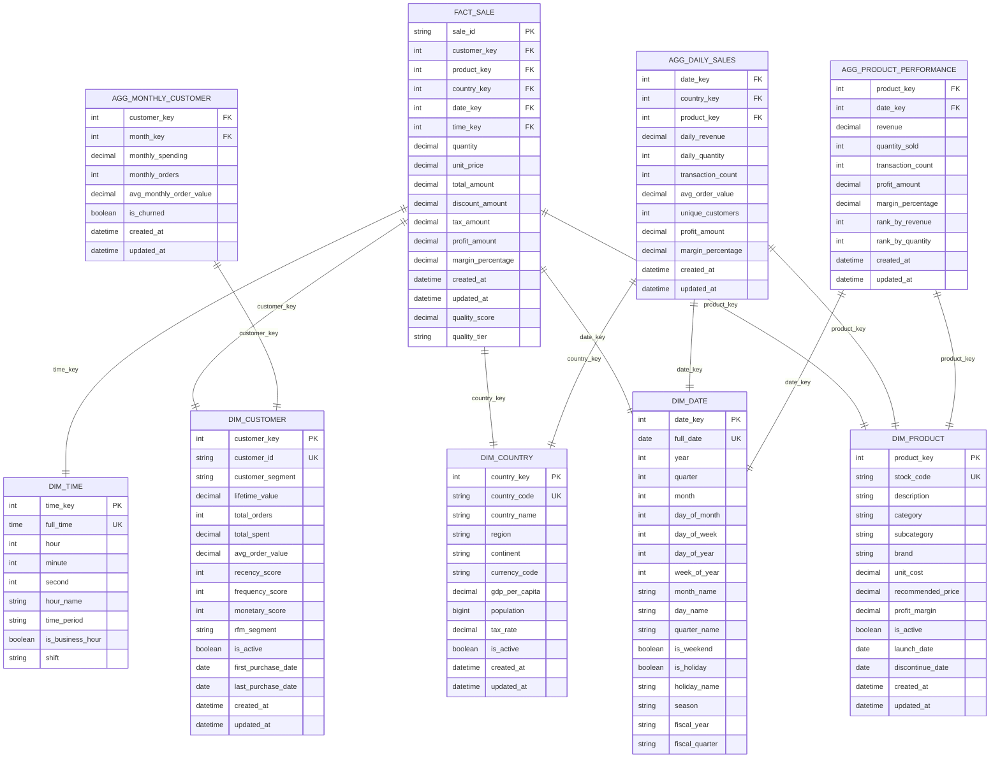

# Comprehensive ETL Pipeline Documentation: Bronze→Silver→Gold Architecture

---
title: ETL Pipeline Architecture - Medallion Lakehouse
description: Complete documentation of the Bronze→Silver→Gold ETL pipeline with Delta Lake, Spark, and dbt transformations
audience: [data-engineers, platform-engineers, analytics-teams, architects]
last_updated: 2025-01-25
version: 3.0.0
owner: Data Engineering Team
reviewers: [Platform Team, Analytics Team, Architecture Team]
tags: [etl, data-pipeline, delta-lake, medallion-architecture, spark, dbt, dagster]
---

## Table of Contents

1. [Pipeline Overview](#pipeline-overview)
2. [Medallion Architecture](#medallion-architecture)
3. [Bronze Layer - Raw Data Ingestion](#bronze-layer---raw-data-ingestion)
4. [Silver Layer - Data Cleansing & Validation](#silver-layer---data-cleansing--validation)
5. [Gold Layer - Business-Ready Analytics](#gold-layer---business-ready-analytics)
6. [Data Quality Framework](#data-quality-framework)
7. [Orchestration & Scheduling](#orchestration--scheduling)
8. [Performance Optimization](#performance-optimization)
9. [Monitoring & Alerting](#monitoring--alerting)
10. [Troubleshooting Guide](#troubleshooting-guide)

## Pipeline Overview

The PwC Enterprise Data Engineering Platform implements a **medallion architecture** using **Delta Lake** as the core storage layer, providing **ACID transactions**, **time travel**, and **schema evolution** capabilities for enterprise-scale data processing.

### 🎯 Key Features

- **Multi-Engine Processing**: Apache Spark + dbt + Polars for diverse workload optimization
- **Real-Time + Batch**: Streaming ingestion with Kafka + batch processing capabilities
- **Data Quality**: Comprehensive validation with Great Expectations framework
- **Schema Evolution**: Automatic schema detection and evolution support
- **Time Travel**: Point-in-time queries and data recovery capabilities
- **Performance**: Intelligent partitioning and Z-ordering for query optimization
- **Governance**: Complete data lineage tracking and audit capabilities

### 🏗️ Overall Pipeline Architecture


### 📊 Pipeline Statistics

| Metric | Current Performance |
|--------|-------------------|
| **Daily Data Volume** | 50GB+ raw data ingestion |
| **Processing Speed** | 10M+ records/hour |
| **Latency** | <5 minutes end-to-end for streaming |
| **Availability** | 99.9% uptime SLA |
| **Data Quality** | 99.5% validation success rate |
| **Storage Efficiency** | 70% compression ratio with Delta |

## Medallion Architecture

### 🥉 Bronze Layer - Raw Data Storage

The Bronze layer serves as the **single source of truth** for all raw data, preserving data in its original format with minimal transformation.

**Key Characteristics**:
- **Schema-on-Read**: Flexible schema evolution without data reprocessing
- **Immutable**: Raw data is never modified, only appended
- **Complete History**: All data changes are preserved with timestamps
- **Multi-Format Support**: Parquet, JSON, CSV, Avro compatibility
- **Metadata Rich**: Complete lineage and audit information

### 🥈 Silver Layer - Cleaned and Validated Data

The Silver layer contains **cleaned, validated, and deduplicated** data that serves as the foundation for analytics.

**Key Characteristics**:
- **Data Quality**: Comprehensive validation and cleansing rules
- **Standardization**: Consistent formats, types, and naming conventions
- **Deduplication**: Intelligent duplicate detection and resolution
- **Schema Enforcement**: Strict schema validation with evolution support
- **Business Rules**: Initial business logic application

### 🥇 Gold Layer - Analytics-Ready Data

The Gold layer provides **business-ready, aggregated data** optimized for analytics and reporting.

**Key Characteristics**:
- **Dimensional Modeling**: Star and snowflake schema implementations
- **Pre-Aggregated**: Common business metrics and KPIs
- **Performance Optimized**: Partitioned and indexed for fast queries
- **Business Context**: Enriched with business logic and calculations
- **API Ready**: Structured for direct API consumption

## Bronze Layer - Raw Data Ingestion

### 📥 Data Ingestion Patterns


### 🔄 Streaming Data Ingestion

**Real-time data processing** with Apache Kafka and Spark Structured Streaming:

```python
# Example Spark Streaming Job for Bronze Layer
from pyspark.sql import SparkSession
from pyspark.sql.functions import *
from delta.tables import DeltaTable

def process_streaming_sales_data():
    spark = SparkSession.builder \
        .appName("SalesDataStreaming") \
        .config("spark.sql.extensions", "io.delta.sql.DeltaSparkSessionExtension") \
        .config("spark.sql.catalog.spark_catalog", "org.apache.spark.sql.delta.catalog.DeltaCatalog") \
        .getOrCreate()
    
    # Read from Kafka stream
    streaming_df = spark \
        .readStream \
        .format("kafka") \
        .option("kafka.bootstrap.servers", "kafka:9092") \
        .option("subscribe", "sales-events") \
        .option("startingOffsets", "latest") \
        .load()
    
    # Parse JSON and add metadata
    parsed_df = streaming_df.select(
        from_json(col("value").cast("string"), sales_schema).alias("data"),
        col("timestamp").alias("kafka_timestamp"),
        col("partition").alias("kafka_partition"),
        col("offset").alias("kafka_offset")
    ).select(
        col("data.*"),
        col("kafka_timestamp"),
        current_timestamp().alias("ingestion_timestamp"),
        lit("kafka-streaming").alias("ingestion_source")
    )
    
    # Write to Bronze Delta table
    query = parsed_df.writeStream \
        .format("delta") \
        .option("checkpointLocation", "/delta/checkpoints/bronze_sales") \
        .option("path", "/delta/bronze/sales") \
        .trigger(processingTime="30 seconds") \
        .outputMode("append") \
        .start()
    
    return query
```

### 📂 Batch Data Ingestion

**High-throughput batch processing** for historical data and file uploads:

```python
# Example Batch Ingestion Job
def process_batch_files(file_path: str, file_format: str):
    spark = get_spark_session()
    
    # Read source files with schema inference
    if file_format.lower() == 'csv':
        raw_df = spark.read.csv(
            file_path,
            header=True,
            inferSchema=True,
            timestampFormat="yyyy-MM-dd HH:mm:ss"
        )
    elif file_format.lower() == 'json':
        raw_df = spark.read.json(file_path)
    elif file_format.lower() == 'parquet':
        raw_df = spark.read.parquet(file_path)
    
    # Add ingestion metadata
    enriched_df = raw_df.withColumn("ingestion_timestamp", current_timestamp()) \
                       .withColumn("source_file", lit(file_path)) \
                       .withColumn("ingestion_batch_id", lit(str(uuid.uuid4()))) \
                       .withColumn("data_quality_score", lit(None).cast("double"))
    
    # Write to Bronze layer with schema evolution
    enriched_df.write \
              .format("delta") \
              .mode("append") \
              .option("mergeSchema", "true") \
              .option("path", "/delta/bronze/sales") \
              .save()
    
    # Update metadata catalog
    update_metadata_catalog(file_path, enriched_df.count(), enriched_df.schema)
```

### 🔍 Schema Registry and Evolution

**Automatic schema detection and evolution** with comprehensive tracking:

```python
class SchemaEvolutionManager:
    def __init__(self, spark_session):
        self.spark = spark_session
        self.schema_registry = {}
    
    def register_schema_evolution(self, table_path: str, new_schema: StructType):
        """Register and validate schema evolution."""
        try:
            # Read current table schema
            current_delta = DeltaTable.forPath(self.spark, table_path)
            current_schema = current_delta.toDF().schema
            
            # Analyze schema changes
            schema_diff = self.analyze_schema_changes(current_schema, new_schema)
            
            # Log schema evolution
            self.log_schema_evolution(table_path, schema_diff)
            
            # Apply compatible changes
            if schema_diff['is_compatible']:
                self.apply_schema_evolution(table_path, new_schema)
            else:
                raise SchemaEvolutionError(f"Incompatible schema change: {schema_diff['issues']}")
                
        except Exception as e:
            logger.error(f"Schema evolution failed: {e}")
            raise
    
    def analyze_schema_changes(self, old_schema: StructType, new_schema: StructType) -> dict:
        """Analyze schema changes for compatibility."""
        changes = {
            'added_fields': [],
            'removed_fields': [],
            'modified_fields': [],
            'is_compatible': True,
            'issues': []
        }
        
        old_fields = {field.name: field for field in old_schema.fields}
        new_fields = {field.name: field for field in new_schema.fields}
        
        # Check for added fields
        for field_name in new_fields:
            if field_name not in old_fields:
                changes['added_fields'].append(field_name)
        
        # Check for removed fields
        for field_name in old_fields:
            if field_name not in new_fields:
                changes['removed_fields'].append(field_name)
                changes['is_compatible'] = False
                changes['issues'].append(f"Field {field_name} removed")
        
        # Check for modified fields
        for field_name in old_fields:
            if field_name in new_fields:
                old_field = old_fields[field_name]
                new_field = new_fields[field_name]
                if old_field.dataType != new_field.dataType:
                    changes['modified_fields'].append({
                        'field': field_name,
                        'old_type': str(old_field.dataType),
                        'new_type': str(new_field.dataType)
                    })
                    # Check if type change is compatible
                    if not self.is_type_compatible(old_field.dataType, new_field.dataType):
                        changes['is_compatible'] = False
                        changes['issues'].append(f"Incompatible type change for {field_name}")
        
        return changes
```

## Silver Layer - Data Cleansing & Validation

### 🧹 Data Cleansing Pipeline

The Silver layer implements **comprehensive data cleansing** with configurable rules and quality metrics:


### ✅ Data Validation Framework

**Comprehensive validation** using Great Expectations and custom business rules:

```python
# Data Quality Validation Pipeline
from great_expectations.core import ExpectationSuite
from great_expectations.dataset import SparkDFDataset

class SilverLayerProcessor:
    def __init__(self, spark_session):
        self.spark = spark_session
        self.ge_context = self.initialize_great_expectations()
    
    def process_bronze_to_silver(self, table_name: str):
        """Main processing pipeline from Bronze to Silver."""
        
        # Read Bronze data
        bronze_df = self.spark.read.format("delta").load(f"/delta/bronze/{table_name}")
        
        # Apply data quality pipeline
        silver_df = self.apply_quality_pipeline(bronze_df, table_name)
        
        # Write to Silver layer
        self.write_to_silver(silver_df, table_name)
        
        # Generate quality report
        self.generate_quality_report(table_name, silver_df)
    
    def apply_quality_pipeline(self, df, table_name: str):
        """Apply comprehensive data quality pipeline."""
        
        # Step 1: Schema validation and standardization
        validated_df = self.validate_and_standardize_schema(df, table_name)
        
        # Step 2: Handle null values
        cleaned_df = self.handle_null_values(validated_df, table_name)
        
        # Step 3: Detect and resolve duplicates
        deduplicated_df = self.detect_and_resolve_duplicates(cleaned_df, table_name)
        
        # Step 4: Apply business rules
        business_validated_df = self.apply_business_rules(deduplicated_df, table_name)
        
        # Step 5: Calculate quality scores
        scored_df = self.calculate_quality_scores(business_validated_df, table_name)
        
        # Step 6: Add metadata
        final_df = self.add_silver_metadata(scored_df)
        
        return final_df
    
    def validate_and_standardize_schema(self, df, table_name: str):
        """Validate schema and standardize data types."""
        
        # Get expected schema for table
        expected_schema = self.get_expected_schema(table_name)
        
        # Standardize column names (lowercase, underscore)
        standardized_df = df
        for col_name in df.columns:
            standardized_name = col_name.lower().replace(' ', '_').replace('-', '_')
            if standardized_name != col_name:
                standardized_df = standardized_df.withColumnRenamed(col_name, standardized_name)
        
        # Apply type conversions
        for field in expected_schema.fields:
            if field.name in standardized_df.columns:
                standardized_df = standardized_df.withColumn(
                    field.name, 
                    col(field.name).cast(field.dataType)
                )
        
        return standardized_df
    
    def handle_null_values(self, df, table_name: str):
        """Handle null values based on business rules."""
        
        null_handling_rules = self.get_null_handling_rules(table_name)
        processed_df = df
        
        for column, rule in null_handling_rules.items():
            if rule['strategy'] == 'drop':
                processed_df = processed_df.filter(col(column).isNotNull())
            elif rule['strategy'] == 'default':
                processed_df = processed_df.fillna({column: rule['default_value']})
            elif rule['strategy'] == 'interpolate':
                processed_df = self.interpolate_values(processed_df, column, rule['method'])
            elif rule['strategy'] == 'flag':
                processed_df = processed_df.withColumn(
                    f"{column}_is_null_flag",
                    when(col(column).isNull(), True).otherwise(False)
                ).fillna({column: rule.get('default_value', 0)})
        
        return processed_df
    
    def detect_and_resolve_duplicates(self, df, table_name: str):
        """Detect and resolve duplicate records."""
        
        duplicate_rules = self.get_duplicate_rules(table_name)
        
        if not duplicate_rules:
            return df
        
        # Define key columns for duplicate detection
        key_columns = duplicate_rules.get('key_columns', [])
        resolution_strategy = duplicate_rules.get('strategy', 'keep_latest')
        
        if not key_columns:
            return df
        
        # Add row number for duplicate resolution
        window_spec = Window.partitionBy(*key_columns).orderBy(
            col("ingestion_timestamp").desc()
        )
        
        df_with_row_num = df.withColumn("row_number", row_number().over(window_spec))
        
        if resolution_strategy == 'keep_latest':
            deduplicated_df = df_with_row_num.filter(col("row_number") == 1)
        elif resolution_strategy == 'keep_first':
            window_spec_first = Window.partitionBy(*key_columns).orderBy(
                col("ingestion_timestamp").asc()
            )
            df_with_row_num = df.withColumn("row_number", row_number().over(window_spec_first))
            deduplicated_df = df_with_row_num.filter(col("row_number") == 1)
        elif resolution_strategy == 'merge':
            # Complex merge logic for combining duplicate records
            deduplicated_df = self.merge_duplicate_records(df_with_row_num, key_columns)
        else:
            deduplicated_df = df_with_row_num
        
        return deduplicated_df.drop("row_number")
    
    def apply_business_rules(self, df, table_name: str):
        """Apply business-specific validation rules."""
        
        business_rules = self.get_business_rules(table_name)
        validated_df = df
        
        for rule_name, rule_config in business_rules.items():
            try:
                if rule_config['type'] == 'range_check':
                    validated_df = self.apply_range_check(validated_df, rule_config)
                elif rule_config['type'] == 'format_validation':
                    validated_df = self.apply_format_validation(validated_df, rule_config)
                elif rule_config['type'] == 'reference_data_check':
                    validated_df = self.apply_reference_data_check(validated_df, rule_config)
                elif rule_config['type'] == 'custom_logic':
                    validated_df = self.apply_custom_logic(validated_df, rule_config)
                
                # Log rule application
                logger.info(f"Applied business rule '{rule_name}' to table '{table_name}'")
                
            except Exception as e:
                logger.error(f"Failed to apply business rule '{rule_name}': {e}")
                if rule_config.get('required', False):
                    raise
        
        return validated_df
    
    def calculate_quality_scores(self, df, table_name: str):
        """Calculate comprehensive quality scores for each record."""
        
        quality_metrics = self.get_quality_metrics_config(table_name)
        scored_df = df
        
        # Initialize quality score
        scored_df = scored_df.withColumn("quality_score", lit(100.0))
        
        # Apply quality deductions
        for metric_name, metric_config in quality_metrics.items():
            column = metric_config['column']
            deduction = metric_config['deduction']
            condition = metric_config['condition']
            
            # Apply deduction based on condition
            if condition == 'is_null':
                scored_df = scored_df.withColumn(
                    "quality_score",
                    when(col(column).isNull(), 
                         col("quality_score") - deduction)
                    .otherwise(col("quality_score"))
                )
            elif condition == 'out_of_range':
                min_val = metric_config.get('min_value')
                max_val = metric_config.get('max_value')
                if min_val is not None and max_val is not None:
                    scored_df = scored_df.withColumn(
                        "quality_score",
                        when((col(column) < min_val) | (col(column) > max_val),
                             col("quality_score") - deduction)
                        .otherwise(col("quality_score"))
                    )
        
        # Ensure score doesn't go below 0
        scored_df = scored_df.withColumn(
            "quality_score", 
            when(col("quality_score") < 0, 0.0).otherwise(col("quality_score"))
        )
        
        # Add quality tier
        scored_df = scored_df.withColumn(
            "quality_tier",
            when(col("quality_score") >= 90, "HIGH")
            .when(col("quality_score") >= 70, "MEDIUM")
            .when(col("quality_score") >= 50, "LOW")
            .otherwise("POOR")
        )
        
        return scored_df
```

### 📊 Data Quality Monitoring

**Real-time quality monitoring** with automated alerting:

```python
class DataQualityMonitor:
    def __init__(self, spark_session):
        self.spark = spark_session
        self.quality_thresholds = self.load_quality_thresholds()
    
    def monitor_silver_layer_quality(self, table_name: str):
        """Monitor data quality metrics for Silver layer."""
        
        # Read Silver layer data
        silver_df = self.spark.read.format("delta").load(f"/delta/silver/{table_name}")
        
        # Calculate quality metrics
        quality_metrics = self.calculate_quality_metrics(silver_df)
        
        # Check against thresholds
        alerts = self.check_quality_thresholds(table_name, quality_metrics)
        
        # Send alerts if needed
        if alerts:
            self.send_quality_alerts(table_name, alerts)
        
        # Store metrics for trending
        self.store_quality_metrics(table_name, quality_metrics)
        
        return quality_metrics
    
    def calculate_quality_metrics(self, df):
        """Calculate comprehensive quality metrics."""
        
        total_records = df.count()
        
        if total_records == 0:
            return {'error': 'No records found in table'}
        
        metrics = {
            'total_records': total_records,
            'timestamp': datetime.now().isoformat()
        }
        
        # Calculate completeness metrics
        for column in df.columns:
            if column not in ['quality_score', 'quality_tier']:
                null_count = df.filter(col(column).isNull()).count()
                completeness = ((total_records - null_count) / total_records) * 100
                metrics[f'{column}_completeness'] = round(completeness, 2)
        
        # Calculate quality score distribution
        quality_distribution = df.groupBy("quality_tier").count().collect()
        for row in quality_distribution:
            tier = row['quality_tier']
            count = row['count']
            percentage = (count / total_records) * 100
            metrics[f'quality_{tier.lower()}_percentage'] = round(percentage, 2)
        
        # Calculate average quality score
        avg_quality = df.agg(avg("quality_score")).collect()[0][0]
        metrics['average_quality_score'] = round(avg_quality, 2)
        
        # Calculate uniqueness metrics (for key columns)
        key_columns = self.get_key_columns_for_table(table_name)
        for key_col in key_columns:
            if key_col in df.columns:
                unique_count = df.select(key_col).distinct().count()
                uniqueness = (unique_count / total_records) * 100
                metrics[f'{key_col}_uniqueness'] = round(uniqueness, 2)
        
        return metrics
    
    def check_quality_thresholds(self, table_name: str, metrics: dict) -> list:
        """Check metrics against defined thresholds."""
        
        alerts = []
        thresholds = self.quality_thresholds.get(table_name, {})
        
        for metric_name, threshold in thresholds.items():
            if metric_name in metrics:
                actual_value = metrics[metric_name]
                
                if threshold['type'] == 'minimum':
                    if actual_value < threshold['value']:
                        alerts.append({
                            'metric': metric_name,
                            'actual': actual_value,
                            'threshold': threshold['value'],
                            'severity': threshold.get('severity', 'WARNING'),
                            'message': f"{metric_name} ({actual_value}) below threshold ({threshold['value']})"
                        })
                elif threshold['type'] == 'maximum':
                    if actual_value > threshold['value']:
                        alerts.append({
                            'metric': metric_name,
                            'actual': actual_value,
                            'threshold': threshold['value'],
                            'severity': threshold.get('severity', 'WARNING'),
                            'message': f"{metric_name} ({actual_value}) above threshold ({threshold['value']})"
                        })
        
        return alerts
```

## Gold Layer - Business-Ready Analytics

### ⭐ Star Schema Implementation

The Gold layer implements a **comprehensive star schema** optimized for analytics:



### 🔄 dbt Transformations

**SQL-first modeling** with comprehensive business logic:

```sql
-- models/marts/core/fact_sales.sql
{{ config(
    materialized='incremental',
    unique_key='sale_id',
    partition_by={
        "field": "created_at",
        "data_type": "timestamp",
        "granularity": "day"
    },
    cluster_by=['country_key', 'product_key'],
    post_hook="OPTIMIZE {{ this }} ZORDER BY (customer_key, date_key)"
) }}

WITH silver_sales AS (
    SELECT *
    FROM {{ ref('silver_sales') }}
    
        WHERE updated_at > (SELECT MAX(updated_at) FROM {{ this }})
    
),

customer_mapping AS (
    SELECT 
        customer_id,
        customer_key
    FROM {{ ref('dim_customer') }}
),

product_mapping AS (
    SELECT 
        stock_code,
        product_key
    FROM {{ ref('dim_product') }}
),

country_mapping AS (
    SELECT 
        country_name,
        country_key
    FROM {{ ref('dim_country') }}
),

date_mapping AS (
    SELECT 
        CAST(full_date AS DATE) as date_value,
        date_key
    FROM {{ ref('dim_date') }}
),

time_mapping AS (
    SELECT 
        CAST(full_time AS TIME) as time_value,
        time_key
    FROM {{ ref('dim_time') }}
),

enriched_sales AS (
    SELECT
        s.sale_id,
        COALESCE(c.customer_key, -1) as customer_key,
        p.product_key,
        co.country_key,
        d.date_key,
        t.time_key,
        s.quantity,
        s.unit_price,
        s.total_amount,
        s.discount_amount,
        s.tax_amount,
        -- Business calculations
        CASE 
            WHEN p.unit_cost IS NOT NULL AND p.unit_cost > 0 
            THEN (s.unit_price - p.unit_cost) * s.quantity
            ELSE NULL
        END as profit_amount,
        
        CASE 
            WHEN p.unit_cost IS NOT NULL AND p.unit_cost > 0 
            THEN ((s.unit_price - p.unit_cost) / s.unit_price) * 100
            ELSE NULL
        END as margin_percentage,
        
        s.created_at,
        s.updated_at,
        s.quality_score,
        s.quality_tier
        
    FROM silver_sales s
    LEFT JOIN customer_mapping c ON s.customer_id = c.customer_id
    INNER JOIN product_mapping p ON s.stock_code = p.stock_code
    INNER JOIN country_mapping co ON s.country = co.country_name
    INNER JOIN date_mapping d ON CAST(s.invoice_date AS DATE) = d.date_value
    INNER JOIN time_mapping t ON CAST(DATE_FORMAT(s.invoice_date, 'HH:mm:ss') AS TIME) = t.time_value
)

SELECT * FROM enriched_sales

-- Data quality tests

-- Test for null foreign keys
{{ dbt_utils.test_not_null('product_key') }}
{{ dbt_utils.test_not_null('country_key') }}
{{ dbt_utils.test_not_null('date_key') }}

-- Test for valid amounts
{{ dbt_utils.test_accepted_range('total_amount', min_value=0) }}
{{ dbt_utils.test_accepted_range('quantity', min_value=1) }}
{{ dbt_utils.test_accepted_range('unit_price', min_value=0) }}

-- Test for referential integrity
{{ dbt_utils.test_relationships('product_key', ref('dim_product'), 'product_key') }}
{{ dbt_utils.test_relationships('country_key', ref('dim_country'), 'country_key') }}

```

### 📊 Pre-Aggregated Analytics Tables

**High-performance aggregation tables** for common analytics patterns:

```sql
-- models/marts/analytics/agg_daily_sales_summary.sql
{{ config(
    materialized='incremental',
    unique_key=['date_key', 'country_key'],
    partition_by={
        "field": "sale_date",
        "data_type": "date",
        "granularity": "month"
    }
) }}

WITH daily_sales AS (
    SELECT 
        f.date_key,
        f.country_key,
        d.full_date as sale_date,
        c.country_name,
        c.region,
        -- Revenue metrics
        SUM(f.total_amount) as daily_revenue,
        SUM(f.profit_amount) as daily_profit,
        SUM(f.quantity) as daily_quantity,
        COUNT(*) as transaction_count,
        COUNT(DISTINCT f.customer_key) as unique_customers,
        
        -- Average metrics
        AVG(f.total_amount) as avg_order_value,
        AVG(f.unit_price) as avg_unit_price,
        AVG(f.margin_percentage) as avg_margin_percentage,
        
        -- Quality metrics
        AVG(f.quality_score) as avg_quality_score,
        SUM(CASE WHEN f.quality_tier = 'HIGH' THEN 1 ELSE 0 END) as high_quality_transactions,
        
        -- Product diversity
        COUNT(DISTINCT f.product_key) as unique_products,
        
        -- Time-based metrics
        d.day_name,
        d.is_weekend,
        d.is_holiday,
        d.season,
        
        CURRENT_TIMESTAMP() as created_at,
        CURRENT_TIMESTAMP() as updated_at
        
    FROM {{ ref('fact_sales') }} f
    INNER JOIN {{ ref('dim_date') }} d ON f.date_key = d.date_key
    INNER JOIN {{ ref('dim_country') }} c ON f.country_key = c.country_key
    
    
        WHERE d.full_date > (SELECT MAX(sale_date) FROM {{ this }})
    
    
    GROUP BY 
        f.date_key, f.country_key, d.full_date, c.country_name, c.region,
        d.day_name, d.is_weekend, d.is_holiday, d.season
),

enhanced_metrics AS (
    SELECT 
        *,
        -- Growth calculations (compared to previous day)
        daily_revenue - LAG(daily_revenue) OVER (
            PARTITION BY country_key 
            ORDER BY sale_date
        ) as revenue_growth_abs,
        
        ((daily_revenue - LAG(daily_revenue) OVER (
            PARTITION BY country_key 
            ORDER BY sale_date
        )) / NULLIF(LAG(daily_revenue) OVER (
            PARTITION BY country_key 
            ORDER BY sale_date
        ), 0)) * 100 as revenue_growth_pct,
        
        -- Moving averages (7-day)
        AVG(daily_revenue) OVER (
            PARTITION BY country_key 
            ORDER BY sale_date 
            ROWS BETWEEN 6 PRECEDING AND CURRENT ROW
        ) as revenue_7day_avg,
        
        AVG(transaction_count) OVER (
            PARTITION BY country_key 
            ORDER BY sale_date 
            ROWS BETWEEN 6 PRECEDING AND CURRENT ROW
        ) as transaction_count_7day_avg
        
    FROM daily_sales
)

SELECT * FROM enhanced_metrics
```

### 🔧 Performance Optimization

**Advanced optimization techniques** for Gold layer performance:

```python
class GoldLayerOptimizer:
    def __init__(self, spark_session):
        self.spark = spark_session
    
    def optimize_table_performance(self, table_path: str, table_name: str):
        """Apply comprehensive performance optimizations."""
        
        # Z-ORDER optimization for common query patterns
        self.apply_z_order_optimization(table_path, table_name)
        
        # Vacuum old files
        self.vacuum_table(table_path)
        
        # Update table statistics
        self.update_table_statistics(table_name)
        
        # Optimize file sizes
        self.optimize_file_sizes(table_path)
    
    def apply_z_order_optimization(self, table_path: str, table_name: str):
        """Apply Z-ORDER optimization based on query patterns."""
        
        # Get optimization configuration
        optimization_config = self.get_optimization_config(table_name)
        
        if 'z_order_columns' in optimization_config:
            z_order_columns = optimization_config['z_order_columns']
            
            # Apply Z-ORDER
            self.spark.sql(f"""
                OPTIMIZE delta.`{table_path}`
                ZORDER BY ({', '.join(z_order_columns)})
            """)
            
            logger.info(f"Applied Z-ORDER optimization on {table_name} with columns: {z_order_columns}")
    
    def vacuum_table(self, table_path: str, retention_hours: int = 168):
        """Remove old file versions to improve performance."""
        
        # Run VACUUM command
        self.spark.sql(f"""
            VACUUM delta.`{table_path}` RETAIN {retention_hours} HOURS
        """)
        
        logger.info(f"Vacuumed table at {table_path} with {retention_hours} hours retention")
    
    def optimize_file_sizes(self, table_path: str):
        """Optimize file sizes for better query performance."""
        
        # Run OPTIMIZE command to compact small files
        self.spark.sql(f"""
            OPTIMIZE delta.`{table_path}`
        """)
        
        logger.info(f"Optimized file sizes for table at {table_path}")
    
    def analyze_query_patterns(self, table_name: str) -> dict:
        """Analyze query patterns to suggest optimizations."""
        
        # This would typically query query logs/metrics
        # Simplified example:
        query_patterns = {
            'most_filtered_columns': ['country_key', 'date_key', 'product_key'],
            'most_grouped_columns': ['country_key', 'date_key'],
            'most_joined_columns': ['customer_key', 'product_key'],
            'query_volume_per_hour': 1500,
            'avg_query_latency_ms': 250
        }
        
        return query_patterns
    
    def suggest_partitioning_strategy(self, table_name: str, data_profile: dict) -> dict:
        """Suggest optimal partitioning strategy based on data profile."""
        
        suggestions = {
            'partition_columns': [],
            'cluster_columns': [],
            'z_order_columns': [],
            'reasons': []
        }
        
        # Analyze data patterns
        if data_profile.get('date_range_days', 0) > 90:
            suggestions['partition_columns'].append('date_key')
            suggestions['reasons'].append('Large date range detected - partition by date for performance')
        
        if data_profile.get('country_cardinality', 0) > 10:
            suggestions['cluster_columns'].append('country_key')
            suggestions['reasons'].append('High country cardinality - cluster by country')
        
        if data_profile.get('customer_query_frequency', 0) > 0.3:
            suggestions['z_order_columns'].append('customer_key')
            suggestions['reasons'].append('High customer query frequency - Z-order by customer')
        
        return suggestions
```

## Data Quality Framework

### 🎯 Quality Metrics & KPIs

**Comprehensive data quality tracking** with automated reporting:


### 📊 Quality Reporting Dashboard

**Executive-level quality reporting** with trend analysis:

```python
class DataQualityReporter:
    def __init__(self, spark_session):
        self.spark = spark_session
    
    def generate_quality_report(self, start_date: str, end_date: str) -> dict:
        """Generate comprehensive data quality report."""
        
        report = {
            'report_period': f"{start_date} to {end_date}",
            'generated_at': datetime.now().isoformat(),
            'overall_quality': {},
            'layer_quality': {},
            'trend_analysis': {},
            'issues_summary': {},
            'recommendations': []
        }
        
        # Overall quality metrics
        report['overall_quality'] = self.calculate_overall_quality_metrics(start_date, end_date)
        
        # Layer-specific quality
        for layer in ['bronze', 'silver', 'gold']:
            report['layer_quality'][layer] = self.calculate_layer_quality_metrics(
                layer, start_date, end_date
            )
        
        # Trend analysis
        report['trend_analysis'] = self.analyze_quality_trends(start_date, end_date)
        
        # Issues summary
        report['issues_summary'] = self.summarize_quality_issues(start_date, end_date)
        
        # Generate recommendations
        report['recommendations'] = self.generate_quality_recommendations(report)
        
        return report
    
    def calculate_overall_quality_metrics(self, start_date: str, end_date: str) -> dict:
        """Calculate overall data quality metrics across all layers."""
        
        # Query quality metrics from monitoring tables
        quality_query = f"""
            SELECT 
                COUNT(*) as total_records_processed,
                AVG(quality_score) as avg_quality_score,
                SUM(CASE WHEN quality_tier = 'HIGH' THEN 1 ELSE 0 END) * 100.0 / COUNT(*) as high_quality_percentage,
                SUM(CASE WHEN quality_tier = 'POOR' THEN 1 ELSE 0 END) * 100.0 / COUNT(*) as poor_quality_percentage,
                COUNT(DISTINCT processing_date) as processing_days,
                AVG(processing_time_seconds) as avg_processing_time
            FROM data_quality_metrics 
            WHERE processing_date BETWEEN '{start_date}' AND '{end_date}'
        """
        
        result = self.spark.sql(quality_query).collect()[0]
        
        return {
            'total_records_processed': result['total_records_processed'],
            'average_quality_score': round(result['avg_quality_score'], 2),
            'high_quality_percentage': round(result['high_quality_percentage'], 2),
            'poor_quality_percentage': round(result['poor_quality_percentage'], 2),
            'processing_days': result['processing_days'],
            'average_processing_time_seconds': round(result['avg_processing_time'], 2)
        }
    
    def analyze_quality_trends(self, start_date: str, end_date: str) -> dict:
        """Analyze quality trends over the reporting period."""
        
        trend_query = f"""
            SELECT 
                processing_date,
                layer,
                AVG(quality_score) as daily_avg_quality,
                COUNT(*) as daily_record_count,
                SUM(CASE WHEN quality_tier = 'HIGH' THEN 1 ELSE 0 END) * 100.0 / COUNT(*) as daily_high_quality_pct
            FROM data_quality_metrics 
            WHERE processing_date BETWEEN '{start_date}' AND '{end_date}'
            GROUP BY processing_date, layer
            ORDER BY processing_date, layer
        """
        
        trend_data = self.spark.sql(trend_query).collect()
        
        trends = {
            'daily_quality_scores': [],
            'quality_improvement': 0,
            'most_improved_layer': None,
            'concerning_trends': []
        }
        
        # Process trend data
        for row in trend_data:
            trends['daily_quality_scores'].append({
                'date': row['processing_date'],
                'layer': row['layer'],
                'quality_score': round(row['daily_avg_quality'], 2),
                'record_count': row['daily_record_count'],
                'high_quality_percentage': round(row['daily_high_quality_pct'], 2)
            })
        
        # Calculate improvement trends
        if len(trends['daily_quality_scores']) >= 2:
            first_week_avg = sum(d['quality_score'] for d in trends['daily_quality_scores'][:7]) / 7
            last_week_avg = sum(d['quality_score'] for d in trends['daily_quality_scores'][-7:]) / 7
            trends['quality_improvement'] = round(last_week_avg - first_week_avg, 2)
        
        return trends
    
    def generate_quality_recommendations(self, report: dict) -> list:
        """Generate actionable quality improvement recommendations."""
        
        recommendations = []
        
        # Check overall quality score
        overall_quality = report['overall_quality']['average_quality_score']
        if overall_quality < 80:
            recommendations.append({
                'priority': 'HIGH',
                'category': 'Overall Quality',
                'issue': f'Average quality score ({overall_quality}%) is below acceptable threshold (80%)',
                'recommendation': 'Implement stricter validation rules and increase data cleansing efforts',
                'estimated_impact': 'High'
            })
        
        # Check poor quality percentage
        poor_quality_pct = report['overall_quality']['poor_quality_percentage']
        if poor_quality_pct > 5:
            recommendations.append({
                'priority': 'MEDIUM',
                'category': 'Data Cleansing',
                'issue': f'Poor quality data percentage ({poor_quality_pct}%) exceeds threshold (5%)',
                'recommendation': 'Review and enhance data validation rules, implement data quarantine process',
                'estimated_impact': 'Medium'
            })
        
        # Check processing time
        avg_processing_time = report['overall_quality']['average_processing_time_seconds']
        if avg_processing_time > 300:  # 5 minutes
            recommendations.append({
                'priority': 'LOW',
                'category': 'Performance',
                'issue': f'Average processing time ({avg_processing_time}s) is higher than expected',
                'recommendation': 'Optimize Spark jobs, review partitioning strategy, consider resource scaling',
                'estimated_impact': 'Low'
            })
        
        # Layer-specific recommendations
        for layer, metrics in report['layer_quality'].items():
            if metrics.get('average_quality_score', 100) < 85:
                recommendations.append({
                    'priority': 'MEDIUM',
                    'category': f'{layer.title()} Layer',
                    'issue': f'{layer.title()} layer quality score below threshold',
                    'recommendation': f'Focus quality improvement efforts on {layer} layer transformations',
                    'estimated_impact': 'Medium'
                })
        
        return recommendations
```

## Orchestration & Scheduling

### 🎼 Dagster Asset-Based Pipeline

**Modern orchestration** with comprehensive asset lineage:

```python
# assets/bronze_layer_assets.py
from dagster import asset, AssetIn, Output, MetadataValue
from dagster_spark import spark_resource
import pandas as pd

@asset(
    group_name="bronze_layer",
    compute_kind="spark",
    description="Raw sales data ingested from multiple sources"
)
def bronze_sales_data(context, spark: SparkSession) -> Output[None]:
    """Ingest raw sales data into Bronze layer."""
    
    # Configuration
    source_path = context.op_config.get("source_path", "/data/raw/sales/")
    bronze_path = context.op_config.get("bronze_path", "/delta/bronze/sales")
    
    # Read source data
    raw_df = spark.read.option("multiline", "true").json(source_path)
    
    # Add ingestion metadata
    enriched_df = raw_df.withColumn("ingestion_timestamp", current_timestamp()) \
                       .withColumn("source_system", lit("file_upload")) \
                       .withColumn("ingestion_batch_id", lit(str(uuid.uuid4())))
    
    # Write to Bronze layer
    enriched_df.write.format("delta").mode("append").save(bronze_path)
    
    # Calculate metrics
    record_count = enriched_df.count()
    schema_fields = len(enriched_df.schema.fields)
    
    return Output(
        value=None,
        metadata={
            "records_ingested": record_count,
            "schema_fields": schema_fields,
            "source_path": MetadataValue.path(source_path),
            "bronze_path": MetadataValue.path(bronze_path)
        }
    )

@asset(
    ins={"bronze_sales": AssetIn("bronze_sales_data")},
    group_name="silver_layer",
    compute_kind="spark",
    description="Cleaned and validated sales data"
)
def silver_sales_data(context, spark: SparkSession, bronze_sales) -> Output[None]:
    """Transform Bronze sales data to Silver layer."""
    
    bronze_path = "/delta/bronze/sales"
    silver_path = "/delta/silver/sales"
    
    # Initialize processor
    processor = SilverLayerProcessor(spark)
    
    # Process Bronze to Silver
    processor.process_bronze_to_silver("sales")
    
    # Calculate quality metrics
    silver_df = spark.read.format("delta").load(silver_path)
    quality_metrics = processor.calculate_quality_metrics(silver_df)
    
    return Output(
        value=None,
        metadata={
            "records_processed": quality_metrics.get("total_records", 0),
            "average_quality_score": quality_metrics.get("average_quality_score", 0),
            "high_quality_percentage": quality_metrics.get("quality_HIGH_percentage", 0),
            "processing_timestamp": MetadataValue.timestamp(datetime.now())
        }
    )

@asset(
    ins={"silver_sales": AssetIn("silver_sales_data")},
    group_name="gold_layer",
    compute_kind="dbt",
    description="Business-ready dimensional data"
)
def gold_sales_fact(context, silver_sales) -> Output[None]:
    """Transform Silver sales data to Gold fact table using dbt."""
    
    # Run dbt model
    dbt_result = context.resources.dbt.run(models=["fact_sales"])
    
    # Extract metrics from dbt results
    if dbt_result.success:
        # Get model metadata
        model_result = dbt_result.results[0]
        
        return Output(
            value=None,
            metadata={
                "dbt_model": "fact_sales",
                "execution_time": model_result.execution_time,
                "status": "success",
                "rows_affected": getattr(model_result, 'rows_affected', 0)
            }
        )
    else:
        raise Exception(f"dbt model execution failed: {dbt_result.results}")

# Job definitions
from dagster import job, op, schedule, DefaultScheduleStatus

@job(
    resource_defs={
        "spark": spark_resource,
        "dbt": dbt_resource
    },
    config={
        "ops": {
            "bronze_sales_data": {
                "config": {
                    "source_path": "/data/raw/sales/",
                    "bronze_path": "/delta/bronze/sales"
                }
            }
        }
    }
)
def sales_data_pipeline():
    """Complete sales data pipeline from Bronze to Gold."""
    gold_sales_fact(silver_sales_data(bronze_sales_data()))

@schedule(
    job=sales_data_pipeline,
    cron_schedule="0 2 * * *",  # Daily at 2 AM
    default_status=DefaultScheduleStatus.RUNNING
)
def daily_sales_pipeline_schedule(context):
    """Daily execution of the sales data pipeline."""
    return {}

# Sensors for real-time processing
from dagster import sensor, RunRequest, SkipReason
import os

@sensor(job=sales_data_pipeline)
def new_sales_file_sensor(context):
    """Sensor to trigger pipeline when new sales files arrive."""
    
    watch_directory = "/data/incoming/sales/"
    processed_directory = "/data/processed/sales/"
    
    new_files = []
    
    if os.path.exists(watch_directory):
        for filename in os.listdir(watch_directory):
            file_path = os.path.join(watch_directory, filename)
            processed_path = os.path.join(processed_directory, filename)
            
            # Check if file is new (not yet processed)
            if os.path.isfile(file_path) and not os.path.exists(processed_path):
                new_files.append(filename)
    
    if new_files:
        # Create run request for each new file
        for filename in new_files:
            yield RunRequest(
                run_key=f"file_{filename}_{datetime.now().timestamp()}",
                run_config={
                    "ops": {
                        "bronze_sales_data": {
                            "config": {
                                "source_path": os.path.join(watch_directory, filename),
                                "bronze_path": "/delta/bronze/sales"
                            }
                        }
                    }
                },
                tags={"file_name": filename}
            )
    else:
        yield SkipReason("No new files detected")
```

### ⏰ Scheduling Strategy

**Multi-level scheduling** for different data processing patterns:


## Performance Optimization

### ⚡ Query Optimization Techniques

**Advanced optimization strategies** for maximum performance:

```python
class QueryOptimizer:
    def __init__(self, spark_session):
        self.spark = spark_session
    
    def optimize_spark_configuration(self):
        """Apply optimal Spark configuration for data processing."""
        
        # Adaptive Query Execution
        self.spark.conf.set("spark.sql.adaptive.enabled", "true")
        self.spark.conf.set("spark.sql.adaptive.coalescePartitions.enabled", "true")
        self.spark.conf.set("spark.sql.adaptive.skewJoin.enabled", "true")
        
        # Dynamic partition pruning
        self.spark.conf.set("spark.sql.optimizer.dynamicPartitionPruning.enabled", "true")
        
        # Broadcast join optimization
        self.spark.conf.set("spark.sql.autoBroadcastJoinThreshold", "100MB")
        
        # Memory optimization
        self.spark.conf.set("spark.sql.execution.arrow.pyspark.enabled", "true")
        self.spark.conf.set("spark.serializer", "org.apache.spark.serializer.KryoSerializer")
        
        # Delta Lake optimizations
        self.spark.conf.set("spark.sql.extensions", "io.delta.sql.DeltaSparkSessionExtension")
        self.spark.conf.set("spark.sql.catalog.spark_catalog", "org.apache.spark.sql.delta.catalog.DeltaCatalog")
        
        logger.info("Applied optimized Spark configuration")
    
    def analyze_query_plan(self, sql_query: str) -> dict:
        """Analyze query execution plan for optimization opportunities."""
        
        # Get physical plan
        df = self.spark.sql(sql_query)
        physical_plan = df._jdf.queryExecution().executedPlan().toString()
        
        # Parse plan for optimization opportunities
        analysis = {
            'has_broadcast_join': 'BroadcastHashJoin' in physical_plan,
            'has_sort_merge_join': 'SortMergeJoin' in physical_plan,
            'has_partition_pruning': 'PartitionFilters' in physical_plan,
            'scan_operations': physical_plan.count('Scan'),
            'exchange_operations': physical_plan.count('Exchange'),
            'recommendations': []
        }
        
        # Generate recommendations
        if analysis['exchange_operations'] > 3:
            analysis['recommendations'].append({
                'type': 'performance',
                'message': 'High number of shuffle operations detected. Consider repartitioning or bucketing.',
                'priority': 'HIGH'
            })
        
        if not analysis['has_partition_pruning'] and 'WHERE' in sql_query.upper():
            analysis['recommendations'].append({
                'type': 'partitioning',
                'message': 'Partition pruning not detected. Ensure partition columns are used in WHERE clause.',
                'priority': 'MEDIUM'
            })
        
        return analysis
    
    def suggest_partitioning_strategy(self, table_name: str, query_patterns: list) -> dict:
        """Suggest optimal partitioning strategy based on query patterns."""
        
        partitioning_analysis = {
            'recommended_partition_columns': [],
            'recommended_clustering_columns': [],
            'reasoning': []
        }
        
        # Analyze common WHERE clauses
        where_columns = {}
        for pattern in query_patterns:
            if 'where_columns' in pattern:
                for col in pattern['where_columns']:
                    where_columns[col] = where_columns.get(col, 0) + pattern.get('frequency', 1)
        
        # Sort by frequency
        sorted_where_columns = sorted(where_columns.items(), key=lambda x: x[1], reverse=True)
        
        # Recommend partition columns (top 1-2 most filtered columns)
        for col, frequency in sorted_where_columns[:2]:
            if frequency > len(query_patterns) * 0.3:  # Used in >30% of queries
                partitioning_analysis['recommended_partition_columns'].append(col)
                partitioning_analysis['reasoning'].append(
                    f"Column '{col}' is filtered in {frequency} queries ({frequency/len(query_patterns)*100:.1f}%)"
                )
        
        # Recommend clustering columns (next most common columns)
        for col, frequency in sorted_where_columns[2:5]:
            if frequency > len(query_patterns) * 0.2:  # Used in >20% of queries
                partitioning_analysis['recommended_clustering_columns'].append(col)
        
        return partitioning_analysis
```

### 📊 Caching Strategy

**Multi-tier caching** for optimal performance:

```python
class CachingManager:
    def __init__(self, spark_session, redis_client):
        self.spark = spark_session
        self.redis = redis_client
        self.cache_stats = {}
    
    def implement_caching_strategy(self, table_name: str, access_patterns: dict):
        """Implement optimal caching strategy based on access patterns."""
        
        strategy = self.determine_cache_strategy(access_patterns)
        
        if strategy['spark_cache']:
            self.enable_spark_caching(table_name, strategy['cache_level'])
        
        if strategy['redis_cache']:
            self.setup_redis_caching(table_name, strategy['ttl'])
        
        if strategy['delta_cache']:
            self.enable_delta_caching(table_name)
    
    def determine_cache_strategy(self, access_patterns: dict) -> dict:
        """Determine optimal caching strategy based on access patterns."""
        
        query_frequency = access_patterns.get('queries_per_hour', 0)
        data_size_mb = access_patterns.get('data_size_mb', 0)
        update_frequency = access_patterns.get('updates_per_day', 0)
        
        strategy = {
            'spark_cache': False,
            'redis_cache': False,
            'delta_cache': False,
            'cache_level': None,
            'ttl': None
        }
        
        # High query frequency and reasonable size
        if query_frequency > 100 and data_size_mb < 1000:
            strategy['spark_cache'] = True
            strategy['cache_level'] = 'MEMORY_AND_DISK_SER'
        
        # Very high query frequency, small data, low update frequency
        if query_frequency > 500 and data_size_mb < 100 and update_frequency < 10:
            strategy['redis_cache'] = True
            strategy['ttl'] = 3600  # 1 hour
        
        # Large frequently accessed data
        if query_frequency > 50 and data_size_mb > 1000:
            strategy['delta_cache'] = True
        
        return strategy
    
    def enable_spark_caching(self, table_name: str, cache_level: str):
        """Enable Spark DataFrame caching with specified storage level."""
        
        from pyspark import StorageLevel
        
        storage_levels = {
            'MEMORY_ONLY': StorageLevel.MEMORY_ONLY,
            'MEMORY_AND_DISK': StorageLevel.MEMORY_AND_DISK,
            'MEMORY_AND_DISK_SER': StorageLevel.MEMORY_AND_DISK_SER,
            'DISK_ONLY': StorageLevel.DISK_ONLY
        }
        
        df = self.spark.table(table_name)
        df.persist(storage_levels.get(cache_level, StorageLevel.MEMORY_AND_DISK_SER))
        
        # Trigger caching
        count = df.count()
        
        logger.info(f"Enabled Spark caching for {table_name} with level {cache_level}. Cached {count} records.")
    
    def monitor_cache_performance(self) -> dict:
        """Monitor cache performance and provide optimization suggestions."""
        
        # Get Spark cache metrics
        spark_metrics = self.get_spark_cache_metrics()
        
        # Get Redis cache metrics
        redis_metrics = self.get_redis_cache_metrics()
        
        performance_report = {
            'spark_cache': spark_metrics,
            'redis_cache': redis_metrics,
            'optimization_suggestions': []
        }
        
        # Generate optimization suggestions
        if spark_metrics.get('cache_hit_ratio', 0) < 0.7:
            performance_report['optimization_suggestions'].append({
                'type': 'spark_cache',
                'message': 'Spark cache hit ratio is low. Consider adjusting cache size or storage level.',
                'current_hit_ratio': spark_metrics.get('cache_hit_ratio', 0)
            })
        
        if redis_metrics.get('memory_usage_percent', 0) > 80:
            performance_report['optimization_suggestions'].append({
                'type': 'redis_cache',
                'message': 'Redis memory usage is high. Consider implementing LRU eviction or increasing memory.',
                'current_usage': redis_metrics.get('memory_usage_percent', 0)
            })
        
        return performance_report
```

---

This comprehensive ETL pipeline documentation provides enterprise-grade guidance for implementing and maintaining the Bronze→Silver→Gold medallion architecture with Delta Lake, ensuring data quality, performance, and operational excellence.

For implementation details and code examples, refer to the source code in the `/src/etl/` directory and dbt models in `/dbt/models/`.

---

**Next Steps**: Review the [Monitoring & Alerting Guide](../monitoring/COMPREHENSIVE_MONITORING_GUIDE.md) and [Performance Tuning Best Practices](../operations/PERFORMANCE_TUNING_GUIDE.md).