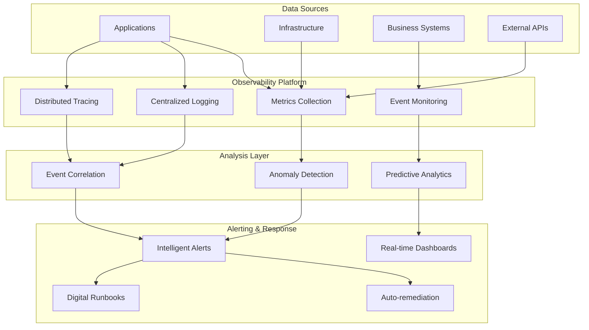
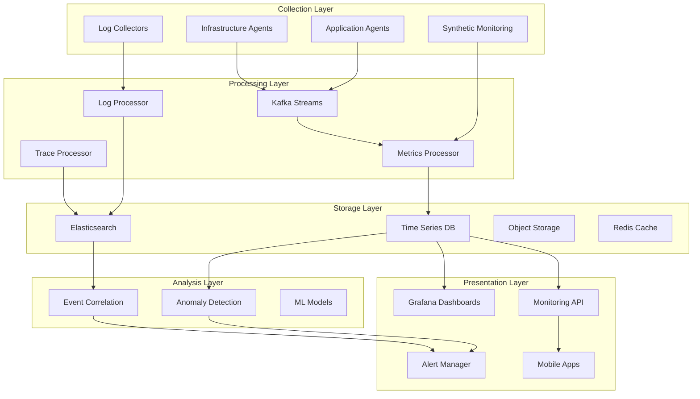

# Comprehensive Monitoring and Observability Guide

---
title: Enterprise Monitoring and Observability Strategy
description: Complete guide to monitoring, alerting, and observability for the enterprise data platform
audience: [operators, sre, developers, analysts]
last_updated: 2025-01-25
version: 2.0.0
owner: SRE Team
reviewers: [Platform Team, Security Team, Architecture Team]
tags: [monitoring, observability, metrics, alerts, dashboards, sre, operations]
---

## Table of Contents

1. [Overview](#overview)
2. [Monitoring Architecture](#monitoring-architecture)
3. [Metrics Framework](#metrics-framework)
4. [Alerting Strategy](#alerting-strategy)
5. [Dashboard System](#dashboard-system)
6. [Distributed Tracing](#distributed-tracing)
7. [Log Management](#log-management)
8. [Anomaly Detection](#anomaly-detection)
9. [Performance Monitoring](#performance-monitoring)
10. [Business Metrics](#business-metrics)
11. [SLA/SLO Management](#slaslo-management)
12. [Incident Response](#incident-response)
13. [Operational Runbooks](#operational-runbooks)

## Overview

The PwC Enterprise Data Platform implements a comprehensive monitoring and observability strategy designed to provide real-time insights into system performance, business metrics, and operational health. The platform combines traditional metrics monitoring with ML-powered anomaly detection and intelligent alerting.

### Observability Pillars



### Key Features

- **Real-time Metrics Collection**: 30-second granularity for critical metrics
- **ML-Powered Anomaly Detection**: Statistical analysis with confidence scoring
- **Intelligent Alerting**: Context-aware alerts with auto-resolution
- **Interactive Dashboards**: Role-based dashboards with real-time updates
- **Distributed Tracing**: End-to-end request tracing across microservices
- **Business Intelligence**: KPI tracking and business health monitoring
- **Predictive Analytics**: Capacity planning and performance forecasting

## Monitoring Architecture

### High-Level Architecture



### Technology Stack

| Component | Technology | Purpose |
|-----------|------------|---------|
| **Metrics Collection** | Custom Python agents, Prometheus exporters | Application and infrastructure metrics |
| **Log Collection** | Fluentd, Logstash | Centralized log aggregation |
| **Time Series DB** | InfluxDB, Prometheus | Metrics storage and querying |
| **Search Engine** | Elasticsearch | Log storage and search |
| **Message Queue** | Apache Kafka | Real-time data streaming |
| **Caching** | Redis | Dashboard and query caching |
| **Dashboards** | Custom React dashboards, Grafana | Visualization and monitoring |
| **Alerting** | Custom alert manager | Intelligent alert routing |
| **Tracing** | OpenTelemetry, Jaeger | Distributed request tracing |

## Metrics Framework

### Metric Categories

#### 1. Infrastructure Metrics

```python
# System metrics collection
async def collect_system_metrics():
    await collector.record_metric(MetricPoint(
        name="cpu_usage",
        value=psutil.cpu_percent(),
        timestamp=datetime.now(),
        labels={"host": socket.gethostname(), "environment": "production"},
        metric_type=MetricType.GAUGE
    ))
    
    await collector.record_metric(MetricPoint(
        name="memory_usage",
        value=psutil.virtual_memory().percent,
        timestamp=datetime.now(),
        labels={"host": socket.gethostname()},
        metric_type=MetricType.GAUGE
    ))
    
    await collector.record_metric(MetricPoint(
        name="disk_usage",
        value=psutil.disk_usage('/').percent,
        timestamp=datetime.now(),
        labels={"host": socket.gethostname(), "mount": "/"},
        metric_type=MetricType.GAUGE
    ))
```

#### 2. Application Metrics

```python
# API performance metrics
@app.middleware("http")
async def metrics_middleware(request: Request, call_next):
    start_time = time.time()
    
    response = await call_next(request)
    
    duration = time.time() - start_time
    
    # Record response time
    await metrics_collector.record_metric(MetricPoint(
        name="api_response_time",
        value=duration * 1000,  # Convert to milliseconds
        labels={
            "method": request.method,
            "endpoint": str(request.url.path),
            "status_code": str(response.status_code)
        },
        metric_type=MetricType.HISTOGRAM
    ))
    
    # Record request count
    await metrics_collector.record_metric(MetricPoint(
        name="api_request_count",
        value=1,
        labels={
            "method": request.method,
            "endpoint": str(request.url.path),
            "status_code": str(response.status_code)
        },
        metric_type=MetricType.COUNTER
    ))
    
    return response
```

#### 3. Business Metrics

```python
# Business KPI metrics
async def track_business_metrics():
    # Revenue metrics
    daily_revenue = await calculate_daily_revenue()
    await collector.record_metric(MetricPoint(
        name="daily_revenue",
        value=daily_revenue,
        labels={"currency": "USD", "region": "north_america"},
        metric_type=MetricType.GAUGE
    ))
    
    # Customer metrics
    active_users = await get_active_user_count()
    await collector.record_metric(MetricPoint(
        name="active_users",
        value=active_users,
        labels={"platform": "web"},
        metric_type=MetricType.GAUGE
    ))
    
    # Data processing metrics
    records_processed = await get_etl_processed_count()
    await collector.record_metric(MetricPoint(
        name="etl_records_processed",
        value=records_processed,
        labels={"pipeline": "sales_etl", "status": "success"},
        metric_type=MetricType.COUNTER
    ))
```

### Metric Standards

#### Naming Conventions

| Pattern | Example | Usage |
|---------|---------|-------|
| `<service>_<metric_type>_<unit>` | `api_response_time_ms` | Service-specific metrics |
| `<domain>_<metric>_<unit>` | `sales_revenue_usd` | Business domain metrics |
| `<system>_<resource>_<metric>` | `cpu_usage_percent` | Infrastructure metrics |

#### Label Standards

```python
# Required labels for all metrics
REQUIRED_LABELS = {
    "service": "service_name",       # Which service generated the metric
    "environment": "production",     # Environment (dev/staging/prod)
    "version": "2.1.0",             # Application version
    "region": "us-east-1"           # Geographic region
}

# Optional but recommended labels
RECOMMENDED_LABELS = {
    "instance_id": "api-server-1",   # Instance identifier
    "datacenter": "aws-us-east-1a",  # Datacenter/AZ
    "component": "database",         # Component within service
    "customer_tier": "premium"       # Business context
}
```

## Alerting Strategy

### Alert Severity Levels

| Severity | Response Time | Escalation | Example |
|----------|---------------|------------|---------|
| **Critical** | Immediate (0-15 min) | Page on-call + management | Service completely down |
| **Error** | 30 minutes | Page on-call | High error rate (>5%) |
| **Warning** | 2 hours | Email + Slack | High response time |
| **Info** | 24 hours | Email only | Deployment completed |

### Alert Rules Configuration

```python
# Critical system alerts
CRITICAL_ALERTS = [
    Alert(
        alert_id="service_down",
        name="Service Completely Down",
        description="Service is not responding to health checks",
        severity=AlertSeverity.CRITICAL,
        metric_name="service_health_check",
        condition="== 0",
        threshold=0,
        duration_seconds=60,
        actions=["pagerduty", "slack", "email"]
    ),
    Alert(
        alert_id="high_error_rate",
        name="High API Error Rate",
        description="API error rate above 5% for 5 minutes",
        severity=AlertSeverity.ERROR,
        metric_name="api_error_rate",
        condition="> 5",
        threshold=5.0,
        duration_seconds=300,
        actions=["pagerduty", "slack"]
    )
]

# Performance alerts
PERFORMANCE_ALERTS = [
    Alert(
        alert_id="high_response_time",
        name="High API Response Time",
        description="95th percentile response time above 1000ms",
        severity=AlertSeverity.WARNING,
        metric_name="api_response_time_p95",
        condition="> 1000",
        threshold=1000.0,
        duration_seconds=300,
        actions=["slack", "email"]
    ),
    Alert(
        alert_id="high_cpu_usage",
        name="High CPU Usage",
        description="CPU usage above 80% for 10 minutes",
        severity=AlertSeverity.WARNING,
        metric_name="cpu_usage",
        condition="> 80",
        threshold=80.0,
        duration_seconds=600,
        actions=["slack", "email"]
    )
]

# Business alerts
BUSINESS_ALERTS = [
    Alert(
        alert_id="revenue_drop",
        name="Significant Revenue Drop",
        description="Daily revenue 20% below 7-day average",
        severity=AlertSeverity.ERROR,
        metric_name="daily_revenue_change",
        condition="< -20",
        threshold=-20.0,
        duration_seconds=3600,
        actions=["email", "business_slack"]
    )
]
```

### Intelligent Alerting Features

#### 1. Alert Correlation

```python
class AlertCorrelationEngine:
    async def correlate_alerts(self, new_alert: AlertInstance) -> List[AlertInstance]:
        """Correlate new alert with existing alerts to reduce noise"""
        
        # Time-based correlation (alerts within 5 minutes)
        time_window = timedelta(minutes=5)
        recent_alerts = await self.get_recent_alerts(time_window)
        
        correlated_alerts = []
        
        for alert in recent_alerts:
            # Service correlation
            if (alert.metadata.get("service") == new_alert.metadata.get("service")):
                correlated_alerts.append(alert)
            
            # Dependency correlation
            if await self.are_services_related(alert.service, new_alert.service):
                correlated_alerts.append(alert)
            
            # Symptom correlation (e.g., high CPU + high response time)
            if await self.are_symptoms_related(alert.metric_name, new_alert.metric_name):
                correlated_alerts.append(alert)
        
        return correlated_alerts

    async def should_suppress_alert(self, alert: AlertInstance, 
                                  correlated_alerts: List[AlertInstance]) -> bool:
        """Determine if alert should be suppressed due to correlation"""
        
        # Suppress if higher severity alert already active
        for corr_alert in correlated_alerts:
            if (corr_alert.severity.value > alert.severity.value and 
                corr_alert.resolved_at is None):
                return True
        
        # Suppress if this is a known downstream effect
        if await self.is_downstream_effect(alert, correlated_alerts):
            return True
        
        return False
```

#### 2. Adaptive Thresholds

```python
class AdaptiveThresholdManager:
    def __init__(self):
        self.baseline_window = timedelta(days=7)
        self.seasonal_patterns = {}
    
    async def calculate_adaptive_threshold(self, metric_name: str, 
                                         base_threshold: float) -> float:
        """Calculate adaptive threshold based on historical patterns"""
        
        # Get historical data
        historical_data = await self.get_historical_data(
            metric_name, 
            self.baseline_window
        )
        
        if len(historical_data) < 100:  # Not enough data
            return base_threshold
        
        # Detect seasonal patterns
        seasonal_factor = await self.detect_seasonal_pattern(
            metric_name, 
            historical_data
        )
        
        # Calculate statistical threshold
        mean = statistics.mean(historical_data)
        std_dev = statistics.stdev(historical_data)
        
        # Adaptive threshold = mean + (2 * std_dev * seasonal_factor)
        adaptive_threshold = mean + (2 * std_dev * seasonal_factor)
        
        # Ensure threshold is within reasonable bounds
        min_threshold = base_threshold * 0.5
        max_threshold = base_threshold * 2.0
        
        return max(min_threshold, min(adaptive_threshold, max_threshold))
```

### Alert Notification Channels

#### 1. PagerDuty Integration

```python
async def send_pagerduty_alert(alert_instance: AlertInstance, alert: Alert):
    """Send alert to PagerDuty for critical issues"""
    
    incident_data = {
        "routing_key": PAGERDUTY_INTEGRATION_KEY,
        "event_action": "trigger",
        "dedup_key": f"alert_{alert_instance.alert_id}",
        "payload": {
            "summary": alert_instance.message,
            "severity": alert.severity.value,
            "source": alert.metric_name,
            "component": alert.metadata.get("service", "unknown"),
            "group": alert.metadata.get("component", "platform"),
            "class": alert.metadata.get("alert_type", "metric"),
            "custom_details": {
                "alert_id": alert_instance.alert_id,
                "current_value": alert_instance.current_value,
                "threshold": alert.threshold,
                "duration": alert.duration_seconds,
                "runbook": f"https://runbooks.pwc.com/{alert.alert_id}"
            }
        },
        "client": "PWC Data Platform",
        "client_url": f"https://dashboard.pwc.com/alerts/{alert_instance.instance_id}"
    }
    
    async with httpx.AsyncClient() as client:
        response = await client.post(
            "https://events.pagerduty.com/v2/enqueue",
            json=incident_data,
            timeout=10.0
        )
        response.raise_for_status()
```

#### 2. Slack Integration

```python
async def send_slack_alert(alert_instance: AlertInstance, alert: Alert):
    """Send alert to Slack channel"""
    
    # Determine color based on severity
    color_map = {
        AlertSeverity.CRITICAL: "#FF0000",
        AlertSeverity.ERROR: "#FF8800",
        AlertSeverity.WARNING: "#FFCC00",
        AlertSeverity.INFO: "#0099FF"
    }
    
    blocks = [
        {
            "type": "header",
            "text": {
                "type": "plain_text",
                "text": f"🚨 {alert.severity.value.upper()}: {alert.name}"
            }
        },
        {
            "type": "section",
            "fields": [
                {"type": "mrkdwn", "text": f"*Service:* {alert.metadata.get('service', 'N/A')}"},
                {"type": "mrkdwn", "text": f"*Current Value:* {alert_instance.current_value}"},
                {"type": "mrkdwn", "text": f"*Threshold:* {alert.threshold}"},
                {"type": "mrkdwn", "text": f"*Duration:* {alert.duration_seconds}s"}
            ]
        },
        {
            "type": "section",
            "text": {
                "type": "mrkdwn",
                "text": f"*Description:* {alert.description}"
            }
        },
        {
            "type": "actions",
            "elements": [
                {
                    "type": "button",
                    "text": {"type": "plain_text", "text": "View Dashboard"},
                    "url": f"https://dashboard.pwc.com/alerts/{alert_instance.instance_id}"
                },
                {
                    "type": "button", 
                    "text": {"type": "plain_text", "text": "View Runbook"},
                    "url": f"https://runbooks.pwc.com/{alert.alert_id}"
                }
            ]
        }
    ]
    
    message = {
        "channel": SLACK_ALERTS_CHANNEL,
        "attachments": [{
            "color": color_map[alert.severity],
            "blocks": blocks
        }]
    }
    
    await slack_client.send_message(message)
```

## Dashboard System

### Dashboard Architecture

The platform provides role-based dashboards with real-time updates and interactive visualizations.

#### Dashboard Categories

1. **Executive Dashboards**
   - Business KPIs and health overview
   - Revenue and customer metrics
   - High-level system status

2. **Operational Dashboards**
   - System performance and health
   - Alert status and trends
   - Capacity utilization

3. **Development Dashboards**
   - Application performance metrics
   - Error rates and debugging info
   - Deployment and release metrics

4. **Business Intelligence Dashboards**
   - Sales analytics and trends
   - Customer behavior analysis
   - Product performance metrics

### Dashboard Widgets

#### 1. Metric Cards

```typescript
interface MetricCardWidget {
    id: string;
    title: string;
    metric_name: string;
    display_format: 'number' | 'percentage' | 'currency' | 'duration';
    comparison: {
        enabled: boolean;
        period: 'previous_period' | 'same_period_last_year';
        show_trend: boolean;
    };
    thresholds: {
        warning: number;
        critical: number;
    };
}

// Example configuration
const cpuUsageCard: MetricCardWidget = {
    id: 'cpu_usage_card',
    title: 'CPU Usage',
    metric_name: 'cpu_usage',
    display_format: 'percentage',
    comparison: {
        enabled: true,
        period: 'previous_period',
        show_trend: true
    },
    thresholds: {
        warning: 70,
        critical: 85
    }
};
```

#### 2. Time Series Charts

```typescript
interface TimeSeriesWidget {
    id: string;
    title: string;
    chart_type: 'line' | 'area' | 'bar';
    metrics: string[];
    time_range: string;
    aggregation: 'avg' | 'sum' | 'max' | 'min' | 'p95' | 'p99';
    y_axis: {
        min?: number;
        max?: number;
        unit: string;
    };
}

// Example configuration
const responseTimeChart: TimeSeriesWidget = {
    id: 'response_time_chart',
    title: 'API Response Time (95th Percentile)',
    chart_type: 'line',
    metrics: ['api_response_time_p95'],
    time_range: '6h',
    aggregation: 'p95',
    y_axis: {
        min: 0,
        unit: 'ms'
    }
};
```

#### 3. Alert Summary Widgets

```typescript
interface AlertSummaryWidget {
    id: string;
    title: string;
    severity_filter: AlertSeverity[];
    time_range: string;
    max_items: number;
    group_by: 'service' | 'severity' | 'none';
}

const activeAlertsWidget: AlertSummaryWidget = {
    id: 'active_alerts',
    title: 'Active Alerts',
    severity_filter: [AlertSeverity.CRITICAL, AlertSeverity.ERROR],
    time_range: '24h',
    max_items: 10,
    group_by: 'severity'
};
```

### Real-time Updates

#### WebSocket Integration

```javascript
// Dashboard WebSocket connection
class DashboardWebSocket {
    constructor(dashboardId, widgets) {
        this.dashboardId = dashboardId;
        this.widgets = widgets;
        this.ws = null;
        this.reconnectAttempts = 0;
        this.maxReconnectAttempts = 5;
    }
    
    connect() {
        const wsUrl = `wss://api.pwc-data.com/api/v1/monitoring/dashboard/${this.dashboardId}/realtime`;
        this.ws = new WebSocket(wsUrl);
        
        this.ws.onopen = () => {
            console.log(`Connected to dashboard ${this.dashboardId}`);
            this.reconnectAttempts = 0;
            
            // Subscribe to widget updates
            this.subscribeToWidgets();
        };
        
        this.ws.onmessage = (event) => {
            const update = JSON.parse(event.data);
            this.handleUpdate(update);
        };
        
        this.ws.onclose = () => {
            console.log(`Dashboard ${this.dashboardId} WebSocket closed`);
            this.attemptReconnect();
        };
        
        this.ws.onerror = (error) => {
            console.error(`Dashboard WebSocket error:`, error);
        };
    }
    
    subscribeToWidgets() {
        const subscription = {
            action: 'subscribe',
            widgets: this.widgets.map(w => w.id),
            update_interval: 5000
        };
        
        this.ws.send(JSON.stringify(subscription));
    }
    
    handleUpdate(update) {
        switch (update.type) {
            case 'widget_data_update':
                this.updateWidget(update.widget_id, update.data);
                break;
            case 'alert_triggered':
                this.showAlertNotification(update.alert);
                break;
            case 'system_status_change':
                this.updateSystemStatus(update.status);
                break;
        }
    }
    
    updateWidget(widgetId, data) {
        const widget = document.getElementById(widgetId);
        if (widget) {
            // Update widget with new data
            this.renderWidgetData(widget, data);
        }
    }
    
    attemptReconnect() {
        if (this.reconnectAttempts < this.maxReconnectAttempts) {
            this.reconnectAttempts++;
            const delay = Math.pow(2, this.reconnectAttempts) * 1000; // Exponential backoff
            
            setTimeout(() => {
                console.log(`Attempting to reconnect (${this.reconnectAttempts}/${this.maxReconnectAttempts})`);
                this.connect();
            }, delay);
        }
    }
}
```

## Anomaly Detection

### ML-Powered Anomaly Detection Engine

The platform implements statistical anomaly detection using z-score analysis and trend detection.

#### Detection Algorithm

```python
class AdvancedAnomalyDetector:
    def __init__(self, window_size: int = 100, sensitivity: float = 3.0):
        self.window_size = window_size
        self.sensitivity = sensitivity  # Standard deviations for anomaly threshold
        self.metric_windows: Dict[str, deque] = defaultdict(lambda: deque(maxlen=window_size))
        self.baselines: Dict[str, Dict[str, float]] = {}
        self.seasonal_patterns: Dict[str, Dict] = {}
    
    def add_metric(self, metric_name: str, value: float, timestamp: datetime):
        """Add metric value for anomaly detection"""
        self.metric_windows[metric_name].append((value, timestamp))
        self._update_baseline(metric_name)
        self._detect_seasonal_patterns(metric_name)
    
    def _update_baseline(self, metric_name: str):
        """Update baseline statistics for metric"""
        values = [v[0] for v in self.metric_windows[metric_name]]
        
        if len(values) >= 10:  # Minimum samples for statistics
            self.baselines[metric_name] = {
                'mean': statistics.mean(values),
                'stdev': statistics.stdev(values) if len(values) > 1 else 0,
                'median': statistics.median(values),
                'p95': self._percentile(values, 95),
                'p99': self._percentile(values, 99),
                'min': min(values),
                'max': max(values)
            }
    
    def _detect_seasonal_patterns(self, metric_name: str):
        """Detect seasonal patterns in metrics"""
        if len(self.metric_windows[metric_name]) < 50:
            return
        
        values_with_time = list(self.metric_windows[metric_name])
        
        # Detect hourly patterns
        hourly_averages = defaultdict(list)
        for value, timestamp in values_with_time:
            hour = timestamp.hour
            hourly_averages[hour].append(value)
        
        # Calculate average for each hour
        hourly_pattern = {}
        for hour, hour_values in hourly_averages.items():
            if len(hour_values) >= 3:  # Minimum samples per hour
                hourly_pattern[hour] = statistics.mean(hour_values)
        
        if len(hourly_pattern) >= 12:  # Need significant hourly coverage
            self.seasonal_patterns[metric_name] = {
                'type': 'hourly',
                'pattern': hourly_pattern,
                'confidence': self._calculate_pattern_confidence(hourly_pattern)
            }
    
    def detect_anomaly(self, metric_name: str, value: float, 
                      timestamp: datetime) -> Dict[str, Any]:
        """Detect if metric value is anomalous"""
        
        if metric_name not in self.baselines:
            return {'is_anomaly': False, 'confidence': 0.0, 'reason': 'insufficient_data'}
        
        baseline = self.baselines[metric_name]
        mean = baseline['mean']
        stdev = baseline['stdev']
        
        if stdev == 0:
            return {'is_anomaly': False, 'confidence': 0.0, 'reason': 'zero_variance'}
        
        # Basic z-score anomaly detection
        z_score = abs((value - mean) / stdev)
        is_anomaly = z_score > self.sensitivity
        confidence = min(z_score / self.sensitivity, 1.0)
        
        # Adjust for seasonal patterns
        seasonal_adjustment = self._get_seasonal_adjustment(metric_name, timestamp)
        if seasonal_adjustment:
            adjusted_mean = mean * seasonal_adjustment['factor']
            adjusted_z_score = abs((value - adjusted_mean) / stdev)
            
            if adjusted_z_score < z_score * 0.7:  # Seasonal pattern explains the anomaly
                is_anomaly = adjusted_z_score > self.sensitivity
                confidence = min(adjusted_z_score / self.sensitivity, 1.0)
        
        # Trend-based anomaly detection
        trend_anomaly = self._detect_trend_anomaly(metric_name, value)
        
        return {
            'is_anomaly': is_anomaly or trend_anomaly['is_anomaly'],
            'confidence': max(confidence, trend_anomaly['confidence']),
            'z_score': z_score,
            'baseline_mean': mean,
            'baseline_stdev': stdev,
            'current_value': value,
            'seasonal_adjustment': seasonal_adjustment,
            'trend_analysis': trend_anomaly,
            'anomaly_type': self._classify_anomaly_type(value, baseline, trend_anomaly)
        }
    
    def _detect_trend_anomaly(self, metric_name: str, value: float) -> Dict[str, Any]:
        """Detect anomalies based on trend analysis"""
        if len(self.metric_windows[metric_name]) < 20:
            return {'is_anomaly': False, 'confidence': 0.0}
        
        recent_values = [v[0] for v in list(self.metric_windows[metric_name])[-20:]]
        
        # Calculate trend using linear regression
        x = list(range(len(recent_values)))
        trend_slope = self._calculate_trend_slope(x, recent_values)
        
        # Detect sudden trend changes
        if len(recent_values) >= 10:
            first_half_trend = self._calculate_trend_slope(x[:10], recent_values[:10])
            second_half_trend = self._calculate_trend_slope(x[10:], recent_values[10:])
            
            trend_change = abs(second_half_trend - first_half_trend)
            trend_change_threshold = statistics.stdev(recent_values) * 0.5
            
            is_trend_anomaly = trend_change > trend_change_threshold
            confidence = min(trend_change / trend_change_threshold, 1.0)
            
            return {
                'is_anomaly': is_trend_anomaly,
                'confidence': confidence,
                'trend_slope': trend_slope,
                'trend_change': trend_change,
                'trend_direction': 'increasing' if trend_slope > 0 else 'decreasing'
            }
        
        return {'is_anomaly': False, 'confidence': 0.0}
    
    def _classify_anomaly_type(self, value: float, baseline: Dict, 
                              trend_analysis: Dict) -> str:
        """Classify the type of anomaly detected"""
        mean = baseline['mean']
        
        if value > baseline['p99']:
            return 'extreme_high'
        elif value < baseline.get('p1', mean - 3 * baseline['stdev']):
            return 'extreme_low'
        elif trend_analysis.get('is_anomaly', False):
            direction = trend_analysis.get('trend_direction', 'unknown')
            return f'trend_change_{direction}'
        elif value > mean + 2 * baseline['stdev']:
            return 'statistical_high'
        elif value < mean - 2 * baseline['stdev']:
            return 'statistical_low'
        else:
            return 'unknown'
```

### Anomaly Alert Integration

```python
async def handle_detected_anomaly(metric_name: str, anomaly_result: Dict[str, Any], 
                                 metric_value: float):
    """Handle a detected anomaly by creating contextual alerts"""
    
    if not anomaly_result['is_anomaly']:
        return
    
    # Create anomaly alert
    alert_severity = AlertSeverity.WARNING
    if anomaly_result['confidence'] > 0.9:
        alert_severity = AlertSeverity.ERROR
    elif anomaly_result['confidence'] > 0.7:
        alert_severity = AlertSeverity.WARNING
    else:
        alert_severity = AlertSeverity.INFO
    
    anomaly_alert = Alert(
        alert_id=f"anomaly_{metric_name}_{int(time.time())}",
        name=f"Anomaly Detected: {metric_name}",
        description=f"Statistical anomaly detected in {metric_name} with {anomaly_result['confidence']:.1%} confidence",
        severity=alert_severity,
        metric_name=metric_name,
        condition=f"anomaly_confidence > 0.5",
        threshold=0.5,
        duration_seconds=0,  # Immediate alert
        actions=["slack", "email"] if alert_severity != AlertSeverity.INFO else ["email"],
        metadata={
            'anomaly_type': anomaly_result['anomaly_type'],
            'z_score': anomaly_result['z_score'],
            'baseline_mean': anomaly_result['baseline_mean'],
            'baseline_stdev': anomaly_result['baseline_stdev'],
            'confidence': anomaly_result['confidence'],
            'detection_method': 'ml_statistical'
        }
    )
    
    # Create alert instance
    alert_instance = AlertInstance(
        alert_id=anomaly_alert.alert_id,
        instance_id=str(uuid.uuid4()),
        triggered_at=datetime.now(),
        current_value=metric_value,
        message=f"Anomaly in {metric_name}: current={metric_value:.2f}, expected={anomaly_result['baseline_mean']:.2f}±{anomaly_result['baseline_stdev']:.2f}",
        context=anomaly_result
    )
    
    # Store and notify
    observability_collector.alert_instances[alert_instance.instance_id] = alert_instance
    await observability_collector._send_alert_notification(alert_instance)
```

## SLA/SLO Management

### Service Level Objectives (SLOs)

```python
@dataclass
class SLO:
    """Service Level Objective definition"""
    slo_id: str
    name: str
    description: str
    service_name: str
    metric_name: str
    target_percentage: float  # e.g., 99.9 for 99.9%
    measurement_window: timedelta
    condition: str  # e.g., "response_time < 500"
    threshold: float
    
    # Error budget calculation
    error_budget_window: timedelta = timedelta(days=30)
    
    def calculate_error_budget(self, current_success_rate: float) -> Dict[str, Any]:
        """Calculate current error budget status"""
        target_success_rate = self.target_percentage / 100
        error_budget = 1 - target_success_rate
        
        current_error_rate = 1 - (current_success_rate / 100)
        error_budget_consumed = current_error_rate / error_budget if error_budget > 0 else 0
        error_budget_remaining = max(0, 1 - error_budget_consumed)
        
        # Calculate time remaining in budget window
        time_remaining = self.error_budget_window.total_seconds()  # Simplified
        
        return {
            'target_success_rate': target_success_rate,
            'current_success_rate': current_success_rate / 100,
            'error_budget': error_budget,
            'error_budget_consumed': error_budget_consumed,
            'error_budget_remaining': error_budget_remaining,
            'status': self._get_error_budget_status(error_budget_consumed),
            'time_remaining_days': time_remaining / 86400
        }
    
    def _get_error_budget_status(self, consumed_percentage: float) -> str:
        """Get error budget status based on consumption"""
        if consumed_percentage >= 1.0:
            return 'exhausted'
        elif consumed_percentage >= 0.8:
            return 'critical'
        elif consumed_percentage >= 0.6:
            return 'warning'
        else:
            return 'healthy'


# Platform SLOs
PLATFORM_SLOS = [
    SLO(
        slo_id="api_availability",
        name="API Availability",
        description="API should be available 99.9% of the time",
        service_name="api-gateway",
        metric_name="api_success_rate",
        target_percentage=99.9,
        measurement_window=timedelta(minutes=5),
        condition="success_rate >= 99.9",
        threshold=99.9
    ),
    SLO(
        slo_id="api_response_time",
        name="API Response Time",
        description="95% of API requests should complete within 500ms",
        service_name="api-gateway",
        metric_name="api_response_time_p95",
        target_percentage=95.0,
        measurement_window=timedelta(minutes=5),
        condition="response_time_p95 < 500",
        threshold=500.0
    ),
    SLO(
        slo_id="data_pipeline_success",
        name="Data Pipeline Success Rate",
        description="ETL pipelines should succeed 99.5% of the time",
        service_name="etl-service",
        metric_name="etl_success_rate",
        target_percentage=99.5,
        measurement_window=timedelta(hours=1),
        condition="success_rate >= 99.5",
        threshold=99.5
    )
]
```

### SLO Monitoring Dashboard

```python
class SLOMonitor:
    def __init__(self, observability_collector: ObservabilityCollector):
        self.collector = observability_collector
        self.slos = {slo.slo_id: slo for slo in PLATFORM_SLOS}
    
    async def calculate_slo_status(self, slo_id: str) -> Dict[str, Any]:
        """Calculate current SLO status"""
        slo = self.slos[slo_id]
        
        # Get recent metrics for SLO calculation
        cutoff_time = datetime.now() - slo.measurement_window
        
        relevant_metrics = []
        for metric_key, metrics in self.collector.metrics.items():
            if slo.metric_name in metric_key and slo.service_name in metric_key:
                relevant_metrics.extend([
                    m for m in metrics if m.timestamp > cutoff_time
                ])
        
        if not relevant_metrics:
            return {
                'slo_id': slo_id,
                'status': 'no_data',
                'current_value': 0,
                'target': slo.target_percentage,
                'compliance': False
            }
        
        # Calculate current metric value
        current_value = statistics.mean([m.value for m in relevant_metrics])
        
        # Check SLO compliance
        compliance = self._check_slo_compliance(slo, current_value)
        
        # Calculate error budget if applicable
        error_budget = None
        if slo.slo_id in ['api_availability', 'data_pipeline_success']:
            error_budget = slo.calculate_error_budget(current_value)
        
        return {
            'slo_id': slo_id,
            'name': slo.name,
            'description': slo.description,
            'status': 'compliant' if compliance else 'violated',
            'current_value': current_value,
            'target': slo.target_percentage,
            'compliance': compliance,
            'measurement_window_minutes': slo.measurement_window.total_seconds() / 60,
            'last_updated': datetime.now().isoformat(),
            'error_budget': error_budget,
            'trend': self._calculate_slo_trend(slo_id, current_value)
        }
    
    def _check_slo_compliance(self, slo: SLO, current_value: float) -> bool:
        """Check if current value meets SLO target"""
        if slo.condition.startswith('>='):
            return current_value >= slo.threshold
        elif slo.condition.startswith('<='):
            return current_value <= slo.threshold
        elif slo.condition.startswith('<'):
            return current_value < slo.threshold
        elif slo.condition.startswith('>'):
            return current_value > slo.threshold
        else:
            return False
    
    async def get_slo_dashboard_data(self) -> Dict[str, Any]:
        """Get comprehensive SLO dashboard data"""
        slo_statuses = {}
        
        for slo_id in self.slos.keys():
            slo_statuses[slo_id] = await self.calculate_slo_status(slo_id)
        
        # Overall platform health
        compliant_slos = sum(1 for status in slo_statuses.values() 
                           if status['compliance'])
        total_slos = len(slo_statuses)
        overall_compliance = (compliant_slos / total_slos) * 100 if total_slos > 0 else 0
        
        return {
            'overall_compliance': overall_compliance,
            'compliant_slos': compliant_slos,
            'total_slos': total_slos,
            'slo_statuses': slo_statuses,
            'timestamp': datetime.now().isoformat()
        }
```

---

## Quick Reference

### Common Monitoring Tasks

#### Check System Health
```bash
# Overall system status
curl -H "Authorization: Bearer $TOKEN" \
  https://api.pwc-data.com/api/v1/monitoring/health

# Service-specific health
curl -H "Authorization: Bearer $TOKEN" \
  https://api.pwc-data.com/api/v1/enterprise/services/sales-service
```

#### Query Metrics
```bash
# Get CPU usage for last 24 hours
curl -H "Authorization: Bearer $TOKEN" \
  "https://api.pwc-data.com/api/v1/monitoring/metrics?metric_names=cpu_usage&hours=24"

# Get time series data
curl -H "Authorization: Bearer $TOKEN" \
  "https://api.pwc-data.com/api/v1/monitoring/metrics/timeseries/response_time?hours=6"
```

#### Alert Management
```bash
# Get active alerts
curl -H "Authorization: Bearer $TOKEN" \
  https://api.pwc-data.com/api/v1/monitoring/alerts?active_only=true

# Create custom alert
curl -X POST -H "Authorization: Bearer $TOKEN" \
  -H "Content-Type: application/json" \
  -d '{"name":"Custom Alert","metric_name":"custom_metric","condition":"> 100","threshold":100}' \
  https://api.pwc-data.com/api/v1/monitoring/alerts
```

### Emergency Contacts

| Severity | Contact | Response Time |
|----------|---------|---------------|
| **Critical** | PagerDuty: `critical-alerts@pwc.pagerduty.com` | 15 minutes |
| **Error** | On-call: `+1-555-ONCALL-1` | 30 minutes |
| **Warning** | Slack: `#platform-alerts` | 2 hours |
| **Info** | Email: `platform-team@pwc.com` | 24 hours |

---

*This monitoring guide is maintained by the SRE team and updated with each platform release.*