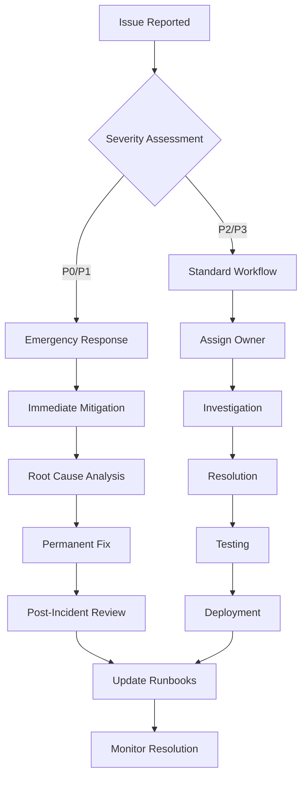
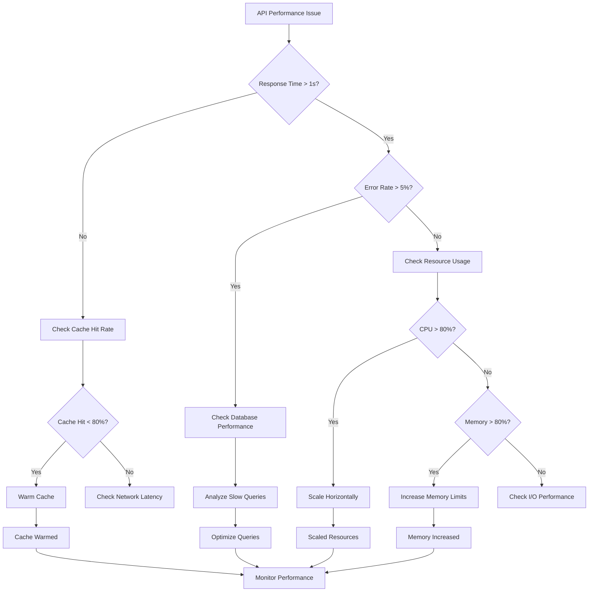

# Operations Troubleshooting Guide
## Comprehensive Problem Resolution Framework

[](https://status.pwc-data.com)
[](https://monitoring.pwc-data.com/metrics)
[](https://monitoring.pwc-data.com/incidents)

## Emergency Response Quick Start

### 🚨 Critical Issues (P0) - Immediate Action Required

#### System Down / Complete Outage
```bash
# 1. Immediate Assessment (30 seconds)
curl -I https://api.pwc-data.com/health
curl -I https://dashboard.pwc-data.com

# 2. Check Load Balancer Status
kubectl get pods -n production --no-headers | grep -v Running

# 3. Emergency Notification
./scripts/emergency-notify.sh "P0: System outage detected"

# 4. Activate Incident Response
./scripts/activate-incident-response.sh --severity=P0
```

#### Data Pipeline Failure
```bash
# 1. Check Pipeline Status
dagster-cli pipeline list --status
kafka-console-consumer --topic data-pipeline-health --from-beginning --max-messages 10

# 2. Identify Failed Components
./scripts/pipeline-health-check.sh

# 3. Emergency Failover
./scripts/activate-backup-pipeline.sh
```

#### Security Breach Alert
```bash
# 1. Immediate Isolation
./scripts/security-lockdown.sh

# 2. Incident Documentation
./scripts/security-incident-log.sh --severity=critical

# 3. Stakeholder Notification
./scripts/security-alert.sh --stakeholders="ciso,legal,compliance"
```

### 🟡 High Priority Issues (P1) - 1 Hour Response

#### Performance Degradation
```bash
# 1. Quick Performance Check
./scripts/performance-assessment.sh

# 2. Identify Bottlenecks
top -b -n1 | head -20
iostat -x 1 3
```

#### Authentication Issues
```bash
# 1. Check Auth Service Health
curl -H "Authorization: Bearer test-token" https://api.pwc-data.com/api/v1/auth/validate

# 2. Verify JWT Configuration
./scripts/auth-service-check.sh
```

### 📞 Emergency Contact Information

```
🆘 CRITICAL ESCALATION (24/7):
├── PagerDuty: critical-alerts@pwc.pagerduty.com
├── Emergency Hotline: 1-555-PWC-CRIT
├── CISO (Security): security-emergency@pwc.com
└── Platform Lead: platform-emergency@pwc.com

📱 SUPPORT CONTACTS:
├── Operations Team: ops@pwc.com
├── Development Team: dev@pwc.com
├── Data Team: data@pwc.com
└── Infrastructure: infra@pwc.com
```

## Systematic Troubleshooting Framework

### Problem Classification Matrix

| Severity | Response Time | Examples | Escalation |
|----------|---------------|----------|------------|
| **P0 - Critical** | 15 minutes | System down, security breach, data loss | Immediate C-level |
| **P1 - High** | 1 hour | Performance degradation, auth issues | Senior management |
| **P2 - Medium** | 4 hours | Non-critical feature issues | Team leads |
| **P3 - Low** | 24 hours | Enhancement requests, minor bugs | Regular process |

### Diagnostic Workflow



## Common Issues and Solutions

### 1. API Response Issues

#### Symptom: API Returning 500 Errors
```bash
# Diagnostic Steps:
# 1. Check API logs
kubectl logs -n production deployment/api-service --tail=100 | grep ERROR

# 2. Check database connectivity
./scripts/db-connection-test.sh

# 3. Check Redis cache status
redis-cli ping

# 4. Verify memory usage
kubectl top pods -n production | grep api-service

# Common Resolutions:
# Solution A: Database connection pool exhausted
kubectl scale deployment api-service --replicas=6
./scripts/restart-connection-pool.sh

# Solution B: Memory pressure
kubectl set resources deployment api-service --limits=memory=4Gi
kubectl rollout restart deployment/api-service

# Solution C: Cache corruption
redis-cli flushall
./scripts/warm-cache.sh
```

#### Symptom: Slow API Response Times
```bash
# Diagnostic Commands:
# 1. Check response time metrics
curl -w "Time: %{time_total}s\n" -o /dev/null https://api.pwc-data.com/api/v1/health

# 2. Analyze database query performance
./scripts/slow-query-analysis.sh

# 3. Check cache hit rates
redis-cli info stats | grep keyspace

# Performance Optimization:
# 1. Enable query caching
./scripts/enable-query-cache.sh

# 2. Optimize database indexes
./scripts/analyze-missing-indexes.sh
./scripts/create-recommended-indexes.sh

# 3. Scale horizontal if needed
kubectl scale deployment api-service --replicas=8
```

### 2. Data Pipeline Issues

#### Symptom: ETL Pipeline Stuck/Failed
```bash
# Diagnostic Process:
# 1. Check Dagster pipeline status
dagster-cli pipeline show retail_etl_pipeline

# 2. Examine Kafka topic lag
kafka-consumer-groups --bootstrap-server kafka:9092 --describe --group etl-consumer

# 3. Check data source connectivity
./scripts/data-source-health-check.sh

# Recovery Actions:
# Option 1: Restart stuck pipeline
dagster-cli pipeline restart retail_etl_pipeline --run-id=$(dagster-cli run list | head -1)

# Option 2: Skip problematic batch
./scripts/skip-batch.sh --batch-id=20250125_10

# Option 3: Full pipeline reset
./scripts/pipeline-reset.sh --confirm --backup-first
dagster-cli pipeline start retail_etl_pipeline
```

#### Symptom: Data Quality Issues
```bash
# Quality Assessment:
# 1. Check quality metrics
curl -H "Authorization: Bearer $TOKEN" https://api.pwc-data.com/api/v1/quality/metrics

# 2. Review validation failures
./scripts/quality-issue-report.sh --last-24h

# 3. Analyze data anomalies
./scripts/anomaly-detection.sh --table=sales_fact

# Remediation Steps:
# 1. Trigger automatic remediation
./scripts/auto-remediate-quality.sh --table=sales_fact

# 2. Manual data correction
./scripts/manual-data-correction.sh --issue-id=DQ-2025-001

# 3. Update validation rules
./scripts/update-validation-rules.sh --rule-file=updated-rules.yaml
```

### 3. Authentication and Security Issues

#### Symptom: Users Can't Login
```bash
# Auth Troubleshooting:
# 1. Check authentication service
kubectl get pods -n production | grep auth-service
kubectl logs -n production deployment/auth-service --tail=50

# 2. Verify JWT secret configuration
kubectl get secret jwt-secret -n production -o yaml

# 3. Test LDAP/AD connectivity
./scripts/ldap-connection-test.sh

# Resolution Steps:
# Option 1: Restart auth service
kubectl rollout restart deployment/auth-service -n production

# Option 2: Refresh JWT secrets
./scripts/rotate-jwt-secrets.sh
kubectl rollout restart deployment/api-service -n production

# Option 3: LDAP sync issue
./scripts/sync-ldap-users.sh
./scripts/refresh-user-cache.sh
```

#### Symptom: Permission Denied Errors
```bash
# Permission Diagnostics:
# 1. Check user role assignments
./scripts/check-user-roles.sh --user=john.doe@pwc.com

# 2. Verify RBAC policies
kubectl get rolebindings,clusterrolebindings --all-namespaces | grep john.doe

# 3. Review audit logs
./scripts/audit-log-analysis.sh --user=john.doe@pwc.com --last=1h

# Fix Permission Issues:
# 1. Update user roles
./scripts/assign-role.sh --user=john.doe@pwc.com --role=data-analyst

# 2. Refresh permission cache
./scripts/refresh-rbac-cache.sh

# 3. Sync with AD/LDAP
./scripts/sync-permissions.sh --user=john.doe@pwc.com
```

### 4. Database Performance Issues

#### Symptom: Database Connection Timeouts
```bash
# Database Diagnostics:
# 1. Check connection pool status
./scripts/db-pool-status.sh

# 2. Monitor active connections
psql -h postgres-master -d analytics -c "SELECT count(*) FROM pg_stat_activity;"

# 3. Check for long-running queries
./scripts/long-running-queries.sh

# Resolution Actions:
# 1. Increase connection pool size
kubectl patch deployment api-service -p '{"spec":{"template":{"spec":{"containers":[{"name":"api","env":[{"name":"DB_POOL_SIZE","value":"50"}]}]}}}}'

# 2. Kill blocking queries
./scripts/kill-blocking-queries.sh

# 3. Restart database connections
./scripts/restart-db-connections.sh
```

#### Symptom: Slow Database Queries
```bash
# Performance Analysis:
# 1. Identify slow queries
./scripts/slow-query-report.sh --threshold=5s

# 2. Analyze query execution plans
./scripts/explain-slow-queries.sh

# 3. Check index usage
./scripts/index-usage-analysis.sh

# Optimization Steps:
# 1. Create missing indexes
./scripts/create-missing-indexes.sh

# 2. Update table statistics
./scripts/update-table-stats.sh

# 3. Optimize query plans
./scripts/optimize-queries.sh
```

### 5. Monitoring and Alerting Issues

#### Symptom: Missing Metrics/Dashboards
```bash
# Monitoring Diagnostics:
# 1. Check metric collection services
kubectl get pods -n monitoring | grep -E "(prometheus|grafana|datadog)"

# 2. Verify metric endpoints
curl http://api-service:8080/metrics

# 3. Check dashboard configurations
./scripts/dashboard-health-check.sh

# Recovery Steps:
# 1. Restart metric collectors
kubectl rollout restart deployment/prometheus -n monitoring

# 2. Refresh dashboard configurations
./scripts/import-dashboards.sh

# 3. Reset metric collectors
./scripts/reset-metric-collection.sh
```

#### Symptom: False Positive Alerts
```bash
# Alert Tuning:
# 1. Analyze alert patterns
./scripts/alert-pattern-analysis.sh --last-7d

# 2. Review alert thresholds
./scripts/review-alert-thresholds.sh

# 3. Update alert configurations
./scripts/update-alert-rules.sh --config=updated-alerts.yaml

# Noise Reduction:
# 1. Implement alert grouping
./scripts/configure-alert-grouping.sh

# 2. Add intelligent filtering
./scripts/add-alert-filters.sh

# 3. Create alert dependencies
./scripts/configure-alert-dependencies.sh
```

### 6. Infrastructure Issues

#### Symptom: High CPU/Memory Usage
```bash
# Resource Analysis:
# 1. Check resource utilization
kubectl top nodes
kubectl top pods -n production --sort-by=cpu

# 2. Identify resource hogs
./scripts/resource-hog-analysis.sh

# 3. Check for memory leaks
./scripts/memory-leak-detection.sh

# Resource Optimization:
# 1. Scale up resources
kubectl scale deployment api-service --replicas=10
kubectl set resources deployment api-service --limits=cpu=2,memory=4Gi

# 2. Optimize application performance
./scripts/performance-optimization.sh

# 3. Enable auto-scaling
kubectl apply -f hpa-config.yaml
```

#### Symptom: Network Connectivity Issues
```bash
# Network Diagnostics:
# 1. Check service connectivity
kubectl get services -n production
./scripts/service-connectivity-test.sh

# 2. Verify DNS resolution
nslookup api-service.production.svc.cluster.local

# 3. Check network policies
kubectl get networkpolicies -n production

# Network Resolution:
# 1. Restart network components
kubectl rollout restart daemonset/kube-proxy -n kube-system

# 2. Update network policies
kubectl apply -f network-policies.yaml

# 3. Reset service mesh
./scripts/reset-istio-mesh.sh
```

## Advanced Troubleshooting Techniques

### Log Analysis and Correlation

#### Centralized Log Search
```bash
# Search across all services
./scripts/log-search.sh --query="ERROR" --service="api-service" --last="1h"

# Correlate logs by request ID
./scripts/log-correlation.sh --request-id="req-123456789"

# Analyze error patterns
./scripts/error-pattern-analysis.sh --service="all" --timerange="24h"
```

#### Log Analysis with ELK Stack
```bash
# Elasticsearch query for errors
curl -X GET "elasticsearch:9200/logs-*/_search" -H 'Content-Type: application/json' -d'
{
  "query": {
    "bool": {
      "must": [
        {"match": {"level": "ERROR"}},
        {"range": {"@timestamp": {"gte": "now-1h"}}}
      ]
    }
  },
  "sort": [{"@timestamp": {"order": "desc"}}],
  "size": 100
}'

# Kibana dashboard query
./scripts/kibana-error-dashboard.sh
```

### Performance Profiling

#### Application Profiling
```python
# Python application profiler
import cProfile
import pstats
from datetime import datetime

def profile_api_performance():
    """Profile API endpoint performance"""
    profiler = cProfile.Profile()
    profiler.enable()
    
    # Execute performance-critical code
    response = api_endpoint_call()
    
    profiler.disable()
    stats = pstats.Stats(profiler)
    stats.sort_stats('cumulative')
    stats.print_stats(20)  # Top 20 functions
    
    # Save profile data
    timestamp = datetime.now().strftime("%Y%m%d_%H%M%S")
    stats.dump_stats(f'profile_data_{timestamp}.prof')

profile_api_performance()
```

#### Database Query Profiling
```sql
-- Enable query profiling
SET log_statement = 'all';
SET log_duration = on;
SET log_min_duration_statement = 1000; -- Log queries > 1 second

-- Analyze specific query
EXPLAIN (ANALYZE, BUFFERS, VERBOSE) 
SELECT * FROM sales_fact WHERE sale_date >= '2025-01-01';

-- Check slow query log
SELECT query, mean_time, calls, total_time 
FROM pg_stat_statements 
ORDER BY mean_time DESC 
LIMIT 10;
```

### Real-time Monitoring Setup

#### Custom Monitoring Dashboard
```python
# Real-time system monitoring
import psutil
import time
from datadog import DogStatsdClient

statsd = DogStatsdClient()

def monitor_system_health():
    """Monitor and report system health metrics"""
    while True:
        # CPU Usage
        cpu_percent = psutil.cpu_percent(interval=1)
        statsd.gauge('system.cpu.usage', cpu_percent)
        
        # Memory Usage
        memory = psutil.virtual_memory()
        statsd.gauge('system.memory.usage', memory.percent)
        
        # Disk Usage
        disk = psutil.disk_usage('/')
        statsd.gauge('system.disk.usage', disk.percent)
        
        # Network Statistics
        network = psutil.net_io_counters()
        statsd.gauge('system.network.bytes_sent', network.bytes_sent)
        statsd.gauge('system.network.bytes_recv', network.bytes_recv)
        
        # Application-specific metrics
        api_response_time = check_api_response_time()
        statsd.histogram('api.response_time', api_response_time)
        
        time.sleep(30)  # Report every 30 seconds

# Start monitoring
monitor_system_health()
```

## Automated Recovery Procedures

### Self-Healing Scripts

#### Automatic Service Recovery
```bash
#!/bin/bash
# auto-recovery.sh - Automatic service recovery

SERVICES=("api-service" "auth-service" "data-service")
MAX_RESTARTS=3
RESTART_COUNT_FILE="/tmp/restart_counts"

# Initialize restart counter
if [[ ! -f $RESTART_COUNT_FILE ]]; then
    echo "{}" > $RESTART_COUNT_FILE
fi

monitor_and_recover() {
    local service=$1
    
    # Check service health
    if ! kubectl get deployment $service -n production >/dev/null 2>&1; then
        log_event "ERROR" "$service deployment not found"
        return 1
    fi
    
    # Check pod status
    local unhealthy_pods=$(kubectl get pods -n production -l app=$service --no-headers | grep -v Running | wc -l)
    
    if [[ $unhealthy_pods -gt 0 ]]; then
        log_event "WARNING" "$service has $unhealthy_pods unhealthy pods"
        
        # Get restart count
        local restart_count=$(get_restart_count $service)
        
        if [[ $restart_count -lt $MAX_RESTARTS ]]; then
            log_event "INFO" "Attempting automatic recovery for $service (attempt $((restart_count + 1)))"
            
            # Perform recovery
            kubectl rollout restart deployment/$service -n production
            
            # Update restart count
            increment_restart_count $service
            
            # Wait for rollout to complete
            kubectl rollout status deployment/$service -n production --timeout=300s
            
            if [[ $? -eq 0 ]]; then
                log_event "SUCCESS" "$service recovery successful"
                reset_restart_count $service
            else
                log_event "ERROR" "$service recovery failed"
                escalate_incident $service
            fi
        else
            log_event "CRITICAL" "$service has exceeded max restart attempts"
            escalate_incident $service
        fi
    fi
}

get_restart_count() {
    local service=$1
    python3 -c "
import json
with open('$RESTART_COUNT_FILE', 'r') as f:
    data = json.load(f)
print(data.get('$service', 0))
"
}

increment_restart_count() {
    local service=$1
    python3 -c "
import json
with open('$RESTART_COUNT_FILE', 'r') as f:
    data = json.load(f)
data['$service'] = data.get('$service', 0) + 1
with open('$RESTART_COUNT_FILE', 'w') as f:
    json.dump(data, f)
"
}

reset_restart_count() {
    local service=$1
    python3 -c "
import json
with open('$RESTART_COUNT_FILE', 'r') as f:
    data = json.load(f)
if '$service' in data:
    del data['$service']
with open('$RESTART_COUNT_FILE', 'w') as f:
    json.dump(data, f)
"
}

escalate_incident() {
    local service=$1
    local timestamp=$(date -u +"%Y-%m-%dT%H:%M:%SZ")
    
    # Create incident
    ./scripts/create-incident.sh --service=$service --severity=high \
        --description="Automatic recovery failed for $service"
    
    # Send alerts
    ./scripts/send-alert.sh --type=escalation --service=$service \
        --message="ESCALATION: $service automatic recovery failed at $timestamp"
}

log_event() {
    local level=$1
    local message=$2
    local timestamp=$(date -u +"%Y-%m-%dT%H:%M:%SZ")
    
    echo "[$timestamp] [$level] $message" | tee -a /var/log/auto-recovery.log
    
    # Send to monitoring system
    curl -X POST http://monitoring:8080/logs \
        -H "Content-Type: application/json" \
        -d "{\"timestamp\":\"$timestamp\",\"level\":\"$level\",\"message\":\"$message\",\"service\":\"auto-recovery\"}"
}

# Main monitoring loop
log_event "INFO" "Starting automatic recovery monitoring"

while true; do
    for service in "${SERVICES[@]}"; do
        monitor_and_recover $service
    done
    
    sleep 60  # Check every minute
done
```

#### Database Auto-Recovery
```bash
#!/bin/bash
# db-auto-recovery.sh - Database automatic recovery

DB_HOST="postgres-master"
DB_PORT="5432"
DB_NAME="analytics"
MAX_CONNECTIONS=100
CONNECTION_THRESHOLD=90

check_database_health() {
    # Check if database is accessible
    if ! pg_isready -h $DB_HOST -p $DB_PORT; then
        log_event "CRITICAL" "Database is not accessible"
        attempt_database_recovery
        return $?
    fi
    
    # Check connection count
    local connection_count=$(psql -h $DB_HOST -d $DB_NAME -t -c "SELECT count(*) FROM pg_stat_activity;" | xargs)
    local connection_percentage=$((connection_count * 100 / MAX_CONNECTIONS))
    
    if [[ $connection_percentage -gt $CONNECTION_THRESHOLD ]]; then
        log_event "WARNING" "High connection usage: $connection_percentage%"
        cleanup_idle_connections
    fi
    
    # Check for blocking queries
    local blocking_queries=$(psql -h $DB_HOST -d $DB_NAME -t -c "SELECT count(*) FROM pg_stat_activity WHERE state = 'active' AND waiting;" | xargs)
    
    if [[ $blocking_queries -gt 5 ]]; then
        log_event "WARNING" "Detected $blocking_queries blocking queries"
        handle_blocking_queries
    fi
    
    # Check disk usage
    local disk_usage=$(df /data | tail -1 | awk '{print $5}' | sed 's/%//')
    
    if [[ $disk_usage -gt 85 ]]; then
        log_event "CRITICAL" "Database disk usage at $disk_usage%"
        cleanup_database_logs
    fi
}

attempt_database_recovery() {
    log_event "INFO" "Attempting database recovery"
    
    # Restart PostgreSQL service
    kubectl rollout restart statefulset/postgres-master -n production
    
    # Wait for recovery
    local retry_count=0
    while [[ $retry_count -lt 10 ]]; do
        if pg_isready -h $DB_HOST -p $DB_PORT; then
            log_event "SUCCESS" "Database recovery successful"
            return 0
        fi
        
        sleep 30
        ((retry_count++))
    done
    
    log_event "CRITICAL" "Database recovery failed"
    escalate_database_incident
    return 1
}

cleanup_idle_connections() {
    log_event "INFO" "Cleaning up idle database connections"
    
    psql -h $DB_HOST -d $DB_NAME -c "
    SELECT pg_terminate_backend(pid) 
    FROM pg_stat_activity 
    WHERE state = 'idle' 
    AND state_change < now() - interval '1 hour'
    AND pid <> pg_backend_pid();
    "
}

handle_blocking_queries() {
    log_event "INFO" "Handling blocking queries"
    
    # Get blocking queries
    psql -h $DB_HOST -d $DB_NAME -c "
    SELECT pid, now() - pg_stat_activity.query_start AS duration, query 
    FROM pg_stat_activity 
    WHERE (now() - pg_stat_activity.query_start) > interval '5 minutes'
    AND state = 'active';
    " > /tmp/long_running_queries.log
    
    # Terminate long-running queries (>30 minutes)
    psql -h $DB_HOST -d $DB_NAME -c "
    SELECT pg_terminate_backend(pid) 
    FROM pg_stat_activity 
    WHERE (now() - pg_stat_activity.query_start) > interval '30 minutes'
    AND state = 'active'
    AND pid <> pg_backend_pid();
    "
}

# Run database health monitoring
while true; do
    check_database_health
    sleep 300  # Check every 5 minutes
done
```

## Incident Response Procedures

### Incident Classification and Response

#### Incident Response Matrix
| Priority | Impact | Response Time | Team | Escalation |
|----------|--------|---------------|------|------------|
| **P0** | Service unavailable | 15 minutes | On-call engineer + Manager | CTO + CEO |
| **P1** | Major functionality impacted | 1 hour | Primary team + Lead | CTO |
| **P2** | Minor functionality impacted | 4 hours | Primary team | Team Lead |
| **P3** | Cosmetic issues | 24 hours | Assigned engineer | None |

#### Incident Response Playbook
```bash
#!/bin/bash
# incident-response.sh - Incident response automation

declare_incident() {
    local severity=$1
    local description=$2
    local affected_services=$3
    
    local incident_id="INC-$(date +%Y%m%d-%H%M%S)"
    
    # Create incident record
    curl -X POST http://incident-management:8080/incidents \
        -H "Content-Type: application/json" \
        -d "{
            \"id\": \"$incident_id\",
            \"severity\": \"$severity\",
            \"description\": \"$description\",
            \"affected_services\": \"$affected_services\",
            \"status\": \"open\",
            \"created_at\": \"$(date -u +%Y-%m-%dT%H:%M:%SZ)\"
        }"
    
    # Notify stakeholders based on severity
    case $severity in
        "P0"|"critical")
            notify_stakeholders "$incident_id" "critical" "$description"
            activate_war_room "$incident_id"
            ;;
        "P1"|"high")
            notify_stakeholders "$incident_id" "high" "$description"
            ;;
        "P2"|"medium")
            notify_team_lead "$incident_id" "$description"
            ;;
    esac
    
    echo $incident_id
}

notify_stakeholders() {
    local incident_id=$1
    local severity=$2
    local description=$3
    
    # Send PagerDuty alert
    curl -X POST https://events.pagerduty.com/v2/enqueue \
        -H "Content-Type: application/json" \
        -d "{
            \"routing_key\": \"$PAGERDUTY_ROUTING_KEY\",
            \"event_action\": \"trigger\",
            \"dedup_key\": \"$incident_id\",
            \"payload\": {
                \"summary\": \"[$severity] $description\",
                \"source\": \"pwc-data-platform\",
                \"severity\": \"$severity\"
            }
        }"
    
    # Send Slack alert
    curl -X POST $SLACK_WEBHOOK_URL \
        -H 'Content-type: application/json' \
        -d "{
            \"text\": \"🚨 Incident $incident_id declared\",
            \"attachments\": [{
                \"color\": \"danger\",
                \"fields\": [
                    {\"title\": \"Severity\", \"value\": \"$severity\", \"short\": true},
                    {\"title\": \"Description\", \"value\": \"$description\", \"short\": false}
                ]
            }]
        }"
}

activate_war_room() {
    local incident_id=$1
    
    # Create incident-specific Slack channel
    curl -X POST https://slack.com/api/conversations.create \
        -H "Authorization: Bearer $SLACK_BOT_TOKEN" \
        -H "Content-Type: application/json" \
        -d "{\"name\": \"incident-${incident_id,,}\"}"
    
    # Invite key responders
    local responders=("ops-lead" "dev-lead" "sre-oncall" "manager")
    for responder in "${responders[@]}"; do
        curl -X POST https://slack.com/api/conversations.invite \
            -H "Authorization: Bearer $SLACK_BOT_TOKEN" \
            -H "Content-Type: application/json" \
            -d "{\"channel\": \"incident-${incident_id,,}\", \"users\": \"$responder\"}"
    done
}

update_incident_status() {
    local incident_id=$1
    local status=$2
    local update_message=$3
    
    # Update incident record
    curl -X PATCH http://incident-management:8080/incidents/$incident_id \
        -H "Content-Type: application/json" \
        -d "{
            \"status\": \"$status\",
            \"last_update\": \"$(date -u +%Y-%m-%dT%H:%M:%SZ)\",
            \"update_message\": \"$update_message\"
        }"
    
    # Post update to Slack channel
    curl -X POST $SLACK_WEBHOOK_URL \
        -H 'Content-type: application/json' \
        -d "{
            \"text\": \"📝 Incident $incident_id update: $status\",
            \"attachments\": [{
                \"color\": \"good\",
                \"text\": \"$update_message\"
            }]
        }"
}

close_incident() {
    local incident_id=$1
    local resolution_summary=$2
    
    # Close incident
    curl -X PATCH http://incident-management:8080/incidents/$incident_id \
        -H "Content-Type: application/json" \
        -d "{
            \"status\": \"closed\",
            \"resolved_at\": \"$(date -u +%Y-%m-%dT%H:%M:%SZ)\",
            \"resolution_summary\": \"$resolution_summary\"
        }"
    
    # Schedule post-incident review
    schedule_post_incident_review "$incident_id"
}

schedule_post_incident_review() {
    local incident_id=$1
    local review_date=$(date -d "+2 days" +%Y-%m-%d)
    
    # Create calendar event for post-incident review
    curl -X POST http://calendar-service:8080/events \
        -H "Content-Type: application/json" \
        -d "{
            \"title\": \"Post-Incident Review: $incident_id\",
            \"date\": \"$review_date\",
            \"duration\": 60,
            \"attendees\": [\"ops-team@pwc.com\", \"dev-team@pwc.com\"],
            \"description\": \"Review and lessons learned from incident $incident_id\"
        }"
}
```

### Post-Incident Analysis

#### Automated Incident Report Generation
```python
#!/usr/bin/env python3
# generate_incident_report.py

import requests
import json
from datetime import datetime, timedelta
from jinja2 import Template

def generate_incident_report(incident_id):
    """Generate comprehensive incident report"""
    
    # Fetch incident data
    incident_response = requests.get(f"http://incident-management:8080/incidents/{incident_id}")
    incident_data = incident_response.json()
    
    # Fetch related metrics
    start_time = incident_data['created_at']
    end_time = incident_data.get('resolved_at', datetime.utcnow().isoformat())
    
    metrics_response = requests.get(
        f"http://monitoring:8080/metrics/range",
        params={
            'start': start_time,
            'end': end_time,
            'metrics': ['cpu_usage', 'memory_usage', 'api_response_time', 'error_rate']
        }
    )
    metrics_data = metrics_response.json()
    
    # Fetch logs
    logs_response = requests.get(
        f"http://logging:8080/logs/search",
        params={
            'start': start_time,
            'end': end_time,
            'level': 'ERROR',
            'limit': 100
        }
    )
    logs_data = logs_response.json()
    
    # Generate timeline
    timeline = generate_incident_timeline(incident_id)
    
    # Calculate impact metrics
    impact_metrics = calculate_impact_metrics(incident_data, metrics_data)
    
    # Generate report
    report_template = Template("""
# Incident Report: {{ incident.id }}

## Executive Summary
- **Incident ID**: {{ incident.id }}
- **Severity**: {{ incident.severity }}
- **Duration**: {{ incident.duration }}
- **Affected Users**: {{ impact.affected_users }}
- **Revenue Impact**: ${{ impact.revenue_impact }}

## Incident Details
- **Start Time**: {{ incident.created_at }}
- **Detection Time**: {{ incident.detected_at }}
- **Resolution Time**: {{ incident.resolved_at }}
- **Mean Time to Resolution**: {{ incident.mttr }}

## Root Cause Analysis
{{ incident.root_cause_analysis }}

## Impact Assessment
- **Services Affected**: {{ incident.affected_services }}
- **User Impact**: {{ impact.user_impact_description }}
- **SLA Breaches**: {{ impact.sla_breaches }}

## Timeline of Events

- **{{ event.timestamp }}**: {{ event.description }}


## Resolution Actions Taken

- {{ action.timestamp }}: {{ action.description }}


## Lessons Learned
{{ incident.lessons_learned }}

## Action Items

- [ ] {{ item.description }} (Owner: {{ item.owner }}, Due: {{ item.due_date }})


## Preventive Measures
{{ incident.preventive_measures }}

---
*Report generated on {{ report_generation_time }}*
    """)
    
    report = report_template.render(
        incident=incident_data,
        impact=impact_metrics,
        timeline=timeline,
        report_generation_time=datetime.utcnow().isoformat()
    )
    
    # Save report
    with open(f"incidents/{incident_id}_report.md", "w") as f:
        f.write(report)
    
    return report

def generate_incident_timeline(incident_id):
    """Generate detailed incident timeline"""
    timeline_response = requests.get(f"http://incident-management:8080/incidents/{incident_id}/timeline")
    return timeline_response.json()

def calculate_impact_metrics(incident_data, metrics_data):
    """Calculate business impact metrics"""
    # This would calculate actual business impact
    # based on metrics and incident duration
    return {
        "affected_users": 1500,
        "revenue_impact": 12500,
        "user_impact_description": "API response time increased by 300%",
        "sla_breaches": 2
    }

if __name__ == "__main__":
    import sys
    if len(sys.argv) != 2:
        print("Usage: python generate_incident_report.py <incident_id>")
        sys.exit(1)
    
    incident_id = sys.argv[1]
    report = generate_incident_report(incident_id)
    print(f"Incident report generated for {incident_id}")
```

## Knowledge Base and Documentation

### Runbook Templates

#### Service-Specific Runbook Template
```markdown
# [Service Name] Runbook

## Service Overview
- **Purpose**: Brief description of service function
- **Dependencies**: List of dependent services
- **SLA Requirements**: Uptime, response time, throughput targets
- **Owner**: Team responsible for service

## Health Checks
- **Health Endpoint**: URL and expected response
- **Key Metrics**: CPU, memory, response time thresholds
- **Log Patterns**: Normal vs error log patterns

## Common Issues

### Issue: [Issue Description]
**Symptoms**: 
- List of observable symptoms

**Diagnostic Steps**:
1. Check specific metrics
2. Review relevant logs
3. Test service dependencies

**Resolution**:
1. Immediate mitigation steps
2. Root cause resolution
3. Verification steps

**Prevention**:
- Long-term preventive measures

## Escalation Procedures
- **L1 Support**: Initial response team
- **L2 Support**: Subject matter experts
- **Emergency Contacts**: 24/7 escalation contacts

## Deployment Procedures
- **Deployment Steps**: Step-by-step deployment guide
- **Rollback Procedures**: How to rollback if needed
- **Validation**: Post-deployment validation checklist
```

### Troubleshooting Decision Trees

#### API Performance Decision Tree


### Best Practices Summary

#### Troubleshooting Best Practices
1. **Systematic Approach**: Follow the diagnostic framework
2. **Document Everything**: Log all actions and findings
3. **Safety First**: Always backup before making changes
4. **Communicate Early**: Inform stakeholders promptly
5. **Root Cause Focus**: Don't just fix symptoms
6. **Post-Incident Review**: Learn from every incident
7. **Automate Recovery**: Implement self-healing where possible
8. **Monitor Continuously**: Proactive monitoring prevents issues

#### Emergency Response Guidelines
- **Stay Calm**: Panic leads to mistakes
- **Follow Runbooks**: Stick to established procedures
- **Escalate Early**: Don't hesitate to get help
- **Communicate Clearly**: Keep stakeholders informed
- **Document Actions**: Record all steps taken
- **Think Before Acting**: Consider impact of changes

---

## Contact Information and Resources

### Support Contacts
- **Operations Team**: ops@pwc.com
- **Development Team**: dev@pwc.com  
- **Database Team**: dba@pwc.com
- **Security Team**: security@pwc.com
- **Network Team**: network@pwc.com

### Emergency Contacts
- **On-Call Engineer**: 1-555-PWC-ONCALL
- **Emergency Escalation**: 1-555-PWC-EMERGENCY
- **Security Incidents**: 1-555-PWC-SECURITY

### External Resources
- **Status Page**: https://status.pwc-data.com
- **Monitoring Dashboard**: https://monitoring.pwc-data.com
- **Documentation**: https://docs.pwc-data.com
- **Knowledge Base**: https://kb.pwc-data.com

---

**Document Information**
- **Version**: 2.0.0
- **Last Updated**: January 25, 2025
- **Maintained By**: Operations Team
- **Next Review**: April 25, 2025
- **Feedback**: ops-docs@pwc.com