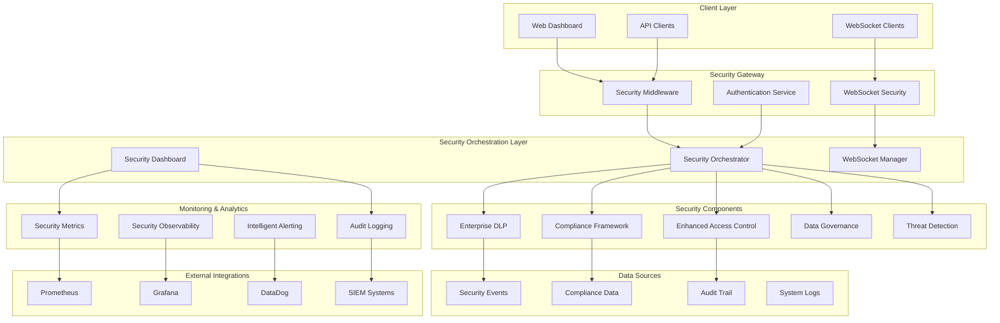
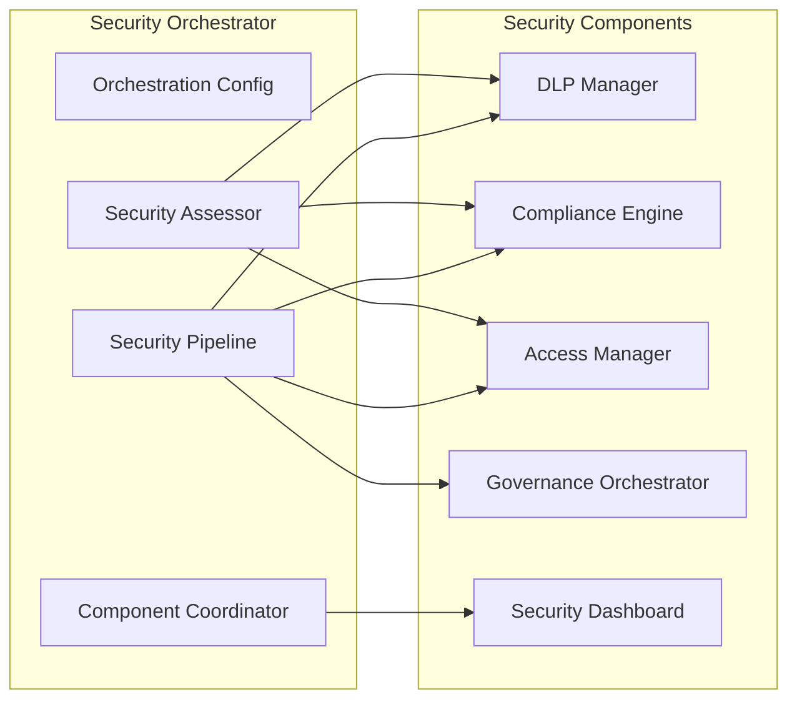
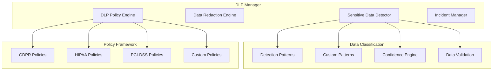
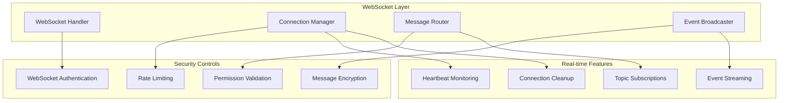
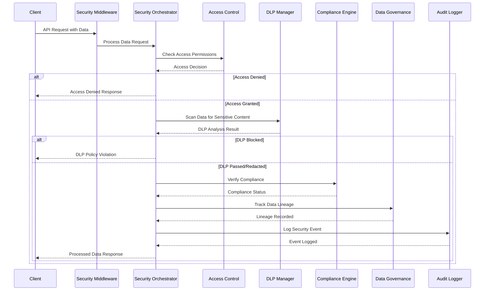
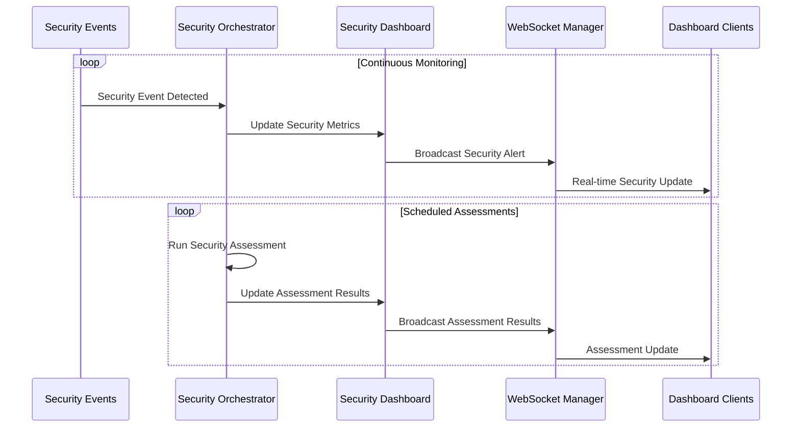
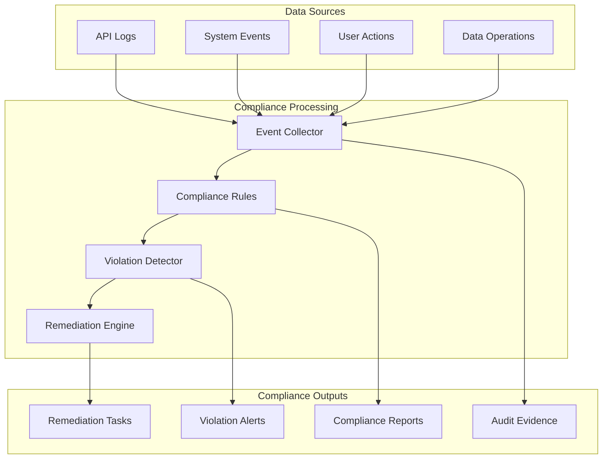
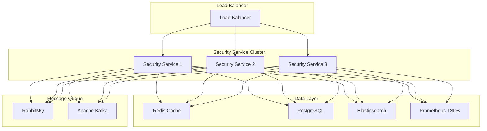
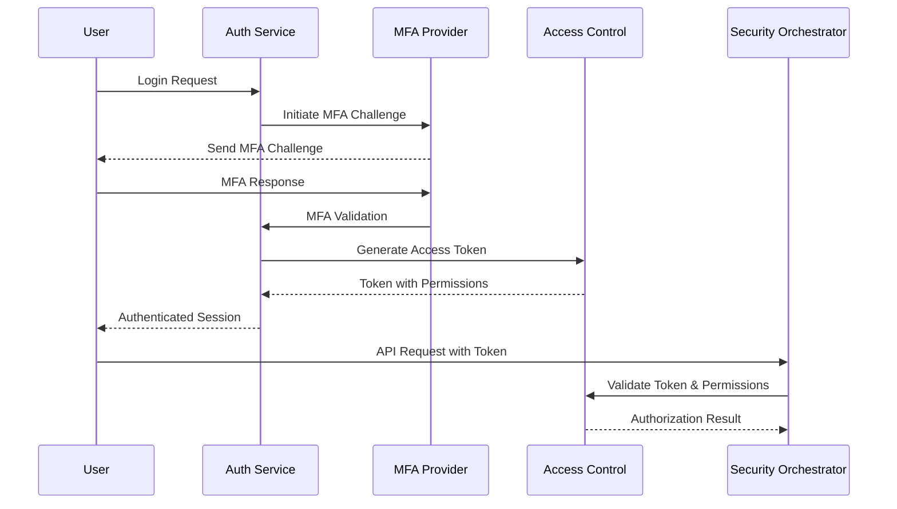

# Enterprise Security and Compliance Framework - Architecture Documentation

## Overview

This document provides comprehensive architectural documentation for the enterprise security and compliance framework implemented in the data engineering platform. The framework provides unified security operations, real-time threat detection, compliance monitoring, and automated policy enforcement.

## Table of Contents

1. [System Architecture](#system-architecture)
2. [Component Architecture](#component-architecture)
3. [Security Data Flow](#security-data-flow)
4. [Integration Architecture](#integration-architecture)
5. [Scalability and Performance](#scalability-and-performance)
6. [Security Controls](#security-controls)

---

## System Architecture

### High-Level Architecture

### Core Components

#### 1. Enterprise Security Orchestrator
- **Purpose**: Central coordination of all security components
- **Location**: `src/core/security/enterprise_security_orchestrator.py`
- **Key Functions**:
  - Unified security request processing
  - Component coordination
  - Security assessment execution
  - Real-time security monitoring

#### 2. Enterprise Data Loss Prevention (DLP)
- **Purpose**: Comprehensive data classification and protection
- **Location**: `src/core/security/enterprise_dlp.py`
- **Key Functions**:
  - Sensitive data detection
  - Data redaction and encryption
  - Policy enforcement
  - Incident management

#### 3. Compliance Framework
- **Purpose**: Multi-framework compliance monitoring and reporting
- **Location**: `src/core/security/compliance_framework.py`
- **Supported Frameworks**: GDPR, HIPAA, PCI-DSS, SOX, CCPA, ISO 27001, NIST
- **Key Functions**:
  - Automated compliance checks
  - Violation tracking
  - Remediation management
  - Compliance reporting

#### 4. Enhanced Access Control
- **Purpose**: RBAC/ABAC with privileged access management
- **Location**: `src/core/security/enhanced_access_control.py`
- **Key Functions**:
  - Role-based access control
  - Attribute-based access control
  - Privileged access management
  - Dynamic access evaluation

---

## Component Architecture

### Security Orchestrator Architecture

### DLP Framework Architecture

### WebSocket Security Architecture

---

## Security Data Flow

### Data Request Processing Pipeline

### Real-time Security Monitoring Flow

### Compliance Monitoring Flow

---

## Integration Architecture

### External System Integrations

```mermaid
graph TB
    subgraph "Security Platform"
        SEC_ORCHESTRATOR[Security Orchestrator]
        SEC_DASHBOARD[Security Dashboard]
        AUDIT_SYSTEM[Audit System]
        ALERTING[Alerting System]
    end
    
    subgraph "Monitoring Stack"
        PROMETHEUS[Prometheus]
        GRAFANA[Grafana]
        DATADOG[DataDog]
        ELASTIC[Elasticsearch]
    end
    
    subgraph "External Security"
        SIEM[SIEM Systems]
        THREAT_INTEL[Threat Intelligence]
        VULNERABILITY[Vulnerability Scanners]
        IAM[Identity Providers]
    end
    
    subgraph "Compliance Systems"
        GRC[GRC Platforms]
        AUDIT_TOOLS[Audit Tools]
        RISK_MGT[Risk Management]
        POLICY_MGT[Policy Management]
    end
    
    SEC_ORCHESTRATOR --> PROMETHEUS
    SEC_DASHBOARD --> GRAFANA
    AUDIT_SYSTEM --> DATADOG
    ALERTING --> ELASTIC
    
    SEC_ORCHESTRATOR --> SIEM
    SEC_DASHBOARD --> THREAT_INTEL
    AUDIT_SYSTEM --> VULNERABILITY
    ALERTING --> IAM
    
    SEC_ORCHESTRATOR --> GRC
    SEC_DASHBOARD --> AUDIT_TOOLS
    AUDIT_SYSTEM --> RISK_MGT
    ALERTING --> POLICY_MGT
```

### API Integration Points

#### Security API Endpoints
- `/api/v1/security/scan` - Data scanning and DLP analysis
- `/api/v1/security/assess` - Security assessment execution
- `/api/v1/security/dashboard` - Dashboard data retrieval
- `/api/v1/compliance/check` - Compliance validation
- `/api/v1/compliance/report` - Compliance reporting
- `/api/v1/access/check` - Access control validation
- `/api/v1/governance/lineage` - Data lineage tracking

#### WebSocket Endpoints
- `/ws/security/dashboard` - Real-time security updates
- `/ws/security/alerts` - Security alert streaming
- `/ws/compliance/monitoring` - Compliance event streaming

---

## Scalability and Performance

### Horizontal Scaling Architecture

### Performance Optimizations

#### 1. Caching Strategy
- **Pattern Detection Cache**: Cache compiled regex patterns
- **User Permission Cache**: Redis-backed permission caching
- **Compliance Rule Cache**: Cache frequently accessed rules
- **Dashboard Data Cache**: Time-based cache for dashboard metrics

#### 2. Asynchronous Processing
- **DLP Scanning**: Asynchronous data scanning for large datasets
- **Compliance Checks**: Background compliance validation
- **Audit Logging**: Non-blocking audit event processing
- **Real-time Updates**: WebSocket-based asynchronous notifications

#### 3. Database Optimization
- **Indexed Queries**: Optimized database indexes for security queries
- **Partitioned Tables**: Time-based partitioning for audit logs
- **Connection Pooling**: Efficient database connection management
- **Read Replicas**: Read-only replicas for reporting queries

---

## Security Controls

### Authentication and Authorization

#### Multi-Factor Authentication Flow

#### Role-Based Access Control (RBAC)
- **Admin Roles**: System administration, security management
- **Security Roles**: Security monitoring, incident response
- **Compliance Roles**: Compliance monitoring, reporting
- **Audit Roles**: Audit log access, forensic analysis
- **User Roles**: Standard user operations

#### Attribute-Based Access Control (ABAC)
- **User Attributes**: Department, clearance level, location
- **Resource Attributes**: Data classification, sensitivity level
- **Environmental Attributes**: Time, IP address, device type
- **Dynamic Policies**: Context-aware access decisions

### Data Protection Controls

#### Data Classification Levels
- **Public**: No restrictions
- **Internal**: Internal use only
- **Confidential**: Restricted access
- **Restricted**: Highly sensitive, limited access
- **Top Secret**: Maximum protection

#### Encryption Standards
- **Data at Rest**: AES-256-GCM encryption
- **Data in Transit**: TLS 1.3 with perfect forward secrecy
- **Key Management**: Hardware Security Module (HSM) integration
- **Certificate Management**: Automated certificate lifecycle

### Network Security Controls

#### API Security
- **Rate Limiting**: Configurable rate limits per endpoint
- **Input Validation**: Comprehensive request validation
- **Output Sanitization**: Response data sanitization
- **CORS Policy**: Strict cross-origin resource sharing
- **Security Headers**: HSTS, CSP, X-Frame-Options

#### WebSocket Security
- **Authentication**: Token-based WebSocket authentication
- **Authorization**: Permission-based topic subscription
- **Rate Limiting**: WebSocket message rate limiting
- **Connection Monitoring**: Real-time connection health monitoring

---

This architecture documentation provides a comprehensive overview of the enterprise security and compliance framework. The system is designed for scalability, security, and regulatory compliance across multiple frameworks.

For implementation details, API documentation, and operational procedures, refer to the companion documentation files.