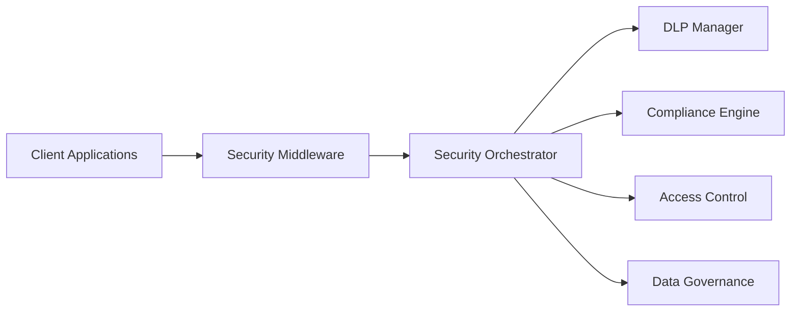
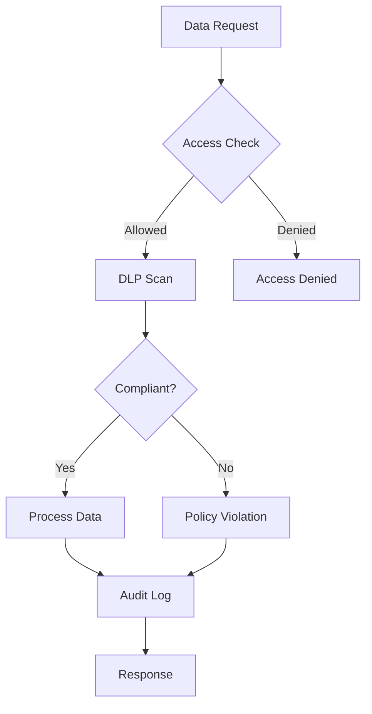

# Enterprise Security and Compliance Framework Documentation

## Overview

The Enterprise Security and Compliance Framework provides comprehensive security, compliance monitoring, and data protection capabilities for enterprise data engineering platforms. This documentation guides you through installation, configuration, operation, and integration of all security components.

## 🔒 Framework Capabilities

### Core Security Features
- **Advanced Threat Detection** - Real-time monitoring and automated threat response
- **Data Loss Prevention (DLP)** - Comprehensive data scanning and protection policies
- **Multi-Framework Compliance** - GDPR, HIPAA, PCI-DSS, SOX, ISO 27001, NIST compliance
- **Enhanced Access Control** - RBAC/ABAC with privileged access management
- **Data Governance** - Automated data lineage tracking and policy enforcement
- **Security Dashboard** - Real-time monitoring with WebSocket-based updates

### Enterprise Integrations
- **API Security** - Comprehensive REST and GraphQL API protection
- **Monitoring Stack** - Prometheus, Grafana, DataDog, Elasticsearch integration
- **Identity Providers** - OAuth2, SAML, multi-factor authentication support
- **External Security** - SIEM systems, threat intelligence feeds, vulnerability scanners

## 📖 Documentation Structure

### Quick Start
- **[Security Quick Start Guide](SECURITY_QUICK_START_GUIDE.md)** - 15-minute installation and setup

### Administration Guides
- **[Security Administrator Guide](SECURITY_ADMINISTRATOR_GUIDE.md)** - Complete installation, configuration, and maintenance
- **[Security Operations Guide](SECURITY_OPERATIONS_GUIDE.md)** - Day-to-day operations and incident response

### Technical Documentation  
- **[Enterprise Security Architecture](ENTERPRISE_SECURITY_ARCHITECTURE.md)** - System architecture and component design
- **[Security API Documentation](SECURITY_API_DOCUMENTATION.md)** - Complete API reference with examples

### Developer Resources
- **[Security Developer Guide](SECURITY_DEVELOPER_GUIDE.md)** - Integration guide for developers

## 🚀 Getting Started

### For Administrators
1. **New Installation**: Start with the [Security Quick Start Guide](SECURITY_QUICK_START_GUIDE.md)
2. **Production Setup**: Follow the [Security Administrator Guide](SECURITY_ADMINISTRATOR_GUIDE.md)
3. **Operations**: Use the [Security Operations Guide](SECURITY_OPERATIONS_GUIDE.md)

### For Developers
1. **Integration**: Follow the [Security Developer Guide](SECURITY_DEVELOPER_GUIDE.md)
2. **API Usage**: Reference the [Security API Documentation](SECURITY_API_DOCUMENTATION.md)

### For Architects
1. **System Design**: Review [Enterprise Security Architecture](ENTERPRISE_SECURITY_ARCHITECTURE.md)
2. **Integration Patterns**: Study architecture diagrams and data flow patterns

## 🔧 Core Components

### Security Orchestrator
Central coordination hub that integrates all security components:
- **Location**: `src/core/security/enterprise_security_orchestrator.py`
- **Purpose**: Unified security request processing and component coordination
- **Features**: Real-time monitoring, automated threat response, security assessments

### Data Loss Prevention (DLP)
Comprehensive data protection system:
- **Location**: `src/core/security/enterprise_dlp.py`
- **Purpose**: Sensitive data detection, classification, and protection
- **Supported Data Types**: PII, PHI, PCI, custom patterns
- **Actions**: Redaction, encryption, blocking, alerting

### Compliance Framework
Multi-standard compliance monitoring:
- **Location**: `src/core/security/compliance_framework.py`
- **Frameworks**: GDPR, HIPAA, PCI-DSS, SOX, CCPA, ISO 27001, NIST
- **Features**: Automated compliance checks, violation tracking, remediation management

### Enhanced Access Control
Advanced authorization system:
- **Location**: `src/core/security/enhanced_access_control.py`
- **Models**: Role-Based Access Control (RBAC), Attribute-Based Access Control (ABAC)
- **Features**: Privileged access management, dynamic access evaluation

### Security Dashboard
Real-time monitoring interface:
- **Location**: `src/core/security/security_dashboard.py`
- **Features**: WebSocket-based real-time updates, customizable widgets
- **Capabilities**: Threat monitoring, compliance tracking, incident management

## 📊 Security Metrics and KPIs

### Key Performance Indicators
- **Security Posture Score**: Overall security effectiveness (target: >95%)
- **Compliance Rate**: Multi-framework compliance percentage (target: >90%)
- **Threat Detection Rate**: Percentage of threats detected automatically (target: >98%)
- **Mean Time to Detection (MTTD)**: Average time to detect security incidents (target: <5 minutes)
- **Mean Time to Response (MTTR)**: Average time to respond to incidents (target: <15 minutes)

### Operational Metrics
- **DLP Incidents**: Daily data protection incidents and resolutions
- **Access Violations**: Authentication and authorization failures
- **Compliance Violations**: Regulatory compliance gaps and remediation
- **System Availability**: Security service uptime and performance

## 🛡️ Security Standards Compliance

### Supported Frameworks

#### GDPR (General Data Protection Regulation)
- **Data Subject Rights**: Right to access, rectification, erasure, portability
- **Lawful Basis Tracking**: Documentation and validation of processing lawfulness
- **Breach Notification**: Automated breach detection and reporting workflows
- **Privacy by Design**: Built-in privacy controls and data minimization

#### HIPAA (Health Insurance Portability and Accountability Act)
- **Administrative Safeguards**: Security officer assignment, workforce training
- **Physical Safeguards**: Facility access controls, workstation security
- **Technical Safeguards**: Access control, audit controls, integrity, transmission security

#### PCI-DSS (Payment Card Industry Data Security Standard)
- **Network Security**: Firewall and router configuration management
- **Data Protection**: Cardholder data encryption and secure storage
- **Vulnerability Management**: Regular security testing and updates
- **Access Control**: Restricted access to cardholder data

#### SOX (Sarbanes-Oxley Act)
- **Internal Controls**: Financial data access and modification controls
- **Audit Trail**: Comprehensive logging of financial system access
- **Data Integrity**: Controls ensuring accuracy of financial reporting data

## 🔄 Integration Architecture

### API Integration

### Data Flow

## 📈 Monitoring and Observability

### Real-Time Monitoring
- **Security Events**: Live threat detection and response
- **Compliance Status**: Continuous compliance monitoring
- **System Health**: Performance metrics and availability monitoring
- **User Activity**: Authentication, authorization, and data access patterns

### Alerting and Notifications
- **Security Incidents**: Automated threat detection and escalation
- **Compliance Violations**: Regulatory compliance gap notifications
- **System Anomalies**: Performance and availability alerts
- **Policy Violations**: Data access and usage policy breaches

### Dashboard Features
- **Executive Summary**: High-level security posture overview
- **Threat Intelligence**: Real-time threat landscape visualization
- **Compliance Tracking**: Multi-framework compliance status
- **Incident Management**: Security incident workflow and resolution tracking

## 🔒 Security Best Practices

### Deployment Security
- **Infrastructure**: Deploy on hardened systems with minimal attack surface
- **Network**: Use network segmentation and encrypted communications
- **Access**: Implement zero-trust architecture with strong authentication
- **Monitoring**: Enable comprehensive logging and real-time monitoring

### Operational Security
- **Regular Updates**: Keep all components updated with latest security patches
- **Backup Management**: Implement secure backup and disaster recovery procedures
- **Incident Response**: Maintain updated incident response procedures and team training
- **Security Testing**: Perform regular penetration testing and vulnerability assessments

### Data Protection
- **Encryption**: Implement encryption at rest and in transit
- **Data Classification**: Classify all data according to sensitivity levels
- **Access Controls**: Apply principle of least privilege for data access
- **Retention Policies**: Implement data retention and disposal policies

## 🛠️ Troubleshooting Resources

### Common Issues
- **Installation Problems**: Database connectivity, service startup issues
- **Configuration Errors**: YAML syntax, policy validation problems  
- **Performance Issues**: Slow queries, high memory usage
- **Integration Failures**: API connectivity, external system integration

### Diagnostic Tools
- **Health Checks**: Built-in system health monitoring endpoints
- **Log Analysis**: Structured logging with correlation IDs
- **Performance Metrics**: Real-time performance monitoring dashboards
- **Configuration Validation**: Automated configuration syntax checking

### Support Resources
- **Documentation**: Comprehensive guides and API documentation
- **Troubleshooting Guides**: Step-by-step problem resolution procedures
- **Best Practices**: Security and operational best practice guidelines
- **Community**: Developer community and support forums

## 📞 Support and Maintenance

### Regular Maintenance
- **Daily**: Health checks, log review, security event analysis
- **Weekly**: Performance optimization, policy review, user access review
- **Monthly**: Compliance assessments, security testing, backup verification
- **Quarterly**: Penetration testing, disaster recovery testing, policy updates

### Upgrade Procedures
- **Pre-Upgrade**: Backup systems, test upgrade in staging environment
- **Upgrade Process**: Follow documented upgrade procedures with rollback plans
- **Post-Upgrade**: Validate all functionality, monitor system performance
- **Documentation**: Update configuration documentation and runbooks

### Emergency Procedures  
- **Incident Response**: Documented procedures for security incident handling
- **Disaster Recovery**: Business continuity and system recovery procedures
- **Emergency Contacts**: 24/7 support contact information and escalation procedures
- **Communication**: Stakeholder communication templates and procedures

---

## 📋 Document Index

| Document | Purpose | Audience |
|----------|---------|----------|
| [README.md](README.md) | Framework overview and navigation | All users |
| [SECURITY_QUICK_START_GUIDE.md](SECURITY_QUICK_START_GUIDE.md) | Rapid installation guide | Administrators |
| [SECURITY_ADMINISTRATOR_GUIDE.md](SECURITY_ADMINISTRATOR_GUIDE.md) | Complete admin procedures | Administrators |
| [SECURITY_OPERATIONS_GUIDE.md](SECURITY_OPERATIONS_GUIDE.md) | Daily operations and incident response | Security operations |
| [ENTERPRISE_SECURITY_ARCHITECTURE.md](ENTERPRISE_SECURITY_ARCHITECTURE.md) | System architecture and design | Architects, developers |
| [SECURITY_API_DOCUMENTATION.md](SECURITY_API_DOCUMENTATION.md) | API reference and examples | Developers |
| [SECURITY_DEVELOPER_GUIDE.md](SECURITY_DEVELOPER_GUIDE.md) | Integration and development | Developers |

---

**Enterprise Security Framework** - Comprehensive security, compliance, and data protection for enterprise platforms.