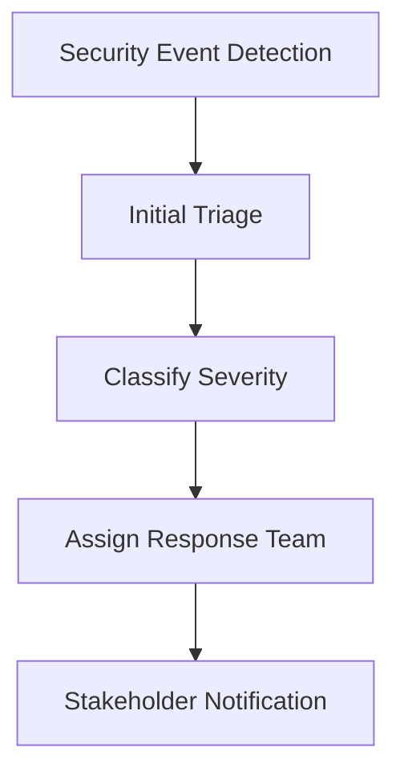

# Enterprise Security Operations Guide

## Overview

This guide provides comprehensive operational procedures for the enterprise security and compliance framework, including security dashboard usage, incident response, threat detection workflows, and compliance monitoring procedures.

## Table of Contents

1. [Security Dashboard Operations](#security-dashboard-operations)
2. [Incident Response Procedures](#incident-response-procedures)
3. [Threat Detection and Analysis](#threat-detection-and-analysis)
4. [Compliance Monitoring](#compliance-monitoring)
5. [Security Assessment Workflows](#security-assessment-workflows)
6. [Troubleshooting Guide](#troubleshooting-guide)

---

## Security Dashboard Operations

### Accessing the Security Dashboard

#### Web Dashboard
1. Navigate to `https://dashboard.company.com/security`
2. Authenticate with multi-factor authentication
3. Select appropriate security perspective based on your role

#### Real-time WebSocket Dashboard
1. Connect to WebSocket endpoint: `wss://api.company.com/ws/security/dashboard`
2. Authenticate using JWT token
3. Subscribe to relevant security event topics

### Dashboard Components

#### 1. Threat Detection Widget

**Purpose**: Real-time monitoring of security threats and attacks

**Key Metrics**:
- Active threats count
- Threats blocked in last 24 hours
- Top threat sources
- Threat severity distribution

**Interpretation**:
```
• Active Threats: 0-5 (Green), 6-15 (Yellow), 16+ (Red)
• Blocked Threats: Monitor for unusual spikes
• Threat Sources: Identify attack patterns
• Severity: Focus on high/critical threats first
```

**Actions**:
- Click on threat count to view detailed threat list
- Use "Investigate" button for threat analysis
- Export threat data for external analysis
- Configure automated blocking rules

#### 2. Data Loss Prevention (DLP) Widget

**Purpose**: Monitor sensitive data protection and policy violations

**Key Metrics**:
- Data scans performed (24h)
- DLP incidents created
- Data protected (GB)
- Policy violations by type

**Interpretation**:
```
• High incident rate may indicate:
  - New data sources with sensitive content
  - Policy configuration issues
  - Training needs for users
  
• Low detection rate may indicate:
  - Inadequate pattern coverage
  - Need for policy tuning
```

**Actions**:
- Review incident details for false positives
- Update DLP patterns for new data types
- Generate DLP compliance reports
- Configure automated data redaction

#### 3. Compliance Monitoring Widget

**Purpose**: Track compliance status across multiple frameworks

**Key Metrics**:
- Overall compliance score
- Framework-specific scores (GDPR, HIPAA, PCI-DSS)
- Active violations
- Remediation progress

**Interpretation**:
```
Compliance Scores:
• 95-100%: Excellent (Green)
• 85-94%: Good (Yellow)
• 70-84%: Needs Improvement (Orange)
• <70%: Critical (Red)
```

**Actions**:
- Drill down into specific framework details
- Review violation details and timelines
- Assign remediation tasks
- Generate compliance reports for auditors

#### 4. Access Control Widget

**Purpose**: Monitor authentication and authorization events

**Key Metrics**:
- Login attempts (24h)
- Failed login attempts
- Active privileged sessions
- Access policy violations

**Interpretation**:
```
Warning Signs:
• Failed login rate >5%
• Unusual geographic access patterns
• Privileged session count spikes
• Multiple policy violations from same user
```

**Actions**:
- Review failed login patterns for brute force attacks
- Monitor privileged access for abuse
- Update access policies based on usage patterns
- Generate access reports for compliance

### Dashboard Navigation

#### Filtering and Search
```
Time Range Filters:
• Last hour, 6 hours, 24 hours, 7 days, 30 days
• Custom date range selection

Severity Filters:
• Critical, High, Medium, Low, Info

Component Filters:
• DLP, Compliance, Access Control, Threat Detection
```

#### Export Capabilities
- Export dashboard data as JSON/CSV
- Generate PDF reports for executives
- Schedule automated report delivery
- API access for external integrations

---

## Incident Response Procedures

### Security Incident Classification

#### Severity Levels
```
CRITICAL (P1):
• Data breach involving PII/PHI
• System compromise with admin access
• Active malware spreading
• Complete service outage
• Response Time: <15 minutes

HIGH (P2):
• Suspected data exfiltration
• Privilege escalation attempts
• DLP policy violations (sensitive data)
• Compliance violations (critical controls)
• Response Time: <1 hour

MEDIUM (P3):
• Failed authentication spikes
• Suspicious user behavior
• Non-critical compliance gaps
• System performance anomalies
• Response Time: <4 hours

LOW (P4):
• Policy violations (non-sensitive)
• Routine security alerts
• Informational events
• Response Time: <24 hours
```

### Incident Response Workflow

#### 1. Detection and Alerting


**Detection Sources**:
- Automated security monitoring
- DLP incident alerts
- User reports
- Compliance violations
- Third-party security tools

**Triage Process**:
1. Verify alert authenticity (reduce false positives)
2. Gather initial context and evidence
3. Determine scope and impact
4. Classify severity level
5. Assign to appropriate response team

#### 2. Investigation and Analysis

**Evidence Collection**:
```bash
# Security event logs
curl -X GET "https://api.company.com/api/v1/security/events" \
  -H "Authorization: Bearer $TOKEN" \
  -d '{"incident_id": "inc_20241026_001", "time_range": "1h"}'

# User access logs
curl -X GET "https://api.company.com/api/v1/audit/user-access" \
  -H "Authorization: Bearer $TOKEN" \
  -d '{"user_id": "suspicious_user", "start_time": "2024-10-26T10:00:00Z"}'

# DLP incident details
curl -X GET "https://api.company.com/api/v1/security/dlp/incidents" \
  -H "Authorization: Bearer $TOKEN" \
  -d '{"incident_id": "dlp_inc_001"}'
```

**Analysis Framework**:
1. **Timeline Construction**: Create chronological sequence of events
2. **Impact Assessment**: Determine affected systems, data, and users
3. **Attribution Analysis**: Identify threat actor or root cause
4. **Technical Analysis**: Examine attack vectors and techniques
5. **Scope Determination**: Full extent of compromise or violation

#### 3. Containment and Mitigation

**Immediate Actions**:
```python
# Block suspicious IP addresses
response = requests.post('https://api.company.com/api/v1/security/block-ip', 
                        json={'ip_address': '192.168.1.50', 'reason': 'malicious_activity'})

# Disable compromised user account
response = requests.post('https://api.company.com/api/v1/users/disable',
                        json={'user_id': 'compromised_user', 'reason': 'security_incident'})

# Quarantine affected systems
response = requests.post('https://api.company.com/api/v1/systems/quarantine',
                        json={'system_id': 'affected_server', 'duration': '24h'})
```

**Containment Strategies**:
- **Network Isolation**: Isolate affected systems from network
- **Access Revocation**: Disable compromised accounts immediately
- **Data Protection**: Prevent further data exfiltration
- **Service Isolation**: Quarantine affected services
- **Evidence Preservation**: Maintain forensic integrity

#### 4. Recovery and Remediation

**Recovery Steps**:
1. **System Restoration**: Restore systems from clean backups
2. **Security Hardening**: Apply additional security controls
3. **Monitoring Enhancement**: Increase monitoring for affected areas
4. **User Education**: Provide security awareness training
5. **Policy Updates**: Update security policies based on lessons learned

**Validation Process**:
- Security control verification
- System integrity checks
- Data consistency validation
- Performance monitoring
- User access verification

### Incident Documentation

#### Required Documentation
```markdown
# Incident Report Template

## Incident Overview
- Incident ID: INC_YYYY_MMDD_###
- Detection Time: YYYY-MM-DD HH:MM:SS UTC
- Severity Level: [Critical/High/Medium/Low]
- Status: [Open/Investigating/Contained/Resolved/Closed]

## Impact Assessment
- Affected Systems: [List of systems]
- Affected Data: [Types and volumes]
- Affected Users: [Number and roles]
- Business Impact: [Service disruption, financial impact]

## Timeline of Events
- Initial Detection: [Time and source]
- Escalation: [Time and method]
- Containment: [Time and actions taken]
- Resolution: [Time and final actions]

## Technical Analysis
- Attack Vector: [How the incident occurred]
- Root Cause: [Underlying cause]
- Evidence: [Logs, screenshots, forensic data]
- IOCs: [Indicators of Compromise]

## Response Actions
- Immediate Actions: [Emergency response steps]
- Containment Measures: [Steps to prevent spread]
- Recovery Actions: [System restoration steps]
- Preventive Measures: [Future prevention steps]

## Lessons Learned
- What worked well: [Effective response elements]
- Areas for improvement: [Response gaps]
- Recommendations: [Process improvements]
```

---

## Threat Detection and Analysis

### Threat Detection Workflows

#### 1. Automated Threat Detection

**Threat Sources Monitored**:
- Network traffic anomalies
- Unauthorized access attempts
- Malware signatures
- Suspicious user behavior
- Data exfiltration attempts
- Privilege escalation activities

**Detection Rules**:
```yaml
# Example threat detection rules
threat_rules:
  - name: "Multiple Failed Logins"
    condition: "failed_logins > 10 in 5 minutes"
    severity: "high"
    action: ["alert", "block_ip"]
  
  - name: "Privileged Access Outside Hours"
    condition: "admin_access AND (time < 08:00 OR time > 18:00)"
    severity: "medium"
    action: ["alert", "require_mfa"]
  
  - name: "Large Data Export"
    condition: "export_size > 1GB AND user_role != 'data_analyst'"
    severity: "high"
    action: ["alert", "block_operation"]
```

#### 2. Threat Intelligence Integration

**Intelligence Sources**:
- Commercial threat feeds
- Government threat reports
- Industry sharing groups
- Internal threat intelligence
- Open source intelligence

**Integration Workflow**:
```python
class ThreatIntelligenceProcessor:
    def process_threat_feed(self, feed_data):
        """Process external threat intelligence feed"""
        
        # Parse threat indicators
        iocs = self.extract_iocs(feed_data)
        
        # Validate and enrich indicators
        validated_iocs = self.validate_iocs(iocs)
        
        # Update detection rules
        self.update_detection_rules(validated_iocs)
        
        # Generate threat landscape report
        return self.generate_threat_report(validated_iocs)
```

#### 3. Behavioral Analytics

**User Behavior Monitoring**:
- Login patterns and locations
- Data access patterns
- Application usage patterns
- Network communication patterns
- File system activities

**Anomaly Detection Models**:
```python
# Example behavioral analysis
def analyze_user_behavior(user_id, time_window='24h'):
    """Analyze user behavior for anomalies"""
    
    # Collect user activity data
    activities = get_user_activities(user_id, time_window)
    
    # Calculate behavior baselines
    baseline = calculate_behavior_baseline(user_id, '30d')
    
    # Detect anomalies
    anomalies = []
    
    # Check access patterns
    if activities['access_hours'] != baseline['normal_hours']:
        anomalies.append({
            'type': 'unusual_access_time',
            'severity': 'medium',
            'details': f"Access outside normal hours: {activities['access_hours']}"
        })
    
    # Check data volumes
    if activities['data_accessed'] > baseline['avg_data_access'] * 3:
        anomalies.append({
            'type': 'excessive_data_access',
            'severity': 'high',
            'details': f"Data access volume: {activities['data_accessed']}"
        })
    
    return anomalies
```

### Threat Analysis Framework

#### 1. MITRE ATT&CK Mapping

**Attack Technique Analysis**:
```
Initial Access:
• T1078 - Valid Accounts
• T1190 - Exploit Public-Facing Application
• T1199 - Trusted Relationship

Execution:
• T1059 - Command and Scripting Interpreter
• T1106 - Native API

Persistence:
• T1098 - Account Manipulation
• T1136 - Create Account

Privilege Escalation:
• T1068 - Exploitation for Privilege Escalation
• T1548 - Abuse Elevation Control Mechanism
```

#### 2. Threat Actor Profiling

**Actor Categories**:
- **Nation State**: Advanced persistent threats (APTs)
- **Cybercriminals**: Financial motivation
- **Hacktivists**: Ideological motivation
- **Insiders**: Malicious employees/contractors
- **Script Kiddies**: Low-skill opportunistic

**Profiling Criteria**:
```python
def profile_threat_actor(attack_data):
    """Profile threat actor based on attack characteristics"""
    
    profile = {
        'sophistication': 'unknown',
        'motivation': 'unknown',
        'resources': 'unknown',
        'likely_actor_type': 'unknown'
    }
    
    # Analyze attack sophistication
    if attack_data['zero_days_used'] or attack_data['custom_malware']:
        profile['sophistication'] = 'high'
    elif attack_data['public_exploits'] and attack_data['basic_tools']:
        profile['sophistication'] = 'low'
    
    # Determine motivation
    if attack_data['targets_financial_data']:
        profile['motivation'] = 'financial'
    elif attack_data['targets_intellectual_property']:
        profile['motivation'] = 'espionage'
    
    # Assess resources
    if attack_data['infrastructure_complexity'] == 'high':
        profile['resources'] = 'well_funded'
    
    return profile
```

### Threat Response Procedures

#### 1. Immediate Response Actions

**Automated Response**:
```python
class AutomatedThreatResponse:
    def __init__(self):
        self.response_actions = {
            'block_ip': self.block_ip_address,
            'disable_account': self.disable_user_account,
            'quarantine_system': self.quarantine_system,
            'alert_team': self.alert_security_team
        }
    
    def execute_response(self, threat_event):
        """Execute automated response to threat"""
        
        threat_type = threat_event['type']
        severity = threat_event['severity']
        
        # Determine appropriate response
        if threat_type == 'malware_detected' and severity == 'critical':
            self.quarantine_system(threat_event['affected_system'])
            self.alert_team(threat_event)
        
        elif threat_type == 'brute_force_attack':
            self.block_ip_address(threat_event['source_ip'])
            
        elif threat_type == 'insider_threat' and severity == 'high':
            self.disable_user_account(threat_event['user_id'])
            self.alert_team(threat_event)
```

#### 2. Manual Investigation Procedures

**Investigation Checklist**:
- [ ] Collect and preserve evidence
- [ ] Analyze attack timeline
- [ ] Identify affected systems and data
- [ ] Determine attack vector
- [ ] Assess ongoing threat presence
- [ ] Document findings
- [ ] Recommend containment actions

**Evidence Collection Tools**:
```bash
# Collect system logs
journalctl --since="2024-10-26 10:00:00" --until="2024-10-26 14:00:00" > investigation_logs.txt

# Network traffic analysis
tcpdump -r network_capture.pcap 'host 192.168.1.50' -w threat_traffic.pcap

# File system analysis
find /var/log -name "*.log" -newermt "2024-10-26 10:00:00" -exec ls -la {} \;

# Memory dump analysis
volatility -f memory_dump.raw --profile=Linux imageinfo
```

---

## Compliance Monitoring

### Compliance Framework Operations

#### 1. GDPR Compliance Monitoring

**Key Controls Monitored**:
- Lawful basis for processing
- Data subject consent management
- Data retention policies
- Right to erasure implementation
- Data protection by design
- Security of processing

**Monitoring Procedures**:
```python
class GDPRComplianceMonitor:
    def run_gdpr_assessment(self):
        """Run comprehensive GDPR compliance assessment"""
        
        results = {}
        
        # Check data processing lawfulness
        results['lawful_processing'] = self.check_lawful_basis()
        
        # Verify consent mechanisms
        results['consent_management'] = self.check_consent_systems()
        
        # Validate data retention
        results['data_retention'] = self.check_retention_policies()
        
        # Test right to erasure
        results['right_to_erasure'] = self.test_deletion_procedures()
        
        # Assess security measures
        results['data_security'] = self.assess_security_controls()
        
        return self.generate_gdpr_report(results)
```

**Violation Detection**:
- Automated scanning for personal data without lawful basis
- Monitoring consent withdrawal processing
- Checking data retention period compliance
- Validating cross-border data transfer agreements

#### 2. HIPAA Compliance Monitoring

**Technical Safeguards**:
- Access control (automatic logoff, encryption)
- Audit controls (hardware, software, procedures)
- Integrity controls (PHI alteration/destruction)
- Person or entity authentication
- Transmission security

**Monitoring Dashboard**:
```python
def get_hipaa_compliance_dashboard():
    """Generate HIPAA compliance dashboard"""
    
    return {
        'administrative_safeguards': {
            'security_officer_assigned': True,
            'workforce_training_current': True,
            'access_management_implemented': True
        },
        'physical_safeguards': {
            'facility_access_controlled': True,
            'workstation_security_implemented': True,
            'device_controls_active': True
        },
        'technical_safeguards': {
            'access_control_active': True,
            'audit_logs_enabled': True,
            'integrity_controls_implemented': True,
            'transmission_security_enabled': True
        },
        'compliance_score': 0.94,
        'violations_last_30_days': 2,
        'risk_assessment_date': '2024-10-15'
    }
```

#### 3. PCI-DSS Compliance Monitoring

**Key Requirements**:
- Install and maintain firewalls
- Don't use vendor-supplied defaults
- Protect stored cardholder data
- Encrypt transmission of cardholder data
- Use and regularly update anti-virus
- Develop and maintain secure systems

**Automated Compliance Checks**:
```python
class PCIDSSComplianceChecker:
    def run_pci_assessment(self):
        """Run PCI-DSS compliance assessment"""
        
        results = {
            'network_security': self.check_network_security(),
            'cardholder_data_protection': self.check_data_protection(),
            'vulnerability_management': self.check_vulnerability_mgmt(),
            'access_control': self.check_access_controls(),
            'network_monitoring': self.check_monitoring(),
            'security_testing': self.check_security_testing()
        }
        
        # Calculate compliance score
        compliance_score = sum(r['score'] for r in results.values()) / len(results)
        
        return {
            'overall_score': compliance_score,
            'requirement_results': results,
            'violations': self.identify_violations(results),
            'recommendations': self.generate_recommendations(results)
        }
```

### Compliance Reporting

#### 1. Automated Report Generation

**Report Types**:
- Daily compliance status
- Weekly violation summary
- Monthly compliance dashboard
- Quarterly audit reports
- Annual compliance assessment

**Report Templates**:
```python
def generate_compliance_report(framework, period='monthly'):
    """Generate comprehensive compliance report"""
    
    template = {
        'report_metadata': {
            'framework': framework,
            'period': period,
            'generated_at': datetime.now().isoformat(),
            'report_id': f"{framework}_{period}_{uuid.uuid4()}"
        },
        'executive_summary': generate_executive_summary(framework),
        'compliance_metrics': get_compliance_metrics(framework, period),
        'violation_analysis': analyze_violations(framework, period),
        'remediation_status': get_remediation_status(framework),
        'recommendations': generate_recommendations(framework),
        'appendices': {
            'detailed_findings': get_detailed_findings(framework),
            'evidence_collection': get_evidence_links(framework),
            'risk_assessment': get_risk_assessment(framework)
        }
    }
    
    return template
```

#### 2. Audit Trail Management

**Audit Log Requirements**:
- User identification
- Type of action performed
- Date and time of action
- Success or failure of action
- Origination of action
- Identity of affected data/systems

**Log Retention Policies**:
```python
class AuditLogManager:
    def __init__(self):
        self.retention_policies = {
            'gdpr': '6_years',
            'hipaa': '6_years', 
            'pci_dss': '1_year',
            'sox': '7_years',
            'default': '3_years'
        }
    
    def apply_retention_policy(self, log_entry):
        """Apply appropriate retention policy to audit log"""
        
        # Determine applicable frameworks
        frameworks = self.identify_frameworks(log_entry)
        
        # Apply longest retention period
        retention_periods = [self.retention_policies.get(f, self.retention_policies['default']) 
                           for f in frameworks]
        
        max_retention = max(retention_periods, key=lambda x: int(x.split('_')[0]))
        
        log_entry['retention_period'] = max_retention
        log_entry['delete_after'] = self.calculate_delete_date(max_retention)
        
        return log_entry
```

---

## Security Assessment Workflows

### Periodic Security Assessments

#### 1. Daily Security Health Checks

**Automated Daily Assessment**:
```bash
#!/bin/bash
# daily_security_check.sh

echo "Running daily security assessment..."

# Check system health
curl -s -X POST "https://api.company.com/api/v1/security/assess" \
  -H "Authorization: Bearer $SECURITY_TOKEN" \
  -d '{"assessment_type": "daily", "include_components": ["security", "access_control"]}' \
  | jq '.overall_status'

# Check for new threats
curl -s -X GET "https://api.company.com/api/v1/security/threats?since=24h" \
  -H "Authorization: Bearer $SECURITY_TOKEN" \
  | jq '.threat_count'

# Verify compliance status
curl -s -X GET "https://api.company.com/api/v1/compliance/dashboard" \
  -H "Authorization: Bearer $SECURITY_TOKEN" \
  | jq '.overall_compliance.compliance_rate'

echo "Daily security check completed."
```

#### 2. Weekly Comprehensive Assessment

**Assessment Components**:
- Vulnerability scanning
- Penetration testing results
- Compliance gap analysis
- User access review
- Security control effectiveness
- Incident response metrics

**Weekly Assessment Script**:
```python
class WeeklySecurityAssessment:
    def run_weekly_assessment(self):
        """Run comprehensive weekly security assessment"""
        
        assessment_results = {}
        
        # Security posture assessment
        assessment_results['security_posture'] = self.assess_security_posture()
        
        # Vulnerability assessment
        assessment_results['vulnerabilities'] = self.scan_vulnerabilities()
        
        # Compliance assessment
        assessment_results['compliance'] = self.assess_compliance()
        
        # Access review
        assessment_results['access_control'] = self.review_access_controls()
        
        # Incident metrics
        assessment_results['incident_metrics'] = self.analyze_incident_metrics()
        
        # Generate recommendations
        recommendations = self.generate_recommendations(assessment_results)
        
        # Create report
        report = self.create_assessment_report(assessment_results, recommendations)
        
        return report
```

#### 3. Monthly Risk Assessment

**Risk Categories**:
- Technical risks (vulnerabilities, misconfigurations)
- Operational risks (process gaps, training needs)
- Compliance risks (regulatory violations, audit findings)
- Strategic risks (business impact, reputation)

**Risk Scoring Matrix**:
```python
def calculate_risk_score(probability, impact):
    """Calculate risk score based on probability and impact"""
    
    risk_matrix = {
        ('low', 'low'): 1,
        ('low', 'medium'): 2,
        ('low', 'high'): 3,
        ('medium', 'low'): 2,
        ('medium', 'medium'): 4,
        ('medium', 'high'): 6,
        ('high', 'low'): 3,
        ('high', 'medium'): 6,
        ('high', 'high'): 9
    }
    
    return risk_matrix.get((probability.lower(), impact.lower()), 5)
```

---

## Troubleshooting Guide

### Common Issues and Solutions

#### 1. Security Dashboard Issues

**Issue**: Dashboard not loading or showing outdated data
**Symptoms**:
- Dashboard widgets showing "No data available"
- Metrics not updating in real-time
- WebSocket connection failures

**Troubleshooting Steps**:
```bash
# Check API service status
curl -s https://api.company.com/health | jq '.status'

# Verify authentication token
curl -s -H "Authorization: Bearer $TOKEN" https://api.company.com/api/v1/auth/verify

# Test WebSocket connectivity
wscat -c "wss://api.company.com/ws/security/dashboard?token=$TOKEN"

# Check service logs
kubectl logs -f deployment/security-api -n security
```

**Solutions**:
- Refresh authentication token
- Clear browser cache and cookies
- Verify network connectivity
- Restart security services if necessary

#### 2. DLP False Positives

**Issue**: DLP system flagging legitimate data as sensitive
**Symptoms**:
- High number of false positive alerts
- Business processes being blocked unnecessarily
- User complaints about data access restrictions

**Investigation Steps**:
```python
# Analyze recent DLP incidents
def investigate_dlp_false_positives():
    """Investigate potential DLP false positives"""
    
    # Get recent incidents
    incidents = get_dlp_incidents(days=7)
    
    # Analyze patterns
    false_positive_indicators = []
    
    for incident in incidents:
        # Check confidence scores
        if incident['confidence'] < 0.8:
            false_positive_indicators.append({
                'incident_id': incident['id'],
                'reason': 'low_confidence',
                'confidence': incident['confidence']
            })
        
        # Check context patterns
        if 'test' in incident['context'].lower():
            false_positive_indicators.append({
                'incident_id': incident['id'],
                'reason': 'test_data',
                'context': incident['context']
            })
    
    return false_positive_indicators
```

**Solutions**:
- Fine-tune detection patterns
- Add exclusion rules for known false positives
- Adjust confidence thresholds
- Implement context-aware detection

#### 3. Compliance Assessment Failures

**Issue**: Compliance assessments returning errors or incomplete results
**Symptoms**:
- Assessment API returning 500 errors
- Missing compliance data
- Inconsistent assessment results

**Diagnostic Commands**:
```bash
# Check compliance service status
kubectl get pods -n compliance -l app=compliance-engine

# Review compliance service logs
kubectl logs -f -n compliance deployment/compliance-engine

# Test individual compliance checks
curl -X POST "https://api.company.com/api/v1/compliance/test-check" \
  -H "Authorization: Bearer $TOKEN" \
  -d '{"control_id": "GDPR-32.1"}'

# Verify database connectivity
kubectl exec -it -n compliance deployment/compliance-engine -- \
  pg_isready -h postgres.compliance.svc.cluster.local
```

**Resolution Steps**:
1. Restart compliance engine service
2. Verify database connections
3. Update compliance rule definitions
4. Re-run failed assessments manually

#### 4. WebSocket Connection Issues

**Issue**: Real-time updates not working in dashboard
**Symptoms**:
- WebSocket connection timeouts
- Missing real-time alerts
- Dashboard showing stale data

**Troubleshooting**:
```javascript
// WebSocket connection debugging
function debugWebSocket() {
    const ws = new WebSocket('wss://api.company.com/ws/security/dashboard?token=' + token);
    
    ws.onopen = function() {
        console.log('WebSocket connected successfully');
    };
    
    ws.onerror = function(error) {
        console.error('WebSocket error:', error);
        
        // Check common issues
        if (error.code === 1006) {
            console.log('Possible causes: Network issues, server restart, authentication failure');
        }
    };
    
    ws.onclose = function(event) {
        console.log('WebSocket closed:', event.code, event.reason);
        
        // Implement reconnection logic
        setTimeout(() => {
            debugWebSocket();
        }, 5000);
    };
}
```

### Performance Optimization

#### 1. Database Query Optimization

**Common Performance Issues**:
- Slow security event queries
- Large audit log tables
- Inefficient compliance checks

**Optimization Strategies**:
```sql
-- Add indexes for common queries
CREATE INDEX CONCURRENTLY idx_security_events_timestamp 
ON security_events (timestamp DESC) 
WHERE timestamp >= NOW() - INTERVAL '7 days';

CREATE INDEX CONCURRENTLY idx_audit_logs_user_action 
ON audit_logs (user_id, action_type, timestamp);

-- Partition large tables
CREATE TABLE audit_logs_2024_10 PARTITION OF audit_logs 
FOR VALUES FROM ('2024-10-01') TO ('2024-11-01');

-- Optimize compliance queries
CREATE INDEX CONCURRENTLY idx_compliance_assessments_framework_status 
ON compliance_assessments (framework, status, timestamp DESC);
```

#### 2. Cache Configuration

**Redis Cache Setup**:
```python
class SecurityCache:
    def __init__(self):
        self.redis_client = redis.Redis(
            host='redis.security.svc.cluster.local',
            port=6379,
            db=0,
            decode_responses=True
        )
        
        self.cache_ttl = {
            'user_permissions': 3600,  # 1 hour
            'compliance_status': 1800,  # 30 minutes
            'threat_intelligence': 900,  # 15 minutes
            'dashboard_metrics': 300    # 5 minutes
        }
    
    def cache_user_permissions(self, user_id, permissions):
        """Cache user permissions"""
        cache_key = f"user_permissions:{user_id}"
        self.redis_client.setex(
            cache_key, 
            self.cache_ttl['user_permissions'], 
            json.dumps(permissions)
        )
```

### Emergency Procedures

#### 1. Security Incident Response Emergency

**Immediate Actions**:
```bash
#!/bin/bash
# emergency_response.sh

echo "SECURITY INCIDENT EMERGENCY RESPONSE"
echo "===================================="

# 1. Isolate affected systems
echo "Step 1: System Isolation"
curl -X POST "https://api.company.com/api/v1/emergency/isolate" \
  -H "Authorization: Bearer $EMERGENCY_TOKEN" \
  -d '{"systems": ["affected_server_1", "affected_server_2"]}'

# 2. Block malicious IPs
echo "Step 2: Block Threat Sources"
curl -X POST "https://api.company.com/api/v1/emergency/block-ips" \
  -H "Authorization: Bearer $EMERGENCY_TOKEN" \
  -d '{"ips": ["malicious_ip_1", "malicious_ip_2"], "duration": "24h"}'

# 3. Disable compromised accounts
echo "Step 3: Disable Compromised Accounts"
curl -X POST "https://api.company.com/api/v1/emergency/disable-users" \
  -H "Authorization: Bearer $EMERGENCY_TOKEN" \
  -d '{"users": ["compromised_user_1"], "reason": "security_incident"}'

# 4. Alert security team
echo "Step 4: Alert Security Team"
curl -X POST "https://api.company.com/api/v1/emergency/alert" \
  -H "Authorization: Bearer $EMERGENCY_TOKEN" \
  -d '{"severity": "critical", "message": "Security incident in progress"}'

echo "Emergency response actions completed."
```

#### 2. Service Recovery Procedures

**Recovery Checklist**:
- [ ] Verify threat elimination
- [ ] Restore affected systems from clean backups
- [ ] Update security controls
- [ ] Implement additional monitoring
- [ ] Conduct post-incident review
- [ ] Update incident response procedures

---

This operations guide provides comprehensive procedures for managing the enterprise security and compliance framework effectively. Regular review and updates of these procedures ensure optimal security operations.